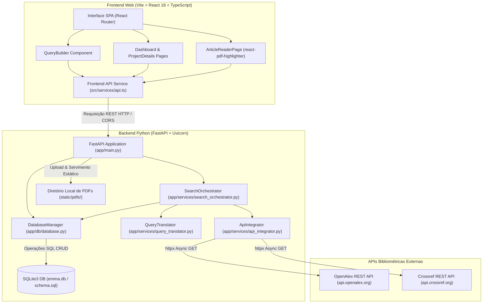

# Fase 0: Concepção, Fundação Python/FastAPI e Protótipo MVP Web

**Posição:** Fase 0 (Commits 1 a 19)

---

## 1. Resumo Executivo

A **Fase 0** marca a concepção original do projeto **Emma's Librarian**, concebido como um assistente inteligente para gestão bibliométrica e leitura interativa de literatura científica. O objetivo primordial nesta etapa inicial era prover aos pesquisadores uma plataforma capaz de traduzir consultas estruturadas de busca (utilizando operadores booleanos), executar buscas paralelas e desduplicadas em bases públicas como OpenAlex e Crossref, armazenar os metadados dos artigos em formato padronizado CSL-JSON e possibilitar a visualização e anotação visual de arquivos PDF diretamente na interface web.

Durante este ciclo inicial (desenvolvido entre 17 e 18 de Maio de 2026), a arquitetura adotou um modelo **cliente-servidor desacoplado via HTTP REST**:
- **Backend**: Desenvolvido em Python 3.13 utilizando FastAPI como servidor web assíncrono, SQLite3 como banco de dados relacional embarcado e Pytest para garantia de qualidade orientada a testes (TDD).
- **Frontend**: Aplicação SPA web baseada em React 18, TypeScript, Vite e Tailwind CSS, incorporando o componente `react-pdf-highlighter` para renderização e marcação interativa de documentos PDF em canvas.

Ao final desta fase, o projeto contava com um protótipo MVP web funcional capaz de gerenciar projetos de pesquisa, orquestrar buscas bibliométricas em múltiplas APIs, desduplicar resultados por DOI ou título, persistir marcadores visuais em PDFs e exportar metadados em CSV.

---

## 2. Detalhamento Profundo

### 2.1. Decisões de Engenharia & Racional Arquitetural

1. **Desacoplamento Cliente-Servidor via HTTP/REST**: A escolha inicial por uma arquitetura cliente-servidor HTTP permitiu uma separação clara de responsabilidades entre o motor de busca e persistência em Python (`http://localhost:8000`) e a interface visual em React/TypeScript (`http://localhost:5173`). O backend tratava unicamente de regras de negócio, integrações assíncronas de API e manipulação do SQLite, enquanto o frontend gerenciava o estado de exibição e interatividade.
2. **Desenvolvimento Orientado a Testes (TDD) no Backend Python**: O desenvolvimento do motor bibliométrico seguiu rigorosamente os princípios de TDD. Módulos críticos como `QueryTranslator`, `ApiIntegrator` e `SearchOrchestrator` foram implementados acompanhados por suítes de teste no Pytest (`test_db.py`, `test_query_translator.py`, `test_api_integrator.py`, `test_search_orchestrator.py`).
3. **Abstração e Tradução de Consultas Booleanas (`QueryTranslator`)**: Para evitar que o pesquisador precisasse dominar as especificidades sintáticas de cada API bibliométrica, construiu-se a classe `QueryTranslator`. Ela converte blocos de consulta estruturada (como campos `title`, `year` com comparadores `equals`, `greater_than`, `less_than`) para a sintaxe de filtro do OpenAlex (`title.search:`, `publication_year:>`) e para os parâmetros de busca da REST API do Crossref (`query.title`, `from-pub-date`, `until-pub-date`).
4. **Orquestração e Desduplicação Concorrente (`SearchOrchestrator`)**: O módulo `SearchOrchestrator` executa requisições HTTP assíncronas utilizando `httpx.AsyncClient`. Como diferentes bases bibliométricas frequentemente retornam o mesmo artigo científico, implementou-se um algoritmo de desduplicação em memória que unifica artigos redundantes utilizando chaves de comparação por DOI normalizado ou por título normalizado (caixa baixa e sem espaços extras). Quando um artigo é identificado em múltiplas fontes, a propriedade `base_origem` consolida a lista de fontes de origem (ex: `['OpenAlex', 'Crossref']`).
5. **Normalização CSL-JSON**: Todos os registros bibliográficos recuperados das APIs foram convertidos para a norma internacional CSL-JSON (*Citation Style Language*), garantindo interoperabilidade com gerenciadores de referências bibliográficas e simplificando o mapeamento para tabelas do banco relacional.
6. **Esquema Relacional SQLite (`schema.sql`)**: Definiu-se um banco de dados relacional leve com integridade referencial mantida por chaves estrangeiras com ação `ON DELETE CASCADE`. As tabelas `projects`, `articles`, `annotations` e `highlights` foram desenhadas para suportar a rastreabilidade entre a busca original, os metadados do artigo, os arquivos PDF associados e as marcações visuais dos trechos lidos.
7. **Leitura Interativa e Armazenamento Local de PDFs**: O componente `react-pdf-highlighter` foi integrado ao frontend SPA, viabilizando o destaque de trechos em PDF em tempo real. O backend FastAPI disponibilizou rotas para upload físico de arquivos PDF (`/upload_pdf`) e servimento estático (`/static/pdfs`), gravando as coordenadas exatas dos destaques (`position_data` em JSON) na tabela `highlights`.

---

### 2.2. Diagrama de Arquitetura & Fluxo de Dados (Mermaid)



---

### 2.3. Tabela de Estrutura de Diretórios e Arquivos (Fase 0)

| Caminho do Arquivo / Diretório | Descrição da Responsabilidade & Conteúdo | Commits Principais |
| :--- | :--- | :--- |
| `backend/app/main.py` | Ponto de entrada FastAPI. Define rotas REST de projetos, artigos, buscas, upload/servimento de PDFs e exportação CSV. | `92fdab2`, `c887f7d`, `dc62f6e`, `09ff21b` |
| `backend/app/db/schema.sql` | Script SQL de criação das tabelas `projects`, `articles`, `annotations` e `highlights` com `ON DELETE CASCADE`. | `cc1d50d`, `dc62f6e` |
| `backend/app/db/database.py` | Classe `DatabaseManager`. Encapsula conexões SQLite3, transações e operações CRUD para todas as entidades. | `cc1d50d`, `4ed7dc9`, `c887f7d`, `dc62f6e` |
| `backend/app/services/query_translator.py` | Classe `QueryTranslator`. Converte blocos de busca visual em queries formatadas para OpenAlex e parâmetros para Crossref. | `968c38a` |
| `backend/app/services/api_integrator.py` | Classe `ApiIntegrator`. Consome APIs externas com `httpx` e normaliza respostas em dicionários CSL-JSON. | `131c201` |
| `backend/app/services/search_orchestrator.py` | Classe `SearchOrchestrator`. Executa buscas paralelas, desduplica artigos por DOI/título e salva no banco de dados. | `4ed7dc9` |
| `backend/tests/` | Suíte de testes unitários Pytest (`test_db.py`, `test_query_translator.py`, `test_api_integrator.py`, `test_search_orchestrator.py`). | `cc1d50d`, `968c38a`, `131c201`, `4ed7dc9` |
| `frontend/src/pages/DashboardPage.tsx` | Tela inicial. Lista projetos existentes com data de criação e contador de artigos, além de botão para criar projeto. | `51f6368` |
| `frontend/src/pages/NewProjectPage.tsx` | Tela de criação de projeto com integração do QueryBuilder visual para consulta inicial. | `92fdab2` |
| `frontend/src/pages/ProjectDetailsPage.tsx` | Visão detalhada do projeto. Exibe tabela de artigos, filtros, modal de busca adicional e exportação CSV. | `51f6368`, `09ff21b`, `93407c0` |
| `frontend/src/pages/ArticleReaderPage.tsx` | Leitor de PDF interativo baseado em `react-pdf-highlighter` com suporte a realces de texto, notas e upload de PDF local. | `c887f7d`, `dc62f6e`, `042ef98`, `93407c0` |
| `frontend/src/components/QueryBuilder.tsx` | Componente de construção visual de buscas booleanas (operações AND/OR/NOT, campos e comparadores). | `92fdab2`, `93407c0` |
| `frontend/src/services/api.ts` | Cliente Axios no frontend para integração com todos os endpoints do backend FastAPI (`http://localhost:8000`). | `92fdab2`, `51f6368`, `c887f7d`, `dc62f6e` |
| `frontend/src/types/index.ts` | Interfaces TypeScript para `Project`, `Article`, `Highlight`, `Annotation`, `QueryBlock`. | `92fdab2`, `c887f7d`, `042ef98` |
| `README.md` | Documentação de inicialização do projeto MVP (instruções de instalação backend/frontend). | `09ff21b`, `e4a60e0` |

---

### 2.4. Trechos de Código Principais (Extraídos dos Diffs dos Commits)

#### A. Esquema Relacional do Banco de Dados (`backend/app/db/schema.sql` — Commit `cc1d50d`)
```sql
-- schema.sql: Definição do esquema SQLite inicial em Python
CREATE TABLE IF NOT EXISTS projects (
    id INTEGER PRIMARY KEY AUTOINCREMENT,
    name TEXT NOT NULL,
    data_criacao TIMESTAMP DEFAULT CURRENT_TIMESTAMP,
    ultima_execucao TIMESTAMP
);

CREATE TABLE IF NOT EXISTS articles (
    id INTEGER PRIMARY KEY AUTOINCREMENT,
    projeto_id INTEGER NOT NULL,
    doi TEXT,
    titulo TEXT NOT NULL,
    autores TEXT,
    ano INTEGER,
    query_origem TEXT,
    base_origem TEXT, -- Armazenado como JSON string/lista
    csl_json TEXT,    -- Conteúdo bruto normalizado
    status TEXT DEFAULT 'novo', -- status: novo / lido / arquivado
    pdf_path TEXT,
    FOREIGN KEY (projeto_id) REFERENCES projects (id) ON DELETE CASCADE
);

CREATE TABLE IF NOT EXISTS annotations (
    id INTEGER PRIMARY KEY AUTOINCREMENT,
    artigo_id INTEGER NOT NULL,
    conteudo_markdown TEXT NOT NULL,
    data_criacao TIMESTAMP DEFAULT CURRENT_TIMESTAMP,
    FOREIGN KEY (artigo_id) REFERENCES articles (id) ON DELETE CASCADE
);

CREATE TABLE IF NOT EXISTS highlights (
    id INTEGER PRIMARY KEY AUTOINCREMENT,
    artigo_id INTEGER NOT NULL,
    color TEXT NOT NULL,
    position_data TEXT NOT NULL, -- Coordenadas do highlight em JSON
    annotation_id INTEGER,
    FOREIGN KEY (artigo_id) REFERENCES articles (id) ON DELETE CASCADE,
    FOREIGN KEY (annotation_id) REFERENCES annotations (id) ON DELETE SET NULL
);
```

#### B. Tradutor de Consultas Booleanas (`backend/app/services/query_translator.py` — Commit `968c38a`)
```python
from typing import List, Dict

class QueryTranslator:
    def to_openalex(self, query_blocks: List[Dict]) -> str:
        """Converte blocos de busca visual na sintaxe de filtro do OpenAlex."""
        filters = []
        for block in query_blocks:
            field = block.get("field")
            value = block.get("value")
            type_ = block.get("type")
            
            if field == "title":
                filters.append(f"title.search:{value}")
            elif field == "year":
                if type_ == "greater_than":
                    filters.append(f"publication_year:>{value}")
                elif type_ == "less_than":
                    filters.append(f"publication_year:<{value}")
                else:
                    filters.append(f"publication_year:{value}")
        
        return ",".join(filters)

    def to_crossref(self, query_blocks: List[Dict]) -> Dict[str, str]:
        """Converte blocos de busca visual em parâmetros de requisição para Crossref."""
        params = {}
        filters = []
        for block in query_blocks:
            field = block.get("field")
            value = block.get("value")
            type_ = block.get("type")
            
            if field == "title":
                params["query.title"] = value
            elif field == "year":
                if type_ == "equals":
                    filters.append(f"from-pub-date:{value}")
                    filters.append(f"until-pub-date:{value}")
                elif type_ == "greater_than":
                    filters.append(f"from-pub-date:{int(value) + 1}")
                elif type_ == "less_than":
                    filters.append(f"until-pub-date:{int(value) - 1}")
        
        if filters:
            params["filter"] = ",".join(filters)
            
        return params
```

#### C. Orquestração e Desduplicação de Buscas (`backend/app/services/search_orchestrator.py` — Commit `4ed7dc9`)
```python
from typing import List, Dict, Any
from backend.app.services.query_translator import QueryTranslator
from backend.app.services.api_integrator import ApiIntegrator

class SearchOrchestrator:
    def __init__(self, db_manager):
        self.db_manager = db_manager
        self.translator = QueryTranslator()
        self.integrator = ApiIntegrator()

    async def search_and_persist(self, project_id: int, query_blocks: List[Dict], limit: int = 100) -> int:
        openalex_filter = self.translator.to_openalex(query_blocks)
        crossref_params = self.translator.to_crossref(query_blocks)
        
        oa_raw = await self.integrator.fetch_openalex(openalex_filter)
        cr_raw = await self.integrator.fetch_crossref(crossref_params)
        
        normalized_results = []
        for item in oa_raw[:limit]:
            norm = self.integrator.normalize_openalex(item)
            norm["base_origem"] = "OpenAlex"
            normalized_results.append(norm)
            
        for item in cr_raw[:limit]:
            norm = self.integrator.normalize_crossref(item)
            norm["base_origem"] = "Crossref"
            normalized_results.append(norm)
            
        deduplicated = self._deduplicate(normalized_results)
        
        count = 0
        for article in deduplicated:
            article_db = {
                "projeto_id": project_id,
                "doi": article.get("DOI"),
                "titulo": article.get("title"),
                "autores": ", ".join([f"{a.get('given', '')} {a.get('family', '')}".strip() for a in article.get("author", [])]),
                "ano": article.get("issued", {}).get("date-parts", [[None]])[0][0],
                "query_origem": str(query_blocks),
                "base_origem": article["base_origem"],
                "csl_json": article
            }
            self.db_manager.save_article(article_db)
            count += 1
            
        return count

    def _deduplicate(self, results: List[Dict]) -> List[Dict]:
        """Desduplica artigos com base no DOI ou no Título normalizado."""
        seen_doi = {}
        seen_title = {}
        deduplicated = []
        
        for item in results:
            doi = item.get("DOI")
            title = item.get("title", "").lower().strip()
            
            existing_idx = None
            if doi and doi in seen_doi:
                existing_idx = seen_doi[doi]
            elif title and title in seen_title:
                existing_idx = seen_title[title]
            
            if existing_idx is not None:
                current_bases = deduplicated[existing_idx]["base_origem"]
                if isinstance(current_bases, str):
                    current_bases = [current_bases]
                
                new_base = item["base_origem"]
                if new_base not in current_bases:
                    current_bases.append(new_base)
                
                deduplicated[existing_idx]["base_origem"] = current_bases
            else:
                idx = len(deduplicated)
                item["base_origem"] = [item["base_origem"]]
                deduplicated.append(item)
                if doi:
                    seen_doi[doi] = idx
                if title:
                    seen_title[title] = idx
                    
        return deduplicated
```

#### D. Servidor API FastAPI e Roteamento REST (`backend/app/main.py` — Commit `92fdab2` e `c887f7d`)
```python
from fastapi import FastAPI, HTTPException, UploadFile, File
from fastapi.middleware.cors import CORSMiddleware
from pydantic import BaseModel
from typing import List, Optional
from backend.app.db.database import DatabaseManager
from backend.app.services.search_orchestrator import SearchOrchestrator

app = FastAPI(title="Emma's Librarian API")

app.add_middleware(
    CORSMiddleware,
    allow_origins=["*"],
    allow_credentials=True,
    allow_methods=["*"],
    allow_headers=["*"],
)

DB_PATH = "emma.db"
db = DatabaseManager(DB_PATH)
orchestrator = SearchOrchestrator(db)

class ProjectCreate(BaseModel):
    name: str

class SearchRequest(BaseModel):
    query_blocks: List[dict]
    limit: Optional[int] = 100

@app.get("/projects")
async def list_projects():
    return db.get_all_projects()

@app.post("/projects")
async def create_project(project: ProjectCreate):
    project_id = db.create_project(project.name)
    return db.get_project(project_id)

@app.post("/projects/{project_id}/search")
async def search_articles(project_id: int, request: SearchRequest):
    p = db.get_project(project_id)
    if not p:
        raise HTTPException(status_code=404, detail="Projeto não encontrado")
    
    count = await orchestrator.search_and_persist(project_id, request.query_blocks, limit=request.limit)
    return {"count": count}

@app.get("/projects/{project_id}/articles")
async def list_articles(project_id: int):
    return db.get_articles_by_project(project_id)
```

---

### 2.5. Tabela Completa de Commits da Fase 0

| # | Hash | Data | Mensagem do Commit | Impacto Arquitetural / Descrição dos Mudanças |
| :-: | :--- | :--- | :--- | :--- |
| 1 | `fe7cf51` | 17/05/2026 | `Initial commit: Emma's Librarian core files` | Criação da estrutura base do repositório e arquivos fundamentais do projeto. |
| 2 | `9703c64` | 17/05/2026 | `Requirement: Add PDF visual highlighting and annotations using react-pdf-highlighter` | Levantamento do requisito técnico para suporte a anotações visuais em PDF via `react-pdf-highlighter`. |
| 3 | `f9459bd` | 17/05/2026 | `Plan: Draft MVP Implementation roadmap` | Definição do roadmap de desenvolvimento em ciclos (Cycles 1 a 10) para construção do MVP. |
| 4 | `1ad2734` | 17/05/2026 | `Update MVP plan schema and add development procedures` | Refinamento do planejamento e especificação das etapas de implementação TDD backend e frontend. |
| 5 | `cc1d50d` | 17/05/2026 | `Initial backend setup: SQLite schema and database manager with tests` | Criação do `schema.sql` (tabelas `projects`, `articles`, `annotations`, `highlights`) e classe `DatabaseManager` com Pytest. |
| 6 | `968c38a` | 18/05/2026 | `Implement Query Translation module for OpenAlex and Crossref with TDD` | Implementação do `QueryTranslator` com cobertura de testes unitários para tradução de queries booleanas. |
| 7 | `131c201` | 18/05/2026 | `Implement API integration and CSL-JSON normalization for OpenAlex and Crossref` | Implementação do `ApiIntegrator` usando `httpx` assíncrono para busca e normalização de metadados em CSL-JSON. |
| 8 | `4ed7dc9` | 18/05/2026 | `Implement Search Orchestrator with deduplication and persistence` | Construção do `SearchOrchestrator`, unificando chamadas paralelas, desduplicação por DOI/título e inserção no banco SQLite. |
| 9 | `e117e1c` | 18/05/2026 | `Cycle 5: Setup Frontend project with Vite, TypeScript and core dependencies` | Inicialização do projeto frontend React 18 + TypeScript com Vite e configuração inicial do Tailwind CSS. |
| 10 | `92fdab2` | 18/05/2026 | `Cycle 6: Implement Visual Query Builder, Project UI and backend API entry point` | Criação do `main.py` (FastAPI), componente `QueryBuilder.tsx`, `NewProjectPage.tsx` e cliente de API em TypeScript (`api.ts`). |
| 11 | `51f6368` | 18/05/2026 | `Cycle 7: Implement Dashboard and Project Details with article listing table` | Implementação das páginas `DashboardPage.tsx` (lista de projetos) e `ProjectDetailsPage.tsx` (tabela de artigos). |
| 12 | `c887f7d` | 18/05/2026 | `Cycle 8: Implement PDF Reader with react-pdf-highlighter and persistence` | Integração do `ArticleReaderPage.tsx` com `react-pdf-highlighter` e endpoints backend de salvamento/carregamento de highlights. |
| 13 | `dc62f6e` | 18/05/2026 | `Cycle 9: Implement Local PDF management (upload and serve)` | Adição de suporte ao upload físico de arquivos PDF (`/upload_pdf`) e servimento estático no FastAPI (`/static/pdfs`). |
| 14 | `09ff21b` | 18/05/2026 | `Cycle 10: Implement CSV export and finalize MVP with README documentation` | Adição de exportação CSV de artigos no backend (`/export_csv`) e documentação completa de inicialização no `README.md`. |
| 15 | `e4a60e0` | 18/05/2026 | `Docs: Update backend startup instructions to fix ModuleNotFoundError` | Atualização das instruções no `README.md` especificando `PYTHONPATH=. uvicorn backend.app.main:app` para evitar erros de import. |
| 16 | `7d29090` | 18/05/2026 | `Fix: Update index.html to point to src/main.tsx and fix root div ID` | Correção na estrutura de ponto de entrada HTML no Vite apontando para `src/main.tsx`. |
| 17 | `042ef98` | 18/05/2026 | `Fix: Resolve TypeScript errors and frontend build failures in types and PDF reader` | Resolução de inconsistências de tipagem TypeScript no `types/index.ts` e compilação do leitor de PDF. |
| 18 | `93407c0` | 18/05/2026 | `Fix(UI): Resolve Query Builder auto-submit and improve PDF reader navigation.` | Correção de submissão automática indevida no formulário do QueryBuilder e melhorias de UX na navegação do PDF reader. |
| 19 | `8225baa` | 18/05/2026 | `Fix: Remove .db files from version control and update .gitignore` | Remoção dos arquivos SQLite binários (`emma.db` e `test_emma.db`) do repositório Git e atualização de regras no `.gitignore`. |
