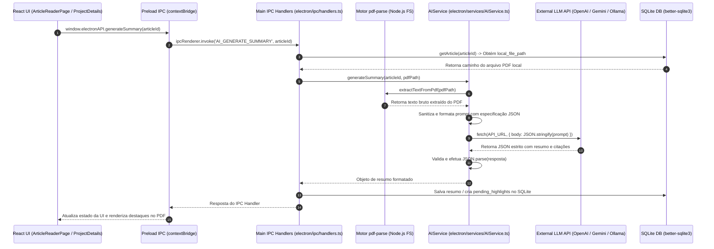

# Fase 2: Integração com Inteligência Artificial, Polimento Nativo Desktop & Automação de Releases

**Posição**: Fase 2 (Commits 34 a 50)  
**Período de Desenvolvimento**: 24/05/2026 – 26/05/2026  
**Intervalo de Commits**: `6158111` a `dd6a330` (17 commits)

---

## 1. Resumo Executivo

A **Fase 2** marca um salto evolutivo decisivo na trajetória do *Emma's Librarian*, elevando o software de um organizador bibliográfico local para um **assistente acadêmico inteligente e nativo para desktop**. Desenvolvida no curto e intenso intervalo entre 24 e 26 de maio de 2026, esta fase introduziu o motor de Inteligência Artificial (`AIService.ts`), habilitando capacidades avançadas de síntese textual (*Magic Summary*), extração massiva de dados estruturados a partir de arquivos PDF brutos e ancoragem precisa de citações textuais diretas no leitor de documentos.

Simultaneamente, a experiência do usuário desktop foi completamente redesenhada. A janela padrão do sistema operacional deu lugar a uma interface nativa customizada (*frameless window*) equipada com a nova `TitleBar.tsx`, logotipia vetorial SVG renovada e gerenciamento de regiões de arrasto (*drag region*). Para respaldar a responsabilidade ética do processamento de dados por terceiros, foi incorporado o módulo de Termos de Uso (`TermsOfUsePage.tsx`) e controle de consentimento do usuário.

No âmbito da infraestrutura e engenharia de software, a fase estabeleceu uma esteira industrial de compilação e entrega contínua (CI/CD). Através da integração do **Electron Builder**, empacotamento **NSIS** para Windows, geração de executáveis com ícones incorporados (`icon.ico`) e automação via **GitHub Actions** (`release.yml`), o projeto adquiriu a capacidade de realizar compilação, versionamento e publicação automática de instaladores executáveis a cada nova *tag* de release publicada no repositório.

---

## 2. Detalhamento Profundo

### 2.1 Decisões de Engenharia & Racional Arquitetural

#### 1. Motor Multiprovedor de IA e Orquestração Assíncrona (`AIService.ts`)
Para garantir resiliência e evitar aprisionamento tecnológico (*vendor lock-in*), o `AIService` foi projetado com uma arquitetura de fallback transparente e prioritária entre múltiplos provedores de Modelos de Linguagem (LLM):
- **OpenAI (`gpt-4o-mini`)**: Provedor primário por sua relação otimizada de custo/desempenho e alta precisão na estruturação de respostas JSON.
- **Google Gemini (`gemini-2.5-flash`)**: Alternativa de alta velocidade e ampla janela de contexto.
- **Ollama / Local (OpenAI-compatible REST API)**: Provedor para execução 100% offline e privada em hardware local.

A escolha de exigir que as respostas dos LLMs retornem exclusivamente em **JSON estrito** (sem blocos Markdown) permitiu que a aplicação parseasse os resultados com segurança e ancorasse resumos e respostas diretamente nas tabelas relacionais do SQLite.

#### 2. Extração de Texto Nativa de PDFs com `pdf-parse` em Node.js
A extração do conteúdo textual dos arquivos PDF locais passou a ser executada diretamente no *Main Process* do Electron através da biblioteca `pdf-parse`. Isso eliminou qualquer necessidade de utilitários externos em Python ou chamadas a microsserviços de terceiros. A importação e compilação do módulo foram ajustadas para lidar com as especificidades de exportação nomeada ESM do Node 22/Electron.

#### 3. Síntese Mágica (*Magic Summary*) e Extração Massiva com Ancoragem de Citações
- **Magic Summary**: Processa o texto truncado do PDF (até 80.000 caracteres) e gera simultaneamente duas perspectivas: um resumo executivo abrangente (1 parágrafo) e um detalhamento estruturado por seções do artigo.
- **Extração Massiva (*Massive Extraction*)**: Permite que o pesquisador submeta uma lista de perguntas investigativas sobre um conjunto de artigos. A IA retorna não apenas as respostas descritivas, mas também o **trecho literal exato (`quote`)** do PDF. Esse trecho é registrado na tabela `pending_highlights`, permitindo que o leitor de PDF do frontend navegue e destaque visualmente a fonte primária no documento original.

#### 4. Interface Nativizada *Frameless* com Drag-Region (`TitleBar.tsx`)
Ao configurar a janela principal do Electron com `frame: false`, as bordas padrão do Windows foram removidas. Para manter a usabilidade nativa, desenvolveu-se a componente `TitleBar.tsx` em React, que injeta no CSS as propriedades proprietárias do Electron:
- `-webkit-app-region: drag`: Permite arrastar a janela clicando no cabeçalho customizado.
- `-webkit-app-region: no-drag`: Restringe botões de ação (minimizar, fechar, configurações) para garantir interatividade por clique.

#### 5. Documentos Rápidos e Investigações Massivas (`project_documents` e `massive_investigations`)
O esquema do banco de dados SQLite (`schema.sql`) foi expandido com duas novas tabelas com restrição `ON DELETE CASCADE`:
- `project_documents`: Permite anexar links externos, diretrizes ou PDFs complementares a um projeto específico, abrindo-os de forma nativa através da API `shell.openPath` / `shell.openExternal`.
- `massive_investigations`: Registra o histórico e os parâmetros de lote das consultas de IA aplicadas a múltiplos artigos simultaneamente.

#### 6. Suíte de Testes Automatizados com Mocks (`AIService.test.ts`)
A confiabilidade do motor de IA foi assegurada através de testes unitários isolados executados com **Vitest**. Utilizando o utilitário `vi.mock()`, os módulos do sistema de arquivos (`fs`), da biblioteca `pdf-parse` e da API global `fetch` foram fustigados por cenários de teste que validam desde a extração de texto até a captura de exceções em chaves de API ausentes ou malformadas.

#### 7. Automação de CI/CD para Releases Desktop (GitHub Actions + Electron Builder + NSIS)
A automação de empacotamento foi consolidada no arquivo `.github/workflows/release.yml`. Ao identificar a criação de uma *tag* de versão (ex: `v1.0.0`), a Action executa um *runner* em `windows-latest`, instala as dependências, compila o código TypeScript, executa o Vite e dispara o `electron-builder`. Este gera o instalador customizado NSIS com suporte a atalhos na Área de Trabalho e no Menu Iniciar, associando o ícone proprietário `.ico` e publicando o executável final diretamente nas Releases do GitHub.

---

### 2.2 Diagrama de Arquitetura e Fluxo do Motor de IA

O diagrama a seguir detalha o fluxo de dados desde a solicitação de processamento de IA na interface do usuário até a extração do texto no PDF, chamada ao provedor de LLM, persistência no banco SQLite e renderização das citações ancoradas no leitor:



---

### 2.3 Estrutura de Diretórios e Arquivos Adicionados/Modificados

A tabela abaixo sumariza a organização dos arquivos introduzidos ou profundamente modificados durante a Fase 2:

| Caminho do Arquivo | Descrição e Responsabilidade Técnica |
| :--- | :--- |
| `emmas_librarian/electron/services/AIService.ts` | Motor central de IA: extração de texto em PDF via `pdf-parse`, chamadas HTTP para OpenAI, Gemini e Ollama, e parsing de resumos e extração massiva. |
| `emmas_librarian/electron/services/__tests__/AIService.test.ts` | Suíte de testes unitários Vitest para o `AIService`, utilizando mocks de `fs`, `pdf-parse` e `fetch`. |
| `emmas_librarian/electron/database/schema.sql` | Atualização do esquema relacional com as tabelas `project_documents`, `massive_investigations` e `pending_highlights`. |
| `emmas_librarian/electron/database/DatabaseManager.ts` | Métodos de persistência para documentos do projeto, histórico de IA e chaves de API em `settings`. |
| `emmas_librarian/electron/ipc/handlers.ts` | Registro de novos canais IPC (`AI_GENERATE_SUMMARY`, `AI_MASSIVE_EXTRACTION`, `PROJECT_DOCUMENTS_*`). |
| `emmas_librarian/src/components/Layout.tsx` | Injeção da barra de título nativa customizada `NativeTitleBar` com suporte a `-webkit-app-region`. |
| `emmas_librarian/src/components/Logo.tsx` | Componente vetorial SVG responsável pela renderização escalável do logotipo oficial da aplicação. |
| `emmas_librarian/src/pages/TermsOfUsePage.tsx` | Interface de apresentação dos Termos de Uso e política de consentimento para integração com APIs de IA de terceiros. |
| `emmas_librarian/src/pages/ArticleReaderPage.tsx` | Integração do painel de resumo por IA, acionamento do *Magic Summary* e ancoragem de destaques pendentes. |
| `emmas_librarian/src/pages/ProjectDetailsPage.tsx` | Interface para execução de Investigações Massivas de IA e gestão dos Documentos Rápidos do projeto. |
| `emmas_librarian/src/pages/SettingsPage.tsx` | Painel para cadastro e gerenciamento das chaves de API (`api_key_openai`, `api_key_gemini`, etc.). |
| `emmas_librarian/build/icon.ico` | Arquivo binário de ícone nativo multi-resolução para o executável do Windows. |
| `.github/workflows/release.yml` | Workflow do GitHub Actions para automação de build, empacotamento Electron Builder e publicação de releases. |
| `emmas_librarian/package.json` | Configuração da seção `"build"` do `electron-builder`, alvos de compilação NSIS, dependências (`pdf-parse`) e versão. |

---

### 2.4 Trechos de Código Principais Extraídos dos Diffs

#### 1. Motor de Integração com IA (`electron/services/AIService.ts` — Commit `6158111`)

```typescript
import fs from 'fs';
import pdfParseModule from 'pdf-parse';
import { DatabaseManager } from '../database/DatabaseManager';

const pdfParse: any = pdfParseModule;

export class AIService {
  private db: DatabaseManager;

  constructor(db: DatabaseManager) {
    this.db = db;
  }

  // Extração de texto do arquivo PDF local utilizando buffer em Node.js
  public async extractTextFromPdf(pdfPath: string): Promise<string> {
    if (!fs.existsSync(pdfPath)) {
      throw new Error(`PDF file not found: ${pdfPath}`);
    }
    const dataBuffer = fs.readFileSync(pdfPath);
    try {
      const data = await pdfParse(dataBuffer);
      return data.text;
    } catch (err) {
      console.error('Error parsing PDF:', err);
      throw new Error('Failed to parse PDF file');
    }
  }

  // Recupera as chaves de API cadastradas na tabela settings do SQLite
  private getKeys() {
    return {
      openai: this.db.getSetting('api_key_openai'),
      gemini: this.db.getSetting('api_key_gemini'),
      anthropic: this.db.getSetting('api_key_anthropic'),
      ollama: this.db.getSetting('api_key_ollama'),
    };
  }

  // Execução de prompt com fallback prioritário entre provedores
  private async generateCompletion(prompt: string): Promise<string> {
    const keys = this.getKeys();

    if (keys.openai) {
      return this.callOpenAI(prompt, keys.openai);
    } else if (keys.gemini) {
      return this.callGemini(prompt, keys.gemini);
    } else if (keys.ollama) {
      return this.callOllama(prompt, keys.ollama);
    } else {
      throw new Error("Nenhuma chave de IA configurada. Por favor, adicione uma chave nas configurações.");
    }
  }

  // Síntese Mágica (Magic Summary) formatada estritamente em JSON
  public async generateSummary(articleId: number, pdfPath: string): Promise<{ generalSummary: string; sectionSummary: string }> {
    const text = await this.extractTextFromPdf(pdfPath);
    const truncatedText = text.substring(0, 80000);

    const prompt = `Você é um assistente acadêmico. Por favor, leia o texto do artigo científico fornecido abaixo e produza duas coisas:
1. Um resumo geral do artigo (aprox. 1 parágrafo).
2. Um resumo dividido por seções principais do artigo.

A sua resposta deve ser EXATAMENTE um objeto JSON válido, sem markdown, contendo:
{
  "generalSummary": "seu resumo geral aqui",
  "sectionSummary": "seu resumo detalhado por seções aqui, pode conter quebras de linha \\n"
}

ARTIGO:
${truncatedText}
`;
    
    let result = await this.generateCompletion(prompt);
    result = result.replace(/```json/g, '').replace(/```/g, '').trim();
    return JSON.parse(result);
  }
}
```

#### 2. Teste Unitário do Motor de IA com Vitest (`electron/services/__tests__/AIService.test.ts` — Commit `c523823`)

```typescript
import { describe, it, expect, vi, beforeEach } from 'vitest';
import { AIService } from '../AIService';
import { DatabaseManager } from '../../database/DatabaseManager';

// Mock das dependências de pdf-parse e fs
vi.mock('pdf-parse', () => {
  const MockPDFParse = vi.fn().mockImplementation(() => ({
    load: vi.fn().mockResolvedValue(undefined),
    getText: vi.fn().mockResolvedValue('Mocked PDF text content for testing purposes.')
  }));
  return { default: { PDFParse: MockPDFParse }, PDFParse: MockPDFParse };
});

vi.mock('fs', () => ({
  default: {
    existsSync: vi.fn().mockReturnValue(true),
    readFileSync: vi.fn().mockReturnValue(Buffer.from('dummy-pdf-buffer')),
  }
}));

describe('AIService', () => {
  let dbMock: any;
  let aiService: AIService;

  beforeEach(() => {
    vi.clearAllMocks();
    dbMock = {
      getSetting: vi.fn((key: string) => key === 'api_key_openai' ? 'test-openai-key' : null),
    } as unknown as DatabaseManager;

    aiService = new AIService(dbMock);

    global.fetch = vi.fn().mockResolvedValue({
      ok: true,
      json: async () => ({
        choices: [{ message: { content: '{"generalSummary": "Resumo geral mockado", "sectionSummary": "Resumo detalhado mockado"}' } }]
      })
    });
  });

  it('deve gerar o resumo invocando a API de completion', async () => {
    const summary = await aiService.generateSummary(1, 'fake/path.pdf');
    expect(global.fetch).toHaveBeenCalled();
    expect(summary.generalSummary).toBe('Resumo geral mockado');
    expect(summary.sectionSummary).toBe('Resumo detalhado mockado');
  });
});
```

#### 3. Barra de Título Nativizada Frameless (`src/components/Layout.tsx` — Commit `69a25c2`)

```tsx
import React from 'react';

const NativeTitleBar = () => (
  <div style={{
    height: '32px',
    width: '100%',
    WebkitAppRegion: 'drag', // Ativa o arrasto nativo da janela desktop no Electron
    display: 'flex',
    alignItems: 'center',
    justifyContent: 'center',
    fontSize: '12px',
    fontWeight: 500,
    color: 'var(--text-muted)',
    backgroundColor: 'var(--bg-main)',
    position: 'sticky',
    top: 0,
    zIndex: 60
  }} className="native-titlebar">
    Emma's Librarian
  </div>
);

export const Layout: React.FC<{ children: React.ReactNode }> = ({ children }) => {
  return (
    <div style={{ minHeight: '100vh', display: 'flex', flexDirection: 'column' }}>
      <NativeTitleBar />
      <header className="glass-panel" style={{ position: 'sticky', top: '32px', zIndex: 50 }}>
        {/* Conteúdo do cabeçalho da aplicação */}
      </header>
      <main className="fade-in" style={{ flexGrow: 1, padding: '2rem' }}>
        {children}
      </main>
    </div>
  );
};
```

#### 4. Configuração do Electron Builder no `package.json` (`emmas_librarian/package.json` — Commit `dd6a330`)

```json
{
  "name": "emmas_librarian",
  "version": "1.0.0",
  "main": "dist-electron/electron/main.js",
  "scripts": {
    "electron:build": "vite build && tsc -p tsconfig.electron.json && electron-builder"
  },
  "build": {
    "appId": "com.emma.librarian",
    "productName": "Emma's Librarian",
    "directories": {
      "output": "release"
    },
    "files": [
      "dist/**/*",
      "dist-electron/**/*",
      "electron/database/schema.sql"
    ],
    "win": {
      "target": ["nsis"],
      "icon": "build/icon.ico"
    },
    "nsis": {
      "oneClick": false,
      "allowToChangeInstallationDirectory": true,
      "createDesktopShortcut": true,
      "createStartMenuShortcut": true,
      "shortcutName": "Emma's Librarian"
    },
    "publish": [
      {
        "provider": "github",
        "owner": "mastrien",
        "repo": "emmas_librarian"
      }
    ]
  }
}
```

#### 5. Automação de CI/CD para Releases Automáticas (`.github/workflows/release.yml` — Commit `50d0efd`)

```yaml
name: Build and Release

on:
  push:
    tags:
      - 'v*' # Dispara a publicação automática para tags como v1.0.0

jobs:
  release:
    runs-on: windows-latest

    steps:
      - name: Check out Git repository
        uses: actions/checkout@v4

      - name: Install Node.js
        uses: actions/setup-node@v4
        with:
          node-version: 22

      - name: Install dependencies
        working-directory: ./emmas_librarian
        run: npm ci

      - name: Build and Publish
        working-directory: ./emmas_librarian
        env:
          GITHUB_TOKEN: ${{ secrets.GITHUB_TOKEN }}
        run: npm run electron:build -- --publish always
```

---

### 2.5 Cronologia e Registro Completo dos Commits (Fase 2)

Abaixo encontra-se a relação exata dos 17 commits que compõem a Fase 2, extraídos diretamente do histórico do Git:

| # | Hash | Data | Mensagem do Commit | Principais Contribuições Técnicas |
| :-: | :--- | :--- | :--- | :--- |
| 34 | `6158111` | 24/05/2026 | `feat: AI Integration - Magic Summary, Massive Extraction, Terms of Use, and UI improvements` | Criação do `AIService.ts`, suporte a OpenAI/Gemini/Ollama, *Magic Summary*, *Massive Extraction*, `TermsOfUsePage` e telas de configurações. |
| 35 | `67631fc` | 25/05/2026 | `fix: pdf-parse import and rename magic summary` | Correção na importação do módulo `pdf-parse` em ambiente Node/Electron e ajuste de nomenclatura na UI. |
| 36 | `c523823` | 25/05/2026 | `fix: correctly resolve pdf-parse using ESM named export and add unit tests for AIService` | Resolução do export nomeado ESM do `pdf-parse` e criação da suíte de testes unitários `AIService.test.ts`. |
| 37 | `2a0f45d` | 25/05/2026 | `fix: resolve typescript compilation errors for PDFParse API and getKeys accessibility` | Resolução de erros de compilação TypeScript no `AIService` (escopo de `getKeys` e tipos do `pdf-parse`). |
| 38 | `39f0afb` | 25/05/2026 | `feat: add quick access documents feature` | Implementação da funcionalidade de Documentos Rápidos do projeto e tabela `project_documents`. |
| 39 | `69a25c2` | 25/05/2026 | `feat: custom native title bar and new svg logo` | Janela *frameless*, barra de título customizada com *drag region*, novos ativos de logotipo e ícones nativos. |
| 40 | `2ec2751` | 25/05/2026 | `fix: display native title bar on reader page` | Exibição consistente da barra de título nativa na página isolada do Leitor de PDF (`ArticleReaderPage`). |
| 41 | `d1475c3` | 25/05/2026 | `fix: resolve UI layout overflows, PDF highlight anchoring, and add AI extraction history tracking` | Ajustes de transbordamento de layout, ancoragem visual de citações de IA no PDF e log de histórico de extrações. |
| 42 | `ff5666b` | 25/05/2026 | `feat: patch notes` | Implementação do visualizador de Notas de Atualização (*Patch Notes*) no aplicativo. |
| 43 | `e20f24d` | 25/05/2026 | `feat: patch notes` | Refinamentos na exibição do histórico de notas de versão na interface. |
| 44 | `50d0efd` | 25/05/2026 | `fix: workflow publish errors` | Correção de erros no workflow do GitHub Actions (`release.yml`), ajuste do `vite.config.mts` e ícones. |
| 45 | `6139338` | 25/05/2026 | `fix: icon` | Atualização e validação das dimensões do arquivo de ícone desktop. |
| 46 | `93e31db` | 25/05/2026 | `fix: version on package.json` | Sincronização do número de versão no `package.json` para alinhamento com a release. |
| 47 | `61b52b1` | 25/05/2026 | `fix icon again` | Ajuste de compatibilidade do binário `.ico` para o empacotador do Windows. |
| 48 | `486ed55` | 25/05/2026 | `fix: windows icon` | Validação do formato multi-resolução do ícone no empacotamento NSIS. |
| 49 | `1b5650c` | 25/05/2026 | `fix: windows icon` | Ajustes finais da imagem de ícone do executável Windows. |
| 50 | `dd6a330` | 26/05/2026 | `fix(build): configure electron-builder nsis shortcuts and windows icon` | Configuração final do NSIS (atalhos no Desktop e Menu Iniciar) e documentação completa dos ajustes de build. |
