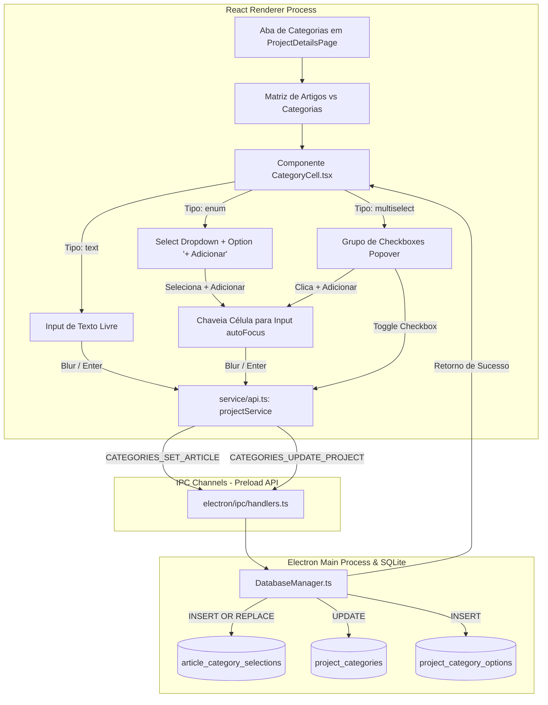
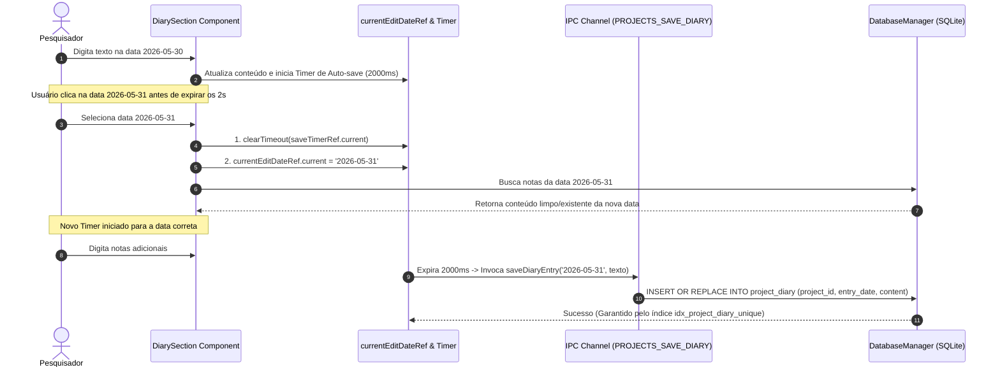
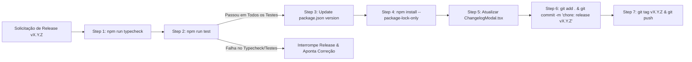

# Fase 6: Matriz Taxonômica Interativa, Ergonomia UI/UX e Estabilização de Concorrência

**Posição**: Fase 6 (Commits 92 a 120)  
**Intervalo de Commits**: `b55fa51d` (Commit 92) até `764cdc7f` (Commit 120) — Total: 29 commits  
**Data da Janela de Desenvolvimento**: 30 de Maio de 2026 a 03 de Junho de 2026  

---

## 1. Resumo Executivo

A **Fase 6** do desenvolvimento do *Emma's Librarian* representa o ciclo de consolidação da experiência do usuário (*UI/UX Ergonomics*), maturidade da modelagem de dados qualitativos e automação rigorosa da governança de lançamentos do software. Após a transformação da aplicação em um ambiente de pesquisa local-first e a introdução da portabilidade via arquivos `.emmapcarc` na Fase 5, a equipe concentrou esforços em responder a demandas acadêmicas refinadas de meta-síntese de dados e estabilização de infraestrutura.

O marco central desta fase foi a implementação da **Matriz Taxonômica Interativa** (`CategoryCell.tsx` e aba de categorias em `ProjectDetailsPage.tsx`). Esta funcionalidade permite que pesquisadores definam categorias qualitativas customizadas por projeto (como "Metodologia", "População de Estudo", "Nível de Evidência") e preencham esses atributos de forma reativa diretamente em uma grade bidimensional (Artigo x Categoria). A arquitetura taxonômica foi evoluída para suportar três tipos estruturados de dados: texto livre (`text`), listas de enumeração com adição inline (`enum`) e seleção múltipla com caixas de checagem (`multiselect`).

Paralelamente, a interface principal (Dashboard) passou por reestruturações ergonômicas substanciais: o grid responsivo de 12 colunas foi ajustado, gráficos visuais foram reordenados para priorizar métricas de produtividade, o mapa de calor do diário de pesquisa (`DashboardCalendar.tsx`) recebeu destaque visual de borda reativa para o dia corrente, e caixas de diálogo nativas bloqueantes (`window.prompt`) foram substituídas por formulários inline e modais dinâmicos.

No âmbito da engenharia de banco de dados e estabilidade, foi diagnosticada e sanada uma **condição de corrida (*race condition*) crítica na persistência do Diário de Projeto** (`DatabaseManager.ts` / `DiarySection.tsx`). A correção combinou a criação de um índice de unicidade relacional no SQLite com o congelamento de referências via `useRef` e limpeza de timers pendentes de *auto-save* no React Renderer Process.

Por fim, a fase homologou quatro versões semânticas consecutivas (**v1.1.5, v1.1.6, v1.1.7 e v1.1.8**) e formalizou a **skill de automação `release-manager`** (`agent/release-manager/SKILL.md`), estabelecendo um protocolo obrigatório de verificação de tipos (`typecheck`), suíte de testes de integração, sincronização de pacotes e etiquetagem (*git tag*) semântica.

---

## 2. Detalhamento Profundo

### 2.1. Decisões de Engenharia & Racional Arquitetural

#### A. Modelagem Relacional e Reatividade da Matriz Taxonômica (`text`, `enum`, `multiselect`)
Para suportar o fluxo de síntese qualitativa de artigos científicos sem sobrecarregar o esquema fixo da tabela `articles`, a engenharia optou por um modelo EAV (Entity-Attribute-Value) otimizado e fortemente tipado no SQLite.
- **Tabelas de Suporte**: Foram criadas as tabelas `project_categories` (metadados da categoria), `project_category_options` (opções pré-definidas para listas) e `article_category_selections` (tabela de junção para seleções `multiselect`).
- **Reatividade Inline**: O componente `CategoryCell.tsx` foi concebido para chavear dinamicamente entre modos de exibição e edição. Para categorias do tipo `enum` e `multiselect`, a adição de novas opções ocorre sem a necessidade de retornar às configurações do projeto: a opção `+ Adicionar nova opção...` transforma o campo em um `<input>` dinâmico no próprio local da célula.
- **Isolamento de Estado**: As requisições de atualização de categorias foram separadas do fluxo principal de recarregamento do leitor de PDF (`ArticleReaderPage.tsx`), impedindo o reset do scroll do documento ou interrupções na leitura durante o preenchimento de metadados.

```
+-----------------------------------------------------------------------------------+
|                            MATRIZ DE TAXONOMIA QUALITATIVA                        |
+------------------------------------+--------------------+-------------------------+
| Artigo Científico                  | Tipo de Estudo     | Fatores de Risco        |
+------------------------------------+--------------------+-------------------------+
| Smith et al. (2024) - RCT Neuro    | [ Enum: Ensaio...v]| [x] Sedentarismo        |
|                                    |                    | [x] Dieta Hipercalórica |
|                                    |                    | [+ Adicionar nova...]   |
+------------------------------------+--------------------+-------------------------+
| Johnson & Lee (2025) - Cohort Study| [ Enum: Coorte   v]| [x] Tabagismo           |
+------------------------------------+--------------------+-------------------------+
```

#### B. Ergonomia da UI, Eliminação de Diálogos Bloqueantes e React Portals
- **Substituição do `window.prompt` por Inline Controls**: No ambiente do Electron, invocar funções bloqueantes do navegador como `window.prompt()` paralisa a *event loop* do Renderer Process e causa falhas de renderização em janelas nativas ou no modo fullscreen. A refatoração substituiu todos os `window.prompt` por estados locais no React (`isAddingNewOption`), garantindo input fluido com foco automático (`autoFocus`), submissão ao pressionar `Enter` e cancelamento em `Escape`.
- **Portalização de Overlays de Drag-and-Drop**: O overlay visual de arrastar e soltar arquivos de projeto (`.emmapcarc`) ou PDFs em lote foi migrado para `ReactDOM.createPortal` ancorado no `document.body` (`Layout.tsx`). Isso assegura cobertura integral da tela (100vw x 100vh), sobrepondo componentes com `overflow: hidden` ou z-index isolados.
- **Refinamento do Dashboard**: Ajustes na proporção do grid de 12 colunas reequilibraram o espaço entre a lista de projetos ativos e os painéis gráficos. O gráfico de status de artigos (Ativo, Lendo, Arquivado) foi restaurado e o mapa de calor de produtividade recebeu um contorno em cor primária destacando o dia atual.

#### C. Resolução de Condição de Corrida (Race Condition) na Persistência do Diário
- **O Problema**: O `DiarySection.tsx` utilizava um temporizador de *debouncing* de 2 segundos para salvar automaticamente as anotações do diário à medida que o usuário digitava. Quando o usuário alternava entre datas no calendário rapidamente, a função temporizada assíncrona era disparada *após* a troca da data selecionada no estado do React (`selectedDate`). Como resultado, o conteúdo digitado na data anterior era gravado sobre a nova data selecionada no SQLite, gerando duplicação de chave primária e perda de notas.
- **A Solução em Duas Camadas**:
  1. **Backend / SQLite Migration (`DatabaseManager.ts`)**: Executou-se uma rotina de desduplicação mantendo o registro de `id` mais recente e criou-se a restrição de unicidade relacional:
     ```sql
     CREATE UNIQUE INDEX IF NOT EXISTS idx_project_diary_unique 
     ON project_diary(project_id, entry_date);
     ```
  2. **Frontend / React Ref & Cancellation (`DiarySection.tsx`)**: Introduziu-se a referência `currentEditDateRef` para travar o valor da data associada ao escopo do timer de auto-salvamento. Adicionalmente, qualquer clique em uma nova data no calendário invalida e cancela explicitamente o temporizador ativo (`if (saveTimerRef.current) clearTimeout(saveTimerRef.current);`).

#### D. Governança e Automação de Releases com a Skill `release-manager`
Com o aumento da frequência de lançamentos (v1.1.5 a v1.1.8), tornou-se indispensável formalizar um procedimento operacional padrão para entregas de código:
- **Criação do Agente Skill (`agent/release-manager/SKILL.md`)**: Define uma esteira de 5 passos obrigatórios que impede lançamentos com quebras estáticas ou de testes.
- **Remoção de Impasses em CI**: Remoção do script de *prepare* do Husky do `package.json` para evitar falhas de execução de hooks Git em contêineres de Integração Contínua desprovidos de ambiente TTY interativo.

---

### 2.2. Diagramas de Arquitetura e Fluxos de Dados (Mermaid)

#### Diagrama 1: Fluxo de Interação e Persistência na Matriz Taxonômica


#### Diagrama 2: Resolução de Condição de Corrida (Auto-Save Debounced vs Navegação de Datas)


#### Diagrama 3: Esteira Operacional da Skill `release-manager`


---

### 2.3. Estrutura de Diretórios e Arquivos Modificados/Criados

A tabela abaixo detalha a movimentação de arquivos e a distribuição de responsabilidades estabelecidas durante a Fase 6:

| Caminho do Arquivo | Estado | Responsabilidade e Impacto Arquitetural |
|---|---|---|
| `agent/release-manager/SKILL.md` | **Novo** | Documento e instrução executável da skill de automação de lançamentos e verificações de integridade. |
| `emmas_librarian/src/components/CategoryCell.tsx` | **Novo Componente** | Renderizador dinâmico de células da matriz taxonômica (suporte a `text`, `enum` e `multiselect` com inputs inline). |
| `emmas_librarian/electron/database/schema.sql` | **Atualizado** | Adição das tabelas `project_categories`, `project_category_options`, `article_category_selections` e índice `idx_project_diary_unique`. |
| `emmas_librarian/electron/database/DatabaseManager.ts` | **Atualizado** | Métodos para atualização de categorias, adição de opções relacionais e desduplicação transacional do diário. |
| `emmas_librarian/electron/ipc/handlers.ts` | **Atualizado** | Registro de manipuladores IPC para `CATEGORIES_UPDATE_PROJECT`, `CATEGORIES_SET_ARTICLE` e `CATEGORIES_GET_PROJECT`. |
| `emmas_librarian/electron/types.ts` | **Atualizado** | Definição de novos enums de comunicação IPC em `IpcChannel`. |
| `emmas_librarian/src/pages/ProjectDetailsPage.tsx` | **Atualizado** | Implementação da aba "Categorias" com visualização da matriz bidimensional e botões de exportação CSV/XLSX. |
| `emmas_librarian/src/pages/ArticleReaderPage.tsx` | **Atualizado** | Reformulação do botão de categorização para estilo *pill* com carregamento isolado via `useEffect`. |
| `emmas_librarian/src/components/DiarySection.tsx` | **Atualizado** | Bloqueio de condições de corrida com `currentEditDateRef` e cancelamento de timers pendentes. |
| `emmas_librarian/src/components/common/Layout.tsx` | **Atualizado** | Encapsulamento dos overlays de Drag-and-Drop com `ReactDOM.createPortal` ancorado no `document.body`. |
| `emmas_librarian/src/components/common/DashboardCalendar.tsx` | **Atualizado** | Destaque visual do dia atual no mapa de calor do diário com borda em cor primária. |
| `emmas_librarian/src/components/modals/ProjectCategoriesModal.tsx` | **Atualizado** | Formatação visual dos formulários de gestão de categorias com a classe `input-field`. |
| `emmas_librarian/src/components/modals/ChangelogModal.tsx` | **Atualizado** | Adição dos registros de alterações para as versões v1.1.5, v1.1.6, v1.1.7 e v1.1.8. |
| `emmas_librarian/package.json` | **Atualizado** | Bump de versões semânticas e remoção do comando `husky install` do script `prepare`. |

---

### 2.4. Trechos de Código Principais (Diffs Extraídos dos Commits)

#### A. Célula Dinâmica da Matriz com Suporte a `multiselect` e Edição Inline (`src/components/CategoryCell.tsx`)
*Extraído dos diffs dos commits `cc93fa8b`, `3c1e5558` e `57336170`*:

```typescript
// emmas_librarian/src/components/CategoryCell.tsx
import React, { useState } from 'react';
import { Category, projectService } from '../services/api';

interface CategoryCellProps {
  articleId: number;
  category: Category;
  initialValue?: string;
}

export const CategoryCell: React.FC<CategoryCellProps> = ({ articleId, category, initialValue = '' }) => {
  const [value, setValue] = useState(initialValue);
  const [isEditing, setIsEditing] = useState(false);

  const initialOptions = (category.type === 'enum' || category.type === 'multiselect') && category.options 
    ? category.options.split(',').map(o => o.trim()) 
    : [];
  const [localOptions, setLocalOptions] = useState<string[]>(initialOptions);
  const [isAddingNewOption, setIsAddingNewOption] = useState(false);
  const [newOptionValue, setNewOptionValue] = useState('');

  const saveWithoutClosing = async (newValue: string) => {
    setValue(newValue);
    try {
      await projectService.setArticleCategory(articleId, category.id, newValue);
    } catch (err) {
      console.error('Erro ao salvar categoria do artigo:', err);
    }
  };

  // Tratamento do tipo Multi-Seleção (Multiselect)
  if (category.type === 'multiselect') {
    const selectedValues = value ? value.split(',').map(v => v.trim()).filter(Boolean) : [];

    const handleToggleOption = (opt: string) => {
      const newSelected = selectedValues.includes(opt)
        ? selectedValues.filter(v => v !== opt)
        : [...selectedValues, opt];
      saveWithoutClosing(newSelected.join(', '));
    };

    const saveNewOptionMultiselect = async () => {
      if (newOptionValue && newOptionValue.trim()) {
        const trimmed = newOptionValue.trim();
        if (!localOptions.includes(trimmed)) {
          const updatedOptions = [...localOptions, trimmed].join(', ');
          try {
            await projectService.updateProjectCategory(category.id, category.name, category.type, updatedOptions);
            setLocalOptions([...localOptions, trimmed]);
            saveWithoutClosing([...selectedValues, trimmed].join(', '));
          } catch (err) {
            console.error('Erro ao adicionar opção:', err);
          }
        }
      }
      setIsAddingNewOption(false);
      setNewOptionValue('');
    };

    if (isAddingNewOption) {
      return (
        <input
          autoFocus
          value={newOptionValue}
          onChange={(e) => setNewOptionValue(e.target.value)}
          onBlur={saveNewOptionMultiselect}
          placeholder="Nova opção..."
          onKeyDown={(e) => {
            if (e.key === 'Enter') saveNewOptionMultiselect();
            if (e.key === 'Escape') setIsAddingNewOption(false);
          }}
          className="input-field-sm"
        />
      );
    }

    if (isEditing) {
      return (
        <div className="multiselect-popover bg-surface p-2 border border-primary rounded shadow-md">
          {localOptions.map((opt, idx) => (
            <label key={idx} className="flex items-center gap-2 text-xs cursor-pointer">
              <input 
                type="checkbox" 
                checked={selectedValues.includes(opt)}
                onChange={() => handleToggleOption(opt)}
              />
              {opt}
            </label>
          ))}
          <button 
            className="text-xs text-primary mt-1 text-left"
            onClick={() => { setIsAddingNewOption(true); setNewOptionValue(''); }}
          >
            + Adicionar nova...
          </button>
          <button 
            className="text-xs text-muted mt-2 w-full text-center border-t border-color pt-1"
            onClick={() => setIsEditing(false)}
          >
            Concluir
          </button>
        </div>
      );
    }

    return (
      <div 
        onClick={() => setIsEditing(true)}
        className={`category-tag-cell cursor-pointer text-xs p-1 rounded ${
          selectedValues.length > 0 ? 'bg-surface border' : 'border-dashed text-muted'
        }`}
      >
        {selectedValues.length > 0 ? selectedValues.join(', ') : 'Adicionar'}
      </div>
    );
  }

  // Fallback para tipos text e enum...
  return null;
};
```

---

#### B. Correção da Condição de Corrida no Diário de Pesquisa (`src/components/DiarySection.tsx` & `DatabaseManager.ts`)
*Extraído do diff do commit `03c940c4`*:

```typescript
// 1. Migração no Backend: electron/database/DatabaseManager.ts
public performMigrations(): void {
  try {
    // Deduplica entradas legadas do diário (mantém apenas o ID mais recente por projeto/data)
    this.db.exec(`
      DELETE FROM project_diary 
      WHERE id NOT IN (
        SELECT MAX(id) 
        FROM project_diary 
        GROUP BY project_id, entry_date
      );
    `);
    
    // Garante a restrição de unicidade no SQLite
    this.db.exec(`
      CREATE UNIQUE INDEX IF NOT EXISTS idx_project_diary_unique 
      ON project_diary(project_id, entry_date);
    `);
  } catch (e) {
    console.error('Schema migrations error', e);
  }
}

// 2. Proteção de Escopo no Frontend: src/components/DiarySection.tsx
export const DiarySection: React.FC<DiarySectionProps> = ({ projectId }) => {
  const [selectedDate, setSelectedDate] = useState(todayStr);
  const saveTimerRef = useRef<ReturnType<typeof setTimeout> | null>(null);
  const currentEditDateRef = useRef<string | null>(null);

  const handleDateChange = async (date: string) => {
    // Salva pendências da data anterior imediatamente se existirem alterações
    if (hasChanges && selectedDate) {
      await projectService.saveDiaryEntry(projectId, selectedDate, content);
    }
    
    // Cancela qualquer auto-save debounced pendente para a data anterior!
    if (saveTimerRef.current) {
      clearTimeout(saveTimerRef.current);
    }
    
    setSelectedDate(date);
    currentEditDateRef.current = date; // Trava a nova data de edição no Ref
    setHasChanges(false);

    const entry = await projectService.getDiaryEntry(projectId, date);
    setContent(entry?.content || '');
  };

  const handleContentChange = (newContent: string) => {
    // Aborta se a data selecionada no estado não for idêntica à data travada no ref
    if (currentEditDateRef.current !== selectedDate) return;
    
    setContent(newContent);
    setHasChanges(true);
    
    if (saveTimerRef.current) clearTimeout(saveTimerRef.current);
    
    const dateToSave = selectedDate; // Congela a data na closure da arrow function
    saveTimerRef.current = setTimeout(async () => {
      if (dateToSave && newContent.trim()) {
        setSaving(true);
        await projectService.saveDiaryEntry(projectId, dateToSave, newContent);
        setSaving(false);
        setHasChanges(false);
      }
    }, 2000);
  };
};
```

---

#### C. Esquema SQL das Tabelas de Taxonomia Qualitativa (`electron/database/schema.sql`)
*Extraído dos diffs dos commits `0145cb4d` e `57336170`*:

```sql
-- Tabelas de Taxonomia Qualitativa por Projeto
CREATE TABLE IF NOT EXISTS project_categories (
    id INTEGER PRIMARY KEY AUTOINCREMENT,
    project_id INTEGER NOT NULL,
    name TEXT NOT NULL,
    type TEXT NOT NULL DEFAULT 'text', -- Tipos suportados: 'text', 'enum', 'multiselect'
    options TEXT, -- String separada por vírgulas para opções rápidas
    FOREIGN KEY(project_id) REFERENCES projects(id) ON DELETE CASCADE
);

CREATE TABLE IF NOT EXISTS project_category_options (
    id INTEGER PRIMARY KEY AUTOINCREMENT,
    category_id INTEGER NOT NULL,
    name TEXT NOT NULL,
    FOREIGN KEY(category_id) REFERENCES project_categories(id) ON DELETE CASCADE
);

CREATE TABLE IF NOT EXISTS article_category_selections (
    article_id INTEGER NOT NULL,
    category_id INTEGER NOT NULL,
    option_id INTEGER NOT NULL,
    PRIMARY KEY(article_id, category_id, option_id),
    FOREIGN KEY(article_id) REFERENCES articles(id) ON DELETE CASCADE,
    FOREIGN KEY(category_id) REFERENCES project_categories(id) ON DELETE CASCADE,
    FOREIGN KEY(option_id) REFERENCES project_category_options(id) ON DELETE CASCADE
);
```

---

#### D. Especificação do Workflow Automatizado da Skill `release-manager` (`agent/release-manager/SKILL.md`)
*Extraído do commit `764cdc7f`*:

```markdown
# Release Manager Workflow (Trecho de Instruções da Skill)

Sempre que for solicitado o lançamento de uma nova versão do Emma's Librarian, execute rigorosamente as seguintes etapas:

1. Verificação de Integridade (Typecheck e Testes):
   cd emmas_librarian/emmas_librarian
   npm run typecheck
   npm run test

2. Atualização dos Arquivos de Metadados:
   - Atualizar "version" em package.json para a versão semântica synched
   - Executar: npm install --package-lock-only

3. Atualização das Patch Notes:
   - Registrar no ChangelogModal.tsx os novos recursos, correções e refatorações da versão
   - Atualizar asserções de teste em ChangelogModal.test.tsx se necessário

4. Commitar as Alterações:
   git add .
   git commit -m "chore: release vX.Y.Z"

5. Geração e Push da Tag Git:
   git tag vX.Y.Z
   git push origin main
   git push origin vX.Y.Z
```

---

## 3. Tabela Completa de Commits Mapeados (Fase 6)

| Index | Commit Hash | Autor | Data (UTC-3) | Mensagem do Commit | Escopo / Alteração Principal |
|---|---|---|---|---|---|
| 92 | `b55fa51d` | João Pedro V | 30/05/2026 10:47 | `refactor(ui): apply UX cleanups for project details and article reader` | Ajustes de espaçamento e UX na tela de detalhes e no leitor. |
| 93 | `fe98b0e3` | João Pedro V | 30/05/2026 12:00 | `feat(ui): restore active/read/archived status chart in dashboard` | Restauração do gráfico de rosquinha de status de leitura no Dashboard. |
| 94 | `2a5ccdf9` | João Pedro V | 30/05/2026 12:03 | `style(ui): adjust dashboard grid to 12-columns and remove background...` | Ajuste da grade do Dashboard para 12 colunas e remoção de fundos opacos. |
| 95 | `5b561282` | João Pedro V | 30/05/2026 12:05 | `style(ui): reorder calendar header to put month selector on a new line` | Reorganização do cabeçalho do calendário em linha dedicada. |
| 96 | `e37f10f9` | João Pedro V | 30/05/2026 12:07 | `style(ui): revert dashboard grid to 1/3 for each column` | Reversão do layout do Dashboard para proporções de 1/3 por coluna. |
| 97 | `87d5707d` | João Pedro V | 30/05/2026 12:11 | `feat(ui): highlight current day with primary border color` | Destaque com borda primária para a célula do dia atual no calendário. |
| 98 | `07090434` | João Pedro V | 30/05/2026 12:16 | `refactor(ui): remove physical files chart and move remaining charts...` | Reorganização visual de gráficos acima da lista de projetos. |
| 99 | `f9333b32` | João Pedro V | 30/05/2026 12:18 | `style(ui): resize dashboard elements to make chart larger...` | Redimensionamento responsivo de elementos no painel principal. |
| 100 | `c3715699` | João Pedro V | 30/05/2026 12:20 | `feat(ui): restore physical files chart and move charts section...` | Restauração do gráfico de arquivos físicos abaixo da listagem de projetos. |
| 101 | `8807a024` | João Pedro V | 30/05/2026 12:26 | `fix(sync): resolve undefined storageDir error when importing project` | Correção de erro de diretório de armazenamento nulo na importação. |
| 102 | `6c7a7045` | João Pedro V | 30/05/2026 12:33 | `fix(ui): use article id instead of created_at for added-asc/desc sorting` | Garantia de ordenação estável utilizando o ID numérico do artigo. |
| 103 | `d733199e` | João Pedro V | 30/05/2026 12:42 | `style(ui): add input-field class to style project categories modal` | Padronização de classes de formulário no modal de categorias. |
| 104 | `90f163d9` | João Pedro V | 30/05/2026 12:49 | `fix(ui): use React portal for drag and drop overlays...` | Renderização do overlay Drag-and-Drop no body via `createPortal`. |
| 105 | `30679995` | João Pedro V | 30/05/2026 12:55 | `style(ui): update categorize button in pdf reader to be a pill...` | Redesenho do botão de categorização no leitor para formato *pill*. |
| 106 | `8e72c9e1` | João Pedro V | 30/05/2026 16:05 | `feat(ui): implement categories tab with matrix view and export buttons` | Implementação da aba "Categorias" com visualização em matriz e exportação. |
| 107 | `cc93fa8b` | João Pedro V | 30/05/2026 16:33 | `feat(ui): make enum categories editable inline and fix category cell...` | Habilitação de adição e edição inline de opções em células `enum`. |
| 108 | `3c1e5558` | João Pedro V | 30/05/2026 17:35 | `fix(ui): replace window.prompt with dynamic input for enum category options` | Substituição de `window.prompt` nativo por `<input>` dinâmico no React. |
| 109 | `12f4e21e` | João Pedro V | 30/05/2026 18:09 | `fix(ui): separate categories fetch to avoid reloading pdf reader...` | Separação da busca de categorias para prevenir re-renders no leitor. |
| 110 | `21be4f1a` | João Pedro V | 30/05/2026 18:29 | `test(ui): fix project categories modal test after adding options parameter` | Ajuste em testes unitários do modal de categorias. |
| 111 | `81fd1589` | João Pedro V | 30/05/2026 19:06 | `test(electron): fix mock dependencies for SyncService and handlers...` | Atualização de mocks em testes do processo Main do Electron. |
| 112 | `2ce6bb57` | João Pedro V | 30/05/2026 23:35 | `chore(deps): remove husky from prepare script to fix CI` | Remoção do Husky do script `prepare` para prevenir travamentos no CI. |
| 113 | `0dab999b` | João Pedro V | 31/05/2026 00:24 | `update package.json` | Atualização operacional das dependências no `package.json`. |
| 114 | `03c940c4` | João Pedro V | 31/05/2026 04:20 | `fix(diary): resolve data persistence inconsistency and race condition` | Resolução da race condition no auto-save do diário e constraint SQLite. |
| 115 | `4005d80b` | João Pedro V | 31/05/2026 04:23 | `chore: release v1.1.5` | Lançamento oficial da versão semântica v1.1.5. |
| 116 | `57336170` | João Pedro V | 03/06/2026 11:40 | `feat: add multiselect category type and fix options loading` | Implementação do tipo de categoria `multiselect` e correções de carga. |
| 117 | `36e5189a` | João Pedro V | 03/06/2026 11:42 | `v1.1.6` | Lançamento oficial da versão semântica v1.1.6. |
| 118 | `c3d2f75e` | João Pedro V | 03/06/2026 12:18 | `chore: release v1.1.7` | Lançamento oficial da versão semântica v1.1.7. |
| 119 | `f5ad6af3` | João Pedro V | 03/06/2026 13:03 | `chore: release v1.1.8` | Lançamento oficial da versão semântica v1.1.8. |
| 120 | `764cdc7f` | João Pedro V | 03/06/2026 13:06 | `feat: add release-manager skill` | Formalização da skill `release-manager` para automação de releases. |

---
*Seção da Fase 6 elaborada pelo agente `phase_6_worker` com base no histórico Git e análise técnica do repositório.*
