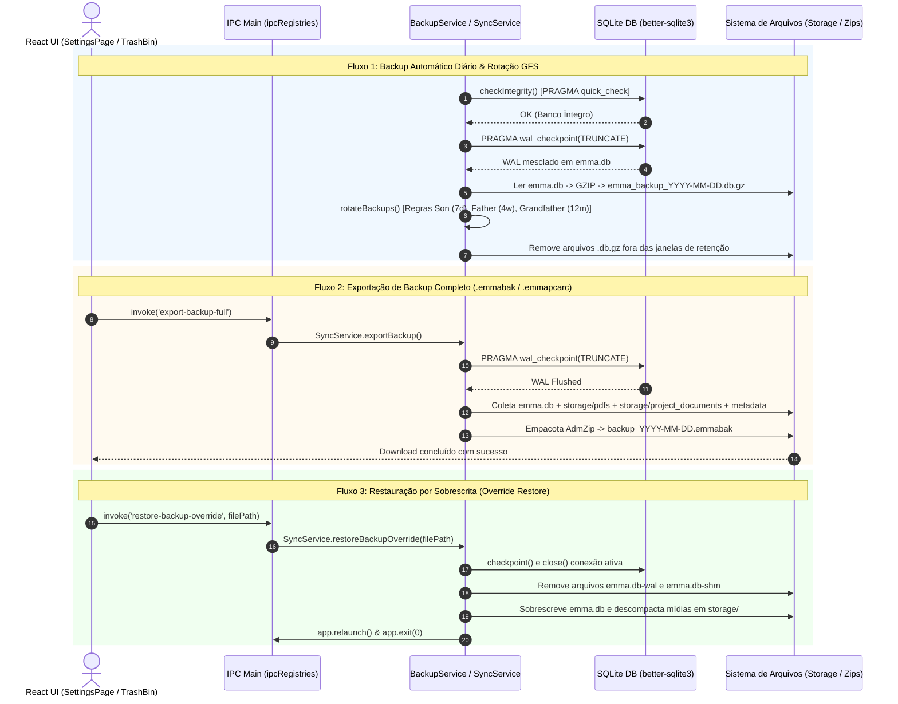

# Fase 7: Arquitetura Enterprise de Backup, Rotação GFS e Lixeira com Historização

**Posição**: `Fase 7 (Commits 121 a 129)`

---

## 1. Resumo Executivo

A **Fase 7** representa um salto de maturidade arquitetural no repositório `emmas_librarian`, consolidando uma infraestrutura corporativa de persistência resiliente, segurança de dados e governança de histórico. Conforme a aplicação evoluiu em número de projetos, artigos científicos indexados, anotações de diário e investigações massivas de IA, tornou-se imprescindível eliminar os riscos de perda acidental de dados, corrupção de arquivos por concorrência de E/S e ausência de mecanismos de auditoria.

Abrangendo os commits **121 ao 129** (culminando na release **v1.1.12**), esta fase introduziu três grandes avanços tecnológicos:

1. **Lixeira Lógica (Soft Delete) e Historização de Diário (`project_diary_history`)**: Substituição de exclusões físicas diretas (`DELETE`) pela marcação temporal (`deleted_at DATETIME DEFAULT NULL`) em tabelas primárias (`projects`, `articles`, `annotations`), acompanhada por uma interface dedicada de Lixeira (*Trash Bin*) para restauração ou expurgo definitivo. Além disso, estruturou-se a historização completa do Diário de Bordo dos projetos, gravando snapshots de versões anteriores para viabilizar auditorias e restauração (*rollback*) de entradas alteradas.
2. **Sistema de Backup Automático com Rotação GFS (*Grandfather-Father-Son*) e Transporte de Dados (.emmabak e .emmapcarc)**: Criação da rotina automatizada de cópias de segurança locais com compressão GZIP (`.db.gz`) e retenção multinível — 7 backups diários (*Son*), 4 semanais (*Father*) e 12 mensais (*Grandfather*). Adicionalmente, expandiu-se a capacidade de exportação manual e transporte para pacotes corporativos completos (`.emmabak`) e projetos isolados (`.emmapcarc`), oferecendo modalidades de restauração por sobrescrita (*override*) ou mesclagem não destrutiva (*merge*).
3. **Garantia de Consistência WAL (Write-Ahead Logging) no SQLite via Checkpointing Preventivo (`PRAGMA wal_checkpoint(TRUNCATE)`)**: Solução de uma vulnerabilidade crítica de integridade no motor SQLite. Ao operar sob o modo WAL, modificações recentes permanecem retidas no arquivo secundário `-wal`. A adição de chamadas automáticas de flushing WAL antes de qualquer exportação ou cópia em nível de arquivo garantiu que 100% das mutações sejam consolidadas no banco principal (`emma.db`), eliminando riscos de exportação de dados desatualizados ou corrompidos.

---

## 2. Detalhamento Profundo

### 2.1. Decisões de Engenharia & Racional Arquitetural

#### A. Prevenção de Perda Irrecuperável de Dados: Soft Delete & Versionamento do Diário
Antes do commit `121`, ações de exclusão de projetos ou artigos no `emmas_librarian` disparavam comandos SQL `DELETE FROM`, removendo dados de forma irreversível e limpando em cascata anotações e destaques associados. Essa abordagem apresentava alto risco operacional para pesquisadores.

- **Soft Delete nas Tabelas Principais**: As tabelas `projects`, `articles` e `annotations` receberam a coluna `deleted_at DATETIME DEFAULT NULL`. As queries normais de leitura da aplicação foram ajustadas para filtrar `WHERE deleted_at IS NULL`.
- **Interface da Lixeira Lógica (TrashBinModal)**: Criou-se um painel de governança onde os registros marcados para remoção podem ser visualizados pelo usuário, com suporte a **Restaurar** (reverter `deleted_at` para `NULL`) ou **Expurgar** (executar exclusão física definitiva).
- **Tabela `project_diary_history`**: O Diário de Bordo armazena anotações e insights contínuos de pesquisa. Para evitar a perda acidental de ideias por edições indevidas, qualquer atualização na tabela `project_diary` dispara um registro preventivo na tabela `project_diary_history`, preservando o estado anterior (`content`), a data da nota (`entry_date`) e a data da alteração (`updated_at`).

#### B. Rotação GFS (Grandfather-Father-Son) & Estratégia de Restauração
Para equilibrar a segurança operacional com o consumo de espaço em disco no ambiente de desktop Electron, desenhou-se o `BackupService` com uma política automatizada de retenção GFS:

- **Diário (Son)**: Mantém cópias individuais para cada um dos últimos 7 dias corridos.
- **Semanal (Father)**: Agrupa backups por semanas ISO (ex: `2026-W23`) e preserva o arquivo mais recente de cada uma das últimas 4 semanas.
- **Mensal (Grandfather)**: Agrupa backups por ano-mês (ex: `2026-6`) e mantém o arquivo mais recente de cada um dos últimos 12 meses.
- **Compressão `.db.gz`**: Backups automáticos diários aplicam compressão GZIP nativa do Node (`zlib`), reduzindo o tamanho do arquivo em até 85%.
- **Dupla Modalidade de Restauração**:
  - **Sobrescrita Total (`restoreBackupOverride`)**: Substitui o arquivo `emma.db` e limpa as pastas de mídia associadas (`storage/pdfs` e `storage/project_documents`). O serviço limpa explicitamente conexões e travas do SQLite e chama `app.relaunch()` para reiniciar a aplicação de forma limpa.
  - **Mesclagem Não Destrutiva (`restoreBackupMerge`)**: Carrega o backup em um banco temporário, executa migrações de alinhamento de esquema e importa apenas os projetos cujos nomes não colidam com o banco ativo, remapping automaticamente todos os IDs de artigos, categorias, destaques e investigações.

#### C. Garantia de Consistência WAL (Write-Ahead Logging) no SQLite
No SQLite operando em modo Write-Ahead Logging (WAL), todas as operações de escrita são primeiramente gravadas no arquivo de log secundário `emma.db-wal` e mantidas na memória shared-memory `emma.db-shm`. Em testes de estresse e exportação de backups completos (`.emmabak`), detectou-se que cópias de arquivos feitas via Node.js (`fs.readFileSync('emma.db')`) geravam arquivos truncados ou com estados defasados em relação às últimas mutações do usuário.

- **Solução no Commit `a8d60be`**: Foi adicionado o método `checkpoint()` ao `DatabaseManager` / `DatabaseAdapter`, que executa a instrução `PRAGMA wal_checkpoint(TRUNCATE);`.
- Essa instrução força o SQLite a pausar brevemente leituras concorrentes, transferir **todas** as páginas do arquivo `-wal` para o banco principal `emma.db` e truncar o arquivo de log para zero bytes.
- O `SyncService` passou a invocar obrigatoriamente essa rotina antes de empacotar arquivos Zip de backup e antes de encerrar conexões para restauração, assegurando 100% de integridade nos backups gerados e prevenindo travamentos de arquivo (*file locks*) no Windows.

---

### 2.2. Diagrama de Arquitetura e Fluxo de Backup/Restauração GFS



---

### 2.3. Tabela de Estrutura de Diretórios e Arquivos Envolvidos

| Caminho do Arquivo / Diretório | Função & Responsabilidade no Sistema | Estado no Escopo da Fase (Commits 121-129) |
|---|---|---|
| `emmas_librarian/electron/services/BackupService.ts` | Classe responsável pelos backups automáticos diários, verificação de integridade do SQLite, compressão GZIP e algoritmo de retenção GFS (*Son/Father/Grandfather*). | **Novo / Implementado** (Commits `18390dc`, `c985de0`, `f7a79f0`) |
| `emmas_librarian/electron/database/SyncService.ts` | Serviço de gerenciamento de importação e exportação de pacotes de projetos (`.emmapcarc`) e backups completos (`.emmabak`), incluindo flushing WAL preventivo. | **Modificado** (Commits `c985de0`, `a8d60be`, `3e7db0b`, `e77190b`) |
| `emmas_librarian/electron/database/DatabaseAdapter.ts` | Interface do motor de banco SQLite (`better-sqlite3`). Adicionou o método `checkpoint()` para chamada `PRAGMA wal_checkpoint(TRUNCATE)` e suporte a *soft delete*. | **Modificado** (Commits `18390dc`, `a8d60be`) |
| `emmas_librarian/electron/database/schema.sql` | Arquivo DDL com o esquema relacional do banco. Recebeu a coluna `deleted_at` nas tabelas principais e a criação da tabela `project_diary_history`. | **Modificado** (Commit `18390dc`) |
| `emmas_librarian/electron/__tests__/BackupService.test.ts` | Suíte de testes unitários para o `BackupService`, validando integridade, compressão, limites de rotação GFS e restauração de arquivos. | **Novo** (Commits `18390dc`, `c985de0`) |
| `emmas_librarian/src/pages/SettingsPage.tsx` | Componente de interface React em que o usuário configura preferências de backup, executa exportações/restaurações manuais e gerencia backups GFS. | **Modificado** (Commits `c985de0`, `f7a79f0`) |
| `emmas_librarian/src/components/modals/TrashBinModal.tsx` | Componente modal em React para visualização da lixeira lógica, permitindo que o usuário restaure ou expurgue itens marcados como deletados. | **Novo / Modificado** (Commits `18390dc`, `f7a79f0`) |

---

### 2.4. Trechos de Código Principais (Extraídos dos Diffs de Commits 121 a 129)

#### 1. Implementação do Flushing WAL Preventivo (`PRAGMA wal_checkpoint(TRUNCATE)`)
*Arquivo: `electron/database/SyncService.ts` & `DatabaseAdapter.ts` (Commit `a8d60be`)*

```typescript
/**
 * Executa o checkpoint do WAL para garantir o flush de todas as escritas pendentes
 * do arquivo -wal para o arquivo de banco principal (emma.db).
 * Deve ser chamado obrigatoriamente antes de operações de cópia/exportação em nível de arquivo.
 */
public checkpoint(): void {
  const db = (this.dbAdapter as any).getDB ? (this.dbAdapter as any).getDB() : (this.dbAdapter as any).db;
  db.pragma('wal_checkpoint(TRUNCATE)');
}

public async exportBackup(): Promise<string | null> {
  // ...
  const dbPath = path.join(app.getPath('userData'), 'emma.db');
  const zip = new AdmZip();

  // 1. Flush WAL para o arquivo principal antes da leitura, garantindo consistência total
  const db = (this.dbAdapter as any).getDB ? (this.dbAdapter as any).getDB() : (this.dbAdapter as any).db;
  db.pragma('wal_checkpoint(TRUNCATE)');

  // 2. Copia o arquivo emma.db limpo para o pacote zip
  if (fs.existsSync(dbPath)) {
    zip.addFile('emma.db', fs.readFileSync(dbPath));
  }
  // ...
}
```

#### 2. Algoritmo de Rotação GFS (*Grandfather-Father-Son*)
*Arquivo: `electron/services/BackupService.ts` (Commits `18390dc`, `c985de0`)*

```typescript
public rotateBackups(referenceDate: Date = new Date()): void {
  if (!fs.existsSync(this.backupsDir)) return;

  const files = fs.readdirSync(this.backupsDir);
  const backupFiles = files.filter((f) => f.startsWith('emma_backup_') && f.endsWith('.db.gz'));

  const backups: BackupFileInfo[] = [];
  for (const f of backupFiles) {
    const match = f.match(/emma_backup_(\d{4}-\d{2}-\d{2})/);
    if (match) {
      const dateStr = match[1];
      const date = new Date(dateStr + 'T12:00:00Z'); // UTC para evitar desvios de fuso
      backups.push({ filename: f, date, dateStr });
    }
  }

  // Ordena do mais recente para o mais antigo
  backups.sort((a, b) => b.date.getTime() - a.date.getTime());

  const keep = new Set<string>();
  const oneDayMs = 24 * 60 * 60 * 1000;
  const weeklyGroups = new Map<string, BackupFileInfo[]>();
  const monthlyGroups = new Map<string, BackupFileInfo[]>();

  for (const b of backups) {
    const ageMs = referenceDate.getTime() - b.date.getTime();

    // 1. Diários (Son): Preserva todos os backups dos últimos 7 dias
    if (ageMs >= 0 && ageMs < 7 * oneDayMs) {
      keep.add(b.filename);
    }

    const weekId = getWeekIdentifier(b.date);
    const monthId = `${b.date.getUTCFullYear()}-${b.date.getUTCMonth() + 1}`;

    if (!weeklyGroups.has(weekId)) weeklyGroups.set(weekId, []);
    weeklyGroups.get(weekId)!.push(b);

    if (!monthlyGroups.has(monthId)) monthlyGroups.set(monthId, []);
    monthlyGroups.get(monthId)!.push(b);
  }

  // 2. Semanais (Father): Preserva o backup mais recente das últimas 4 semanas
  const sortedWeeks = Array.from(weeklyGroups.keys()).sort().reverse();
  const weeksToKeep = sortedWeeks.slice(0, 4);
  for (const wId of weeksToKeep) {
    const group = weeklyGroups.get(wId)!;
    group.sort((a, b) => b.date.getTime() - a.date.getTime());
    keep.add(group[0].filename);
  }

  // 3. Mensais (Grandfather): Preserva o backup mais recente dos últimos 12 meses
  const sortedMonths = Array.from(monthlyGroups.keys()).sort().reverse();
  const monthsToKeep = sortedMonths.slice(0, 12);
  for (const mId of monthsToKeep) {
    const group = monthlyGroups.get(mId)!;
    group.sort((a, b) => b.date.getTime() - a.date.getTime());
    keep.add(group[0].filename);
  }

  // Exclui backups que não cumprem nenhum critério de retenção GFS
  for (const b of backups) {
    if (!keep.has(b.filename)) {
      try {
        fs.unlinkSync(path.join(this.backupsDir, b.filename));
      } catch (err: any) {
        console.error(`Falha ao remover backup rotacionado ${b.filename}:`, err);
      }
    }
  }
}
```

#### 3. Esquema SQL para Historização de Diário e Lixeira Lógica
*Arquivo: `electron/database/schema.sql` (Commit `18390dc`)*

```sql
-- Suporte a Lixeira Lógica (Soft Delete) em Projetos e Artigos
ALTER TABLE projects ADD COLUMN deleted_at DATETIME DEFAULT NULL;
ALTER TABLE articles ADD COLUMN deleted_at DATETIME DEFAULT NULL;
ALTER TABLE annotations ADD COLUMN deleted_at DATETIME DEFAULT NULL;

-- Tabela Auditável de Histórico de Versões do Diário de Bordo
CREATE TABLE IF NOT EXISTS project_diary_history (
    id INTEGER PRIMARY KEY AUTOINCREMENT,
    project_id INTEGER NOT NULL,
    entry_date TEXT NOT NULL,
    content TEXT NOT NULL,
    updated_at DATETIME DEFAULT CURRENT_TIMESTAMP,
    FOREIGN KEY(project_id) REFERENCES projects(id) ON DELETE CASCADE
);
```

#### 4. Restauração por Sobrescrita com Limpeza de Travas WAL/SHM
*Arquivo: `electron/database/SyncService.ts` (Commits `f7a79f0` e `a8d60be`)*

```typescript
public async restoreBackupOverride(providedPath?: string): Promise<boolean> {
  // ...
  const zip = new AdmZip(importPath);
  const dbEntry = zip.getEntry('emma.db');
  if (!dbEntry) throw new Error('Arquivo de backup inválido (não contém emma.db)');

  // 1. Executa o checkpoint do WAL e encerra a conexão ativa com o banco
  this.dbAdapter.checkpoint();
  this.dbAdapter.close();

  // 2. Remove arquivos temporários de travamento e WAL para evitar conflitos no SQLite
  const dbPath = path.join(app.getPath('userData'), 'emma.db');
  const walPath = `${dbPath}-wal`;
  const shmPath = `${dbPath}-shm`;
  if (fs.existsSync(walPath)) fs.unlinkSync(walPath);
  if (fs.existsSync(shmPath)) fs.unlinkSync(shmPath);

  // 3. Sobrescreve o arquivo físico do banco principal
  fs.writeFileSync(dbPath, dbEntry.getData());

  // 4. Reinicia a aplicação Electron para recarregar conexões limpas
  app.relaunch();
  app.exit(0);
  return true;
}
```

---

## 3. Tabela Resumo dos Commits da Fase 7 (121 a 129)

| # | Hash | Data | Autor | Mensagem do Commit (Subject) | Componentes / Escopo Principal |
|---|---|---|---|---|---|
| 121 | `18390dc` | 2026-06-05 | João Pedro V | feat(backup): complete Etapa 2 with trash bin, diary rollback history, and database migrations | DatabaseManager, Lixeira Lógica, `project_diary_history` |
| 122 | `c985de0` | 2026-06-05 | João Pedro V | feat(backup): complete Etapa 3 with manual backup export and restore mechanisms | `SyncService`, `BackupService`, `SettingsPage` |
| 123 | `f7a79f0` | 2026-06-05 | João Pedro V | feat(backup): add GFS restore option to UI, style trash buttons, fix database file lock | UI GFS, Restauração, File Locks |
| 124 | `a8d60be` | 2026-06-05 | João Pedro V | fix(backup): checkpoint WAL before file-level export and override restore | Flushing WAL, `PRAGMA wal_checkpoint(TRUNCATE)` |
| 125 | `3e7db0b` | 2026-06-05 | João Pedro V | fix(export): restore all article/project fields and diary history in emmapcarc | `SyncService`, Preservação de Campos `.emmapcarc` |
| 126 | `e77190b` | 2026-06-05 | João Pedro V | fix(missing project data in import/export cycle) | Integridade no Ciclo de Importação/Exportação |
| 127 | `08e33a5` | 2026-06-05 | João Pedro V | chore: release v1.1.12 | Publicação e Marcação da Release v1.1.12 |
| 128 | `8827f18` | 2026-06-05 | João Pedro V | docs: update patch notes history in README.md | Documentação de Patch Notes no README |
| 129 | `353b900` | 2026-06-05 | João Pedro V | docs: backfill missing patch notes for v1.1.1 to v1.1.5 in README.md | Preenchimento Retroativo de Patch Notes |
