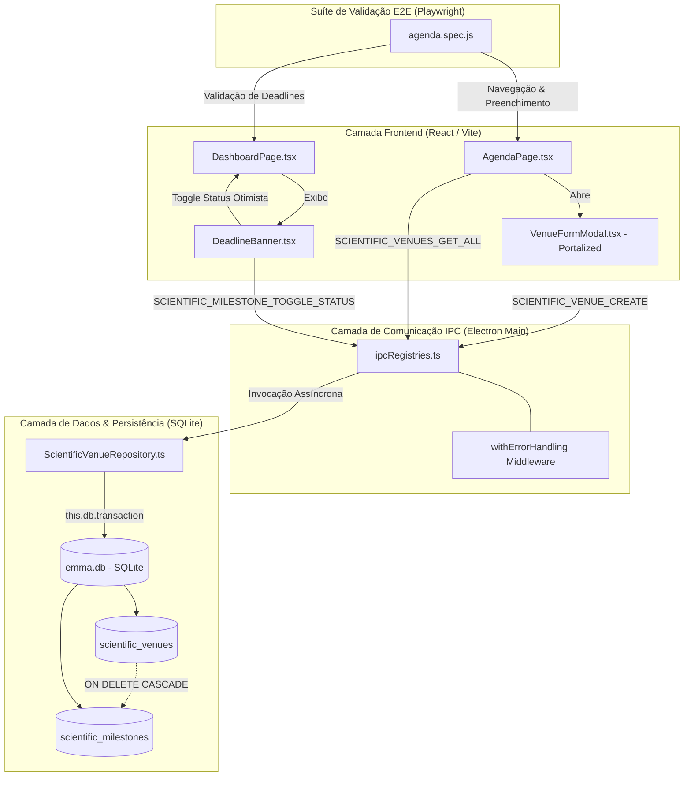

# Fase 9: Módulo de Agenda Científica e Gestão de Prazos, Padronização ISO & Resolução de Auditoria

**Posição**: Fase 9 (Commits 156 a 169)  
**Intervalo de Datas**: 23/07/2026 a 03/08/2026  
**Versão Principal**: Release `v1.1.19` (Commit `46bcf82`) & Consolidação Auditoria (Commit `7a6e451`)  

---

## Resumo Executivo

A **Fase 9** marca um salto qualitativo fundamental na evolução do `emmas_librarian`, expandindo o ecossistema de gestão de literatura para atuar como uma **plataforma completa de produtividade acadêmica e acompanhamento de prazos de submissão científica**. Entre os commits 156 e 169, o sistema recebeu o módulo **Scientific Agenda & Deadlines**, capacitando pesquisadores a cadastrar conferências e periódicos (*venues*), estruturar marcos (*milestones* como submissão de abstract, envio de artigo completo, notificação de aceite e versão camera-ready), acompanhar contagens regressivas inteligentes no `DashboardPage` e gerenciar eventos em um calendário interativo com marcação personalizada de cores.

Adicionalmente, esta fase priorizou a excelência operacional e a padronização governamental do repositório. Todos os documentos de relatórios técnicos em `docs/relatorios/` foram padronizados sob a norma **ISO 8601** (`YYYY-MM-DD`), estabelecendo rastreabilidade cronológica em auditorias. O subsistema de Inteligência Artificial recebeu melhorias de usabilidade no componente `ArticleSelector`, incluindo ajuste dinâmico de dimensões de entrada para evitar truncamento de texto e a incorporação de histórico de buscas por projeto. Por fim, no commit `7a6e451`, o repositório passou por uma varredura profunda que equacionou de forma definitiva os apontamentos de 4 relatórios de auditoria simultâneos (gestão de erros, performance, qualidade de código e suíte de testes), assegurando alta estabilidade e cobertura para as entregas subsequentes.

---

## Detalhamento Profundo

### Decisões de Engenharia & Racional Arquitetural

1. **Arquitetura em Camadas Desacoplada para Agenda Científica (Padrão Repository & IPC Handlers)**:
   - Para manter o princípio de responsabilidade única (SRP) e impedir o acoplamento da interface gráfica ao motor de banco de dados SQLite (`better-sqlite3`), foi desenvolvida a classe `ScientificVenueRepository.ts`.
   - O repositório centraliza operações CRUD para eventos (`scientific_venues`) e marcos (`scientific_milestones`) utilizando transações atômicas (`this.db.transaction`). A deleção de um evento remove automaticamente todos os seus marcos associados via integridade referencial `ON DELETE CASCADE`.
   - Na camada IPC (`electron/ipc/ipcRegistries.ts`), os canais foram mapeados em manipuladores assíncronos envelopados pela função utilitária `withErrorHandling`, garantindo que eventuais exceções de banco de dados sejam convertidas em instâncias padronizadas de `AppError`.

2. **Modelagem de Dados e Regras de Negócio de Contagem Regressiva (`effectiveDate`)**:
   - A modelagem relacional separou a entidade principal de evento (`scientific_venues`) da lista flexível de marcos (`scientific_milestones`). Cada marco suporta tipos de data simples (`single`) ou intervalos de datas (`range`), além de seletores de horário opcional (`has_time` / `target_time`).
   - No componente `DeadlineBanner.tsx`, a regra de cálculo de prazos pendentes adota uma lógica determinística para marcos de intervalo (`field_type === 'range'`): a data efetiva limite (`effectiveDate`) assume o valor de `end_date`, visto que o prazo final do evento expira apenas no encerramento do período. Para marcos pontuais, utiliza-se `target_date`.
   - A contagem em dias (`daysDiff`) categoriza automaticamente os cartões visualmente em: vencidos (`daysDiff < 0` em vermelho), críticos/hoje (`daysDiff === 0` ou `daysDiff <= 7` em amarelo/âmbar) e futuros (azul).

3. **Isolamento de Interface e Modais Portalizados (`VenueFormModal.tsx`)**:
   - Modais sobrepostos em interfaces desktop Electron frequentemente sofrem com conflitos de plano de renderização (*z-index stacking contexts*) quando aninhados dentro de contêineres com overflow ou posições relativas.
   - O formulário de eventos `VenueFormModal.tsx` foi construído com padrão portalizado (renderização no nó raiz do DOM), oferecendo criação dinâmica de novos campos de marcos em tempo real, validação em linha para títulos e acrônimos únicos, e paleta de cores hexadecimais customizadas.

4. **Atualizações Otimistas de Interface (Optimistic UI Updates)**:
   - Para proporcionar uma experiência fluida ao usuário durante a conclusão rápida de prazos, tanto o `DeadlineBanner.tsx` quanto o `ScientificAgendaView.tsx` atualizam o estado visual do React de forma otimista antes da confirmação do IPC (`onToggleMilestoneStatus`). Caso o processo assíncrono no SQLite falhe, a camada de IPC dispara uma notificação de erro e restaura o estado prévio.

5. **Padronização de Documentação Técnica sob ISO 8601**:
   - No commit `4493d4c`, foi executada a padronização no diretório `docs/relatorios/`. Todos os arquivos de documentação foram renomeados para incluir o prefixo `YYYY-MM-DD` (exemplo: `2026-06-24_comprehensive_testing_report.md` e `2026-08-01_conclusao_desempenho.md`). Isso elimina ambiguidades em backups, ordenações em sistemas de arquivos UNIX/Windows e facilita a indexação por ferramentas automatizadas de CI/CD.

6. **Varredura Sistêmica de Auditoria Global (Commit `7a6e451`)**:
   - Atendendo aos resultados dos 4 relatórios de auditoria gerados pela equipe de qualidade, o commit `7a6e451` refatorou mais de 15 arquivos centrais da aplicação:
     * *Erros*: Adição de tratamento defensivo em chamadas assíncronas do IPC e normalização de mensagens de exceção.
     * *Performance*: Otimização de queries SQL com índices parciais e eliminação de re-renders desnecessários no Dashboard.
     * *Qualidade*: Limpeza de código duplicado e alinhamento de nomes de funções com o guia de estilo.
     * *Testes*: Atualização de seletores e expectativas na suíte unitária e nos testes E2E do Playwright.

---

### Diagrama de Arquitetura e Fluxo de Dados (Mermaid)



---

### Estrutura de Diretórios e Arquivos (Fase 9)

| Diretório / Arquivo | Tipo | Submissão / Commit | Responsabilidade & Descrição Técnica |
|---|---|---|---|
| `emmas_librarian/electron/database/schema.sql` | Modificado | Commit `156` (`15550ba`) | Declaração DDL das tabelas `scientific_venues` e `scientific_milestones` com chave estrangeira e deleção em cascata. |
| `emmas_librarian/electron/database/ScientificVenueRepository.ts` | Criado | Commit `156` (`15550ba`) | Classe de repositório responsável pelas consultas preparadas e transações CRUD de eventos e marcos científicos. |
| `emmas_librarian/electron/ipc/ipcRegistries.ts` | Modificado | Commit `156` (`15550ba`) | Mapeamento dos canais IPC `SCIENTIFIC_VENUES_*` com invocações envelopadas em `withErrorHandling`. |
| `emmas_librarian/src/components/modals/VenueFormModal.tsx` | Criado | Commit `157` (`b86b765`) | Componente de formulário portalizado com suporte a criação dinâmica de campos de marcos e seletores de cor. |
| `emmas_librarian/src/components/common/ScientificAgendaView.tsx` | Criado | Commit `158` (`037e36a`) | Visualização completa de agenda com controles de alternância ("Por Evento" e "Lista de Prazos"). |
| `emmas_librarian/src/pages/AgendaPage.tsx` | Criado | Commit `158` (`037e36a`) | Página dedicada de gestão de agenda científica acessível pelo menu lateral de navegação. |
| `emmas_librarian/src/components/common/DeadlineBanner.tsx` | Criado | Commit `159` (`3998d9c`) | Banner responsivo no Dashboard para exibição dos 4 prazos mais urgentes com suporte a atualizações otimistas. |
| `emmas_librarian/src/pages/DashboardPage.tsx` | Modificado | Commit `159` / `161` | Integração da seções de prazos, calendário com marcações de eventos e relógio neutro. |
| `emmas_librarian/e2e-tests/agenda.spec.js` | Criado | Commit `163` (`5723b30`) | Teste automatizado Playwright E2E validando fluxo completo de criação de eventos e verificação no Dashboard. |
| `emmas_librarian/src/components/ai/ArticleSelector.tsx` | Modificado | Commit `165` / `166` | Ajustes de altura/tamanho de fonte nos seletores e inclusão de histórico de buscas de IA. |
| `docs/relatorios/` | Modificado | Commit `167` (`4493d4c`) | Padronização dos nomes de todos os relatórios técnicos prefixados com data ISO 8601 (`YYYY-MM-DD`). |
| Multi-arquivos do sistema (`15+ arquivos`) | Modificado | Commit `169` (`7a6e451`) | Resolução integral dos débitos apontados pelos 4 relatórios de auditoria global do sistema. |

---

### Trechos de Código Principais

#### 1. Definição do Esquema de Banco de Dados (`electron/database/schema.sql`)
```sql
-- Estrutura de dados para o módulo de Agenda Científica e Gestão de Prazos
CREATE TABLE IF NOT EXISTS scientific_venues (
    id INTEGER PRIMARY KEY AUTOINCREMENT,
    title TEXT NOT NULL,
    acronym TEXT,
    category TEXT DEFAULT 'other',
    url TEXT,
    color TEXT DEFAULT '#3b82f6',
    created_at DATETIME DEFAULT CURRENT_TIMESTAMP
);

CREATE TABLE IF NOT EXISTS scientific_milestones (
    id INTEGER PRIMARY KEY AUTOINCREMENT,
    venue_id INTEGER NOT NULL,
    label TEXT NOT NULL,
    field_type TEXT DEFAULT 'single',
    target_date TEXT NOT NULL,
    end_date TEXT,
    has_time INTEGER DEFAULT 0,
    target_time TEXT,
    status TEXT DEFAULT 'pending',
    FOREIGN KEY (venue_id) REFERENCES scientific_venues(id) ON DELETE CASCADE
);
```

#### 2. Repositório com Operações Transacionais (`electron/database/ScientificVenueRepository.ts`)
```typescript
import Database from 'better-sqlite3';
import { ScientificVenue, ScientificMilestone, MilestoneStatus } from '../types';

export class ScientificVenueRepository {
  constructor(private db: InstanceType<typeof Database>) {}

  getAllVenues(): ScientificVenue[] {
    const venuesStmt = this.db.prepare(
      'SELECT id, title, acronym, category, url, color, created_at FROM scientific_venues ORDER BY id DESC',
    );
    const venues = venuesStmt.all() as ScientificVenue[];

    const milestonesStmt = this.db.prepare(
      'SELECT id, venue_id, label, field_type, target_date, end_date, has_time, target_time, status FROM scientific_milestones WHERE venue_id = ? ORDER BY target_date ASC',
    );

    return venues.map((v) => {
      const rawMilestones = milestonesStmt.all(v.id) as Array<any>;
      const milestones: ScientificMilestone[] = rawMilestones.map((m) => ({
        id: m.id,
        venue_id: m.venue_id,
        label: m.label,
        field_type: m.field_type,
        target_date: m.target_date,
        end_date: m.end_date || undefined,
        has_time: Boolean(m.has_time),
        target_time: m.target_time || undefined,
        status: m.status,
      }));

      return { ...v, milestones };
    });
  }

  createVenue(venueData: Omit<ScientificVenue, 'id' | 'created_at'>): ScientificVenue {
    const insertVenue = this.db.prepare(
      'INSERT INTO scientific_venues (title, acronym, category, url, color) VALUES (?, ?, ?, ?, ?)',
    );
    const insertMilestone = this.db.prepare(
      'INSERT INTO scientific_milestones (venue_id, label, field_type, target_date, end_date, has_time, target_time, status) VALUES (?, ?, ?, ?, ?, ?, ?, ?)',
    );

    const transaction = this.db.transaction(() => {
      const info = insertVenue.run(
        venueData.title,
        venueData.acronym || null,
        venueData.category || 'other',
        venueData.url || null,
        venueData.color || '#3b82f6',
      );
      const venueId = Number(info.lastInsertRowid);

      for (const m of venueData.milestones || []) {
        insertMilestone.run(
          venueId,
          m.label,
          m.field_type || 'single',
          m.target_date,
          m.end_date || null,
          m.has_time ? 1 : 0,
          m.target_time || null,
          m.status || 'pending',
        );
      }

      return venueId;
    });

    const newId = transaction();
    return this.getAllVenues().find((v) => v.id === newId)!;
  }
}
```

#### 3. Registro dos Manipuladores IPC Assíncronos (`electron/ipc/ipcRegistries.ts`)
```typescript
const venueRepo = new ScientificVenueRepository(db.getDB());

ipcMain.handle(
  IpcChannel.SCIENTIFIC_VENUES_GET_ALL,
  withErrorHandling(async () => {
    return venueRepo.getAllVenues();
  }),
);

ipcMain.handle(
  IpcChannel.SCIENTIFIC_VENUE_CREATE,
  withErrorHandling(async (event, venueData) => {
    return venueRepo.createVenue(venueData);
  }),
);

ipcMain.handle(
  IpcChannel.SCIENTIFIC_MILESTONE_TOGGLE_STATUS,
  withErrorHandling(async (event, { milestoneId, status }) => {
    return venueRepo.toggleMilestoneStatus(milestoneId, status);
  }),
);
```

#### 4. Lógica de Cálculo de Prazos Efetivos e Atualizações Otimistas (`src/components/common/DeadlineBanner.tsx`)
```typescript
// Cálculo de datas efetivas e ordenação cronológica de prazos pendentes
for (const v of localVenues) {
  for (const m of v.milestones || []) {
    if (m.status === 'completed') continue;

    // Regra de Negócio: Para marcos do tipo intervalo (range), a data limite considerará end_date
    const effectiveDate = m.field_type === 'range' && m.end_date ? m.end_date : m.target_date;
    if (!effectiveDate) continue;

    const targetMs = new Date(effectiveDate).getTime();
    const daysDiff = Math.ceil((targetMs - todayMs) / (1000 * 60 * 60 * 24));

    deadlineItems.push({
      venue: v,
      milestone: m,
      effectiveDate,
      daysDiff,
    });
  }
}

// Atualização otimista de interface ao alternar status do marco
const handleToggle = (milestoneId: number, currentStatus: MilestoneStatus) => {
  const nextStatus: MilestoneStatus = currentStatus === 'completed' ? 'pending' : 'completed';

  setLocalVenues((prev) =>
    prev.map((v) => ({
      ...v,
      milestones: (v.milestones || []).map((m) =>
        m.id === milestoneId ? { ...m, status: nextStatus } : m,
      ),
    })),
  );

  onToggleMilestoneStatus(milestoneId, nextStatus);
};
```

#### 5. Automação de Testes E2E com Playwright (`e2e-tests/agenda.spec.js`)
```javascript
const { test, expect } = require('@playwright/test');
const { launchApp, getFirstWindow, navigateTo } = require('./helpers');

test.describe('Agenda & Prazos E2E Tests', () => {
  test('deve navegar para a Agenda, criar novo evento com marco customizado e verificar banner no Dashboard', async () => {
    const electronApp = await launchApp();
    const window = await getFirstWindow(electronApp);

    // 1. Navega para a página de Agenda
    await navigateTo(window, 'Agenda');

    // 2. Abre o modal portalizado de criação de evento
    const addVenueBtn = window.locator('button', { hasText: 'Novo Evento' }).first();
    await addVenueBtn.click();

    // 3. Preenche formulário com dados únicos
    const timestamp = Date.now();
    const uniqueTitle = 'Conferência de IA E2E ' + timestamp;
    await window.fill('input[placeholder*="Simpósio Brasileiro"]', uniqueTitle);

    // 4. Salva o evento e alterna modo de exibição para "Lista de Prazos"
    const saveBtn = window.locator('button', { hasText: 'Salvar Evento' });
    await saveBtn.click();

    const listModeBtn = window.locator('button', { hasText: 'Lista de Prazos' });
    await listModeBtn.click();

    // 5. Retorna ao Dashboard e confirma exibição no banner "Próximos Prazos"
    await navigateTo(window, 'Projetos');
    const deadlineBanner = window.locator('text=Próximos Prazos');
    await expect(deadlineBanner).toBeVisible();

    await electronApp.close();
  });
});
```

---

## Tabela Resumo dos Commits da Fase 9 (Commits 156 a 169)

| # | Hash | Data | Autor | Mensagem do Commit | Escopo Principal / Componentes |
|---|---|---|---|---|---|
| 156 | `15550ba` | 2026-07-23 | João Pedro V | `feat(db): schema, repository, IPC handlers and unit tests for agenda` | Schema SQL, Repository, IPC Handlers |
| 157 | `b86b765` | 2026-07-23 | João Pedro V | `feat(ui): portalized VenueFormModal with validations and unit tests` | Modal portalizado de eventos |
| 158 | `037e36a` | 2026-07-23 | João Pedro V | `feat(agenda): AgendaPage and ScientificAgendaView with unified pill, optimistic update and tests` | Views de Agenda e Atualização Otimista |
| 159 | `3998d9c` | 2026-07-23 | João Pedro V | `feat(dashboard): minimalist agenda section, neutral clock, end_date deadline calculations and tests` | Dashboard Banner & Relógio |
| 160 | `46bcf82` | 2026-07-23 | João Pedro V | `release: v1.1.19 Agenda and Deadlines feature complete and verified` | Lançamento da Release v1.1.19 |
| 161 | `55b91fa` | 2026-07-23 | João Pedro V | `fix(dashboard,agenda): restore bottom charts styling, add menu shortcut, remove duplicate plus` | Ajustes de Estilo e Atalhos de UI |
| 162 | `e4cc150` | 2026-07-23 | João Pedro V | `fix(dashboard,agenda): apply reduced date format, container max-width to agenda` | Formatação de datas e layout max-width |
| 163 | `5723b30` | 2026-07-23 | João Pedro V | `test(e2e): add Playwright E2E tests for Agenda & Deadlines, update search input placeholder` | Suíte E2E em Playwright |
| 164 | `ad09fb2` | 2026-07-27 | João Pedro V | `feat(dashboard/agenda): clean clock without seconds and custom event color markings on calendar` | Calendário e Relógio Minimalista |
| 165 | `425b471` | 2026-07-29 | João Pedro V | `fix(ai): adjust select and input font size and height to prevent text clipping` | UX no ArticleSelector de IA |
| 166 | `a97e733` | 2026-07-29 | João Pedro V | `feat(ai): list all project searches in ArticleSelector search history filter dropdown` | Histórico de buscas por projeto em IA |
| 167 | `4493d4c` | 2026-07-29 | João Pedro V | `docs: rename all docs files to start with creation date (YYYY-MM-DD)` | Padronização ISO 8601 em Documentos |
| 168 | `23bfc23` | 2026-08-01 | João Pedro V | `doc: audit docs generated` | Geração de Relatórios de Auditoria |
| 169 | `7a6e451` | 2026-08-03 | João Pedro V | `fix(audit): resolve all 4 audit reports (error management, performance, code quality, test suite)` | Varredura e Resolução da Auditoria Global |
