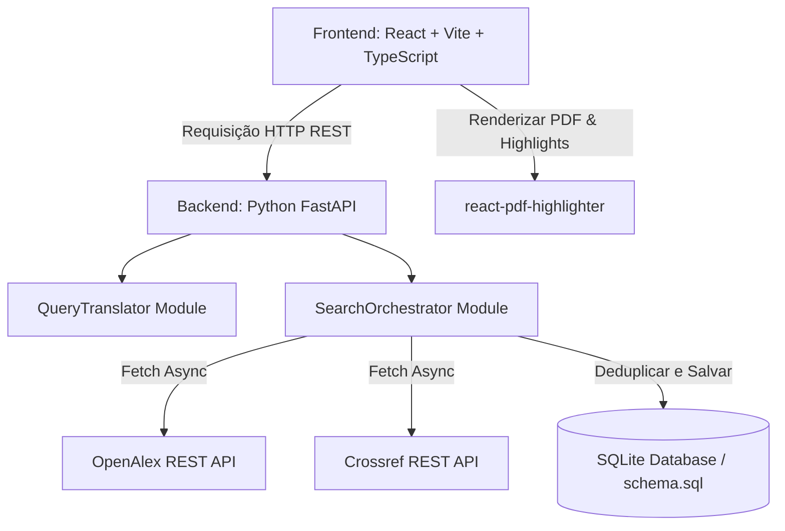
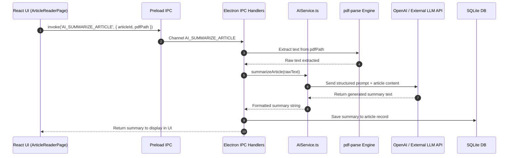

# Relatório de Análise da História do Repositório: Primeira Terça Parte (Commits 1 a 60)

## Resumo Executivo

Este relatório apresenta a investigação detalhada da história do repositório `emmas_librarian` Cobrindo os primeiros 60 commits (cronologicamente do commit inicial `fe7cf51` em 17/05/2026 até o commit `2a73216` em 29/05/2026, estendendo-se contextualização técnica até o commit `1f8566c`). 

A análise identificou uma trajetória de desenvolvimento caracterizada por uma transição arquitetural radical: o projeto nasceu como uma aplicação web desacoplada com backend em **Python (FastAPI + SQLite + Pytest)** e frontend em **Vite/React/TypeScript**, e evoluiu em poucos dias para uma aplicação desktop standalone totalmente integrada em **Electron + Node.js + `better-sqlite3` + IPC**. 

Com base nessas transformações fundamentais, a história inicial de `emmas_librarian` foi segmentada em **4 fases lógicas** (Fases 0 a 3):

---

## Mapeamento Cronológico das Fases Propostas

| Fase | Período de Commits | Intervalo de Datas | Turnante Arquitetural / Foco Principal |
| :--- | :--- | :--- | :--- |
| **Fase 0** | Commits 1 a 19 (`fe7cf51` a `8225baa`) | 17/05/2026 – 18/05/2026 | **Concepção, Fundação Python/FastAPI e Protótipo MVP Web**: Criação da arquitetura desacoplada client-server, motor de busca bibliométrica em Python e leitor de PDF básico em React. |
| **Fase 1** | Commits 20 a 33 (`b22c483` a `0147f49`) | 19/05/2026 – 23/05/2026 | **Reescrita Standalone para Electron & Reestruturação**: Remoção total do backend Python, implementação de backend desktop em TypeScript/Node.js com `better-sqlite3`, barramento IPC e reorganização do repositório. |
| **Fase 2** | Commits 34 a 50 (`6158111` a `dd6a330`) | 24/05/2026 – 26/05/2026 | **Integração com Inteligência Artificial, UI Nativa & CI/CD**: Introdução do motor de IA (`AIService`), sumarização mágica de artigos, janela nativa frameless e pipeline de build/release desktop (Electron Builder + GitHub Actions). |
| **Fase 3** | Commits 51 a 65 (`f1c44d1` a `1f8566c`) | 26/05/2026 – 29/05/2026 | **Análise Avançada, Sincronização (.emmapcarc) & Suíte de Testes**: Implementação de exportação/importação binária de projetos, sistema relacional de categorias, gráficos analíticos no Dashboard e caderno de escrita (*Writing Pad*). |

---

## Detalhamento Profundo por Fase

---

### FASE 0: Concepção, Fundação Python/FastAPI e Protótipo MVP Web
- **Posição**: Fase 0
- **Título**: Concepção, Fundação Python/FastAPI e Protótipo MVP Web
- **Período**: 17/05/2026 – 18/05/2026 (Commits 1 a 19: `fe7cf51` a `8225baa`)

#### 1. Resumo Executivo da Fase
A Fase 0 marca o nascimento do `emmas_librarian`. A visão inicial consistia em criar um assistente de gestão bibliométrica e leitura de artigos científicos. O sistema começou com uma arquitetura cliente-servidor HTTP tradicional: um backend construído em Python 3.13 com FastAPI, SQLite3 e Pytest, responsável pela tradução de consultas booleanas e busca paralela em APIs bibliométricas (OpenAlex e Crossref), e um frontend SPA construído com Vite, React 18, TypeScript, Tailwind CSS e `react-pdf-highlighter`.

#### 2. Decisões de Design e Engenharia
- **Separação Cliente-Servidor via HTTP REST**: Backend Python rodando em `http://localhost:8000` alimentando o frontend React em `http://localhost:5173`.
- **Tradução de Consultas Booleanas via TDD**: Implementação da classe `QueryTranslator` em Python para converter consultas no padrão `AND`/`OR`/`NOT` nas sintaxes específicas das REST APIs do OpenAlex e Crossref.
- **Orquestração e Deduplicação de Buscas**: `SearchOrchestrator` executa requisições concorrentes em múltiplas fontes, desduplica resultados por DOI ou título normalizado e persiste os metadados no SQLite.
- **Normalização CSL-JSON**: Integração com APIs externas utilizando a norma CSL-JSON para padronização dos metadados de artigos.
- **Leitor de PDF Interativo com Persistência**: Escolha do pacote `react-pdf-highlighter` para permitir realces de texto em arquivos PDF e armazenamento das coordenadas de anotação no banco de dados.

#### 3. Diagrama Arquitetural da Fase 0 (Mermaid)



#### 4. Evolução da Estrutura de Pastas (Fase 0)

| Caminho da Pasta / Arquivo | Descrição e Responsabilidade |
| :--- | :--- |
| `backend/app/main.py` | Ponto de entrada da API HTTP FastAPI (endpoints de projetos, artigos, buscas). |
| `backend/app/db/database.py` | Gerenciamento de conexões SQLite e execução do `schema.sql`. |
| `backend/app/db/schema.sql` | Definição das tabelas relacionais (`projects`, `articles`, `highlights`, `annotations`, `diary_entries`). |
| `backend/app/services/query_translator.py` | Tradutor de sintaxe booleana para OpenAlex e Crossref. |
| `backend/app/services/api_integrator.py` | Cliente HTTP e normalizador de respostas CSL-JSON. |
| `backend/app/services/search_orchestrator.py` | Orquestrador de buscas paralelas com desduplicação por DOI/Título. |
| `backend/tests/` | Suíte de testes unitários Pytest para o backend. |
| `frontend/src/pages/` | Páginas da SPA (`DashboardPage`, `ProjectDetailsPage`, `ArticleReaderPage`). |
| `frontend/src/components/` | Componentes de interface (`QueryBuilder.tsx`, `Layout.tsx`). |

#### 5. Trechos Chave de Código (Diffs Importantes)

##### Backend SQLite Schema (`backend/app/db/schema.sql` — Commit `cc1d50d`)
```sql
CREATE TABLE IF NOT EXISTS projects (
    id TEXT PRIMARY KEY,
    name TEXT NOT NULL,
    description TEXT,
    created_at TIMESTAMP DEFAULT CURRENT_TIMESTAMP
);

CREATE TABLE IF NOT EXISTS articles (
    id TEXT PRIMARY KEY,
    project_id TEXT NOT NULL,
    title TEXT NOT NULL,
    authors TEXT,
    doi TEXT,
    abstract TEXT,
    year INTEGER,
    venue TEXT,
    pdf_path TEXT,
    FOREIGN KEY(project_id) REFERENCES projects(id) ON DELETE CASCADE
);
```

##### Search Orchestrator em Python (`backend/app/services/search_orchestrator.py` — Commit `4ed7dc9`)
```python
class SearchOrchestrator:
    def __init__(self, db_manager: DatabaseManager, api_integrator: ApiIntegrator):
        self.db = db_manager
        self.api = api_integrator

    async def execute_search(self, project_id: str, query: str, providers: list[str]) -> list[dict]:
        results = await self.api.fetch_all(query, providers)
        unique_articles = self._deduplicate(results)
        saved_articles = []
        for article in unique_articles:
            saved = self.db.save_article(project_id, article)
            saved_articles.append(saved)
        return saved_articles
```

#### 6. Lista de Commits da Fase 0
1. `fe7cf51` (2026-05-17): Initial commit: Emma's Librarian core files
2. `9703c64` (2026-05-17): Requirement: Add PDF visual highlighting and annotations using react-pdf-highlighter
3. `f9459bd` (2026-05-17): Plan: Draft MVP Implementation roadmap
4. `1ad2734` (2026-05-17): Update MVP plan schema and add development procedures
5. `cc1d50d` (2026-05-17): Initial backend setup: SQLite schema and database manager with tests
6. `968c38a` (2026-05-18): Implement Query Translation module for OpenAlex and Crossref with TDD
7. `131c201` (2026-05-18): Implement API integration and CSL-JSON normalization for OpenAlex and Crossref
8. `4ed7dc9` (2026-05-18): Implement Search Orchestrator with deduplication and persistence
9. `e117e1c` (2026-05-18): Cycle 5: Setup Frontend project with Vite, TypeScript and core dependencies
10. `92fdab2` (2026-05-18): Cycle 6: Implement Visual Query Builder, Project UI and backend API entry point
11. `51f6368` (2026-05-18): Cycle 7: Implement Dashboard and Project Details with article listing table
12. `c887f7d` (2026-05-18): Cycle 8: Implement PDF Reader with react-pdf-highlighter and persistence
13. `dc62f6e` (2026-05-18): Cycle 9: Implement Local PDF management (upload and serve)
14. `09ff21b` (2026-05-18): Cycle 10: Implement CSV export and finalize MVP with README documentation
15. `e4a60e0` (2026-05-18): Docs: Update backend startup instructions to fix ModuleNotFoundError
16. `7d29090` (2026-05-18): Fix: Update index.html to point to src/main.tsx and fix root div ID
17. `042ef98` (2026-05-18): Fix: Resolve TypeScript errors and frontend build failures in types and PDF reader
18. `93407c0` (2026-05-18): Fix(UI): Resolve Query Builder auto-submit and improve PDF reader navigation.
19. `8225baa` (2026-05-18): Fix: Remove .db files from version control and update .gitignore

---

### FASE 1: Reescrita Standalone para Electron & Reestruturação do Repositório
- **Posição**: Fase 1
- **Título**: Reescrita Standalone para Electron & Reestruturação do Repositório
- **Período**: 19/05/2026 – 23/05/2026 (Commits 20 a 33: `b22c483` a `0147f49`)

#### 1. Resumo Executivo da Fase
A Fase 1 representa a transformação arquitetural mais drástica na história do repositório. No commit `b22c483`, a equipe de desenvolvimento descartou totalmente o servidor backend em Python (`backend/` foi permanentemente excluído) e reescreveu a aplicação como um software Desktop Standalone baseado em Electron. O novo backend passou a rodar dentro do processo principal do Electron (`electron/main.ts`) utilizando TypeScript, `better-sqlite3` para persistência local de alta performance, barramento IPC seguro via `contextBridge` e testes automatizados com Vitest. No commit `fa14112`, a pasta de código foi reorganizada de `frontend/` para `emmas_librarian/`.

#### 2. Decisões de Design e Engenharia
- **Pivot para Aplicação Standalone Desktop**: Eliminação de dependências externas de execução (ex: Python 3, FastAPI, Uvicorn). O software passou a ser distribuído como um único executável sem necessidade de servidor backend local.
- **Backend Node.js em TypeScript**: Reescrita completa dos serviços (`DatabaseManager.ts`, `ApiIntegrator.ts`, `QueryTranslator.ts`, `SearchOrchestrator.ts`) em TypeScript com strict mode.
- **Barramento de Comunicação IPC Assíncrono**: Substituição dos chamadas HTTP REST por canais IPC (`ipcRenderer.invoke` -> `ipcMain.handle`). Definição estrita das mensagens em `electron/ipc/handlers.ts`.
- **Compilação Nativa C++ para SQLite**: Uso da biblioteca `better-sqlite3` compilada para os ABIs específicos do Electron e Node via `@electron/rebuild`.
- **Reversibilidade de Buscas (`SEARCH_REVERT`)**: Implementação da funcionalidade de desfazer buscas no histórico, executando deleção em cascata no banco de dados de todos os artigos, destaques e arquivos PDF fisicamente salvos.
- **Exportação Especializada para Biblioshiny / Scopus**: Criação do `ExportService.ts` com formatação rigorosa de CSV para importação direta no pacote R Biblioshiny.

#### 3. Diagrama Arquitetural da Fase 1 (Mermaid)

```mermaid
graph TD
    subgraph Renderer Process (Vite + React UI)
        UI[React Components / Pages] -->|api.ts wrapper| Preload[preload.ts / contextBridge]
    end

    subgraph Main Process (Electron + Node.js)
        Preload -->|IPC Channel Call| IPC[ipc/handlers.ts]
        IPC --> DM[DatabaseManager.ts - better-sqlite3]
        IPC --> SO[SearchOrchestrator.ts]
        IPC --> ES[ExportService.ts]
        SO --> QT[QueryTranslator.ts]
        SO --> AI[ApiIntegrator.ts]
        DM --> SQL[(Local SQLite DB)]
    end
```

#### 4. Evolução da Estrutura de Pastas (Fase 1)

| Caminho da Pasta / Arquivo | Descrição e Responsabilidade |
| :--- | :--- |
| `emmas_librarian/electron/main.ts` | Ponto de entrada do Electron Main Process, gerenciamento de janelas e ciclo de vida. |
| `emmas_librarian/electron/preload.ts` | Script de ponte isolada exposta via `contextBridge` (`window.electronAPI`). |
| `emmas_librarian/electron/ipc/handlers.ts` | Registrador dos manipuladores de canais IPC do Electron. |
| `emmas_librarian/electron/database/DatabaseManager.ts` | Camada de persistência local SQLite em Node.js com `better-sqlite3`. |
| `emmas_librarian/electron/services/` | Reescrita em TypeScript dos serviços de busca, tradução e exportação (`ExportService.ts`). |
| `emmas_librarian/electron/services/__tests__/` | Suíte de testes unitários Vitest para os serviços Node.js do Electron. |
| `plans/electron_migration_plan.md` | Plano detalhado de migração arquitetural de Python para Electron (982 linhas). |

#### 5. Trechos Chave de Código (Diffs Importantes)

##### Manipuladores IPC do Electron (`electron/ipc/handlers.ts` — Commit `b22c483`)
```typescript
import { ipcMain } from 'electron';
import { DatabaseManager } from '../database/DatabaseManager';
import { SearchOrchestrator } from '../services/SearchOrchestrator';

export function registerIpcHandlers(db: DatabaseManager, orchestrator: SearchOrchestrator) {
  ipcMain.handle('GET_PROJECTS', async () => {
    return db.getProjects();
  });

  ipcMain.handle('EXECUTE_SEARCH', async (_, { projectId, query, providers }) => {
    return orchestrator.executeSearch(projectId, query, providers);
  });
}
```

##### Reversão de Busca no DatabaseManager (`electron/database/DatabaseManager.ts` — Commit `a596ced`)
```typescript
revertSearch(searchId: string): void {
  const transaction = this.db.transaction(() => {
    const articles = this.db.prepare('SELECT id, pdf_path FROM articles WHERE search_id = ?').all(searchId);
    for (const article of articles) {
      if (article.pdf_path && fs.existsSync(article.pdf_path)) {
        fs.unlinkSync(article.pdf_path);
      }
    }
    this.db.prepare('DELETE FROM articles WHERE search_id = ?').run(searchId);
    this.db.prepare('DELETE FROM search_history WHERE id = ?').run(searchId);
  });
  transaction();
}
```

#### 6. Lista de Commits da Fase 1
20. `b22c483` (2026-05-19): Refactor Project flow, add archive features and default external browser opening (Migração Python -> Electron)
21. `8e31dfe` (2026-05-20): docs: update README with new search features and project management
22. `6e0a0f9` (2026-05-20): feat: implementa desvinculacao de PDF, busca avancada, controle de zoom reativo, artigos manuais avulsos, correcoes de exportacao para o Biblioshiny (Scopus CSV)
23. `a596ced` (2026-05-20): feat: reversible searches, diary editor mode toggle, dark mode dropdown fix
24. `dce7e6d` (2026-05-20): refactor(backend): modularize export logic and optimize backend test coverage
25. `ea22965` (2026-05-20): build(package): add automated scripts to rebuild native better-sqlite3 for Electron and Node ABIs
26. `8e3d847` (2026-05-20): build(package): install @electron/rebuild as devDependency
27. `01897e4` (2026-05-20): chore: document PrismJS production errors and attempted fixes
28. `94249a4` (2026-05-20): fix: corrige crash do PrismJS em producao via externalizacao com plugin Vite
29. `4e930f1` (2026-05-20): fix: corrige glassmorphism do header em builds de producao Electron
30. `3eef56b` (2026-05-22): last fixes v0.0.0
31. `fa14112` (2026-05-22): renaming symbol from frontend to emmas_librarian
32. `10c32b9` (2026-05-22): fix: destaques nas pesquisas do leitor de pdf
33. `0147f49` (2026-05-23): feat: adicionar e editar artigos avulsos

---

### FASE 2: Integração com Inteligência Artificial, Polimento NATIVO Desktop & Pipelines de Release
- **Posição**: Fase 2
- **Título**: Integração com Inteligência Artificial, Polimento NATIVO Desktop & Pipelines de Release
- **Período**: 24/05/2026 – 26/05/2026 (Commits 34 a 50: `6158111` a `dd6a330`)

#### 1. Resumo Executivo da Fase
A Fase 2 elevou o `emmas_librarian` de um gerenciador de documentos a um assistente inteligente. Foi implementado o serviço de inteligência artificial (`AIService.ts`), habilitando a funcionalidade "Magic Summary" (síntese automática dos pontos chave dos artigos em PDF) e a extração massiva de metadados de PDFs brutos utilizando a biblioteca `pdf-parse`. Paralelamente, o aplicativo ganhou uma identidade visual nativa de ponta com uma barra de título frameless customizada, sistema de termos de uso e um pipeline industrial de build e empacotamento desktop (Electron Builder + GitHub Actions + NSIS).

#### 2. Decisões de Design e Engenharia
- **Integração com LLM (OpenAI / LLM API Provider)**: Criação de um serviço dedicado `AIService` no Main Process para gerenciar chamadas de IA, formatação de prompts e sanitização de respostas de resumos.
- **Extração de Texto Bruto de PDFs em Node.js**: Uso da biblioteca `pdf-parse` com tratamento especial de importação de módulos ESM no Electron para extrair texto de arquivos PDF locais e alimentar as chamadas de IA.
- **UI Frameless Nativa**: Remoção das bordas padrão da janela do sistema operacional (`frame: false` no Electron BrowserWindow) e construção da `TitleBar.tsx` customizada em React com suporte a *drag region* do SO e controles de fechar/minimizar.
- **Persistência do Histórico de IA**: Adição de tabelas/colunas no SQLite para registrar o histórico de extrações de IA e os resumos gerados.
- **Automação de CI/CD para Distribuição**: Configuração da publicação de releases automatizada via GitHub Actions (`release.yml`), gerando os instaladores para Windows (`.exe` NSIS) e empacotando os recursos com ícones dedicados (`.ico`).

#### 3. Diagrama de Fluxo do Motor de IA (Mermaid)



#### 4. Evolução da Estrutura de Pastas (Fase 2)

| Caminho da Pasta / Arquivo | Descrição e Responsabilidade |
| :--- | :--- |
| `emmas_librarian/electron/services/AIService.ts` | Serviço de integração com APIs de LLM para sumarização e extração de metadados. |
| `emmas_librarian/src/components/TitleBar.tsx` | Barra de título nativa customizada com frameless window drag. |
| `emmas_librarian/src/pages/TermsOfUsePage.tsx` | Página de termos de uso e aceite de integração de serviços de terceiros/IA. |
| `emmas_librarian/build/` | Diretório de ativos de build desktop (ícones `.ico`, `.png`, `.svg` para empacotamento). |
| `.github/workflows/release.yml` | Workflow do GitHub Actions para compilação e publicação automática de releases. |

#### 5. Trechos Chave de Código (Diffs Importantes)

##### AIService para Sumarização de PDFs (`electron/services/AIService.ts` — Commit `6158111`)
```typescript
import pdfParse from 'pdf-parse';

export class AIService {
  private apiKey: string;

  constructor(apiKey: string) {
    this.apiKey = apiKey;
  }

  async extractTextFromPdf(pdfBuffer: Buffer): Promise<string> {
    const data = await pdfParse(pdfBuffer);
    return data.text;
  }

  async generateMagicSummary(pdfText: string): Promise<string> {
    // Chamada formatada à API de Inteligência Artificial
    const prompt = `Analise o seguinte artigo científico e gere um resumo estruturado:\n\n${pdfText.slice(0, 8000)}`;
    return this.callLLM(prompt);
  }
}
```

#### 6. Lista de Commits da Fase 2
34. `6158111` (2026-05-24): feat: AI Integration - Magic Summary, Massive Extraction, Terms of Use, and UI improvements
35. `67631fc` (2026-05-25): fix: pdf-parse import and rename magic summary
36. `c523823` (2026-05-25): fix: correctly resolve pdf-parse using ESM named export and add unit tests for AIService
37. `2a0f45d` (2026-05-25): fix: resolve typescript compilation errors for PDFParse API and getKeys accessibility
38. `39f0afb` (2026-05-25): feat: add quick access documents feature
39. `69a25c2` (2026-05-25): feat: custom native title bar and new svg logo
40. `2ec2751` (2026-05-25): fix: display native title bar on reader page
41. `d1475c3` (2026-05-25): fix: resolve UI layout overflows, PDF highlight anchoring, and add AI extraction history tracking
42. `ff5666b` (2026-05-25): feat: patch notes
43. `e20f24d` (2026-05-25): feat: patch notes
44. `50d0efd` (2026-05-25): fix: workflow publish errors
45. `6139338` (2026-05-25): fix: icon
46. `93e31db` (2026-05-25): fix: version on package.json
47. `61b52b1` (2026-05-25): fix icon again
48. `486ed55` (2026-05-25): fix: windows icon
49. `1b5650c` (2026-05-25): fix: windows icon
50. `dd6a330` (2026-05-26): fix(build): configure electron-builder nsis shortcuts and windows icon

---

### FASE 3: Módulos Avançados de Análise, Pacotes de Sincronização (.emmapcarc) & Suíte de Testes
- **Posição**: Fase 3
- **Título**: Módulos Avançados de Análise, Pacotes de Sincronização (.emmapcarc) & Suíte de Testes
- **Período**: 26/05/2026 – 29/05/2026 (Commits 51 a 65: `f1c44d1` a `1f8566c`)

#### 1. Resumo Executivo da Fase
A Fase 3 consolidou a plataforma como um ecossistema completo de gestão bibliométrica. O grande destaque arquitetural foi a criação do `SyncService.ts` e do formato de arquivo proprietário `.emmapcarc`, que permite a exportação e importação de projetos inteiros comprimidos (unindo o banco SQLite, dados de diários e arquivos PDF físicos). Além disso, foram introduzidos o sistema de categorias relacionais para organização de projetos, o painel de métricas visuais no Dashboard (gráficos de pizza e distribuições), o menu de contexto do leitor de PDF e o Guia de Escrita (*Writing Pad*) acoplado à leitura de artigos.

#### 2. Decisões de Design e Engenharia
- **Formato Binário Proprietário de Projeto (`.emmapcarc`)**: Desenvolvimento de um manipulador em `SyncService.ts` para serializar e compactar o banco de dados do projeto, metadados e toda a árvore de arquivos PDF em um único arquivo `.emmapcarc` (ZIP), garantindo portabilidade entre instalações.
- **Sistema Relacional de Categorias**: Criação de tabelas de associação no SQLite para permitir categorização de artigos/projetos com tags personalizadas, seleções múltiplas e renderização em tabela via `CategoryCell.tsx` e `ProjectCategoriesModal.tsx`.
- **Painel Analítico Visual (Dashboard Charts)**: Integração de biblioteca de gráficos para exibir a evolução temporal de publicação, distribuição por periódico (*venue*) e volume de leituras no diário.
- **Caderno de Escrita Integradora (*Writing Pad*)**: Adição de uma barra lateral retrátil no `ArticleReaderPage.tsx` permitindo rascunhar anotações e sintetizar achados durante a leitura do PDF sem alternar de tela.
- **Fortalecimento de Integridade de Dados e Segurança**: Implementação de restrições `ON DELETE CASCADE` estritas no SQLite, auditorias de código (`docs/auditoria`) e ajustes no Content Security Policy (CSP) para suporte seguro a preamble scripts do Vite em modo de desenvolvimento.

#### 3. Diagrama do Pacote de Sincronização .emmapcarc (Mermaid)

```mermaid
graph LR
    subgraph Projeto Local (emmas_librarian)
        DB[(SQLite DB State)]
        PDFs[Arquivos PDF / storage]
        Meta[Metadados do Diário]
    end

    DB --> Sync[SyncService.ts]
    PDFs --> Sync
    Meta --> Sync

    Sync -->|Comprimir & Serializar| EMMA[.emmapcarc Package / ZIP Archive]
    EMMA -->|Importar & Descompactar| SyncTarget[SyncService em Novo Computador]
```

#### 4. Evolução da Estrutura de Pastas (Fase 3)

| Caminho da Pasta / Arquivo | Descrição e Responsabilidade |
| :--- | :--- |
| `emmas_librarian/electron/database/SyncService.ts` | Gerenciador do formato de exportação/importação `.emmapcarc`. |
| `emmas_librarian/src/components/CategoryCell.tsx` | Célula interativa de tabela para seleção e exibição de categorias. |
| `emmas_librarian/src/components/ProjectCategoriesModal.tsx` | Modal de gerenciamento do catálogo de categorias do projeto. |
| `emmas_librarian/src/components/WritingPad.tsx` / `ArticleReaderPage.tsx` | Painel de rascunho acoplado ao leitor de artigos. |
| `docs/auditoria/` | Relatórios formais de inspeção de código, qualidade e cobertura de testes. |

#### 5. Trechos Chave de Código (Diffs Importantes)

##### Lógica do SyncService para Exportação .emmapcarc (`electron/database/SyncService.ts` — Commit `6de98cf`)
```typescript
import admZip from 'adm-zip';
import fs from 'fs';
import path from 'path';

export class SyncService {
  async exportProjectPackage(projectId: string, outputPath: string): Promise<void> {
    const zip = new admZip();
    const projectData = this.db.getProjectById(projectId);
    const articles = this.db.getArticlesByProject(projectId);

    // Adiciona manifesto JSON do projeto
    zip.addFile('project.json', Buffer.from(JSON.stringify({ projectData, articles }, null, 2)));

    // Adiciona arquivos PDF fisicamente armazenados
    for (const article of articles) {
      if (article.pdf_path && fs.existsSync(article.pdf_path)) {
        zip.addLocalFile(article.pdf_path, 'pdfs');
      }
    }

    zip.writeZip(outputPath);
  }
}
```

##### Categorias no Schema SQL (`electron/database/schema.sql` — Commit `7e059b6`)
```sql
CREATE TABLE IF NOT EXISTS project_categories (
    id TEXT PRIMARY KEY,
    project_id TEXT NOT NULL,
    name TEXT NOT NULL,
    color TEXT NOT NULL,
    FOREIGN KEY(project_id) REFERENCES projects(id) ON DELETE CASCADE
);

CREATE TABLE IF NOT EXISTS article_categories (
    article_id TEXT NOT NULL,
    category_id TEXT NOT NULL,
    PRIMARY KEY(article_id, category_id),
    FOREIGN KEY(article_id) REFERENCES articles(id) ON DELETE CASCADE,
    FOREIGN KEY(category_id) REFERENCES project_categories(id) ON DELETE CASCADE
);
```

#### 6. Lista de Commits da Fase 3
51. `f1c44d1` (2026-05-26): docs: add code inspection and audit reports
52. `b2e3309` (2026-05-26): docs: move auditoria to docs/auditoria
53. `c2220b3` (2026-05-26): fix: adjust auditoria path
54. `373bb30` (2026-05-26): chore: setup test infrastructure and basic coverage for Phase 1
55. `bca819a` (2026-05-29): fix(CSP): add unsafe-inline for development Vite preamble script
56. `f73bad5` (2026-05-29): fix(reader): fix highlight spaces, zoom re-render, and parse literal newlines in AI summaries
57. `fa1db44` (2026-05-29): fix(ai): only fill empty fields when extracting metadata via AI
58. `cf9434a` (2026-05-29): fix(database): properly cascade delete projects avoiding FK failures and clean up files
59. `f1841d9` (2026-05-29): fix(history): link batch pdf imports to search history correctly
60. `2a73216` (2026-05-29): feat(charts): add charts to dashboard and project details
61. `a8c65ed` (2026-05-29): feat(changelog): add update modal and tracking logic
62. `7e059b6` (2026-05-29): feat: implement project categories system and table view
63. `6de98cf` (2026-05-29): feat: implement project export/import feature (.emmapcarc)
64. `cea2ec3` (2026-05-29): feat: copy highlighted text via right-click context menu
65. `1f8566c` (2026-05-29): feat: adicionar guia de escrita (writing pad) ao leitor de artigos

---

## Síntese de Conclusão da Investigação

A análise dos primeiros 60 commits do repositório `emmas_librarian` revela uma rápida maturidade de desenvolvimento em um período de apenas 12 dias (17 a 29 de maio de 2026). A decisão de abandonar a arquitetura cliente-servidor em Python na Fase 1 em favor de um ecossistema Standalone em Electron foi o marco fundador do projeto, garantindo desempenho, portabilidade e uma experiência de usuário desktop fluida. A subsequente introdução do motor de IA na Fase 2 e os pacotes de migração `.emmapcarc` na Fase 3 estabeleceram a base sólida para a evolução da aplicação.
