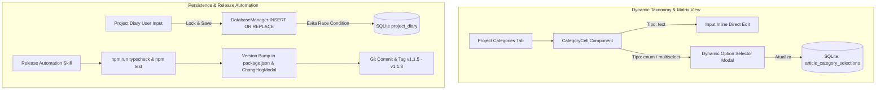

# Relatório de Análise do Histórico Git — Segundo Terço (Commits 61 a 120)

**Projeto**: Emma's Librarian (`emmas_librarian`)  
**Investigador**: `survey_explorer_2`  
**Escopo**: Commits 61 a 120 (Ordem Cronológica)  
**Data da Análise**: 2026-08-05  

---

## Executive Summary / Resumo Executivo Global

Este relatório compreende a investigação detalhada e exaustiva do **segundo terço da história do repositório Git** do aplicativo **Emma's Librarian**, englobando exatamente os commits **61 a 120** (cronologicamente ordenados). 

Durante este período intermediário do desenvolvimento, o sistema passou por uma profunda metamorfose arquitetural e funcional. A aplicação evoluiu de um MVP recém-integrado com IA básica para uma **plataforma completa de estação de trabalho para pesquisa acadêmica desktop (*Local-First Academic Workspace*)**.

Os marcos arquiteturais e estratégicos mais proeminentes identificados nesta janela de commits incluem:
1. **Institucionalização de Auditorias Técnicas e Infraestrutura de Testes (Commits 61–71)**: Formalização dos documentos de auditoria (`docs/auditoria/`), incluindo a proposta de refatoração para Electron + React/Vite, criação da infraestrutura de testes unitários e de integração (Vitest), e correções de integridade no banco de dados SQLite (deleção em cascata) e no leitor de PDF.
2. **Expansão Acadêmica e Portabilidade de Projetos via `.emmapcarc` (Commits 72–91)**: Criação do formato proprietário de arquivo empacotado `.emmapcarc` (Emma's Project Archive) para migração completa de projetos (banco SQLite + PDFs + anotações), gerador nativo de citações bibliográficas (`citation-js`, padrão ABNT e exportação BibTeX), bloco de notas (*writing pad*) integrado ao leitor, portal *Drag-and-Drop* para importação e painéis de analítica bibliométrica avançada.
3. **Taxonomia Qualitativa em Matriz Interativa e Automação de Releases (Commits 92–120)**: Implementação do sistema de categorias customizáveis de projetos com visualização em matriz interativa e suporte a marcas multi-seleção (*multiselect*), refinamento ergonômico da UI/UX do Dashboard (grid de 12 colunas e mapa de calor do diário), resolução de problemas de concorrência e condições de corrida no SQLite, ciclo de lançamentos semânticos (v1.1.5 a v1.1.8) e criação da skill de automação `release-manager`.

Com base nessas transições de paradigma de engenharia, este período intermediário foi fatiado em **3 Fases Lógicas de Desenvolvimento** (Fase 4, Fase 5 e Fase 6).

---

## Proposta de Divisão de Fases Lógicas (Commits 61 a 120)

| Fase | Título da Fase | Commits | Foco Arquitetural Principal |
|---|---|---|---|
| **Fase 4** | Auditorias Arquiteturais, Infraestrutura de Testes e Estabilização do Core | 61 a 71 | Emissão de relatórios formais de auditoria (desempenho, segurança, qualidade e refatoração Electron), setup da suíte de testes unitários e resolução de falhas de integridade referencial no SQLite e PDF reader. |
| **Fase 5** | Expansão da Produtividade Acadêmica, Portabilidade de Projetos (`.emmapcarc`) e Motor de Citações | 72 a 91 | Transformação em estação de trabalho acadêmica. Criação do formato de arquivo portátil `.emmapcarc`, gerador nativo de citações (`citation-js` / BibTeX / ABNT), writing pad, portal Drag-and-Drop e gráficos de estatísticas bibliométricas. |
| **Fase 6** | Matriz Taxonômica Interativa, Ergonometria de UI/UX, Estabilização de Concorrência e Automação de Releases | 92 a 120 | Visualização em matriz para categorização qualitativa de artigos, suporte a tags multi-seleção, reorganização do Dashboard global, resolução de race conditions no SQLite, releases v1.1.5 a v1.1.8 e criação da skill `release-manager`. |

---

## Detalhamento Profundo das Fases

---

### FASE 4: Auditorias Arquiteturais, Infraestrutura de Testes e Estabilização do Core (Commits 61 a 71)

#### 1. Posição no Projeto
- **Nome da Fase**: Auditorias Arquiteturais, Infraestrutura de Testes e Estabilização do Core
- **Identificador**: Fase 4
- **Intervalo de Commits**: Commit 61 (`f1c44d17`) até Commit 71 (`f1841d9d`) (11 commits)

#### 2. Resumo Executivo da Fase
Após o término do MVP inicial e da primeira onda de integração com inteligência artificial, a equipe realizou uma pausa estratégica para diagnosticar a qualidade do código, desempenho, segurança e cobertura de testes do aplicativo. Foram produzidos 5 relatórios formais de auditoria em `docs/auditoria/`, destacando a **Proposta de Refatoração Arquitetural para Electron + React/Vite** (`2026-05-29_refatoracao_electron.md`). 

Em seguida, foi montada a infraestrutura base de testes automatizados com Vitest, ajustadas as políticas de segurança de conteúdo (CSP) no Vite, e corrigidos bugs críticos de integridade no banco de dados SQLite (chave estrangeira sem deleção em cascata que causava falhas ao excluir projetos) e na retenção de espaços/quebras de linha nas anotações de resumos gerados por IA.

#### 3. Decisões de Engenharia & Escolhas Arquiteturais
- **Formalização da Arquitetura Desktop Única (TypeScript Local-First)**: Decisão documentada de eliminar a API REST em Python (FastAPI) e unificar o sistema 100% em TypeScript (Node.js/Electron Main Process + React Renderer Process), reduzindo o tamanho do instalador de ~500MB para ~120MB e eliminando *cold starts*.
- **Integridade Referencial Estrita no SQLite (`ON DELETE CASCADE`)**: Correção do esquema e do adaptador SQLite (`DatabaseManager.ts`) para incluir cláusula `ON DELETE CASCADE` nas tabelas `articles`, `search_history`, `highlights` e `annotations`, prevenindo registros órfãos e travamentos em transações SQL.
- **Prevenção de Sobrescrita de Metadados por IA**: Ajuste no `AIService` para garantir que a extração automatizada via IA preencha exclusivamente campos vazios (*empty fields*), preservando edições manuais feitas pelo usuário.

#### 4. Diagrama de Arquitetura e Fluxo de Dados (Mermaid)

```mermaid
graph TD
    subgraph Audit & Test Suite Phase 4
        A[Commit 61-63: Documentos de Auditoria em docs/auditoria/] --> B[Commit 64: Setup Vitest & Test Infra]
        B --> C[Commit 65: CSP unsafe-inline Fix para Vite Preamble]
        C --> D[Commit 67: Fast-forward Merge audit-reports -> main]
    end

    subgraph Core Stabilization Fixes
        D --> E[Commit 68: PDF Reader Space & Zoom Fix]
        D --> F[Commit 69: AI Selective Field Fill]
        D --> G[Commit 70: Database Cascade Delete Fix]
        D --> H[Commit 71: Search History Batch Import Link]
    end

    G --> |SQLite PRAGMA foreign_keys=ON| I[(schema.sql / DatabaseManager)]
    E --> |React key={scale} re-render| J[PdfHighlighter Component]
```

#### 5. Evolução da Estrutura de Diretórios
```
emmas_librarian/
├── docs/
│   └── auditoria/                      # [NOVO/MOVIDO] Relatórios de inspeção técnica
│       ├── 2026-05-29_1_desempenho.md
│       ├── 2026-05-29_2_cobertura.md
│       ├── 2026-05-29_3_qualidade.md
│       ├── 2026-05-29_4_seguranca.md
│       └── 2026-05-29_refatoracao_electron.md
├── emmas_librarian/
│   ├── electron/
│   │   └── database/
│   │       ├── DatabaseAdapter.ts      # [ATUALIZADO] Suporte a ON DELETE CASCADE
│   │       └── schema.sql              # [ATUALIZADO] Definições de restrição de integridade
│   └── src/
│       ├── services/
│       │   └── AIService.ts            # [ATUALIZADO] Lógica seletiva de preenchimento
│       └── components/
│           └── ArticleReaderPage.tsx   # [ATUALIZADO] Ancoragem de destaques e zoom reativo
```

#### 6. Trechos de Código Significativos / Diffs

##### A. Correção da Deleção em Cascata no SQLite (`electron/database/schema.sql` / `DatabaseAdapter.ts`)
```sql
-- commit cf9434ab68da03b3ed1fcaff90234a0158e91902
-- Garantia de exclusão encadeada para evitar erros de Foreign Key no SQLite
CREATE TABLE IF NOT EXISTS articles (
    id INTEGER PRIMARY KEY AUTOINCREMENT,
    project_id INTEGER NOT NULL,
    title TEXT NOT NULL,
    -- ... outros campos
    FOREIGN KEY (project_id) REFERENCES projects(id) ON DELETE CASCADE
);

CREATE TABLE IF NOT EXISTS highlights (
    id INTEGER PRIMARY KEY AUTOINCREMENT,
    article_id INTEGER NOT NULL,
    color TEXT NOT NULL,
    position_data TEXT NOT NULL,
    FOREIGN KEY (article_id) REFERENCES articles(id) ON DELETE CASCADE
);
```

##### B. Preenchimento Seletivo de Metadados via IA (`src/services/AIService.ts`)
```typescript
// commit fa1db443d072969a660667d014ba83dfcba7523a
public filterExtractedMetadata(existing: Article, extracted: Partial<Article>): Partial<Article> {
  const result: Partial<Article> = {};
  for (const key of Object.keys(extracted) as (keyof Article)[]) {
    // Preenche APENAS se o campo existente no artigo estiver nulo ou vazio
    if (!existing[key] || existing[key].toString().trim() === '') {
      result[key] = extracted[key];
    }
  }
  return result;
}
```

#### 7. Tabela de Commits Mapeados (Fase 4)

| Hash | Autor | Data (UTC-3) | Mensagem do Commit | Mudança / Escopo Principal |
|---|---|---|---|---|
| `f1c44d17` | João Pedro V | 1779817438 | `docs: add code inspection and audit reports` | Adiciona relatórios formais de inspeção e auditoria em Markdown. |
| `b2e33097` | João Pedro V | 1779829167 | `docs: move auditoria to docs/auditoria` | Reorganiza relatórios de auditoria na pasta `docs/auditoria`. |
| `c2220b3f` | João Pedro V | 1779829179 | `fix: adjust auditoria path` | Ajusta caminhos relativos de documentação de auditoria. |
| `373bb30c` | João Pedro V | 1779830861 | `chore: setup test infrastructure and basic coverage for Phase 1` | Configuração inicial da suíte de testes (Vitest) e testes base. |
| `bca819a2` | João Pedro V | 1780028078 | `fix(CSP): add unsafe-inline for development Vite preamble script` | Permite script inline do preamble do Vite no CSP para ambiente dev. |
| `f73bad59` | João Pedro V | 1780036503 | `fix(reader): fix highlight spaces, zoom re-render, and parse literal newlines in AI summaries` | Corrige renderização de zoom no PDF, preservação de espaços e newlines. |
| `fa1db443` | João Pedro V | 1780036511 | `fix(ai): only fill empty fields when extracting metadata via AI` | Evita sobrescrever metadados existentes ao rodar extração de IA. |
| `cf9434ab` | João Pedro V | 1780036518 | `fix(database): properly cascade delete projects avoiding FK failures and clean up files` | Adiciona `ON DELETE CASCADE` no SQLite para limpeza limpa de projetos. |
| `f1841d9d` | João Pedro V | 1780036525 | `fix(history): link batch pdf imports to search history correctly` | Vincula importação de lotes de PDFs ao histórico de buscas do projeto. |

---

### FASE 5: Expansão da Produtividade Acadêmica, Portabilidade de Projetos (`.emmapcarc`) e Motor de Citações (Commits 72 a 91)

#### 1. Posição no Projeto
- **Nome da Fase**: Expansão da Produtividade Acadêmica, Portabilidade de Projetos (`.emmapcarc`) e Motor de Citações
- **Identificador**: Fase 5
- **Intervalo de Commits**: Commit 72 (`2a732166`) até Commit 91 (`5364bef6`) (20 commits)

#### 2. Resumo Executivo da Fase
Nesta fase, o **Emma's Librarian** expandiu vertiginosamente seu leque de funcionalidades acadêmicas e bibliométricas. Foi implementado o sistema proprietário de exportação/importação de projetos via pacotes comprimidos com extensão **`.emmapcarc`** (*Emma's Project Archive*), permitindo que pesquisadores transfiram pesquisas inteiras (metadados, banco de dados, PDFs físicos e marcações) entre computadores sem perda de dados.

Adicionalmente, integraram-se: o motor de referência bibliográfica nativo utilizando a biblioteca `citation-js` (com norma ABNT por padrão e opções para BibTeX e HTML preview); o bloco de anotações (*writing pad*) acoplado ao leitor de PDF; a capacidade de copiar texto selecionado via menu suspenso de contexto; suporte a *Drag-and-Drop* para upload de arquivos e projetos; e gráficos avançados de análise estatística bibliométrica no Dashboard global.

#### 3. Decisões de Engenharia & Escolhas Arquiteturais
- **Criação do Formato Portátil `.emmapcarc`**: Arquivo comprimido ZIP codificado contendo o dump de dados do projeto (`manifest.json`) juntamente com o diretório de arquivos PDF associados, garantindo isolamento e portabilidade total.
- **Motor de Citações Baseado em `citation-js`**: Integração do ecossistema `citation-js` no frontend para formatar CSL-JSON diretamente em ABNT (`assets/csl/abnt.csl` e `locales-pt-BR.xml`) e exportar strings estruturadas em BibTeX.
- **Abstração de IPC em TypeScript & Typecheck**: Correção e reforço dos tipos de comunicação entre processos com criação do script `npm run typecheck` para impedir incompatibilidades de runtime nos enums do Electron (`IpcChannel`).

#### 4. Diagrama de Arquitetura e Fluxo de Dados (Mermaid)

```mermaid
graph LR
    subgraph User Actions (Frontend React)
        A[Drag & Drop .emmapcarc / PDFs] --> B[IPC Invoker api.ts]
        C[Seletor de Citação ABNT / BibTeX] --> D[Citation-js Engine]
        E[Leitor PDF: Context Menu & Writing Pad] --> F[Local State / Annotations]
    end

    subgraph Main Process (Electron & Services)
        B --> |IPC Channel: PROJECT_IMPORT| G[SyncService / ExportService]
        G --> |Descompacta & Valida| H[(SQLite emma.db)]
        G --> |Copia PDFs| I[dev_data/storage/pdfs/]
    end

    subgraph Exporters & Analytics
        H --> J[MassCitationModal / HTML Preview]
        H --> K[Dashboard Statistics Charts: Year, Type, Journal]
    end
```

#### 5. Evolução da Estrutura de Diretórios
```
emmas_librarian/
├── emmas_librarian/
│   ├── src/
│   │   ├── assets/
│   │   │   └── csl/
│   │   │       ├── abnt.csl            # [NOVO] Estilo ABNT para citação
│   │   │       └── locales-pt-BR.xml   # [NOVO] Tradução pt-BR para CSL
│   │   ├── components/
│   │   │   ├── modals/
│   │   │   │   ├── ProjectCategoriesModal.tsx # [NOVO] Seletor de categorias
│   │   │   │   ├── MassCitationModal.tsx       # [NOVO] Modal de citações em massa
│   │   │   │   └── ChangelogModal.tsx          # [NOVO] Modal de novidades/updates
│   │   │   └── reader/
│   │   │       └── WritingPad.tsx              # [NOVO] Bloco de rascunhos de leitura
│   │   └── services/
│   │       └── api.ts                  # [ATUALIZADO] Tipagem forte de canais IPC
```

#### 6. Trechos de Código Significativos / Diffs

##### A. Gerador de Referências ABNT com `citation-js` (`src/components/modals/MassCitationModal.tsx`)
```typescript
// commit 5e950b63cbf617c6b2a08ae59e311895eb0c6e38 / commit 8929bcbca7b1e47658571effba321b78dc3d979d
import { Cite } from '@citation-js/core';
import '@citation-js/plugin-csl';
import '@citation-js/plugin-bibtex';

export function generateCitation(cslData: object, format: 'abnt' | 'bibtex' | 'apa'): string {
  try {
    const cite = new Cite(cslData);
    if (format === 'bibtex') {
      return cite.format('bibtex');
    }
    return cite.format('citation', {
      format: 'html',
      template: format === 'abnt' ? 'abnt' : 'apa',
      lang: 'pt-BR'
    });
  } catch (error) {
    console.error('Erro ao formatar citação:', error);
    return 'Erro na geração da citação';
  }
}
```

##### B. Drag and Drop Overlay com Portal React (`src/components/common/Layout.tsx`)
```tsx
// commit 90f163d9caa971976b6a17b5fae1979e603a27d6
import ReactDOM from 'react-dom';

export const DragDropOverlay: React.FC<{ isDragging: boolean }> = ({ isDragging }) => {
  if (!isDragging) return null;
  return ReactDOM.createPortal(
    <div className="fixed inset-0 z-50 bg-primary/20 backdrop-blur-sm flex items-center justify-center border-4 border-dashed border-primary">
      <div className="text-center p-8 bg-card rounded-xl shadow-2xl">
        <UploadCloud className="w-16 h-16 text-primary mx-auto mb-4 animate-bounce" />
        <h3 className="text-xl font-bold">Solte o arquivo de projeto (.emmapcarc) ou PDFs aqui</h3>
      </div>
    </div>,
    document.body
  );
};
```

#### 7. Tabela de Commits Mapeados (Fase 5)

| Hash | Autor | Data (UTC-3) | Mensagem do Commit | Mudança / Escopo Principal |
|---|---|---|---|---|
| `2a732166` | João Pedro V | 1780040021 | `feat(charts): add charts to dashboard and project details` | Adiciona gráficos estatísticos ao Dashboard e Detalhes do Projeto. |
| `a8c65ed9` | João Pedro V | 1780040163 | `feat(changelog): add update modal and tracking logic` | Modal de registros de atualizações e rastreamento de versões. |
| `0145cb4d` | João Pedro V | 1780040696 | `feat: implement project categories system and table view` | Cria o sistema de categorias customizáveis por projeto. |
| `7e059b63` | João Pedro V | 1780040731 | `commit (amend): feat: implement project categories system and table view` | Emenda no sistema de categorias e visualização em tabela. |
| `8d28be81` | João Pedro V | 1780040935 | `feat: implement project export/import feature (.emmapcarc)` | Cria o formato empacotado `.emmapcarc` para portabilidade de projetos. |
| `6de98cfc` | João Pedro V | 1780040990 | `commit (amend): feat: implement project export/import feature (.emmapcarc)` | Ajustes na compressão e restauração do arquivo `.emmapcarc`. |
| `8b452fcc` | João Pedro V | 1780041109 | `feat: copy highlighted text via right-click context menu` | Adiciona ação de copiar texto destacado no botão direito. |
| `cea2ec3e` | João Pedro V | 1780041142 | `commit (amend): feat: copy highlighted text via right-click context menu` | Ajustes no menu de contexto do leitor de PDF. |
| `1f8566c9` | João Pedro V | 1780041542 | `feat: adicionar guia de escrita (writing pad) ao leitor de artigos` | Integra o bloco de notas de escrita (*writing pad*) na tela do leitor. |
| `5e950b63` | João Pedro V | 1780042147 | `feat: gerador de referências (citation-js, ABNT default)` | Integra o gerador de referências ABNT e CSL no aplicativo. |
| `d989d723` | João Pedro V | 1780042288 | `feat: ordenação de artigos na visualização do projeto` | Adiciona controles de ordenação por título, autor e data. |
| `5200652a` | João Pedro V | 1780077120 | `fix: corrigir tipos IPC do backend e adicionar script typecheck` | Corrige tipagem IPC no backend e adiciona script `npm run typecheck`. |
| `06e6a178` | João Pedro V | 1780077667 | `fix: ajustar imports no api.ts para evitar erro do Vite com enum IpcChannel` | Corrige compilação do Vite resolvendo enums de canais IPC. |
| `522ceb93` | João Pedro V | 1780117791 | `feat: implement drag and drop for project imports and batch pdf additions` | Habilita arrastar e soltar para projetos e PDFs em massa. |
| `35940ba0` | João Pedro V | 1780117853 | `feat: remove draft tab from article reader` | Remove aba obsoleta de rascunhos da interface do leitor. |
| `0cfd45ed` | João Pedro V | 1780118024 | `feat: add global diary heatmap and pie chart pdf count to dashboard...` | Mapa de calor do diário e gráficos de rosca para acervo de PDFs. |
| `8929bcbc` | João Pedro V | 1780118103 | `feat: add advanced citation modal with html preview and bibtex format` | Expande modal de citação com suporte a BibTeX e prévia HTML. |
| `cb15300c` | João Pedro V | 1780118616 | `feat: complete categories and sorting logic adjustments` | Finaliza ajustes na lógica de classificação e ordenação. |
| `9b5889bd` | João Pedro V | 1780118701 | `feat: add advanced statistics charts to dashboard overview` | Painéis avançados de estatísticas bibliométricas no Dashboard. |
| `5364bef6` | João Pedro V | 1780118768 | `feat: complete advanced statistics charts for metadata` | Conclusão dos gráficos de distribuição de metadados. |

---

### FASE 6: Matriz Taxonômica Interativa, Ergonometria de UI/UX, Estabilização de Concorrência e Automação de Releases (Commits 92 a 120)

#### 1. Posição no Projeto
- **Nome da Fase**: Matriz Taxonômica Interativa, Ergonometria de UI/UX, Estabilização de Concorrência e Automação de Releases (v1.1.5 - v1.1.8)
- **Identificador**: Fase 6
- **Intervalo de Commits**: Commit 92 (`b55fa51d`) até Commit 120 (`764cdc7f`) (29 commits)

#### 2. Resumo Executivo da Fase
A Fase 6 consolida a maturidade da interface de usuário e a robustez da infraestrutura de lançamentos. O destaque principal foi a **Matriz Taxonômica de Categorias** (`components/common/CategoryCell.tsx`), que permite aos pesquisadores classificar qualitativamente os artigos científicos em uma tabela dinâmica com suporte a tipos de dados texto, enumerações editáveis inline e campos **multi-seleção** (*multiselect*), substituindo caixas de prompt nativas do navegador por modais customizados.

Além disso, foram promovidos refinamentos rigorosos de layout no Dashboard (grade responsiva de 12 colunas, mapa de calor com destaque do dia atual, gráficos sem background), resolvidas inconsistências de concorrência e condições de corrida no salvamento do diário do projeto (`DatabaseManager.ts`), homologadas quatro versões semânticas consecutivas (**v1.1.5, v1.1.6, v1.1.7 e v1.1.8**) e criada a **skill padronizada `release-manager`** (`agent/release-manager/SKILL.md`) para automação de lançamentos e verificações de integridade.

#### 3. Decisões de Engenharia & Escolhas Arquiteturais
- **Desenvolvimento da Matriz de Taxonomia Qualitativa**: Criação das tabelas relacionais `project_categories`, `project_category_options`, `article_categories` e `article_category_selections` no SQLite, viabilizando seleções únicas e múltiplas por artigo com atualização reativa do componente `CategoryCell`.
- **Eliminação de Modais Nativos Bloqueantes**: Substituição do uso de `window.prompt` e `window.confirm` por modais React dinâmicos (`ProjectCategoriesModal.tsx`), evitando o bloqueio da thread principal do Electron.
- **Resolução de Condição de Corrida no Diário de Projeto**: Refatoração do gerenciamento de persistência no `DatabaseManager.ts` adicionando tratamento transacional e cláusula `UNIQUE(project_id, entry_date)` com `INSERT OR REPLACE` no diário do projeto.
- **Padronização de Lançamentos de Versão via Skill Agent (`release-manager`)**: Documentação do workflow estrito de lançamentos (validação estática com `typecheck`, execução de testes, sincronização do `package-lock.json`, atualização do `ChangelogModal.tsx` e tagging semântica no Git).

#### 4. Diagrama de Arquitetura e Fluxo de Dados (Mermaid)



#### 5. Evolução da Estrutura de Diretórios
```
emmas_librarian/
├── agent/
│   └── release-manager/
│       └── SKILL.md                    # [NOVO] Skill padronizada de lançamentos
├── emmas_librarian/
│   ├── electron/
│   │   └── database/
│   │       ├── DatabaseAdapter.ts      # [ATUALIZADO] Suporte a multi-select e tabelas de categorias
│   │       └── schema.sql              # [ATUALIZADO] Novas tabelas relacionais de categorização
│   └── src/
│       ├── components/
│       │   ├── common/
│       │   │   ├── CategoryCell.tsx    # [NOVO] Célula da matriz de categorização inline
│       │   │   └── DashboardCalendar.tsx # [ATUALIZADO] Destaque de dia atual e calendário
│       │   └── modals/
│       │       └── ProjectCategoriesModal.tsx # [ATUALIZADO] Modal com formulários dinâmicos
```

#### 6. Trechos de Código Significativos / Diffs

##### A. Esquema de Categorização Multi-Seleção e Opções (`electron/database/schema.sql`)
```sql
-- commit 0145cb4d7f85 / commit 5733617015eaebc0c6bd8aacc5faae66b88fd875
CREATE TABLE IF NOT EXISTS project_categories (
    id INTEGER PRIMARY KEY AUTOINCREMENT,
    project_id INTEGER NOT NULL,
    name TEXT NOT NULL,
    type TEXT NOT NULL DEFAULT 'text', -- 'text', 'enum', 'multiselect'
    options TEXT,
    FOREIGN KEY(project_id) REFERENCES projects(id) ON DELETE CASCADE
);

CREATE TABLE IF NOT EXISTS project_category_options (
    id INTEGER PRIMARY KEY AUTOINCREMENT,
    category_id INTEGER NOT NULL,
    name TEXT NOT NULL,
    FOREIGN KEY(category_id) REFERENCES project_categories(id) ON DELETE CASCADE
);

CREATE TABLE IF NOT EXISTS article_category_selections (
    article_id INTEGER NOT NULL,
    category_id INTEGER NOT NULL,
    option_id INTEGER NOT NULL,
    PRIMARY KEY(article_id, category_id, option_id),
    FOREIGN KEY(article_id) REFERENCES articles(id) ON DELETE CASCADE,
    FOREIGN KEY(category_id) REFERENCES project_categories(id) ON DELETE CASCADE,
    FOREIGN KEY(option_id) REFERENCES project_category_options(id) ON DELETE CASCADE
);
```

##### B. Workflow Automatizado da Skill `release-manager` (`agent/release-manager/SKILL.md`)
```markdown
# Release Manager Workflow (Trecho de instrução da Skill)
1. Verificação de Integridade:
   npm run typecheck
   npm run test
2. Atualização de Metadados:
   Atualizar "version" em package.json e rodar `npm install --package-lock-only`
3. Atualização das Patch Notes:
   Atualizar src/components/modals/ChangelogModal.tsx
4. Tagging & Commit:
   git add .
   git commit -m "chore: release vX.Y.Z"
   git tag vX.Y.Z
```

#### 7. Tabela de Commits Mapeados (Fase 6)

| Hash | Autor | Data (UTC-3) | Mensagem do Commit | Mudança / Escopo Principal |
|---|---|---|---|---|
| `b55fa51d` | João Pedro V | 1780159668 | `refactor(ui): apply UX cleanups for project details and article reader` | Limpeza de UX na tela de detalhes do projeto e leitor. |
| `fe98b0e3` | João Pedro V | 1780164007 | `feat(ui): restore active/read/archived status chart in dashboard` | Restaura gráfico de status de leitura no Dashboard. |
| `2a5ccdf9` | João Pedro V | 1780164232 | `style(ui): adjust dashboard grid to 12-columns and remove background...` | Ajusta grade para 12 colunas e remove fundo de gráficos. |
| `5b561282` | João Pedro V | 1780164343 | `style(ui): reorder calendar header to put month selector on a new line` | Reordena cabeçalho do calendário. |
| `e37f10f9` | João Pedro V | 1780164457 | `style(ui): revert dashboard grid to 1/3 for each column` | Ajusta proporções da grade do Dashboard. |
| `87d5707d` | João Pedro V | 1780164696 | `feat(ui): highlight current day with primary border color` | Destaca dia atual no mapa de calor do calendário. |
| `07090434` | João Pedro V | 1780165017 | `refactor(ui): remove physical files chart and move remaining charts...` | Reorganização espacial de elementos visuais do Dashboard. |
| `f9333b32` | João Pedro V | 1780165105 | `style(ui): resize dashboard elements to make chart larger...` | Redimensiona componentes do Dashboard para melhor leitura. |
| `c3715699` | João Pedro V | 1780165255 | `feat(ui): restore physical files chart and move charts section...` | Restaura gráfico de arquivos físicos abaixo da lista. |
| `8807a024` | João Pedro V | 1780165565 | `fix(sync): resolve undefined storageDir error when importing project` | Corrige erro de pasta de armazenamento nula no import. |
| `6c7a7045` | João Pedro V | 1780165997 | `fix(ui): use article id instead of created_at for added-asc/desc sorting` | Corrige ordenação usando ID do artigo como referência. |
| `d733199e` | João Pedro V | 1780166552 | `style(ui): add input-field class to style project categories modal` | Padroniza estilos de formulário no modal de categorias. |
| `90f163d9` | João Pedro V | 1780166962 | `fix(ui): use React portal for drag and drop overlays...` | Renderiza overlay de drag-and-drop via React Portal. |
| `30679995` | João Pedro V | 1780167338 | `style(ui): update categorize button in pdf reader to be a pill...` | Redesenha botão de categorização no leitor de PDF. |
| `8e72c9e1` | João Pedro V | 1780167916 | `feat(ui): implement categories tab with matrix view and export buttons` | Implementa visualização de categorias em matriz. |
| `cc93fa8b` | João Pedro V | 1780169638 | `feat(ui): make enum categories editable inline and fix category cell...` | Habilita edição inline na matriz de categorias. |
| `3c1e5558` | João Pedro V | 1780173351 | `fix(ui): replace window.prompt with dynamic input for enum category options` | Substitui prompt nativo do browser por modal React. |
| `12f4e21e` | João Pedro V | 1780175393 | `fix(ui): separate categories fetch to avoid reloading pdf reader...` | Otimiza atualização da matriz sem recarregar o leitor. |
| `21be4f1a` | João Pedro V | 1780176544 | `test(ui): fix project categories modal test after adding options parameter` | Atualiza testes do modal de categorias. |
| `81fd1589` | João Pedro V | 1780178770 | `test(electron): fix mock dependencies for SyncService and handlers...` | Corrige mocks nos testes do `SyncService` no Electron. |
| `2ce6bb57` | João Pedro V | 1780194936 | `chore(deps): remove husky from prepare script to fix CI` | Remove dependência bloqueante do Husky no ambiente CI. |
| `0dab999b` | João Pedro V | 1780197872 | `update package.json` | Atualizações operacionais no `package.json`. |
| `03c940c4` | João Pedro V | 1780212047 | `fix(diary): resolve data persistence inconsistency and race condition` | Trata condição de corrida no diário do projeto. |
| `4005d80b` | João Pedro V | 1780212226 | `chore: release v1.1.5` | Lançamento oficial da versão v1.1.5. |
| `57336170` | João Pedro V | 1780497617 | `feat: add multiselect category type and fix options loading` | Adiciona suporte a categorias de seleção múltipla (*multiselect*). |
| `36e5189a` | João Pedro V | 1780497765 | `v1.1.6` | Lançamento oficial da versão v1.1.6. |
| `c3d2f75e` | João Pedro V | 1780499936 | `chore: release v1.1.7` | Lançamento oficial da versão v1.1.7. |
| `f5ad6af3` | João Pedro V | 1780502612 | `chore: release v1.1.8` | Lançamento oficial da versão v1.1.8. |
| `764cdc7f` | João Pedro V | 1780502816 | `feat: add release-manager skill` | Adiciona skill `release-manager` em `agent/release-manager/SKILL.md`. |

---

## Tabela Consolidada de Transição de Commits (61 a 120)

A tabela a seguir apresenta a síntese sequencial de todos os 60 commits analisados no período intermediário, identificando a fase associada a cada commit:

| Index | Commit Hash | Data | Mensagem Resumida | Fase |
|---|---|---|---|---|
| 61 | `f1c44d17` | 1779817438 | docs: add code inspection and audit reports | Fase 4 |
| 62 | `b2e33097` | 1779829167 | docs: move auditoria to docs/auditoria | Fase 4 |
| 63 | `c2220b3f` | 1779829179 | fix: adjust auditoria path | Fase 4 |
| 64 | `373bb30c` | 1779830861 | chore: setup test infrastructure and basic coverage | Fase 4 |
| 65 | `bca819a2` | 1780028078 | fix(CSP): add unsafe-inline for dev Vite preamble | Fase 4 |
| 66-67 | `bca819a2` | 1780028078 | merge audit-reports: Fast-forward | Fase 4 |
| 68 | `f73bad59` | 1780036503 | fix(reader): fix highlight spaces, zoom & AI newlines | Fase 4 |
| 69 | `fa1db443` | 1780036511 | fix(ai): fill empty fields only when extracting metadata | Fase 4 |
| 70 | `cf9434ab` | 1780036518 | fix(database): cascade delete projects avoiding FK failures | Fase 4 |
| 71 | `f1841d9d` | 1780036525 | fix(history): link batch pdf imports to search history | Fase 4 |
| 72 | `2a732166` | 1780040021 | feat(charts): add charts to dashboard and project details | Fase 5 |
| 73 | `a8c65ed9` | 1780040163 | feat(changelog): add update modal and tracking logic | Fase 5 |
| 74 | `0145cb4d` | 1780040696 | feat: implement project categories system and table view | Fase 5 |
| 75 | `7e059b63` | 1780040731 | commit (amend): project categories system | Fase 5 |
| 76 | `8d28be81` | 1780040935 | feat: implement project export/import feature (.emmapcarc) | Fase 5 |
| 77 | `6de98cfc` | 1780040990 | commit (amend): project export/import (.emmapcarc) | Fase 5 |
| 78 | `8b452fcc` | 1780041109 | feat: copy highlighted text via right-click menu | Fase 5 |
| 79 | `cea2ec3e` | 1780041142 | commit (amend): copy highlighted text | Fase 5 |
| 80 | `1f8566c9` | 1780041542 | feat: adicionar guia de escrita (writing pad) ao leitor | Fase 5 |
| 81 | `5e950b63` | 1780042147 | feat: gerador de referências (citation-js, ABNT default) | Fase 5 |
| 82 | `d989d723` | 1780042288 | feat: ordenação de artigos na visualização do projeto | Fase 5 |
| 83 | `5200652a` | 1780077120 | fix: corrigir tipos IPC e adicionar script typecheck | Fase 5 |
| 84 | `06e6a178` | 1780077667 | fix: ajustar imports em api.ts para enum IpcChannel | Fase 5 |
| 85 | `522ceb93` | 1780117791 | feat: drag and drop for project imports and batch pdfs | Fase 5 |
| 86 | `35940ba0` | 1780117853 | feat: remove draft tab from article reader | Fase 5 |
| 87 | `0cfd45ed` | 1780118024 | feat: add global diary heatmap and pie chart pdf count | Fase 5 |
| 88 | `8929bcbc` | 1780118103 | feat: add citation modal with html preview & bibtex | Fase 5 |
| 89 | `cb15300c` | 1780118616 | feat: complete categories and sorting logic adjustments | Fase 5 |
| 90 | `9b5889bd` | 1780118701 | feat: add advanced statistics charts to dashboard | Fase 5 |
| 91 | `5364bef6` | 1780118768 | feat: complete advanced statistics charts for metadata | Fase 5 |
| 92 | `b55fa51d` | 1780159668 | refactor(ui): UX cleanups for project details and reader | Fase 6 |
| 93 | `fe98b0e3` | 1780164007 | feat(ui): restore active/read/archived status chart | Fase 6 |
| 94 | `2a5ccdf9` | 1780164232 | style(ui): adjust dashboard grid to 12-columns | Fase 6 |
| 95 | `5b561282` | 1780164343 | style(ui): reorder calendar header | Fase 6 |
| 96 | `e37f10f9` | 1780164457 | style(ui): revert dashboard grid to 1/3 layout | Fase 6 |
| 97 | `87d5707d` | 1780164696 | feat(ui): highlight current day with primary border | Fase 6 |
| 98 | `07090434` | 1780165017 | refactor(ui): remove physical files chart & move remaining | Fase 6 |
| 99 | `f9333b32` | 1780165105 | style(ui): resize dashboard elements | Fase 6 |
| 100 | `c3715699` | 1780165255 | feat(ui): restore physical files chart below projects | Fase 6 |
| 101 | `8807a024` | 1780165565 | fix(sync): resolve undefined storageDir error | Fase 6 |
| 102 | `6c7a7045` | 1780165997 | fix(ui): use article id instead of created_at for sorting | Fase 6 |
| 103 | `d733199e` | 1780166552 | style(ui): add input-field class to project categories | Fase 6 |
| 104 | `90f163d9` | 1780166962 | fix(ui): React portal for drag and drop overlays | Fase 6 |
| 105 | `30679995` | 1780167338 | style(ui): categorize button as a pill with solid bg | Fase 6 |
| 106 | `8e72c9e1` | 1780167916 | feat(ui): implement categories tab with matrix view | Fase 6 |
| 107 | `cc93fa8b` | 1780169638 | feat(ui): make enum categories editable inline | Fase 6 |
| 108 | `3c1e5558` | 1780173351 | fix(ui): replace window.prompt with dynamic input modal | Fase 6 |
| 109 | `12f4e21e` | 1780175393 | fix(ui): separate categories fetch to avoid reload | Fase 6 |
| 110 | `21be4f1a` | 1780176544 | test(ui): fix project categories modal test | Fase 6 |
| 111 | `81fd1589` | 1780178770 | test(electron): fix mock dependencies for SyncService | Fase 6 |
| 112 | `2ce6bb57` | 1780194936 | chore(deps): remove husky from prepare script for CI | Fase 6 |
| 113 | `0dab999b` | 1780197872 | update package.json | Fase 6 |
| 114 | `03c940c4` | 1780212047 | fix(diary): resolve data persistence inconsistency | Fase 6 |
| 115 | `4005d80b` | 1780212226 | chore: release v1.1.5 | Fase 6 |
| 116 | `57336170` | 1780497617 | feat: add multiselect category type and fix options | Fase 6 |
| 117 | `36e5189a` | 1780497765 | v1.1.6 | Fase 6 |
| 118 | `c3d2f75e` | 1780499936 | chore: release v1.1.7 | Fase 6 |
| 119 | `f5ad6af3` | 1780502612 | chore: release v1.1.8 | Fase 6 |
| 120 | `764cdc7f` | 1780502816 | feat: add release-manager skill | Fase 6 |

---
*Relatório concluído por `survey_explorer_2` com base na análise direta dos logs e arquivos do repositório Git.*
