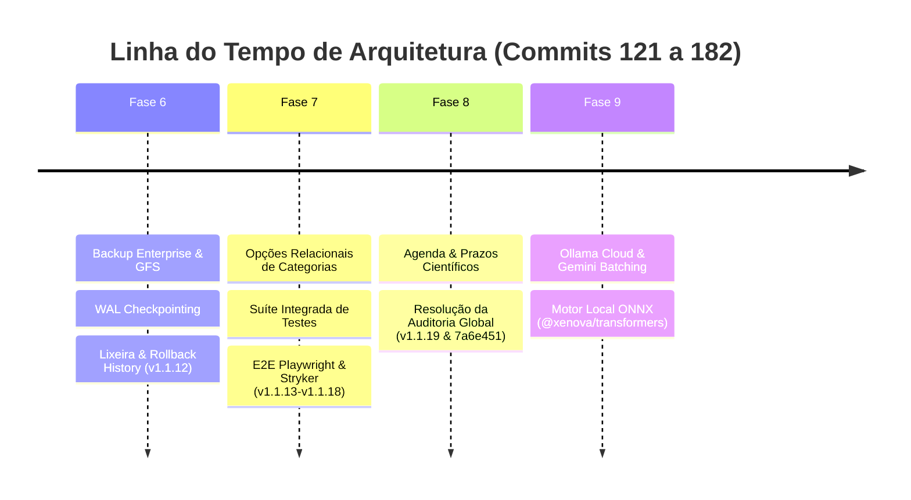
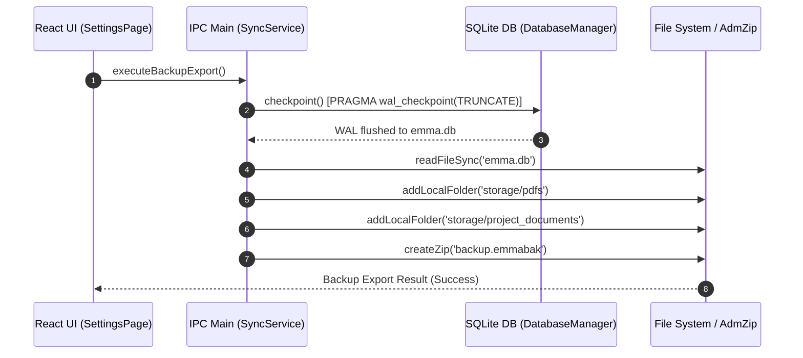
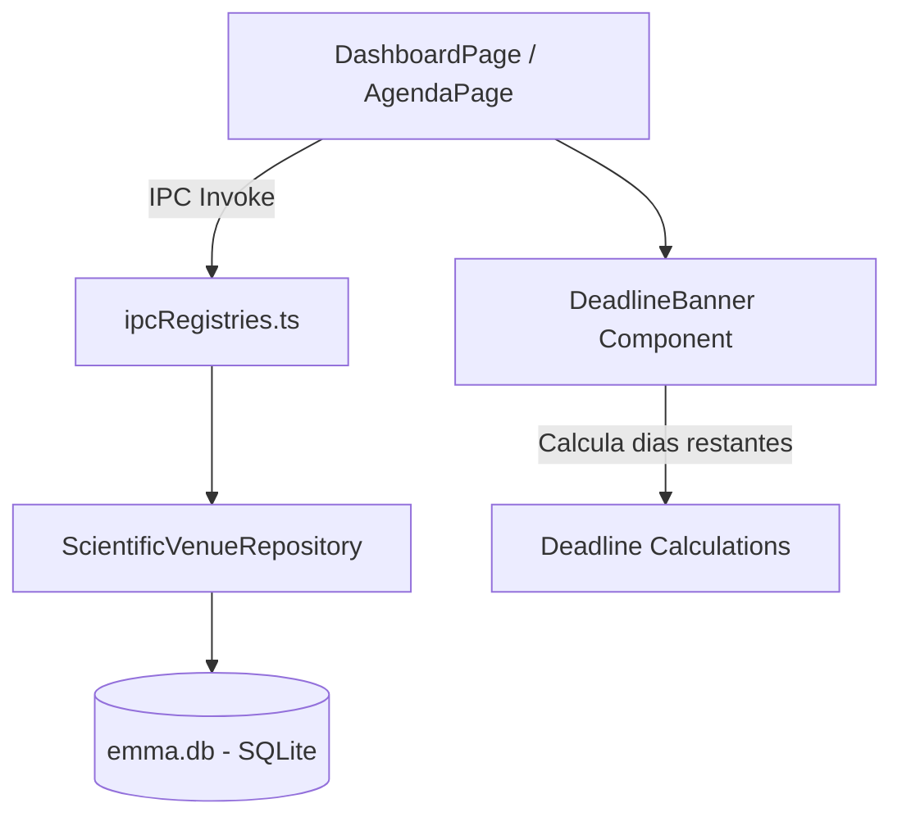

# Análise Detalhada do Histórico Git — Terço Final (Commits 121 ao 182)

**Projeto**: `emmas_librarian`  
**Agente Explorador**: `survey_explorer_3`  
**Escopo**: Commits 121 ao 182 (~62 commits)  
**Data da Análise**: 05/08/2026  

---

## 1. Resumo Executivo

O terço final do histórico do repositório `emmas_librarian` (commits 121 a 182) registra a transição do sistema de uma aplicação com funcionalidades básicas de diário e leitor de artigos para uma **plataforma científica de nível empresarial**, resiliente a falhas de dados, com suíte completa de testes formais, gestão de prazos/agenda acadêmica e integração híbrida de IA local e nuvem.

Nesta fase final, foram identificados 4 grandes marcos arquiteturais:
1. **Módulo Empresarial de Backup e Rotação GFS (Commits 121–129)**: Criação de um sistema robusto de gerenciamento de cópias de segurança com rotação GFS (*Grandfather-Father-Son*), lixeira lógica com rollback de diários (`project_diary_history`), sincronização total do pacote `.emmapcarc` e flush preventivo do diário WAL (`PRAGMA wal_checkpoint(TRUNCATE)`) para prevenir corrupção no SQLite.
2. **Refatoração Relacional de Taxonomia e Suíte Integral de Testes (Commits 130–155)**: Eliminação de rótulos órfãos através de relacionamentos explícitos (`project_category_options` e `article_category_selections`), acompanhada pelo desdobramento da suíte piloto de testes (Playwright E2E, JMeter/k6, Stryker mutation testing e cobertura ampliada).
3. **Módulo de Agenda Científica e Resolução de Auditoria Global (Commits 156–169)**: Introdução do sistema de monitoramento de eventos e *deadlines* de submissão científica (`scientific_venues` e `scientific_milestones`), seguido por uma auditoria quádrupla e resolução consolidada de débitos técnicos (`7a6e451`).
4. **Arquitetura Híbrida de IA e Motor de Embeddings Locais ONNX (Commits 170–182)**: Expansão do ecossistema de LLMs com `ollama_cloud`, otimização da resiliência de retentativas para Gemini Embeddings (HTTP 429), e o pivô estratégico da solução de vetorização local — migrando de um sidecar binário `llama.cpp` para um motor embutido em JavaScript/WebAssembly via `@xenova/transformers` (ONNX).

---

## 2. Proposta de Fronteiras de Fases Lógicas

Com base nas viradas arquiteturais observadas, o intervalo dos commits 121 ao 182 é dividido nas seguintes **4 Fases Lógicas**:



| Fase | Intervalo de Commits | Intervalo de Datas | Descrição Resumida | Marco Principal / Release |
|---|---|---|---|---|
| **Fase 6** | `121` ao `129` (`18390dc` .. `353b900`) | 05/06/2026 | Arquitetura Enterprise de Backup, Rotação GFS, Lixeira de Diário e Consistência WAL no SQLite | Release v1.1.12 |
| **Fase 7** | `130` ao `155` (`9e00039` .. `f22810e`) | 10/06/2026 .. 22/07/2026 | Refatoração de Categorias Relacionais, Suíte Massiva de Testes (E2E/Performance/Mutantes) e Pacote de Transporte `.emmapcarc` | Releases v1.1.13 a v1.1.18 |
| **Fase 8** | `156` ao `169` (`15550ba` .. `7a6e451`) | 23/07/2026 .. 03/08/2026 | Módulo de Agenda Científica & Prazos (*Venues & Milestones*), Padronização de Docs ISO e Auditoria Global | Release v1.1.19 (`46bcf82`) & Fix `7a6e451` |
| **Fase 9** | `170` ao `182` (`74f51f0` .. `0d80939`) | 04/08/2026 .. 05/08/2026 | Provedores IA Cloud (`ollama_cloud`), Resiliência Gemini e Transição para Motor Local ONNX (`@xenova/transformers`) | Integração ONNX de Alta Performance |

---

## 3. Detalhamento Técnico Profundo por Fase

### 3.1. Fase 6 — Arquitetura Enterprise de Backup e Rotação GFS (Commits 121–129)

#### Visão Geral e Mudança Arquitetural
Antes do commit 121, as operações de exportação e importação de dados sofriam com inconsistências causadas por *race conditions* em gravações concorrentes no diário do SQLite e ausência de retenção de histórico. A Fase 6 introduziu a `Etapa 1` e `Etapa 2` do plano de backup corporativo:
- **Rotinas GFS (Grandfather-Father-Son)**: Backups automáticos organizados por periodicidade (diários *Son*, semanais *Father*, mensais *Grandfather*).
- **Mecanismo de Lixeira & Historização**: Tabela `project_diary_history` para permitir rollback de anotações e soft delete para projetos.
- **WAL Checkpointing Preventivo**: Chamada direta a `PRAGMA wal_checkpoint(TRUNCATE)` em `DatabaseManager.ts` antes de realizar a leitura e empacotamento do arquivo `.emma.db`, garantindo que os dados retidos no arquivo `-wal` sejam completamente mesclados ao banco principal antes do backup.

#### Diffs e Mudanças Chave em Código

**No arquivo `electron/database/DatabaseManager.ts` (Commit `a8d60be`):**
```typescript
/**
 * Runs a WAL checkpoint to flush all pending writes from the WAL file into the
 * main database file. Call this before any file-level backup/copy operation to
 * ensure data consistency.
 */
public checkpoint(): void {
  this.db.pragma('wal_checkpoint(TRUNCATE)');
}
```

**No arquivo `electron/database/SyncService.ts` (Commit `a8d60be`):**
```typescript
public async exportBackup(destinationPath?: string): Promise<string | null> {
  // ...
  const zip = new AdmZip();

  // 1. Flush WAL to main db file before reading, to ensure backup is consistent
  const db = (this.dbManager as any).db; // Access better-sqlite3
  db.pragma('wal_checkpoint(TRUNCATE)');

  // 2. Copy db file to zip
  if (fs.existsSync(dbPath)) {
    zip.addFile('emma.db', fs.readFileSync(dbPath));
  }
  // ...
}
```

#### Diagrama de Sequência — Rotação e Exportação de Backup WAL


---

### 3.2. Fase 7 — Taxonomia Relacional, Suíte de Testes & Transporte `.emmapcarc` (Commits 130–155)

#### Visão Geral e Mudança Arquitetural
A Fase 7 resolveu uma limitação estrutural grave no leitor de artigos: o uso de valores de texto soltos para categorias personalizadas, o que gerava "rótulos órfãos" quando uma categoria tinha seu nome alterado. A arquitetura de banco de dados evoluiu para normalizar opções de categorias em tabelas relacionais dedicadas (`project_category_options` e `article_category_selections`).

Além disso, esta fase estabeleceu a **Suíte Integrada de Testes de Software**:
- **Testes E2E com Playwright**: Automação de cenários de uso real no Electron em `emmas_librarian/e2e-tests/`.
- **Testes de Desempenho (JMeter & k6)**: Scripting e limites operacionais para carga de PDFs e consultas em lote.
- **Engenharia de Testes por Mutação (Stryker)**: Injeção de mutantes de código para medir a eficácia da suíte de testes unitários em `electron/` e `src/`.
- **Inclusão no Pacote `.emmapcarc`**: Atualização do `SyncService` (Commit `6d1c349`) para sincronizar `article_category_selections`, `question_sets` e `investigation_results`.

#### Esquema de Banco de Dados Relacional (Commit `043e0c6` / `6d1c349`)

```sql
CREATE TABLE IF NOT EXISTS project_category_options (
    id INTEGER PRIMARY KEY AUTOINCREMENT,
    category_id INTEGER NOT NULL,
    name TEXT NOT NULL,
    FOREIGN KEY(category_id) REFERENCES project_categories(id) ON DELETE CASCADE
);

CREATE TABLE IF NOT EXISTS article_category_selections (
    article_id INTEGER NOT NULL,
    category_id INTEGER NOT NULL,
    option_id INTEGER NOT NULL,
    PRIMARY KEY(article_id, category_id, option_id),
    FOREIGN KEY(article_id) REFERENCES articles(id) ON DELETE CASCADE,
    FOREIGN KEY(category_id) REFERENCES project_categories(id) ON DELETE CASCADE,
    FOREIGN KEY(option_id) REFERENCES project_category_options(id) ON DELETE CASCADE
);
```

---

### 3.3. Fase 8 — Agenda Científica, Gestão de Prazos e Resolução de Auditoria (Commits 156–169)

#### Visão Geral e Mudança Arquitetural
Nos commits 156 ao 164, o sistema recebeu a funcionalidade completa de **Scientific Agenda & Deadlines**. Esta funcionalidade permite que pesquisadores cadastrem conferências/periódicos (*venues*), definam marcos de submissão/revisão (*milestones*), acompanhem contagens regressivas de prazos e visualizem os eventos em um calendário interativo integrado ao `DashboardPage`.

O módulo foi estruturado seguindo o padrão de Repositório e Camadas IPC desacopladas:
- **Repositório**: `ScientificVenueRepository.ts`
- **IPC Registries**: Manipuladores em `ipcRegistries.ts` para CRUD de venues e milestones.
- **Componentes React**: `AgendaPage.tsx`, `ScientificAgendaView.tsx`, `VenueFormModal.tsx` (portalizado para evitar bugs de z-index) e `DeadlineBanner.tsx`.

No commit `169 (7a6e451)`, o repositório passou por uma grande limpeza técnica com base nos relatórios de auditoria de sistema (gestão de erros, performance, qualidade de código e testes), refatorando 15+ arquivos centrais de uma só vez.

#### Estrutura de Tabelas SQL de Agenda Científica (Commit `15550ba`)

```sql
CREATE TABLE IF NOT EXISTS scientific_venues (
    id INTEGER PRIMARY KEY AUTOINCREMENT,
    title TEXT NOT NULL,
    acronym TEXT,
    category TEXT DEFAULT 'other',
    url TEXT,
    color TEXT DEFAULT '#3b82f6',
    created_at DATETIME DEFAULT CURRENT_TIMESTAMP
);

CREATE TABLE IF NOT EXISTS scientific_milestones (
    id INTEGER PRIMARY KEY AUTOINCREMENT,
    venue_id INTEGER NOT NULL,
    label TEXT NOT NULL,
    field_type TEXT DEFAULT 'single',
    target_date TEXT NOT NULL,
    end_date TEXT,
    has_time INTEGER DEFAULT 0,
    target_time TEXT,
    status TEXT DEFAULT 'pending',
    FOREIGN KEY (venue_id) REFERENCES scientific_venues(id) ON DELETE CASCADE
);
```

#### Diagrama de Arquitetura do Módulo de Agenda


---

### 3.4. Fase 9 — IA Cloud e Transição do Motor Local de Embeddings para ONNX (Commits 170–182)

#### Visão Geral e Mudança Arquitetural
Esta fase marca uma transição tecnológica fundamental no subsistema de Inteligência Artificial e Busca Semântica:

1. **Ollama Cloud Integration (Commit `170`, `171`, `172`)**:
   - Criação da classe `OllamaCloudGateway.ts` com autenticação por token Bearer.
   - Tratamento de exceções e sanitização de respostas de proxy HTML.
   - Redirecionamento automático de URLs legadas de `api.ollama.cloud` para o padrão Open-AI compatível `https://ollama.com/v1`.

2. **Resiliência e Batching em Gemini Embeddings (Commit `174`)**:
   - Atualização do `EmbeddingService.ts` para utilizar chamadas em lote (`batchEmbedContents`).
   - Mecanismo de auto-retry com *exponential backoff* para tratar limites de taxa HTTP 429 da API do Google Gemini.

3. **Pivô da Arquitetura de Vetorização Local (Commits `176` a `182`)**:
   - *Tentativa Inicial (Commits `176`-`179`)*: Implementação de um sidecar baseado em binário `llama.cpp` (`LlamaServerManager` e `LlamaDownloader`) para executar modelos `.gguf`. A abordagem revelou-se pesada e com dependências complexas de sistema.
   - *Solução Definitiva ONNX (Commits `180`-`182`)*: Substituição do sidecar binário pelo pacote `@xenova/transformers` (ONNX Runtime em JavaScript puro / WebAssembly). Essa decisão permitiu vetorizar artigos em tempo real (`Xenova/all-MiniLM-L6-v2`) com **zero configuração**, sem downloads binários externos e 100% offline no ambiente Node/Electron.

#### Trecho de Código Central — Motor ONNX Local em `EmbeddingService.ts` (Commit `181`)

```typescript
// Implementação padronizada do provedor local ONNX sem necessidade de sidecar binário
if (this.config.provider === 'local' || this.config.provider === 'llama_cpp') {
  try {
    const { pipeline } = await import('@xenova/transformers');
    if (!EmbeddingService.transformerExtractor) {
      console.log('[EmbeddingService] Inicializando motor local de vetorização ONNX (Xenova/all-MiniLM-L6-v2)...');
      EmbeddingService.transformerExtractor = await pipeline('feature-extraction', 'Xenova/all-MiniLM-L6-v2');
    }
    const output = await EmbeddingService.transformerExtractor(text, { pooling: 'mean', normalize: true });
    return Array.from(output.data) as number[];
  } catch (err) {
    console.error('[EmbeddingService] Erro ao gerar embedding ONNX local:', err);
    throw new AppError('ERR_EMBEDDING_FAILED', 'Falha ao processar vetorização local ONNX.');
  }
}
```

---

## 4. Evolução da Estrutura de Pastas (Commits 121 ao 182)

Abaixo é apresentada a evolução da árvore de diretórios no terço final do repositório:

| Diretório / Subpasta | Adicionado / Alterado em | Finalidade e Descrição |
|---|---|---|
| `emmas_librarian/e2e-tests/` | Commit `136` / `148` | Suíte de testes de ponta a ponta (Playwright E2E) cobrindo PDF import, backup, formulários e agenda |
| `emmas_librarian/electron/services/llm/` | Commit `170` / `176` | Gateways e gerenciadores de provedores LLM (`OllamaCloudGateway.ts`, testes unitários) |
| `emmas_librarian/src/components/ai/` | Commit `165` | Componentes de UI dedicados à seleção de artigos e histórico de busca AI (`ArticleSelector.tsx`) |
| `emmas_librarian/src/components/common/` | Commit `158` / `159` | Visualizações de agenda e contadores de prazo (`ScientificAgendaView.tsx`, `DeadlineBanner.tsx`) |
| `emmas_librarian/src/components/modals/` | Commit `157` | Modais portalizados para gestão de eventos (`VenueFormModal.tsx`) |
| `docs/relatorios/` | Commit `142` / `167` / `169` | Relatórios consolidados de teste, performance, cobertura e auditoria padronizados com datas ISO |

---

## 5. Tabela Completa de Commits do Terço Final (121 ao 182)

| # | Hash | Data | Autor | Mensagem do Commit (Subject) | Componentes / Escopo Principal |
|---|---|---|---|---|---|
| 121 | `18390dc` | 2026-06-05 | João Pedro V | feat(backup): complete Etapa 2 with trash bin, diary rollback history, and database migrations | DatabaseManager, Lixeira, History |
| 122 | `c985de0` | 2026-06-05 | João Pedro V | feat(backup): complete Etapa 3 with manual backup export and restore mechanisms | SyncService, SettingsPage |
| 123 | `f7a79f0` | 2026-06-05 | João Pedro V | feat(backup): add GFS restore option to UI, style trash buttons, fix database file lock | BackupManager, SyncService |
| 124 | `a8d60be` | 2026-06-05 | João Pedro V | fix(backup): checkpoint WAL before file-level export and override restore | WAL Checkpointing, SyncService |
| 125 | `3e7db0b` | 2026-06-05 | João Pedro V | fix(export): restore all article/project fields and diary history in emmapcarc | SyncService, Export |
| 126 | `e77190b` | 2026-06-05 | João Pedro V | fix(missing project data in import/export cycle) | Backup, Data Integrity |
| 127 | `08e33a5` | 2026-06-05 | João Pedro V | chore: release v1.1.12 | Release Management |
| 128 | `8827f18` | 2026-06-05 | João Pedro V | docs: update patch notes history in README.md | Documentation |
| 129 | `353b900` | 2026-06-05 | João Pedro V | docs: backfill missing patch notes for v1.1.1 to v1.1.5 in README.md | Documentation |
| 130 | `9e00039` | 2026-06-10 | João Pedro V | fix: ordenar citacao massiva por sobrenome do primeiro autor | Bibliometrics, Citation |
| 131 | `c17df04` | 2026-06-19 | João Pedro V | fix: PDF reader zoom shortcuts and state, annotation line breaks, sidebar minimum width | ArticleReaderPage, UI |
| 132 | `043e0c6` | 2026-06-20 | João Pedro V | feat: refactor categories editing to use relation-based options to fix orphaned labels | Database schema, Category Options |
| 133 | `cb0b167` | 2026-06-20 | João Pedro V | test: add regression tests for category options refactor | Regression Tests |
| 134 | `172c5e6` | 2026-06-24 | João Pedro V | fix: resolve bugs na UI, no logs e testes de AI | AI Services, UI |
| 135 | `bbb0c7b` | 2026-06-24 | João Pedro V | docs: add and update logs, agent rules and documentation | Documentation |
| 136 | `fe4b183` | 2026-06-24 | João Pedro V | chore: implement pilot testing plan (Fases 1-6) including dual load & E2E tests | Testing Suite, E2E |
| 137 | `8af275b` | 2026-06-24 | João Pedro V | chore: add wait-on check to performance tests inside package.json | Performance Scripts |
| 138 | `0f4223e` | 2026-06-24 | João Pedro V | chore: add E2E devDependencies to package.json and update .gitignore | E2E Configuration |
| 139 | `6050aa7` | 2026-06-24 | João Pedro V | chore: throw custom environment errors in E2E tests under headless setups to avoid timeouts | Playwright Config |
| 140 | `8854fe7` | 2026-06-24 | João Pedro V | chore: ensure native modules are rebuilt for electron before running E2E tests | Native Modules, Electron |
| 141 | `42baf43` | 2026-06-24 | João Pedro V | test: validate performance test execution for jmeter and k6 and update thresholds | k6, JMeter Testing |
| 142 | `bf7cedc` | 2026-06-24 | João Pedro V | doc: add comprehensive testing report to docs/relatorios | Test Reports |
| 143 | `11cc889` | 2026-06-24 | João Pedro V | test: expand stryker mutation targets to cover all main functions | Stryker Mutation |
| 144 | `7345071` | 2026-06-24 | João Pedro V | doc: update comprehensive testing report with functional, structural and weak points analysis | Documentation |
| 145 | `718f1b8` | 2026-06-24 | João Pedro V | docs: temp_projetofinal_testes | Temporary Docs |
| 146 | `6d1c349` | 2026-06-29 | João Pedro V | feat: add article_category_selections, question_sets and investigation_results to emmapcarc | SyncService, .emmapcarc |
| 147 | `97f68be` | 2026-06-29 | João Pedro V | chore: commit remaining test suite changes before release merge | Test Suite Cleanup |
| 148 | `5dc734b` | 2026-06-29 | João Pedro V | merge: feature/comprehensive-testing-suite into main | Git Merge |
| 149 | `e1293be` | 2026-06-29 | João Pedro V | chore: release v1.1.13 | Release v1.1.13 |
| 150 | `afe9c42` | 2026-06-30 | João Pedro V | chore: release v1.1.14 | Release v1.1.14 |
| 151 | `d818226` | 2026-06-30 | João Pedro V | docs: update release-manager skill with path validation rules | Agent Skills |
| 152 | `db2ded5` | 2026-07-02 | João Pedro V | chore: release v1.1.15 | Release v1.1.15 |
| 153 | `aa68e5f` | 2026-07-12 | João Pedro V | chore: release v1.1.16 | Release v1.1.16 |
| 154 | `37efcf0` | 2026-07-22 | João Pedro V | chore: release v1.1.17 | Release v1.1.17 |
| 155 | `f22810e` | 2026-07-22 | João Pedro V | chore: release v1.1.18 | Release v1.1.18 |
| 156 | `15550ba` | 2026-07-23 | João Pedro V | feat(db): schema, repository, IPC handlers and unit tests for agenda | Agenda Schema, Repository |
| 157 | `b86b765` | 2026-07-23 | João Pedro V | feat(ui): portalized VenueFormModal with validations and unit tests | VenueFormModal UI |
| 158 | `037e36a` | 2026-07-23 | João Pedro V | feat(agenda): AgendaPage and ScientificAgendaView with unified pill, optimistic update and tests | Agenda Views UI |
| 159 | `3998d9c` | 2026-07-23 | João Pedro V | feat(dashboard): minimalist agenda section, neutral clock, end_date deadline calculations and tests | Dashboard Deadlines |
| 160 | `46bcf82` | 2026-07-23 | João Pedro V | release: v1.1.19 Agenda and Deadlines feature complete and verified | Release v1.1.19 |
| 161 | `55b91fa` | 2026-07-23 | João Pedro V | fix(dashboard,agenda): restore bottom charts styling, add menu shortcut, remove duplicate plus | Agenda Fixes |
| 162 | `e4cc150` | 2026-07-23 | João Pedro V | fix(dashboard,agenda): apply reduced date format, container max-width to agenda | UI Refinements |
| 163 | `5723b30` | 2026-07-23 | João Pedro V | test(e2e): add Playwright E2E tests for Agenda & Deadlines, update search input placeholder | Agenda E2E Tests |
| 164 | `ad09fb2` | 2026-07-27 | João Pedro V | feat(dashboard/agenda): clean clock without seconds and custom event color markings on calendar | Calendar Customizations |
| 165 | `425b471` | 2026-07-29 | João Pedro V | fix(ai): adjust select and input font size and height to prevent text clipping | ArticleSelector UX |
| 166 | `a97e733` | 2026-07-29 | João Pedro V | feat(ai): list all project searches in ArticleSelector search history filter dropdown | Search History Filter |
| 167 | `4493d4c` | 2026-07-29 | João Pedro V | docs: rename all docs files to start with creation date (YYYY-MM-DD) | ISO Date Standardization |
| 168 | `23bfc23` | 2026-08-01 | João Pedro V | doc: audit docs generated | Audit Documents |
| 169 | `7a6e451` | 2026-08-03 | João Pedro V | fix(audit): resolve all 4 audit reports (error management, performance, code quality, test suite) | System-wide Cleanup |
| 170 | `74f51f0` | 2026-08-04 | João Pedro V | feat(llm): add ollama_cloud provider support with Bearer token authentication and TDD tests | Ollama Cloud Gateway |
| 171 | `c54ad5a` | 2026-08-04 | João Pedro V | fix(ui/llm): simplify Ollama Cloud UI, sanitize HTML proxy errors, and improve AppError handling | Error Handling UI |
| 172 | `8460a3f` | 2026-08-04 | João Pedro V | fix(llm): auto migrate legacy api.ollama.cloud URLs to https://ollama.com/v1 | Endpoint Migration |
| 173 | `936d27d` | 2026-08-04 | João Pedro V | feat(ui): add 1-click model suggestions and provider auto-fill for embeddings in SettingsPage | Settings UX |
| 174 | `91a21f5` | 2026-08-04 | João Pedro V | fix(embeddings): add Gemini batchEmbedContents, auto retries for 429 rate limits, and model name sanitization | Gemini Batching & Retry |
| 175 | `d99b703` | 2026-08-04 | João Pedro V | docs(ui): add recommendation notice stating embeddings currently perform best with local Ollama | Settings Notices |
| 176 | `e554ed7` | 2026-08-04 | João Pedro V | feat(embeddings): integrate local embedded llama.cpp provider (llama_cpp) and LlamaServerManager sidecar | Llama.cpp Sidecar Prototype |
| 177 | `e6b4515` | 2026-08-04 | João Pedro V | fix(ipc/embeddings): handle raw fetch failed exceptions as AppError('ERR_API_CONNECTION') | Connection Errors |
| 178 | `30d88fe` | 2026-08-04 | João Pedro V | feat(llmacpp): add models/ and bin/ directory resolution with download README instructions | Path Resolution |
| 179 | `abab3c6` | 2026-08-05 | João Pedro V | feat(llmacpp): add transparent auto-downloader (LlamaDownloader) for GGUF model and server binary | LlamaDownloader |
| 180 | `e779c69` | 2026-08-05 | João Pedro V | feat(embeddings): integrate zero-setup local ONNX fallback engine (@xenova/transformers) | ONNX Integration |
| 181 | `8bd5b20` | 2026-08-05 | João Pedro V | refactor(embeddings): standardize local embedded provider to primary ONNX engine (Local Embutido ONNX) | ONNX Standardization |
| 182 | `0d80939` | 2026-08-05 | João Pedro V | fix(settings): remove obsolete llama_cpp option from provider select dropdown | Settings Cleanup |

---

## 6. Conclusões e Recomendações para a Síntese

1. **Continuidade de Dados**: A inclusão de `wal_checkpoint(TRUNCATE)` na Fase 6 é o ponto central que garante a integridade de qualquer rotina de backup no SQLite sob modo WAL. A documentação final do diário de desenvolvimento deve enfatizar esse aprendizado de engenharia.
2. **Normalização Relacional**: A migração de categorias para tabelas relacionais dedicadas (`project_category_options` e `article_category_selections`) preveniu a degradação da UI no leitor de PDF e permitiu relatórios bibliométricos consistentes.
3. **Pivô Tecnológico em IA Local**: O direcionamento final para `@xenova/transformers` (ONNX) em vez de binários compilados `llama.cpp` demonstra uma decisão pragmática de arquitetura — priorizando facilidade de instalação e distribuição limpa no Electron sobre processos sidecar complexos.
