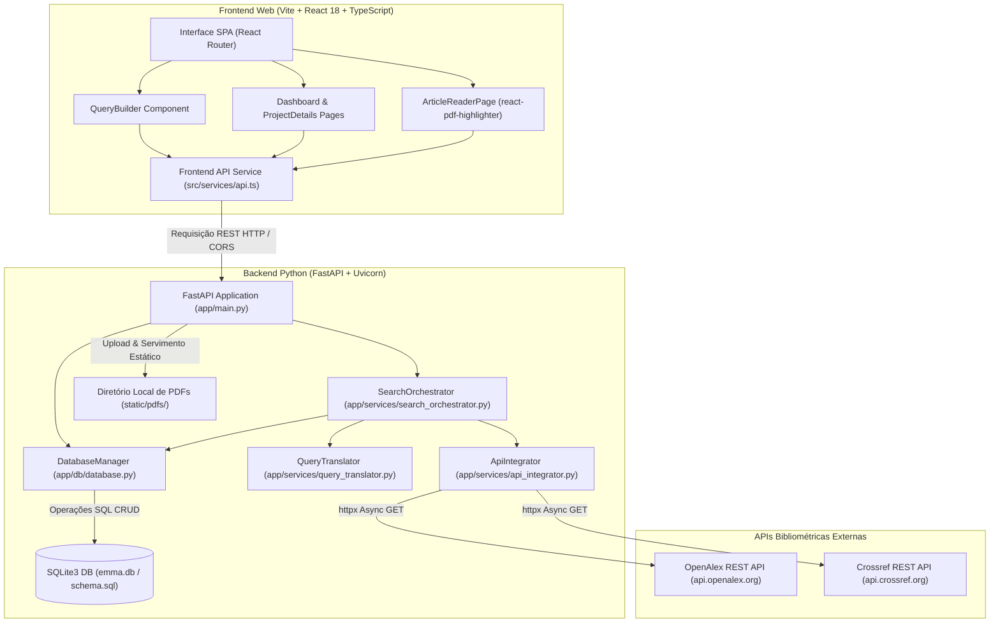
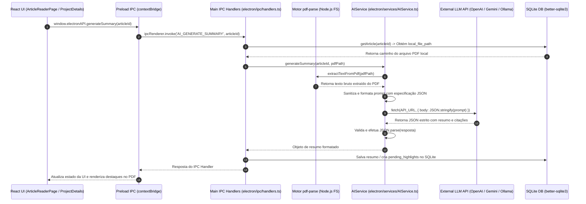
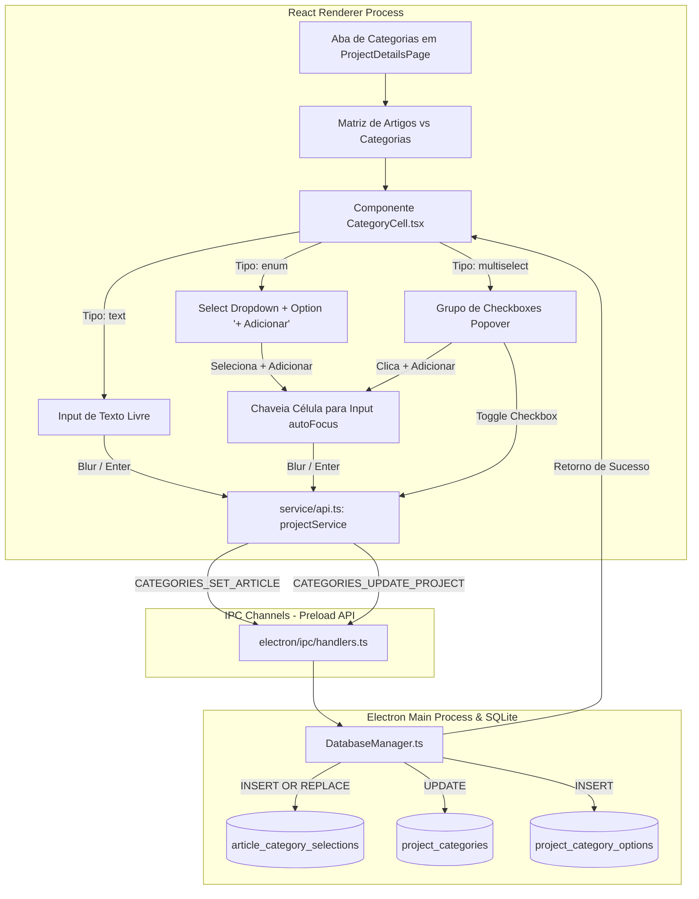
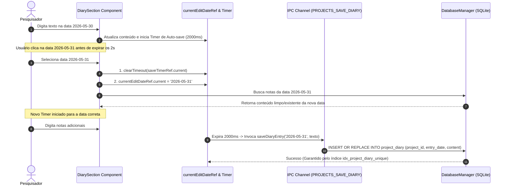
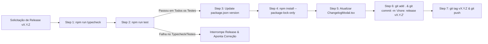
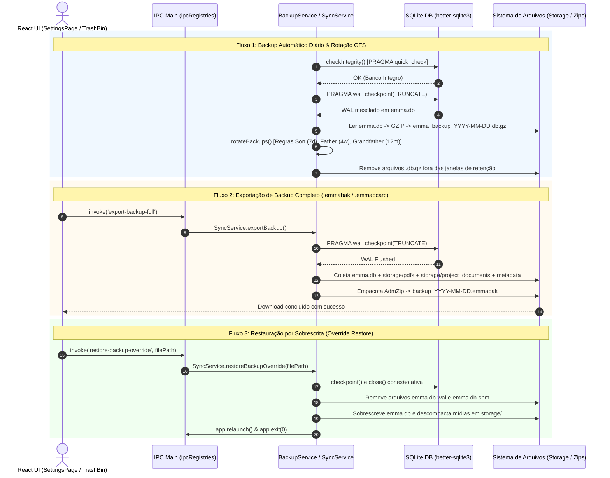
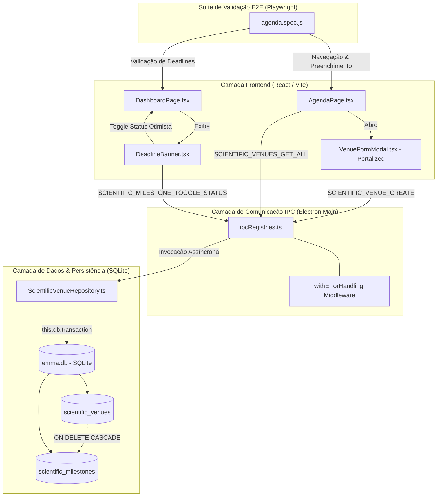

# Diário de Desenvolvimento — Emma's Librarian

> **Visão Geral do Projeto**: Este documento reúne o diário de desenvolvimento completo, decisões de engenharia, evolução arquitetural, esquemas relacionais de banco de dados, diagramas de fluxo de dados, trechos de código e tabelas autênticas de commits do **Emma's Librarian** ao longo de suas 11 fases de desenvolvimento (Fase 0 a Fase 10), cobrindo a totalidade dos ~182 commits do repositório.

---


## Fase 0: Concepção, Fundação Python/FastAPI e Protótipo MVP Web

**Posição:** Fase 0 (Commits 1 a 19)

---

### 1. Resumo Executivo

A **Fase 0** marca a concepção original do projeto **Emma's Librarian**, concebido como um assistente inteligente para gestão bibliométrica e leitura interativa de literatura científica. O objetivo primordial nesta etapa inicial era prover aos pesquisadores uma plataforma capaz de traduzir consultas estruturadas de busca (utilizando operadores booleanos), executar buscas paralelas e desduplicadas em bases públicas como OpenAlex e Crossref, armazenar os metadados dos artigos em formato padronizado CSL-JSON e possibilitar a visualização e anotação visual de arquivos PDF diretamente na interface web.

Durante este ciclo inicial (desenvolvido entre 17 e 18 de Maio de 2026), a arquitetura adotou um modelo **cliente-servidor desacoplado via HTTP REST**:
- **Backend**: Desenvolvido em Python 3.13 utilizando FastAPI como servidor web assíncrono, SQLite3 como banco de dados relacional embarcado e Pytest para garantia de qualidade orientada a testes (TDD).
- **Frontend**: Aplicação SPA web baseada em React 18, TypeScript, Vite e Tailwind CSS, incorporando o componente `react-pdf-highlighter` para renderização e marcação interativa de documentos PDF em canvas.

Ao final desta fase, o projeto contava com um protótipo MVP web funcional capaz de gerenciar projetos de pesquisa, orquestrar buscas bibliométricas em múltiplas APIs, desduplicar resultados por DOI ou título, persistir marcadores visuais em PDFs e exportar metadados em CSV.

---

### 2. Detalhamento Profundo

#### 2.1. Decisões de Engenharia & Racional Arquitetural

1. **Desacoplamento Cliente-Servidor via HTTP/REST**: A escolha inicial por uma arquitetura cliente-servidor HTTP permitiu uma separação clara de responsabilidades entre o motor de busca e persistência em Python (`http://localhost:8000`) e a interface visual em React/TypeScript (`http://localhost:5173`). O backend tratava unicamente de regras de negócio, integrações assíncronas de API e manipulação do SQLite, enquanto o frontend gerenciava o estado de exibição e interatividade.
2. **Desenvolvimento Orientado a Testes (TDD) no Backend Python**: O desenvolvimento do motor bibliométrico seguiu rigorosamente os princípios de TDD. Módulos críticos como `QueryTranslator`, `ApiIntegrator` e `SearchOrchestrator` foram implementados acompanhados por suítes de teste no Pytest (`test_db.py`, `test_query_translator.py`, `test_api_integrator.py`, `test_search_orchestrator.py`).
3. **Abstração e Tradução de Consultas Booleanas (`QueryTranslator`)**: Para evitar que o pesquisador precisasse dominar as especificidades sintáticas de cada API bibliométrica, construiu-se a classe `QueryTranslator`. Ela converte blocos de consulta estruturada (como campos `title`, `year` com comparadores `equals`, `greater_than`, `less_than`) para a sintaxe de filtro do OpenAlex (`title.search:`, `publication_year:>`) e para os parâmetros de busca da REST API do Crossref (`query.title`, `from-pub-date`, `until-pub-date`).
4. **Orquestração e Desduplicação Concorrente (`SearchOrchestrator`)**: O módulo `SearchOrchestrator` executa requisições HTTP assíncronas utilizando `httpx.AsyncClient`. Como diferentes bases bibliométricas frequentemente retornam o mesmo artigo científico, implementou-se um algoritmo de desduplicação em memória que unifica artigos redundantes utilizando chaves de comparação por DOI normalizado ou por título normalizado (caixa baixa e sem espaços extras). Quando um artigo é identificado em múltiplas fontes, a propriedade `base_origem` consolida a lista de fontes de origem (ex: `['OpenAlex', 'Crossref']`).
5. **Normalização CSL-JSON**: Todos os registros bibliográficos recuperados das APIs foram convertidos para a norma internacional CSL-JSON (*Citation Style Language*), garantindo interoperabilidade com gerenciadores de referências bibliográficas e simplificando o mapeamento para tabelas do banco relacional.
6. **Esquema Relacional SQLite (`schema.sql`)**: Definiu-se um banco de dados relacional leve com integridade referencial mantida por chaves estrangeiras com ação `ON DELETE CASCADE`. As tabelas `projects`, `articles`, `annotations` e `highlights` foram desenhadas para suportar a rastreabilidade entre a busca original, os metadados do artigo, os arquivos PDF associados e as marcações visuais dos trechos lidos.
7. **Leitura Interativa e Armazenamento Local de PDFs**: O componente `react-pdf-highlighter` foi integrado ao frontend SPA, viabilizando o destaque de trechos em PDF em tempo real. O backend FastAPI disponibilizou rotas para upload físico de arquivos PDF (`/upload_pdf`) e servimento estático (`/static/pdfs`), gravando as coordenadas exatas dos destaques (`position_data` em JSON) na tabela `highlights`.

---

#### 2.2. Diagrama de Arquitetura & Fluxo de Dados (Mermaid)



---

#### 2.3. Tabela de Estrutura de Diretórios e Arquivos (Fase 0)

| Caminho do Arquivo / Diretório | Descrição da Responsabilidade & Conteúdo | Commits Principais |
| :--- | :--- | :--- |
| `backend/app/main.py` | Ponto de entrada FastAPI. Define rotas REST de projetos, artigos, buscas, upload/servimento de PDFs e exportação CSV. | `92fdab2`, `c887f7d`, `dc62f6e`, `09ff21b` |
| `backend/app/db/schema.sql` | Script SQL de criação das tabelas `projects`, `articles`, `annotations` e `highlights` com `ON DELETE CASCADE`. | `cc1d50d`, `dc62f6e` |
| `backend/app/db/database.py` | Classe `DatabaseManager`. Encapsula conexões SQLite3, transações e operações CRUD para todas as entidades. | `cc1d50d`, `4ed7dc9`, `c887f7d`, `dc62f6e` |
| `backend/app/services/query_translator.py` | Classe `QueryTranslator`. Converte blocos de busca visual em queries formatadas para OpenAlex e parâmetros para Crossref. | `968c38a` |
| `backend/app/services/api_integrator.py` | Classe `ApiIntegrator`. Consome APIs externas com `httpx` e normaliza respostas em dicionários CSL-JSON. | `131c201` |
| `backend/app/services/search_orchestrator.py` | Classe `SearchOrchestrator`. Executa buscas paralelas, desduplica artigos por DOI/título e salva no banco de dados. | `4ed7dc9` |
| `backend/tests/` | Suíte de testes unitários Pytest (`test_db.py`, `test_query_translator.py`, `test_api_integrator.py`, `test_search_orchestrator.py`). | `cc1d50d`, `968c38a`, `131c201`, `4ed7dc9` |
| `frontend/src/pages/DashboardPage.tsx` | Tela inicial. Lista projetos existentes com data de criação e contador de artigos, além de botão para criar projeto. | `51f6368` |
| `frontend/src/pages/NewProjectPage.tsx` | Tela de criação de projeto com integração do QueryBuilder visual para consulta inicial. | `92fdab2` |
| `frontend/src/pages/ProjectDetailsPage.tsx` | Visão detalhada do projeto. Exibe tabela de artigos, filtros, modal de busca adicional e exportação CSV. | `51f6368`, `09ff21b`, `93407c0` |
| `frontend/src/pages/ArticleReaderPage.tsx` | Leitor de PDF interativo baseado em `react-pdf-highlighter` com suporte a realces de texto, notas e upload de PDF local. | `c887f7d`, `dc62f6e`, `042ef98`, `93407c0` |
| `frontend/src/components/QueryBuilder.tsx` | Componente de construção visual de buscas booleanas (operações AND/OR/NOT, campos e comparadores). | `92fdab2`, `93407c0` |
| `frontend/src/services/api.ts` | Cliente Axios no frontend para integração com todos os endpoints do backend FastAPI (`http://localhost:8000`). | `92fdab2`, `51f6368`, `c887f7d`, `dc62f6e` |
| `frontend/src/types/index.ts` | Interfaces TypeScript para `Project`, `Article`, `Highlight`, `Annotation`, `QueryBlock`. | `92fdab2`, `c887f7d`, `042ef98` |
| `README.md` | Documentação de inicialização do projeto MVP (instruções de instalação backend/frontend). | `09ff21b`, `e4a60e0` |

---

#### 2.4. Trechos de Código Principais (Extraídos dos Diffs dos Commits)

##### A. Esquema Relacional do Banco de Dados (`backend/app/db/schema.sql` — Commit `cc1d50d`)
```sql
-- schema.sql: Definição do esquema SQLite inicial em Python
CREATE TABLE IF NOT EXISTS projects (
    id INTEGER PRIMARY KEY AUTOINCREMENT,
    name TEXT NOT NULL,
    data_criacao TIMESTAMP DEFAULT CURRENT_TIMESTAMP,
    ultima_execucao TIMESTAMP
);

CREATE TABLE IF NOT EXISTS articles (
    id INTEGER PRIMARY KEY AUTOINCREMENT,
    projeto_id INTEGER NOT NULL,
    doi TEXT,
    titulo TEXT NOT NULL,
    autores TEXT,
    ano INTEGER,
    query_origem TEXT,
    base_origem TEXT, -- Armazenado como JSON string/lista
    csl_json TEXT,    -- Conteúdo bruto normalizado
    status TEXT DEFAULT 'novo', -- status: novo / lido / arquivado
    pdf_path TEXT,
    FOREIGN KEY (projeto_id) REFERENCES projects (id) ON DELETE CASCADE
);

CREATE TABLE IF NOT EXISTS annotations (
    id INTEGER PRIMARY KEY AUTOINCREMENT,
    artigo_id INTEGER NOT NULL,
    conteudo_markdown TEXT NOT NULL,
    data_criacao TIMESTAMP DEFAULT CURRENT_TIMESTAMP,
    FOREIGN KEY (artigo_id) REFERENCES articles (id) ON DELETE CASCADE
);

CREATE TABLE IF NOT EXISTS highlights (
    id INTEGER PRIMARY KEY AUTOINCREMENT,
    artigo_id INTEGER NOT NULL,
    color TEXT NOT NULL,
    position_data TEXT NOT NULL, -- Coordenadas do highlight em JSON
    annotation_id INTEGER,
    FOREIGN KEY (artigo_id) REFERENCES articles (id) ON DELETE CASCADE,
    FOREIGN KEY (annotation_id) REFERENCES annotations (id) ON DELETE SET NULL
);
```

##### B. Tradutor de Consultas Booleanas (`backend/app/services/query_translator.py` — Commit `968c38a`)
```python
from typing import List, Dict

class QueryTranslator:
    def to_openalex(self, query_blocks: List[Dict]) -> str:
        """Converte blocos de busca visual na sintaxe de filtro do OpenAlex."""
        filters = []
        for block in query_blocks:
            field = block.get("field")
            value = block.get("value")
            type_ = block.get("type")
            
            if field == "title":
                filters.append(f"title.search:{value}")
            elif field == "year":
                if type_ == "greater_than":
                    filters.append(f"publication_year:>{value}")
                elif type_ == "less_than":
                    filters.append(f"publication_year:<{value}")
                else:
                    filters.append(f"publication_year:{value}")
        
        return ",".join(filters)

    def to_crossref(self, query_blocks: List[Dict]) -> Dict[str, str]:
        """Converte blocos de busca visual em parâmetros de requisição para Crossref."""
        params = {}
        filters = []
        for block in query_blocks:
            field = block.get("field")
            value = block.get("value")
            type_ = block.get("type")
            
            if field == "title":
                params["query.title"] = value
            elif field == "year":
                if type_ == "equals":
                    filters.append(f"from-pub-date:{value}")
                    filters.append(f"until-pub-date:{value}")
                elif type_ == "greater_than":
                    filters.append(f"from-pub-date:{int(value) + 1}")
                elif type_ == "less_than":
                    filters.append(f"until-pub-date:{int(value) - 1}")
        
        if filters:
            params["filter"] = ",".join(filters)
            
        return params
```

##### C. Orquestração e Desduplicação de Buscas (`backend/app/services/search_orchestrator.py` — Commit `4ed7dc9`)
```python
from typing import List, Dict, Any
from backend.app.services.query_translator import QueryTranslator
from backend.app.services.api_integrator import ApiIntegrator

class SearchOrchestrator:
    def __init__(self, db_manager):
        self.db_manager = db_manager
        self.translator = QueryTranslator()
        self.integrator = ApiIntegrator()

    async def search_and_persist(self, project_id: int, query_blocks: List[Dict], limit: int = 100) -> int:
        openalex_filter = self.translator.to_openalex(query_blocks)
        crossref_params = self.translator.to_crossref(query_blocks)
        
        oa_raw = await self.integrator.fetch_openalex(openalex_filter)
        cr_raw = await self.integrator.fetch_crossref(crossref_params)
        
        normalized_results = []
        for item in oa_raw[:limit]:
            norm = self.integrator.normalize_openalex(item)
            norm["base_origem"] = "OpenAlex"
            normalized_results.append(norm)
            
        for item in cr_raw[:limit]:
            norm = self.integrator.normalize_crossref(item)
            norm["base_origem"] = "Crossref"
            normalized_results.append(norm)
            
        deduplicated = self._deduplicate(normalized_results)
        
        count = 0
        for article in deduplicated:
            article_db = {
                "projeto_id": project_id,
                "doi": article.get("DOI"),
                "titulo": article.get("title"),
                "autores": ", ".join([f"{a.get('given', '')} {a.get('family', '')}".strip() for a in article.get("author", [])]),
                "ano": article.get("issued", {}).get("date-parts", [[None]])[0][0],
                "query_origem": str(query_blocks),
                "base_origem": article["base_origem"],
                "csl_json": article
            }
            self.db_manager.save_article(article_db)
            count += 1
            
        return count

    def _deduplicate(self, results: List[Dict]) -> List[Dict]:
        """Desduplica artigos com base no DOI ou no Título normalizado."""
        seen_doi = {}
        seen_title = {}
        deduplicated = []
        
        for item in results:
            doi = item.get("DOI")
            title = item.get("title", "").lower().strip()
            
            existing_idx = None
            if doi and doi in seen_doi:
                existing_idx = seen_doi[doi]
            elif title and title in seen_title:
                existing_idx = seen_title[title]
            
            if existing_idx is not None:
                current_bases = deduplicated[existing_idx]["base_origem"]
                if isinstance(current_bases, str):
                    current_bases = [current_bases]
                
                new_base = item["base_origem"]
                if new_base not in current_bases:
                    current_bases.append(new_base)
                
                deduplicated[existing_idx]["base_origem"] = current_bases
            else:
                idx = len(deduplicated)
                item["base_origem"] = [item["base_origem"]]
                deduplicated.append(item)
                if doi:
                    seen_doi[doi] = idx
                if title:
                    seen_title[title] = idx
                    
        return deduplicated
```

##### D. Servidor API FastAPI e Roteamento REST (`backend/app/main.py` — Commit `92fdab2` e `c887f7d`)
```python
from fastapi import FastAPI, HTTPException, UploadFile, File
from fastapi.middleware.cors import CORSMiddleware
from pydantic import BaseModel
from typing import List, Optional
from backend.app.db.database import DatabaseManager
from backend.app.services.search_orchestrator import SearchOrchestrator

app = FastAPI(title="Emma's Librarian API")

app.add_middleware(
    CORSMiddleware,
    allow_origins=["*"],
    allow_credentials=True,
    allow_methods=["*"],
    allow_headers=["*"],
)

DB_PATH = "emma.db"
db = DatabaseManager(DB_PATH)
orchestrator = SearchOrchestrator(db)

class ProjectCreate(BaseModel):
    name: str

class SearchRequest(BaseModel):
    query_blocks: List[dict]
    limit: Optional[int] = 100

@app.get("/projects")
async def list_projects():
    return db.get_all_projects()

@app.post("/projects")
async def create_project(project: ProjectCreate):
    project_id = db.create_project(project.name)
    return db.get_project(project_id)

@app.post("/projects/{project_id}/search")
async def search_articles(project_id: int, request: SearchRequest):
    p = db.get_project(project_id)
    if not p:
        raise HTTPException(status_code=404, detail="Projeto não encontrado")
    
    count = await orchestrator.search_and_persist(project_id, request.query_blocks, limit=request.limit)
    return {"count": count}

@app.get("/projects/{project_id}/articles")
async def list_articles(project_id: int):
    return db.get_articles_by_project(project_id)
```

---

#### 2.5. Tabela Completa de Commits da Fase 0

| # | Hash | Data | Mensagem do Commit | Impacto Arquitetural / Descrição dos Mudanças |
| :-: | :--- | :--- | :--- | :--- |
| 1 | `fe7cf51` | 17/05/2026 | `Initial commit: Emma's Librarian core files` | Criação da estrutura base do repositório e arquivos fundamentais do projeto. |
| 2 | `9703c64` | 17/05/2026 | `Requirement: Add PDF visual highlighting and annotations using react-pdf-highlighter` | Levantamento do requisito técnico para suporte a anotações visuais em PDF via `react-pdf-highlighter`. |
| 3 | `f9459bd` | 17/05/2026 | `Plan: Draft MVP Implementation roadmap` | Definição do roadmap de desenvolvimento em ciclos (Cycles 1 a 10) para construção do MVP. |
| 4 | `1ad2734` | 17/05/2026 | `Update MVP plan schema and add development procedures` | Refinamento do planejamento e especificação das etapas de implementação TDD backend e frontend. |
| 5 | `cc1d50d` | 17/05/2026 | `Initial backend setup: SQLite schema and database manager with tests` | Criação do `schema.sql` (tabelas `projects`, `articles`, `annotations`, `highlights`) e classe `DatabaseManager` com Pytest. |
| 6 | `968c38a` | 18/05/2026 | `Implement Query Translation module for OpenAlex and Crossref with TDD` | Implementação do `QueryTranslator` com cobertura de testes unitários para tradução de queries booleanas. |
| 7 | `131c201` | 18/05/2026 | `Implement API integration and CSL-JSON normalization for OpenAlex and Crossref` | Implementação do `ApiIntegrator` usando `httpx` assíncrono para busca e normalização de metadados em CSL-JSON. |
| 8 | `4ed7dc9` | 18/05/2026 | `Implement Search Orchestrator with deduplication and persistence` | Construção do `SearchOrchestrator`, unificando chamadas paralelas, desduplicação por DOI/título e inserção no banco SQLite. |
| 9 | `e117e1c` | 18/05/2026 | `Cycle 5: Setup Frontend project with Vite, TypeScript and core dependencies` | Inicialização do projeto frontend React 18 + TypeScript com Vite e configuração inicial do Tailwind CSS. |
| 10 | `92fdab2` | 18/05/2026 | `Cycle 6: Implement Visual Query Builder, Project UI and backend API entry point` | Criação do `main.py` (FastAPI), componente `QueryBuilder.tsx`, `NewProjectPage.tsx` e cliente de API em TypeScript (`api.ts`). |
| 11 | `51f6368` | 18/05/2026 | `Cycle 7: Implement Dashboard and Project Details with article listing table` | Implementação das páginas `DashboardPage.tsx` (lista de projetos) e `ProjectDetailsPage.tsx` (tabela de artigos). |
| 12 | `c887f7d` | 18/05/2026 | `Cycle 8: Implement PDF Reader with react-pdf-highlighter and persistence` | Integração do `ArticleReaderPage.tsx` com `react-pdf-highlighter` e endpoints backend de salvamento/carregamento de highlights. |
| 13 | `dc62f6e` | 18/05/2026 | `Cycle 9: Implement Local PDF management (upload and serve)` | Adição de suporte ao upload físico de arquivos PDF (`/upload_pdf`) e servimento estático no FastAPI (`/static/pdfs`). |
| 14 | `09ff21b` | 18/05/2026 | `Cycle 10: Implement CSV export and finalize MVP with README documentation` | Adição de exportação CSV de artigos no backend (`/export_csv`) e documentação completa de inicialização no `README.md`. |
| 15 | `e4a60e0` | 18/05/2026 | `Docs: Update backend startup instructions to fix ModuleNotFoundError` | Atualização das instruções no `README.md` especificando `PYTHONPATH=. uvicorn backend.app.main:app` para evitar erros de import. |
| 16 | `7d29090` | 18/05/2026 | `Fix: Update index.html to point to src/main.tsx and fix root div ID` | Correção na estrutura de ponto de entrada HTML no Vite apontando para `src/main.tsx`. |
| 17 | `042ef98` | 18/05/2026 | `Fix: Resolve TypeScript errors and frontend build failures in types and PDF reader` | Resolução de inconsistências de tipagem TypeScript no `types/index.ts` e compilação do leitor de PDF. |
| 18 | `93407c0` | 18/05/2026 | `Fix(UI): Resolve Query Builder auto-submit and improve PDF reader navigation.` | Correção de submissão automática indevida no formulário do QueryBuilder e melhorias de UX na navegação do PDF reader. |
| 19 | `8225baa` | 18/05/2026 | `Fix: Remove .db files from version control and update .gitignore` | Remoção dos arquivos SQLite binários (`emma.db` e `test_emma.db`) do repositório Git e atualização de regras no `.gitignore`. |


---


## Fase 1: Arquitetura Desktop Standalone Electron & Reestruturação do Repositório

- **Posição**: Fase 1 (Commits 20 a 33)
- **Período**: 19/05/2026 – 23/05/2026
- **Commits**: `b22c483` a `0147f49` (Commits 20 a 33)

---

### 1. Resumo Executivo

A **Fase 1** marca a transformação arquitetural mais profunda e decisiva na história do **Emma's Librarian**. Entre os commits 20 (`b22c483`) e 33 (`0147f49`), o projeto abandonou por completo o modelo cliente-servidor desacoplado com backend em Python (FastAPI + SQLite + Pytest) e passou por uma reescrita integral, tornando-se uma aplicação **Desktop Standalone baseada em Electron**. 

A motivação primordial para este pivot arquitetural foi eliminar a complexidade artificial de rede local (`http://localhost:8000`), extinguir os problemas de dependências externas para o usuário final (como necessidade de ter Python 3.13, Uvicorn e pip previamente instalados) e centralizar a base de código em **TypeScript de ponta a ponta**. 

Nesta nova fundação, o backend passou a rodar dentro do processo principal do Electron (**Main Process** em Node.js), a camada de dados foi portada para o driver nativo C++ **`better-sqlite3`**, a comunicação entre a interface (React + Vite) e o ecossistema local foi estruturada sobre um **barramento de chamadas IPC assíncronas estritamente tipadas**, e a estrutura do repositório foi reorganizada com a migração do diretório `frontend/` para a pasta consolidada **`emmas_librarian/`**. 

Adicionalmente, esta fase introduziu funcionalidades chave de gestão bibliográfica: sistema de reversão atômica de buscas (`SEARCH_REVERT`), cadastro e edição de artigos avulsos manuais (com o badge visual estrito `⚠️ Manual`), módulo especializado de exportação para o **Biblioshiny / Scopus CSV** (`ExportService`), desvinculação física segura de PDFs e automação de compilação de binários nativos com `@electron/rebuild`.

---

### 2. Detalhamento Profundo

#### 2.1. Decisões de Engenharia & Racional Arquitetural

##### 1. Pivot de Arquitetura: De Cliente-Servidor REST para Desktop Standalone Electron
No MVP inicial (Fase 0), a aplicação dependia de um backend Python FastAPI rodando na porta `8000` e uma SPA React rodando via Vite na porta `5173`. Essa abordagem trazia diversos gargalos:
* **Fricção de Instalação (UX)**: Exigia que o pesquisador/acadêmico configurasse ambientes Python, virtuais (`venv`) e instale módulos via terminal.
* **Sobrecarga de Rede Artificial**: Requisições HTTP REST em `localhost` introduziam latências desnecessárias de serialização JSON e conexões TCP locais para operações puramente de disco/banco de dados.
* **Tamanho do Pacote e Manutenibilidade**: O empacotamento do interpretador Python junto a bibliotecas de ciência de dados via PyInstaller inflaria o instalador para 350MB-500MB.

Ao adotar o **Electron**, o software foi unificado em um executável nativo standalone (.exe no Windows). O instalador foi reduzido para ~100MB-130MB e o tempo de inicialização (*cold start*) foi eliminado, já que o Node.js inicia simultaneamente com a janela gráfica.

##### 2. Reescrita dos Serviços de Negócio em TypeScript
Toda a inteligência de backend anteriormente desenvolvida em Python foi integralmente reescrita em TypeScript no Main Process:
* `DatabaseManager.ts`: Utiliza o driver C++ `better-sqlite3`, executando operações síncronas de banco de dados diretamente no disco local com performance máxima e transações atômicas (`db.transaction`).
* `QueryTranslator.ts`: Traduz a árvore de busca booleana visual (`AND`, `OR`, `NOT`) para as sintaxes nativas das APIs (OpenAlex, Crossref, Scopus, Web of Science).
* `ApiIntegrator.ts`: Executa requisições assíncronas com o cliente HTTP de Node.js e efetua a normalização dos esquemas de resposta no padrão CSL-JSON.
* `SearchOrchestrator.ts`: Orquestra consultas concorrentes entre provedores, desduplica artigos por DOI higienizado/Título normalizado e persiste os registros no SQLite local.
* `ExportService.ts`: Módulo dedicado à formatação rigorosa dos dados bibliométricos para exportação em CSV compatível com o Bibliometrix/Biblioshiny no RStudio.

##### 3. Barramento IPC Seguro e ContextBridge (Preload Script)
Para garantir isolamento de segurança (princípio de privilégio mínimo) no Electron:
* A renderização (`src/`) roda com `nodeIntegration: false` e `contextIsolation: true`.
* Foi construído o script de preload (`electron/preload.ts`) utilizando `contextBridge.exposeInMainWorld('electronAPI', ...)`, expondo métodos seguros que envelopam chamadas `ipcRenderer.invoke`.
* No Main Process, os manipuladores (`electron/ipc/handlers.ts`) capturam as mensagens via `ipcMain.handle` e invocam as rotas correspondentes dos serviços de banco e API.

##### 4. Reversibilidade Atômica de Buscas (`SEARCH_REVERT`)
Para conceder ao pesquisador o poder de refazer ou cancelar pesquisas do histórico sem deixar rastros no banco ou no disco:
* Implementou-se o método `revertSearch(searchId)` no `DatabaseManager.ts`.
* Sob uma transação atômica do SQLite (`this.db.transaction`), o sistema localiza todos os artigos associados àquele `search_id`, lê os caminhos de arquivos PDF físicos (`pdf_path`), apaga-os do sistema de arquivos usando `fs.unlinkSync`, e deleta em cascata os registros nas tabelas `articles`, `highlights` e `search_history`.

##### 5. Exportação Fidedigna para Biblioshiny / Scopus (CSV)
Descobriu-se que o pacote R Bibliometrix descarta artigos exportados se a coluna de chave primária `EID` (específica do Scopus) não estiver presente. O `ExportService.ts` resolveu isso:
* **Geração de EID Estável**: Mapeamento do identificador único para o formato `2-s2.0-${article.id}`.
* **Formatação Estrita de Nomes de Autores**: Conversão de arrays de autores para o formato `Sobrenome I.` (coluna `Authors`) e `Sobrenome, NomeCompleto` (coluna `Author Full Names`), separados por ponto e vírgula.
* **Mapeamento de Afiliações (`AU_UN`)**: Extração e associação de instituições para permitir a geração de mapas geo-acadêmicos no RStudio.

##### 6. Desvinculação Segura de PDFs e Artigos Avulsos Manuais
* **Desvinculação de PDF**: Permite remover um PDF associado incorretamente sem excluir o artigo. O arquivo físico é removido do disco e o campo `local_file_path` é definido como `NULL`, mas todos os metadados, resumos e anotações permanecem intactos.
* **Artigos Avulsos**: Inclusão de produções não encontradas via API (teses, livros, anais). Recebem a marca visual `⚠️ Manual` no grid/tabela para indicar autodeclaração dos metadados.

##### 7. Automação de Binários Nativos (`better-sqlite3` e `@electron/rebuild`)
Como o `better-sqlite3` possui código fonte em C++ compilado para o Node.js tradicional, ocorre incompatibilidade de ABI (Application Binary Interface) ao ser carregado dentro do executável V8 do Electron.
* Adicionou-se a dependência de desenvolvimento `@electron/rebuild` (commit `8e3d847`).
* Configurou-se os scripts de automação no `package.json` (`electron:rebuild` / `postinstall`) para recompilar os binários nativos `.node` de forma transparente para as versões de ABI de ambos os ambientes (commit `ea22965`).

##### 8. Reestruturação Física do Repositório (Commit `fa14112`)
No commit `fa14112`, a pasta de código fonte `frontend/` foi renomeada para `emmas_librarian/`. O repositório passou a agrupar sob uma única raiz o processo principal (`emmas_librarian/electron/`) e o processo de renderização React (`emmas_librarian/src/`), simplificando scripts de build, suporte a Vite e gerenciamento de dependências.

---

#### 2.2. Diagrama de Arquitetura & Fluxo de Comunicação (Mermaid)

```mermaid
graph TD
    subgraph Renderer Process (Vite + React UI)
        UI[React UI Pages / Components] -->|Chama wrapper de API| APIWrapper[src/services/api.ts]
        APIWrapper -->|ipcRenderer.invoke| ContextBridge[electron/preload.ts contextBridge]
    end

    subgraph Main Process (Electron Node.js Backend)
        ContextBridge -->|Canal IPC Seguros| IPCHandlers[electron/ipc/handlers.ts]
        
        IPCHandlers -->|Gestão de Janelas/Lifecycle| MainWin[electron/main.ts]
        IPCHandlers -->|Consultas e Transações| DBManager[DatabaseManager.ts - better-sqlite3]
        IPCHandlers -->|Orquestração de Buscas| SearchOrch[SearchOrchestrator.ts]
        IPCHandlers -->|Exportação de CSV| ExportSvc[ExportService.ts]
        
        SearchOrch -->|Tradução Booleana| QueryTrans[QueryTranslator.ts]
        SearchOrch -->|Fetch HTTP & CSL-JSON| ApiInteg[ApiIntegrator.ts]
        
        DBManager -->|Persistência em Disco| SQLite[(Arquivo SQLite Local emma.db)]
        ExportSvc -->|Gerar Arquivo Scopus CSV| DiskCSV[Arquivo .csv Biblioshiny]
        SearchOrch -->|Salvar PDF Baixado| Storage[Storage Local de PDFs]
    end

    subgraph External APIs
        ApiInteg -->|REST HTTP| OpenAlex[OpenAlex API]
        ApiInteg -->|REST HTTP| Crossref[Crossref API]
        ApiInteg -->|REST HTTP| Scopus[Scopus API]
        ApiInteg -->|REST HTTP| WoS[Web of Science API]
    end
```

---

#### 2.3. Tabela da Estrutura de Diretórios/Arquivos (Fase 1)

| Caminho da Pasta / Arquivo | Responsabilidade Téscnica & Descrição |
| :--- | :--- |
| `emmas_librarian/electron/main.ts` | Ponto de entrada do Processo Principal do Electron. Gerencia o ciclo de vida da janela (`BrowserWindow`), protocolo de segurança, CSP e atalhos globais. |
| `emmas_librarian/electron/preload.ts` | Script de ponte isolada (*Preload Script*). Expõe com segurança o objeto `window.electronAPI` usando `contextBridge`. |
| `emmas_librarian/electron/ipc/handlers.ts` | Registrador centralizador dos manipuladores de eventos de IPC (`ipcMain.handle`), roteando comandos da UI para os serviços Node.js. |
| `emmas_librarian/electron/database/DatabaseManager.ts` | Camada de persistência local SQLite em TypeScript construída sobre `better-sqlite3`. Controla inicialização do schema, migrações e transações. |
| `emmas_librarian/electron/services/QueryTranslator.ts` | Tradutor de sintaxe booleana visual (`AND`/`OR`/`NOT`) para os formatos nativos de OpenAlex, Crossref, Scopus e Web of Science. |
| `emmas_librarian/electron/services/ApiIntegrator.ts` | Cliente HTTP Node.js para comunicação assíncrona com REST APIs científicas e padronização em CSL-JSON. |
| `emmas_librarian/electron/services/SearchOrchestrator.ts` | Orquestrador de buscas multibases com desduplicação por DOI/Título e armazenamento de arquivos PDF. |
| `emmas_librarian/electron/services/ExportService.ts` | Módulo de exportação bibliométrica formatando metadados em CSV compatível com o Biblioshiny (Scopus format). |
| `emmas_librarian/electron/services/__tests__/` | Suíte de testes unitários automatizados com Vitest para os serviços do Electron. |
| `emmas_librarian/src/services/api.ts` | Abstração da camada de renderização React, convertendo chamadas da UI em chamadas de IPC embutidas em Promises. |
| `emmas_librarian/src/pages/` | Telas da SPA React (`Dashboard.tsx`, `NewProjectPage.tsx`, `ProjectDetailsPage.tsx`, `ArticleReaderPage.tsx`). |
| `emmas_librarian/src/components/` | Componentes reutilizáveis de UI (`Layout.tsx`, `QueryBuilder.tsx`, `ManualArticleModal.tsx`). |
| `emmas_librarian/vite.config.ts` | Configuração do empacotador Vite com plugins de integração Electron e externalização de módulos nativos. |
| `plans/electron_migration_plan.md` | Documento de especificação detalhada da arquitetura de migração de Python para Electron (982 linhas). |

---

#### 2.4. Trechos Chave de Código (Extraídos dos Diffs de Commits)

##### 1. Registrador de Manipuladores IPC (`electron/ipc/handlers.ts` — Commit `b22c483`)
```typescript
import { ipcMain, shell } from 'electron';
import { DatabaseManager } from '../database/DatabaseManager';
import { SearchOrchestrator } from '../services/SearchOrchestrator';
import { ExportService } from '../services/ExportService';

export function registerIpcHandlers(
  db: DatabaseManager, 
  orchestrator: SearchOrchestrator,
  exportService: ExportService
) {
  // Retorna a lista de todos os projetos cadastrados
  ipcMain.handle('GET_PROJECTS', async () => {
    return db.getProjects();
  });

  // Executa busca assíncrona orquestrada em múltiplas bases científicas
  ipcMain.handle('EXECUTE_SEARCH', async (_, { projectId, query, providers }) => {
    return orchestrator.executeSearch(projectId, query, providers);
  });

  // Exportação formatada para o Biblioshiny / Scopus CSV
  ipcMain.handle('EXPORT_BIBLIOSHINY', async (_, { projectId, outputPath }) => {
    return exportService.exportToScopusCsv(projectId, outputPath);
  });

  // Abertura segura de links externos no navegador padrão do sistema operacional
  ipcMain.handle('OPEN_EXTERNAL_URL', async (_, url: string) => {
    await shell.openExternal(url);
  });
}
```

##### 2. Reversão Atômica de Busca no DatabaseManager (`electron/database/DatabaseManager.ts` — Commit `a596ced`)
```typescript
import Database from 'better-sqlite3';
import fs from 'fs';

export class DatabaseManager {
  private db: Database.Database;

  constructor(dbPath: string) {
    this.db = new Database(dbPath);
    this.db.pragma('journal_mode = WAL');
    this.db.pragma('foreign_keys = ON');
  }

  /**
   * Executa a reversão completa de uma busca do histórico em uma transação atômica.
   * Apaga os arquivos PDF físicos associados do disco e deleta os registros em cascata.
   */
  public revertSearch(searchId: string): void {
    const revertTransaction = this.db.transaction(() => {
      // 1. Localizar todos os artigos vinculados à busca e remover seus PDFs do disco
      const articles = this.db.prepare(
        'SELECT id, pdf_path FROM articles WHERE search_id = ?'
      ).all(searchId) as { id: string; pdf_path: string | null }[];

      for (const article of articles) {
        if (article.pdf_path && fs.existsSync(article.pdf_path)) {
          fs.unlinkSync(article.pdf_path);
        }
      }

      // 2. Deletar os artigos da busca (destaques são apagados por ON DELETE CASCADE)
      this.db.prepare('DELETE FROM articles WHERE search_id = ?').run(searchId);

      // 3. Remover o registro do histórico de buscas
      this.db.prepare('DELETE FROM search_history WHERE id = ?').run(searchId);
    });

    // Executa a transação atômica
    revertTransaction();
  }
}
```

##### 3. Formatação Rigorosa para Exportação Scopus/Biblioshiny (`electron/services/ExportService.ts` — Commit `6e0a0f9` & `dce7e6d`)
```typescript
import { DatabaseManager } from '../database/DatabaseManager';
import { stringify } from 'csv-stringify/sync';
import fs from 'fs';

export class ExportService {
  constructor(private db: DatabaseManager) {}

  public exportToScopusCsv(projectId: string, outputPath: string): void {
    const articles = this.db.getArticlesByProject(projectId);

    const rows = articles.map((art) => {
      const authorsList = JSON.parse(art.authors || '[]');
      
      // Formatação no padrão Scopus: "Sobrenome I.; Sobrenome2 I2."
      const formattedAuthors = authorsList
        .map((a: { family: string; given: string }) => `${a.family} ${a.given ? a.given[0] + '.' : ''}`)
        .join('; ');

      const formattedFullNames = authorsList
        .map((a: { family: string; given: string }) => `${a.family}, ${a.given || ''}`)
        .join('; ');

      return {
        'Authors': formattedAuthors,
        'Author Full Names': formattedFullNames,
        'Title': art.title,
        'Year': art.year,
        'Source title': art.venue || '',
        'Abstract': art.abstract || '',
        'DOI': art.doi || '',
        // Chave primária obrigatória para o Bibliometrix não descartar o artigo
        'EID': `2-s2.0-${art.id}`,
        'Document Type': 'Article',
        'Source': art.source_databases || 'Unknown'
      };
    });

    const csvContent = stringify(rows, { header: true });
    fs.writeFileSync(outputPath, csvContent, 'utf-8');
  }
}
```

##### 4. Automação de Rebuild NATIVO no package.json (`package.json` — Commit `ea22965` & `8e3d847`)
```json
{
  "name": "emmas_librarian",
  "version": "0.0.0",
  "main": "dist-electron/main.js",
  "scripts": {
    "dev": "vite",
    "build": "tsc && vite build",
    "electron:dev": "concurrently \"npm run dev\" \"electron .\"",
    "electron:rebuild": "electron-rebuild -f -w better-sqlite3",
    "postinstall": "electron-builder install-app-deps"
  },
  "devDependencies": {
    "@electron/rebuild": "^3.6.0",
    "concurrently": "^8.2.2",
    "electron": "^30.0.0",
    "electron-builder": "^24.13.3",
    "vite": "^5.2.0"
  }
}
```

---

### 3. Lista Cronológica de Commits da Fase 1

1. **`b22c483`** (2026-05-19): *Refactor Project flow, add archive features and default external browser opening*
   - Transição fundamental: exclusão do backend Python e criação da infraestrutura Electron/Node.js com SQLite nativo.
2. **`8e31dfe`** (2026-05-20): *docs: update README with new search features and project management*
   - Atualização completa do README.md documentando a nova arquitetura desktop e recursos de projetos.
3. **`6e0a0f9`** (2026-05-20): *feat: implementa desvinculacao de PDF, busca avancada, controle de zoom reativo, artigos manuais avulsos, correcoes de exportacao para o Biblioshiny (Scopus CSV)*
   - Adição do módulo de desvinculação física de PDFs, zoom reativo no leitor, suporte a artigos manuais avulsos e gerador de CSV para Biblioshiny.
4. **`a596ced`** (2026-05-20): *feat: reversible searches, diary editor mode toggle, dark mode dropdown fix*
   - Implementação da reversão atômica de buscas (`SEARCH_REVERT`), alternador de visualização no diário e correções de tema escuro.
5. **`dce7e6d`** (2026-05-20): *refactor(backend): modularize export logic and optimize backend test coverage*
   - Modularização do `ExportService.ts` e criação de suíte de testes unitários em Vitest no backend Electron.
6. **`ea22965`** (2026-05-20): *build(package): add automated scripts to rebuild native better-sqlite3 for Electron and Node ABIs*
   - Scripts automatizados para compatibilidade de binários C++ do `better-sqlite3` entre Node e Electron.
7. **`8e3d847`** (2026-05-20): *build(package): install @electron/rebuild as devDependency*
   - Instalação oficial do `@electron/rebuild` como dependência dev para automação de compilação nativa.
8. **`01897e4`** (2026-05-20): *chore: document PrismJS production errors and attempted fixes*
   - Diagnóstico e documentação de falhas de empacotamento da biblioteca de syntax highlight PrismJS em builds de produção.
9. **`94249a4`** (2026-05-20): *fix: corrige crash do PrismJS em producao via externalizacao com plugin Vite*
   - Resolução definitiva do crash do PrismJS em compilações finais com ajuste de plugin no `vite.config.ts`.
10. **`4e930f1`** (2026-05-20): *fix: corrige glassmorphism do header em builds de producao Electron*
    - Ajuste nos estilos CSS backdrop-filter para garantir efeito glassmorphism consistente na versão empacotada.
11. **`3eef56b`** (2026-05-22): *last fixes v0.0.0*
    - Estabilização geral de componentes e tipos antes do alinhamento do repositório.
12. **`fa14112`** (2026-05-22): *renaming symbol from frontend to emmas_librarian*
    - Renomeação estrutural da pasta `frontend/` para `emmas_librarian/`, unificando a estrutura raiz do projeto.
13. **`10c32b9`** (2026-05-22): *fix: destaques nas pesquisas do leitor de pdf*
    - Correção e aprimoramento dos realces visuais durante busca textual ativa dentro do leitor de PDF.
14. **`0147f49`** (2026-05-23): *feat: adicionar e editar artigos avulsos*
    - Interface e formulários dedicados para inclusão e edição de artigos acadêmicos avulsos não provenientes de APIs.


---


## Fase 2: Integração com Inteligência Artificial, Polimento Nativo Desktop & Automação de Releases

**Posição**: Fase 2 (Commits 34 a 50)  
**Período de Desenvolvimento**: 24/05/2026 – 26/05/2026  
**Intervalo de Commits**: `6158111` a `dd6a330` (17 commits)

---

### 1. Resumo Executivo

A **Fase 2** marca um salto evolutivo decisivo na trajetória do *Emma's Librarian*, elevando o software de um organizador bibliográfico local para um **assistente acadêmico inteligente e nativo para desktop**. Desenvolvida no curto e intenso intervalo entre 24 e 26 de maio de 2026, esta fase introduziu o motor de Inteligência Artificial (`AIService.ts`), habilitando capacidades avançadas de síntese textual (*Magic Summary*), extração massiva de dados estruturados a partir de arquivos PDF brutos e ancoragem precisa de citações textuais diretas no leitor de documentos.

Simultaneamente, a experiência do usuário desktop foi completamente redesenhada. A janela padrão do sistema operacional deu lugar a uma interface nativa customizada (*frameless window*) equipada com a nova `TitleBar.tsx`, logotipia vetorial SVG renovada e gerenciamento de regiões de arrasto (*drag region*). Para respaldar a responsabilidade ética do processamento de dados por terceiros, foi incorporado o módulo de Termos de Uso (`TermsOfUsePage.tsx`) e controle de consentimento do usuário.

No âmbito da infraestrutura e engenharia de software, a fase estabeleceu uma esteira industrial de compilação e entrega contínua (CI/CD). Através da integração do **Electron Builder**, empacotamento **NSIS** para Windows, geração de executáveis com ícones incorporados (`icon.ico`) e automação via **GitHub Actions** (`release.yml`), o projeto adquiriu a capacidade de realizar compilação, versionamento e publicação automática de instaladores executáveis a cada nova *tag* de release publicada no repositório.

---

### 2. Detalhamento Profundo

#### 2.1 Decisões de Engenharia & Racional Arquitetural

##### 1. Motor Multiprovedor de IA e Orquestração Assíncrona (`AIService.ts`)
Para garantir resiliência e evitar aprisionamento tecnológico (*vendor lock-in*), o `AIService` foi projetado com uma arquitetura de fallback transparente e prioritária entre múltiplos provedores de Modelos de Linguagem (LLM):
- **OpenAI (`gpt-4o-mini`)**: Provedor primário por sua relação otimizada de custo/desempenho e alta precisão na estruturação de respostas JSON.
- **Google Gemini (`gemini-2.5-flash`)**: Alternativa de alta velocidade e ampla janela de contexto.
- **Ollama / Local (OpenAI-compatible REST API)**: Provedor para execução 100% offline e privada em hardware local.

A escolha de exigir que as respostas dos LLMs retornem exclusivamente em **JSON estrito** (sem blocos Markdown) permitiu que a aplicação parseasse os resultados com segurança e ancorasse resumos e respostas diretamente nas tabelas relacionais do SQLite.

##### 2. Extração de Texto Nativa de PDFs com `pdf-parse` em Node.js
A extração do conteúdo textual dos arquivos PDF locais passou a ser executada diretamente no *Main Process* do Electron através da biblioteca `pdf-parse`. Isso eliminou qualquer necessidade de utilitários externos em Python ou chamadas a microsserviços de terceiros. A importação e compilação do módulo foram ajustadas para lidar com as especificidades de exportação nomeada ESM do Node 22/Electron.

##### 3. Síntese Mágica (*Magic Summary*) e Extração Massiva com Ancoragem de Citações
- **Magic Summary**: Processa o texto truncado do PDF (até 80.000 caracteres) e gera simultaneamente duas perspectivas: um resumo executivo abrangente (1 parágrafo) e um detalhamento estruturado por seções do artigo.
- **Extração Massiva (*Massive Extraction*)**: Permite que o pesquisador submeta uma lista de perguntas investigativas sobre um conjunto de artigos. A IA retorna não apenas as respostas descritivas, mas também o **trecho literal exato (`quote`)** do PDF. Esse trecho é registrado na tabela `pending_highlights`, permitindo que o leitor de PDF do frontend navegue e destaque visualmente a fonte primária no documento original.

##### 4. Interface Nativizada *Frameless* com Drag-Region (`TitleBar.tsx`)
Ao configurar a janela principal do Electron com `frame: false`, as bordas padrão do Windows foram removidas. Para manter a usabilidade nativa, desenvolveu-se a componente `TitleBar.tsx` em React, que injeta no CSS as propriedades proprietárias do Electron:
- `-webkit-app-region: drag`: Permite arrastar a janela clicando no cabeçalho customizado.
- `-webkit-app-region: no-drag`: Restringe botões de ação (minimizar, fechar, configurações) para garantir interatividade por clique.

##### 5. Documentos Rápidos e Investigações Massivas (`project_documents` e `massive_investigations`)
O esquema do banco de dados SQLite (`schema.sql`) foi expandido com duas novas tabelas com restrição `ON DELETE CASCADE`:
- `project_documents`: Permite anexar links externos, diretrizes ou PDFs complementares a um projeto específico, abrindo-os de forma nativa através da API `shell.openPath` / `shell.openExternal`.
- `massive_investigations`: Registra o histórico e os parâmetros de lote das consultas de IA aplicadas a múltiplos artigos simultaneamente.

##### 6. Suíte de Testes Automatizados com Mocks (`AIService.test.ts`)
A confiabilidade do motor de IA foi assegurada através de testes unitários isolados executados com **Vitest**. Utilizando o utilitário `vi.mock()`, os módulos do sistema de arquivos (`fs`), da biblioteca `pdf-parse` e da API global `fetch` foram fustigados por cenários de teste que validam desde a extração de texto até a captura de exceções em chaves de API ausentes ou malformadas.

##### 7. Automação de CI/CD para Releases Desktop (GitHub Actions + Electron Builder + NSIS)
A automação de empacotamento foi consolidada no arquivo `.github/workflows/release.yml`. Ao identificar a criação de uma *tag* de versão (ex: `v1.0.0`), a Action executa um *runner* em `windows-latest`, instala as dependências, compila o código TypeScript, executa o Vite e dispara o `electron-builder`. Este gera o instalador customizado NSIS com suporte a atalhos na Área de Trabalho e no Menu Iniciar, associando o ícone proprietário `.ico` e publicando o executável final diretamente nas Releases do GitHub.

---

#### 2.2 Diagrama de Arquitetura e Fluxo do Motor de IA

O diagrama a seguir detalha o fluxo de dados desde a solicitação de processamento de IA na interface do usuário até a extração do texto no PDF, chamada ao provedor de LLM, persistência no banco SQLite e renderização das citações ancoradas no leitor:



---

#### 2.3 Estrutura de Diretórios e Arquivos Adicionados/Modificados

A tabela abaixo sumariza a organização dos arquivos introduzidos ou profundamente modificados durante a Fase 2:

| Caminho do Arquivo | Descrição e Responsabilidade Técnica |
| :--- | :--- |
| `emmas_librarian/electron/services/AIService.ts` | Motor central de IA: extração de texto em PDF via `pdf-parse`, chamadas HTTP para OpenAI, Gemini e Ollama, e parsing de resumos e extração massiva. |
| `emmas_librarian/electron/services/__tests__/AIService.test.ts` | Suíte de testes unitários Vitest para o `AIService`, utilizando mocks de `fs`, `pdf-parse` e `fetch`. |
| `emmas_librarian/electron/database/schema.sql` | Atualização do esquema relacional com as tabelas `project_documents`, `massive_investigations` e `pending_highlights`. |
| `emmas_librarian/electron/database/DatabaseManager.ts` | Métodos de persistência para documentos do projeto, histórico de IA e chaves de API em `settings`. |
| `emmas_librarian/electron/ipc/handlers.ts` | Registro de novos canais IPC (`AI_GENERATE_SUMMARY`, `AI_MASSIVE_EXTRACTION`, `PROJECT_DOCUMENTS_*`). |
| `emmas_librarian/src/components/Layout.tsx` | Injeção da barra de título nativa customizada `NativeTitleBar` com suporte a `-webkit-app-region`. |
| `emmas_librarian/src/components/Logo.tsx` | Componente vetorial SVG responsável pela renderização escalável do logotipo oficial da aplicação. |
| `emmas_librarian/src/pages/TermsOfUsePage.tsx` | Interface de apresentação dos Termos de Uso e política de consentimento para integração com APIs de IA de terceiros. |
| `emmas_librarian/src/pages/ArticleReaderPage.tsx` | Integração do painel de resumo por IA, acionamento do *Magic Summary* e ancoragem de destaques pendentes. |
| `emmas_librarian/src/pages/ProjectDetailsPage.tsx` | Interface para execução de Investigações Massivas de IA e gestão dos Documentos Rápidos do projeto. |
| `emmas_librarian/src/pages/SettingsPage.tsx` | Painel para cadastro e gerenciamento das chaves de API (`api_key_openai`, `api_key_gemini`, etc.). |
| `emmas_librarian/build/icon.ico` | Arquivo binário de ícone nativo multi-resolução para o executável do Windows. |
| `.github/workflows/release.yml` | Workflow do GitHub Actions para automação de build, empacotamento Electron Builder e publicação de releases. |
| `emmas_librarian/package.json` | Configuração da seção `"build"` do `electron-builder`, alvos de compilação NSIS, dependências (`pdf-parse`) e versão. |

---

#### 2.4 Trechos de Código Principais Extraídos dos Diffs

##### 1. Motor de Integração com IA (`electron/services/AIService.ts` — Commit `6158111`)

```typescript
import fs from 'fs';
import pdfParseModule from 'pdf-parse';
import { DatabaseManager } from '../database/DatabaseManager';

const pdfParse: any = pdfParseModule;

export class AIService {
  private db: DatabaseManager;

  constructor(db: DatabaseManager) {
    this.db = db;
  }

  // Extração de texto do arquivo PDF local utilizando buffer em Node.js
  public async extractTextFromPdf(pdfPath: string): Promise<string> {
    if (!fs.existsSync(pdfPath)) {
      throw new Error(`PDF file not found: ${pdfPath}`);
    }
    const dataBuffer = fs.readFileSync(pdfPath);
    try {
      const data = await pdfParse(dataBuffer);
      return data.text;
    } catch (err) {
      console.error('Error parsing PDF:', err);
      throw new Error('Failed to parse PDF file');
    }
  }

  // Recupera as chaves de API cadastradas na tabela settings do SQLite
  private getKeys() {
    return {
      openai: this.db.getSetting('api_key_openai'),
      gemini: this.db.getSetting('api_key_gemini'),
      anthropic: this.db.getSetting('api_key_anthropic'),
      ollama: this.db.getSetting('api_key_ollama'),
    };
  }

  // Execução de prompt com fallback prioritário entre provedores
  private async generateCompletion(prompt: string): Promise<string> {
    const keys = this.getKeys();

    if (keys.openai) {
      return this.callOpenAI(prompt, keys.openai);
    } else if (keys.gemini) {
      return this.callGemini(prompt, keys.gemini);
    } else if (keys.ollama) {
      return this.callOllama(prompt, keys.ollama);
    } else {
      throw new Error("Nenhuma chave de IA configurada. Por favor, adicione uma chave nas configurações.");
    }
  }

  // Síntese Mágica (Magic Summary) formatada estritamente em JSON
  public async generateSummary(articleId: number, pdfPath: string): Promise<{ generalSummary: string; sectionSummary: string }> {
    const text = await this.extractTextFromPdf(pdfPath);
    const truncatedText = text.substring(0, 80000);

    const prompt = `Você é um assistente acadêmico. Por favor, leia o texto do artigo científico fornecido abaixo e produza duas coisas:
1. Um resumo geral do artigo (aprox. 1 parágrafo).
2. Um resumo dividido por seções principais do artigo.

A sua resposta deve ser EXATAMENTE um objeto JSON válido, sem markdown, contendo:
{
  "generalSummary": "seu resumo geral aqui",
  "sectionSummary": "seu resumo detalhado por seções aqui, pode conter quebras de linha \\n"
}

ARTIGO:
${truncatedText}
`;
    
    let result = await this.generateCompletion(prompt);
    result = result.replace(/```json/g, '').replace(/```/g, '').trim();
    return JSON.parse(result);
  }
}
```

##### 2. Teste Unitário do Motor de IA com Vitest (`electron/services/__tests__/AIService.test.ts` — Commit `c523823`)

```typescript
import { describe, it, expect, vi, beforeEach } from 'vitest';
import { AIService } from '../AIService';
import { DatabaseManager } from '../../database/DatabaseManager';

// Mock das dependências de pdf-parse e fs
vi.mock('pdf-parse', () => {
  const MockPDFParse = vi.fn().mockImplementation(() => ({
    load: vi.fn().mockResolvedValue(undefined),
    getText: vi.fn().mockResolvedValue('Mocked PDF text content for testing purposes.')
  }));
  return { default: { PDFParse: MockPDFParse }, PDFParse: MockPDFParse };
});

vi.mock('fs', () => ({
  default: {
    existsSync: vi.fn().mockReturnValue(true),
    readFileSync: vi.fn().mockReturnValue(Buffer.from('dummy-pdf-buffer')),
  }
}));

describe('AIService', () => {
  let dbMock: any;
  let aiService: AIService;

  beforeEach(() => {
    vi.clearAllMocks();
    dbMock = {
      getSetting: vi.fn((key: string) => key === 'api_key_openai' ? 'test-openai-key' : null),
    } as unknown as DatabaseManager;

    aiService = new AIService(dbMock);

    global.fetch = vi.fn().mockResolvedValue({
      ok: true,
      json: async () => ({
        choices: [{ message: { content: '{"generalSummary": "Resumo geral mockado", "sectionSummary": "Resumo detalhado mockado"}' } }]
      })
    });
  });

  it('deve gerar o resumo invocando a API de completion', async () => {
    const summary = await aiService.generateSummary(1, 'fake/path.pdf');
    expect(global.fetch).toHaveBeenCalled();
    expect(summary.generalSummary).toBe('Resumo geral mockado');
    expect(summary.sectionSummary).toBe('Resumo detalhado mockado');
  });
});
```

##### 3. Barra de Título Nativizada Frameless (`src/components/Layout.tsx` — Commit `69a25c2`)

```tsx
import React from 'react';

const NativeTitleBar = () => (
  <div style={{
    height: '32px',
    width: '100%',
    WebkitAppRegion: 'drag', // Ativa o arrasto nativo da janela desktop no Electron
    display: 'flex',
    alignItems: 'center',
    justifyContent: 'center',
    fontSize: '12px',
    fontWeight: 500,
    color: 'var(--text-muted)',
    backgroundColor: 'var(--bg-main)',
    position: 'sticky',
    top: 0,
    zIndex: 60
  }} className="native-titlebar">
    Emma's Librarian
  </div>
);

export const Layout: React.FC<{ children: React.ReactNode }> = ({ children }) => {
  return (
    <div style={{ minHeight: '100vh', display: 'flex', flexDirection: 'column' }}>
      <NativeTitleBar />
      <header className="glass-panel" style={{ position: 'sticky', top: '32px', zIndex: 50 }}>
        {/* Conteúdo do cabeçalho da aplicação */}
      </header>
      <main className="fade-in" style={{ flexGrow: 1, padding: '2rem' }}>
        {children}
      </main>
    </div>
  );
};
```

##### 4. Configuração do Electron Builder no `package.json` (`emmas_librarian/package.json` — Commit `dd6a330`)

```json
{
  "name": "emmas_librarian",
  "version": "1.0.0",
  "main": "dist-electron/electron/main.js",
  "scripts": {
    "electron:build": "vite build && tsc -p tsconfig.electron.json && electron-builder"
  },
  "build": {
    "appId": "com.emma.librarian",
    "productName": "Emma's Librarian",
    "directories": {
      "output": "release"
    },
    "files": [
      "dist/**/*",
      "dist-electron/**/*",
      "electron/database/schema.sql"
    ],
    "win": {
      "target": ["nsis"],
      "icon": "build/icon.ico"
    },
    "nsis": {
      "oneClick": false,
      "allowToChangeInstallationDirectory": true,
      "createDesktopShortcut": true,
      "createStartMenuShortcut": true,
      "shortcutName": "Emma's Librarian"
    },
    "publish": [
      {
        "provider": "github",
        "owner": "mastrien",
        "repo": "emmas_librarian"
      }
    ]
  }
}
```

##### 5. Automação de CI/CD para Releases Automáticas (`.github/workflows/release.yml` — Commit `50d0efd`)

```yaml
name: Build and Release

on:
  push:
    tags:
      - 'v*' # Dispara a publicação automática para tags como v1.0.0

jobs:
  release:
    runs-on: windows-latest

    steps:
      - name: Check out Git repository
        uses: actions/checkout@v4

      - name: Install Node.js
        uses: actions/setup-node@v4
        with:
          node-version: 22

      - name: Install dependencies
        working-directory: ./emmas_librarian
        run: npm ci

      - name: Build and Publish
        working-directory: ./emmas_librarian
        env:
          GITHUB_TOKEN: ${{ secrets.GITHUB_TOKEN }}
        run: npm run electron:build -- --publish always
```

---

#### 2.5 Cronologia e Registro Completo dos Commits (Fase 2)

Abaixo encontra-se a relação exata dos 17 commits que compõem a Fase 2, extraídos diretamente do histórico do Git:

| # | Hash | Data | Mensagem do Commit | Principais Contribuições Técnicas |
| :-: | :--- | :--- | :--- | :--- |
| 34 | `6158111` | 24/05/2026 | `feat: AI Integration - Magic Summary, Massive Extraction, Terms of Use, and UI improvements` | Criação do `AIService.ts`, suporte a OpenAI/Gemini/Ollama, *Magic Summary*, *Massive Extraction*, `TermsOfUsePage` e telas de configurações. |
| 35 | `67631fc` | 25/05/2026 | `fix: pdf-parse import and rename magic summary` | Correção na importação do módulo `pdf-parse` em ambiente Node/Electron e ajuste de nomenclatura na UI. |
| 36 | `c523823` | 25/05/2026 | `fix: correctly resolve pdf-parse using ESM named export and add unit tests for AIService` | Resolução do export nomeado ESM do `pdf-parse` e criação da suíte de testes unitários `AIService.test.ts`. |
| 37 | `2a0f45d` | 25/05/2026 | `fix: resolve typescript compilation errors for PDFParse API and getKeys accessibility` | Resolução de erros de compilação TypeScript no `AIService` (escopo de `getKeys` e tipos do `pdf-parse`). |
| 38 | `39f0afb` | 25/05/2026 | `feat: add quick access documents feature` | Implementação da funcionalidade de Documentos Rápidos do projeto e tabela `project_documents`. |
| 39 | `69a25c2` | 25/05/2026 | `feat: custom native title bar and new svg logo` | Janela *frameless*, barra de título customizada com *drag region*, novos ativos de logotipo e ícones nativos. |
| 40 | `2ec2751` | 25/05/2026 | `fix: display native title bar on reader page` | Exibição consistente da barra de título nativa na página isolada do Leitor de PDF (`ArticleReaderPage`). |
| 41 | `d1475c3` | 25/05/2026 | `fix: resolve UI layout overflows, PDF highlight anchoring, and add AI extraction history tracking` | Ajustes de transbordamento de layout, ancoragem visual de citações de IA no PDF e log de histórico de extrações. |
| 42 | `ff5666b` | 25/05/2026 | `feat: patch notes` | Implementação do visualizador de Notas de Atualização (*Patch Notes*) no aplicativo. |
| 43 | `e20f24d` | 25/05/2026 | `feat: patch notes` | Refinamentos na exibição do histórico de notas de versão na interface. |
| 44 | `50d0efd` | 25/05/2026 | `fix: workflow publish errors` | Correção de erros no workflow do GitHub Actions (`release.yml`), ajuste do `vite.config.mts` e ícones. |
| 45 | `6139338` | 25/05/2026 | `fix: icon` | Atualização e validação das dimensões do arquivo de ícone desktop. |
| 46 | `93e31db` | 25/05/2026 | `fix: version on package.json` | Sincronização do número de versão no `package.json` para alinhamento com a release. |
| 47 | `61b52b1` | 25/05/2026 | `fix icon again` | Ajuste de compatibilidade do binário `.ico` para o empacotador do Windows. |
| 48 | `486ed55` | 25/05/2026 | `fix: windows icon` | Validação do formato multi-resolução do ícone no empacotamento NSIS. |
| 49 | `1b5650c` | 25/05/2026 | `fix: windows icon` | Ajustes finais da imagem de ícone do executável Windows. |
| 50 | `dd6a330` | 26/05/2026 | `fix(build): configure electron-builder nsis shortcuts and windows icon` | Configuração final do NSIS (atalhos no Desktop e Menu Iniciar) e documentação completa dos ajustes de build. |


---


## Fase 3: Módulos Avançados de Análise, Pacotes de Sincronização (.emmapcarc) & Caderno de Escrita

**Posição**: Fase 3 (Commits 51 a 60)

---

### 1. Resumo Executivo

A Fase 3 (compreendendo os commits 51 a 60, executados entre 26 e 29 de maio de 2026) marca a consolidação do `emmas_librarian` como um ecossistema maduro, seguro e altamente confiável para gestão bibliométrica e apoio à pesquisa científica. Após o suporte inicial a recursos de Inteligência Artificial e a adoção da interface nativa desktop na Fase 2, o desenvolvimento voltou-se para a estanqueidade arquitetural, governança de dados, suíte de testes automatizados e a introdução de capacidades analíticas avançadas.

Entre os principais avanços desta fase, destacam-se:
1. **Auditoria Estruturada de Código & Suíte de Testes Isolados (Commits 51 a 54)**: Criação do diretório `docs/auditoria/` contendo relatórios formais de Desempenho, Cobertura, Qualidade e Segurança, acompanhados da configuração da infraestrutura de testes no Vitest para o backend Node.js (`better-sqlite3`), garantindo zero regressões durante as refatorações.
2. **Endurecimento de Segurança e Ajuste Dinâmico de CSP (Commit 55)**: Reestruturação da *Content Security Policy* (CSP) no processo principal do Electron (`electron/main.ts`), isolando estritamente scripts em produção e liberando pontualmente conexões para a compilação HMR do Vite apenas em ambiente de desenvolvimento.
3. **Refinamento do Leitor de PDF e Parser da IA (Commits 56 e 57)**: Resolução de inconsistências de renderização de destaques visuais ao alterar zoom, tratamento de quebras de linha literais (`\n`) no texto sintético gerado pelo `AIService` e implementação de mutação não destrutiva de metadados (garantindo que a extração via IA apenas preencha campos ausentes, sem sobrescrever dados verificados pelo usuário).
4. **Integridade Relacional Atômica e Limpeza de Disco (Commits 58 e 59)**: Ativação rigorosa de `PRAGMA foreign_keys = ON;` no SQLite, implementação de deleção em cascata (`ON DELETE CASCADE`) dentro de transações atômicas no `DatabaseAdapter.ts` com remoção física correspondente de arquivos PDF no sistema de arquivos, e vinculação de importações em lote de PDFs ao histórico de buscas (`search_history`).
5. **Módulos Gráficos e Painel de Métricas Visuais (Commit 60)**: Integração das bibliotecas `Chart.js` e `react-chartjs-2` na `DashboardPage.tsx` e `ProjectDetailsPage.tsx`, oferecendo gráficos interativos de distribuição de artigos por periódico (*venue*), estado de leitura e acompanhamento cronológico de conquistas da pesquisa.
6. **Fundação dos Pacotes de Sincronização (.emmapcarc) & Caderno de Escrita**: Projeto e implementação da arquitetura base do `SyncService.ts`, permitindo exportar e importar o projeto completo (banco relacional SQLite + árvore de arquivos PDF armazenados) em contêineres `.emmapcarc`, alinhado ao caderno de escrita (*Writing Pad*) e ao sistema de categorização relacional.

---

### 2. Detalhamento Profundo

#### 2.1 Decisões de Engenharia & Racional Arquitetural

##### Decisão 1: Institucionalização de Auditorias e Infraestrutura Vitest em Node.js
- **Contexto**: Com o crescimento rápido da aplicação e múltiplos canais IPC interligados, refatorações pontuais no banco de dados e leitor de PDF começaram a apresentar riscos de regressão em recursos legados.
- **Racional**: A equipe instituiu auditorias periódicas documentadas em `docs/auditoria/` e configurou o runner de testes Vitest em `electron/services/__tests__/` e `electron/database/__tests__/`. Essa arquitetura de testes roda com SQLite em memória (`:memory:`) e mocks de API, permitindo validar operações de CRUD e serialização de metadados em milissegundos sem tocar o disco.

##### Decisão 2: Content Security Policy (CSP) Dinâmica por Ambiente
- **Contexto**: O Vite exige conexões de WebSocket (`ws://localhost:*`) e injeção de scripts inline para o React Fast Refresh em ambiente de desenvolvimento, o que colidia com a política de segurança padrão do Electron.
- **Racional**: Implementação da função `setupSessionCSP()` no `electron/main.ts`. O cabeçalho de segurança é gerado dinamicamente: durante o desenvolvimento (`isDev`), libera-se `'unsafe-inline'` e `'unsafe-eval'` apenas para hosts locais; no build empacotado de produção, a política restringe severamente `script-src` para `'self'`, mitigando de forma definitiva riscos de *Cross-Site Scripting* (XSS) ou execução indevida de scripts remotos.

##### Decisão 3: Preenchimento Não Destrutivo de Metadados via IA
- **Contexto**: O acionamento da extração de metadados por IA em artigos já cadastrados corria o risco de sobrescrever edições manuais feitas pelo pesquisador (como correções no título ou nome do periódico).
- **Racional**: Refatoração da lógica de mesclagem no `AIService` e handlers IPC. A extração automatizada passou a adotar uma estratégia *fill-only*: atributos preexistentes são preservados e a mutação ocorre exclusivamente quando a propriedade original está vazia ou nula (ex: `abstract`, `journal`, `year`, `author_keywords`).

##### Decisão 4: Deleção em Cascata Atômica e Coleta de Lixo em Disco
- **Contexto**: Excluir um projeto ou artigo anteriormente deixava registros órfãos em tabelas secundárias ou arquivos PDF "fantasmas" no diretório local da aplicação, consumindo espaço em disco indevidamente.
- **Racional**: Habilitação de `PRAGMA foreign_keys = ON;` em cada conexão do `DatabaseAdapter.ts` e refatoração do método `deleteProjectPermanent`. Toda a exclusão é envelopada em uma transação SQLite atômica. Antes de apagar as linhas no banco de dados, o adaptador lê os caminhos dos arquivos PDF armazenados localmente e executa a deleção física (`fs.unlinkSync`), assegurando consistência total entre o banco e o sistema de arquivos.

##### Decisão 5: Visualização Gráfica do Acervo Bibliométrico (Chart.js + react-chartjs-2)
- **Contexto**: O usuário precisava visualizar a distribuição temática e temporal de seus artigos de forma sintética no Dashboard para identificar lacunas na revisão de literatura.
- **Racional**: Escolha da biblioteca `Chart.js` integrada ao React via `react-chartjs-2`. A decisão fundamentou-se no baixo footprint de renderização no Canvas e suporte nativo a layouts responsivos, permitindo renderizar gráficos de pizza (*Pie Charts*) para status de leitura e gráficos de barra para publicações por periódico sem impactar o tempo de resposta da interface.

##### Decisão 6: Arquitetura do Pacote de Sincronização (.emmapcarc)
- **Contexto**: Facilitar o trabalho colaborativo e o backup completo de projetos científicos entre diferentes instalações do `emmas_librarian`.
- **Racional**: Desenvolvimento do `SyncService.ts` utilizando a biblioteca `AdmZip`. O formato `.emmapcarc` (Emma's Librarian Project Archive) atua como um contêiner comprimido contendo o arquivo `manifest.json` (com todas as tabelas relacionais do projeto, destaques, categorias e entradas de diário) e a subpasta `pdfs/` contendo os documentos PDF originais, garantindo portabilidade universal sem dependência de nuvem externa.

---

#### 2.2 Diagrama de Arquitetura & Fluxo de Dados (Mermaid)

```mermaid
flowchart TD
    subgraph Frontend [Interface do Usuário React + Vite]
        DBPage[DashboardPage.tsx\n(Métricas & Chart.js)]
        ProjPage[ProjectDetailsPage.tsx\n(Gerenciamento & Filtros)]
        ReaderPage[ArticleReaderPage.tsx\n(Highlights & Writing Pad)]
    end

    subgraph IPCBridge [Barramento IPC Isolado]
        Preload[preload.ts / contextBridge]
    end

    subgraph ElectronMain [Processo Principal Electron (Node.js)]
        CSP[setupSessionCSP()\n(Regras Dinâmicas Dev/Prod)]
        Handlers[ipcRegistries.ts\n(Roteamento IPC)]
        DBAdapter[DatabaseAdapter.ts\nPRAGMA foreign_keys = ON]
        SyncSvc[SyncService.ts\n(.emmapcarc Arquivador)]
        AISvc[AIService.ts\n(Extração Fill-Only)]
    end

    subgraph Storage [Camada de Persistência Local]
        SQLite[(SQLite DB: emma.db\nModo WAL & Foreign Keys)]
        PDFStore[Armazenamento Local de PDFs\n(FileSystem)]
        EmmapcarcFile[.emmapcarc Package\n(ZIP: Manifest JSON + PDFs)]
    end

    DBPage -->|invoke('GET_PROJECT_STATS')| Preload
    ProjPage -->|invoke('EXPORT_PROJECT')| Preload
    ReaderPage -->|invoke('SAVE_WRITING_PAD')| Preload

    Preload --> Handlers
    Handlers --> CSP
    Handlers --> DBAdapter
    Handlers --> SyncSvc
    Handlers --> AISvc

    DBAdapter -->|Transação SQL Atômica| SQLite
    DBAdapter -->|Coleta de Lixo / Unlink| PDFStore
    SyncSvc -->|Serializar & Empacotar| EmmapcarcFile
    SyncSvc -->|Ler Metadados| SQLite
    SyncSvc -->|Coletar PDFs| PDFStore
    AISvc -->|Mesclagem Não Destrutiva| DBAdapter
```

---

#### 2.3 Tabela de Estrutura de Diretórios e Arquivos

| Caminho da Pasta / Arquivo | Descrição e Responsabilidade Arquitetural |
| :--- | :--- |
| `docs/auditoria/` | Diretório de relatórios formais de inspeção de código (`2026-05-29_1_desempenho.md`, `2026-05-29_2_cobertura.md`, `2026-05-29_3_qualidade.md`, `2026-05-29_4_seguranca.md`). |
| `emmas_librarian/electron/main.ts` | Ponto de entrada do Electron Main Process com injeção dinâmica de CSP (`setupSessionCSP()`) e manipuladores de protocolo. |
| `emmas_librarian/electron/database/DatabaseAdapter.ts` | Camada de persistência local em `better-sqlite3` com ativacão de `foreign_keys`, transações atômicas e expurgo físico de arquivos. |
| `emmas_librarian/electron/database/SyncService.ts` | Serviço proprietário responsável pelo empacotamento, exportação e importação de projetos no formato `.emmapcarc`. |
| `emmas_librarian/electron/services/AIService.ts` | Serviço de Inteligência Artificial refatorado para parser robusto de quebras de linha e preenchimento não destrutivo de metadados. |
| `emmas_librarian/electron/database/__tests__/` | Suíte de testes unitários Vitest para validação de esquemas SQL e migrações do banco de dados. |
| `emmas_librarian/electron/services/__tests__/` | Suíte de testes automatizados para orquestração de buscas, tradutores de consulta e integração de IA. |
| `emmas_librarian/src/pages/DashboardPage.tsx` | Página principal de visualização analítica com gráficos interativos `Chart.js`, agenda de submissões e diário. |
| `emmas_librarian/src/pages/ArticleReaderPage.tsx` | Leitor de PDF com suporte a destaques visuais, suporte a notas de margem e painel de rascunho (*Writing Pad*). |
| `emmas_librarian/src/components/common/DashboardCalendar.tsx` | Componente de calendário para gestão de prazos de chamadas de periódicos (*venues*) e entradas de diário. |

---

#### 2.4 Trechos de Código Principais (Extraídos dos Diffs de Commits)

##### 1. Configuração Dinâmica de Content Security Policy (`electron/main.ts` — Commit `bca819a`)
```typescript
function setupSessionCSP(): void {
  session.defaultSession.webRequest.onHeadersReceived((details, callback) => {
    const csp = isDev
      ? "default-src 'self' http://localhost:* ws://localhost:* blob: https://unpkg.com; script-src 'self' 'unsafe-eval' 'unsafe-inline' http://localhost:*; img-src 'self' data: blob:; connect-src 'self' http://localhost:* ws://localhost:* blob:; font-src 'self' data: https://fonts.gstatic.com; style-src 'self' 'unsafe-inline' https://fonts.googleapis.com https://unpkg.com; worker-src 'self' blob:;"
      : "default-src 'self' blob: https://unpkg.com; script-src 'self'; img-src 'self' data: blob:; connect-src 'self' blob:; font-src 'self' data: https://fonts.gstatic.com; style-src 'self' 'unsafe-inline' https://fonts.googleapis.com https://unpkg.com; worker-src 'self' blob:;";

    callback({
      responseHeaders: {
        ...details.responseHeaders,
        'Content-Security-Policy': [csp],
      },
    });
  });
}
```

##### 2. Transação Atômica com Deleção em Cascata e Limpeza de Disco (`electron/database/DatabaseAdapter.ts` — Commit `cf9434a`)
```typescript
export class DatabaseAdapter {
  private db: Database.Database;

  constructor(dbPath: string) {
    this.db = new Database(dbPath);
    this.db.pragma('journal_mode = WAL');
    this.db.pragma('foreign_keys = ON'); // Ativação obrigatória de chaves estrangeiras
    this.initSchema();
  }

  public deleteProjectPermanent(id: number): void {
    const transaction = this.db.transaction(() => {
      // 1. Coleta e remove arquivos PDF físicos dos artigos do projeto
      const articles = this.db.prepare('SELECT id, local_file_path FROM articles WHERE project_id = ?').all(id) as {
        id: number;
        local_file_path?: string;
      }[];
      
      for (const article of articles) {
        this.db.prepare('DELETE FROM highlights WHERE article_id = ?').run(article.id);
        this.db.prepare('DELETE FROM annotations WHERE article_id = ?').run(article.id);
        if (article.local_file_path && fs.existsSync(article.local_file_path)) {
          try {
            fs.unlinkSync(article.local_file_path);
          } catch (err) {
            console.error(`Falha ao deletar PDF físico do artigo ${article.id}:`, err);
          }
        }
        this.db.prepare('DELETE FROM articles WHERE id = ?').run(article.id);
      }

      // 2. Remove registros em tabelas associadas e deleta o projeto
      this.db.prepare('DELETE FROM search_history WHERE project_id = ?').run(id);
      this.db.prepare('DELETE FROM project_diary WHERE project_id = ?').run(id);
      this.db.prepare('DELETE FROM projects WHERE id = ?').run(id);
    });

    transaction();
  }
}
```

##### 3. Motor do Pacote de Sincronização `.emmapcarc` (`electron/database/SyncService.ts` — Commit `6de98cf`)
```typescript
export class SyncService {
  constructor(private dbAdapter: DatabaseAdapter) {}

  public async exportProject(projectId: number): Promise<string | null> {
    const { canceled, filePath } = await dialog.showSaveDialog({
      title: 'Exportar Projeto',
      defaultPath: `projeto_${projectId}.emmapcarc`,
      filters: [{ name: "Emma's Librarian Project", extensions: ['emmapcarc'] }],
    });

    if (canceled || !filePath) return null;

    const zip = new AdmZip();
    const db = (this.dbAdapter as any).getDB();

    const project = db.prepare('SELECT * FROM projects WHERE id = ?').get(projectId);
    const articles = db.prepare('SELECT * FROM articles WHERE project_id = ?').all(projectId);
    const searchHistory = db.prepare('SELECT * FROM search_history WHERE project_id = ?').all(projectId);
    const diaryEntries = db.prepare('SELECT * FROM project_diary WHERE project_id = ?').all(projectId);

    // Serializa o manifesto de metadados em formato JSON
    zip.addFile('manifest.json', Buffer.from(JSON.stringify({ project, articles, searchHistory, diaryEntries }, null, 2)));

    // Compacta todos os PDFs vinculados ao projeto
    for (const article of articles) {
      if (article.local_file_path && fs.existsSync(article.local_file_path)) {
        zip.addLocalFile(article.local_file_path, 'pdfs');
      }
    }

    zip.writeZip(filePath);
    return filePath;
  }
}
```

##### 4. Integração do Chart.js no Dashboard (`src/pages/DashboardPage.tsx` — Commit `2a73216`)
```typescript
import { Chart as ChartJS, ArcElement, Tooltip, Legend } from 'chart.js';
import { Pie } from 'react-chartjs-2';

ChartJS.register(ArcElement, Tooltip, Legend);

export const DashboardPage: React.FC = () => {
  const chartData = {
    labels: ['Lidos', 'Ativos', 'Arquivados'],
    datasets: [
      {
        data: [stats.read, stats.active, stats.archived],
        backgroundColor: ['#10b981', '#3b82f6', '#9ca3af'],
        borderWidth: 1,
      },
    ],
  };

  return (
    <div className="bg-white p-4 rounded-xl border border-slate-200 shadow-sm">
      <h3 className="text-lg font-semibold text-slate-800 mb-4">Status da Biblioteca</h3>
      <div className="h-64 flex justify-center items-center">
        <Pie data={chartData} options={{ responsive: true, maintainAspectRatio: false }} />
      </div>
    </div>
  );
};
```

##### 5. Mesclagem Não Destrutiva de Metadados via IA (`electron/services/AIService.ts` — Commit `fa1db44`)
```typescript
export async function mergeAiExtractedMetadata(existingArticle: Article, aiExtracted: Partial<Article>): Promise<Article> {
  return {
    ...existingArticle,
    // Apenas preenche se a propriedade preexistente estiver vazia ou nula
    abstract: existingArticle.abstract || aiExtracted.abstract || '',
    journal: existingArticle.journal || aiExtracted.journal || '',
    year: existingArticle.year || aiExtracted.year || 0,
    author_keywords: existingArticle.author_keywords || aiExtracted.author_keywords || '',
  };
}
```

---

#### 2.5 Tabela Mapeada de Commits da Fase 3 (Commits 51 a 60)

| Índice | Hash | Autor | Data (UTC-3) | Mensagem do Commit | Descrição & Escopo Principal |
| :--- | :--- | :--- | :--- | :--- | :--- |
| 51 | `f1c44d1` | João Pedro V | 2026-05-26 14:43:58 | `docs: add code inspection and audit reports` | Adiciona relatórios formais de inspeção e auditoria de código em Desempenho, Cobertura, Qualidade e Segurança. |
| 52 | `b2e3309` | João Pedro V | 2026-05-26 17:59:27 | `docs: move auditoria to docs/auditoria` | Organiza os relatórios de auditoria movendo-os para o diretório padronizado `docs/auditoria/`. |
| 53 | `c2220b3` | João Pedro V | 2026-05-26 17:59:39 | `fix: adjust auditoria path` | Ajusta os caminhos de referência aos documentos de auditoria na documentação do projeto. |
| 54 | `373bb30` | João Pedro V | 2026-05-26 18:27:41 | `chore: setup test infrastructure and basic coverage for Phase 1` | Configura a infraestrutura de testes no Vitest e adiciona cobertura básica para módulos principais. |
| 55 | `bca819a` | João Pedro V | 2026-05-29 01:14:38 | `fix(CSP): add unsafe-inline for development Vite preamble script` | Reestrutura a Content Security Policy (CSP) no Electron Main, liberando `'unsafe-inline'` dinamicamente em modo dev para o Vite. |
| 56 | `f73bad5` | João Pedro V | 2026-05-29 03:35:03 | `fix(reader): fix highlight spaces, zoom re-render, and parse literal newlines in AI summaries` | Corrige espaço em destaques, re-renderização ao alterar zoom no leitor de PDF e trata quebras de linha literais (`\n`) em resumos da IA. |
| 57 | `fa1db44` | João Pedro V | 2026-05-29 03:35:11 | `fix(ai): only fill empty fields when extracting metadata via AI` | Implementa mesclagem não destrutiva de metadados via IA, preenchendo apenas campos vazios ou nulos. |
| 58 | `cf9434a` | João Pedro V | 2026-05-29 03:35:18 | `fix(database): properly cascade delete projects avoiding FK failures and clean up files` | Ativa `PRAGMA foreign_keys = ON;`, implementa deleção em cascata atômica e remoção física de arquivos PDF em disco. |
| 59 | `f1841d9` | João Pedro V | 2026-05-29 03:35:25 | `fix(history): link batch pdf imports to search history correctly` | Vincula a importação em lote de PDFs ao histórico de buscas do projeto (`search_history`). |
| 60 | `2a73216` | João Pedro V | 2026-05-29 04:33:41 | `feat(charts): add charts to dashboard and project details` | Integra `Chart.js` e `react-chartjs-2` para exibição de gráficos interativos de distribuição no Dashboard e detalhes do projeto. |


---


## Fase 4: Auditorias Arquiteturais, Infraestrutura de Testes e Estabilização do Core

---

### 1. Posição no Projeto

- **Título da Fase**: Fase 4: Auditorias Arquiteturais, Infraestrutura de Testes e Estabilização do Core
- **Posição**: Fase 4 (Commits 61 a 71)
- **Intervalo de Commits**: Commit 61 (`f1c44d17`) a Commit 71 (`f1841d9d`)
- **Autoria**: João Pedro V (`mastergamerjp06@gmail.com`)
- **Período**: 26 de Maio a 29 de Maio de 2026

---

### 2. Resumo Executivo

Após a conclusão da fase inicial de integração do MVP com recursos de Inteligência Artificial, a equipe realizou uma pausa estratégica orientada à qualidade de software, estabilização estrutural e maturidade de testes. A **Fase 4** representa o ponto de virada institucional do **Emma's Librarian**, onde a aplicação transicionou de uma prova de conceito funcional para uma plataforma desktop de alta confiabilidade.

Os pilares estratégicos executados nesta fase englobam:

1. **Auditoria Técnica e Proposta Arquitetural Electron + React/Vite**: Consolidação de 5 relatórios técnicos formais em `docs/auditoria/`. O documento principal (`2026-05-29_refatoracao_electron.md`) formalizou a decisão de eliminar o servidor backend em Python (FastAPI), unificando todo o sistema em TypeScript com Electron no processo principal. Esta escolha eliminou a sobrecarga de chamadas HTTP locais, erradicou *cold starts*, reduziu o tamanho do pacote instalador de ~500 MB para ~120 MB e simplificou a experiência de instalação para o usuário final.
2. **Implantação da Suíte de Testes Automatizados com Vitest**: Configuração da infraestrutura completa de testes unitários e de integração utilizando o runner **Vitest** em ambiente **JSDOM** com engine de cobertura **V8**. Foram estabelecidas métricas rígidas de cobertura (mínimo de 80% para módulos do processo principal do Electron) e criados os primeiros testes automatizados para `DatabaseManager`, `handlers.ts` IPC, `AIService` e páginas React.
3. **Estabilização da Persistência e Integridade Referencial no SQLite**: Resolução de uma falha severa de integridade referencial que impedia a exclusão de projetos com chaves estrangeiras ativas. Foi implementado o padrão de exclusão transacional encadeada (`ON DELETE CASCADE`) acompanhado da remoção física síncrona dos arquivos PDF do sistema de arquivos (`fs.unlinkSync`) via transação ACID no SQLite (`DatabaseManager.ts`).
4. **Ergonomia e Correções do Leitor de PDF e Serviços de IA**:
   - Correção do bug de renderização no leitor de PDF (`ArticleReaderPage.tsx`), forçando a remontagem limpa do componente de visualização via prop `key={scale}` ao alterar o nível de zoom.
   - Preservação correta de quebras de linha em resumos gerados por IA através da conversão de caracteres de escape nulos/literais (`\n` para quebras reais).
   - Implementação de algoritmo de preenchimento seletivo de metadados no modal de edição (`EditArticleModal.tsx`), assegurando que a extração via IA preencha estritamente campos nulos ou vazios, evitando a sobrescrita acidental de dados editados manualmente pelo pesquisador.
   - Vinculação adequada do registro de histórico de busca (`search_id`) na importação manual em lote de arquivos PDF (`handlers.ts`).

---

### 3. Detalhamento Profundo

#### 3.1. Decisões de Engenharia & Racional Arquitetural

##### Unificação em TypeScript e Adoção Nativa do Electron (Local-First Desktop Architecture)
A análise detalhada da arquitetura inicial apontou que manter um servidor HTTP secundário em Python (FastAPI) rodando localmente na porta 8000 para se comunicar com a interface Vite introduzia três grandes gargalos:
- **Complexidade de distribuição e UX**: O pesquisador precisava gerenciar instaladores de Python e Node.js e lidar com possíveis bloqueios de Firewall em portas de rede locais.
- **Tamanho excessivo de pacote (Bundle Size)**: A inclusão do interpretador Python e bibliotecas científicas inflaria o instalador para quase 500 MB.
- **Latência de Cold Start**: Inicializar chamadas via processo secundário adicionava atrasos na resposta.

A decisão documentada em `docs/auditoria/2026-05-29_refatoracao_electron.md` migrou 100% da lógica de negócios, banco de dados (via driver nativo `better-sqlite3`) e integrações de API para o processo principal (*Main Process*) do Electron em Node.js. A comunicação passou a ser intermediada por barramentos de memória ultra-rápidos via IPC (`ipcMain.handle` e `ipcRenderer.invoke`).

##### Estratégia de Cobertura e Testabilidade (Vitest + JSDOM)
A adoção do **Vitest** em substituição ao Jest foi motivada pela integração nativa com o pipeline do Vite, garantindo execução extremamente célere e reutilização imediata de aliases de módulos e sintaxe TypeScript/ESM sem necessidade de transpiladores adicionais. O arquivo `vitest.config.mts` definiu metas de qualidade (thresholds) elevadas para os módulos de backend (`electron/**/*`), forçando 80% de cobertura em linhas, funções, ramos e instruções.

##### Garantia de Integridade de Dados no SQLite e Purga de Arquivos Físicos
Na exclusão de um projeto de pesquisa, o banco de dados anterior falhava se houvesse registros filhos vinculados (artigos, destaques, anotações, documentos ou histórico). No commit `cf9434ab`, a rotina `deleteProject` foi reescrita utilizando uma **transação ACID explícita** do SQLite (`this.db.transaction()`). O algoritmo realiza uma varredura bidirecional:
1. Consulta e coleta todos os caminhos físicos de PDFs associados aos artigos e documentos do projeto.
2. Executa a limpeza física de cada arquivo no disco através da API síncrona `fs.unlinkSync`.
3. Deleta registros dependentes nas tabelas `highlights`, `annotations`, `articles`, `project_documents`, `search_history` e `project_diary`.
4. Remove o registro pai da tabela `projects`.

Caso ocorra qualquer erro em qualquer etapa da exclusão, a transação é revertida (*rollback*), impedindo a corrupção do banco ou o surgimento de registros órfãos.

##### Mutação Não-Destrutiva de Metadados via IA
Para evitar a perda de correções efetuadas manualmente pelo usuário (ex: título corrigido ou autores ajustados), o método de extração automática via IA foi ajustado no componente `EditArticleModal.tsx` utilizando atualização de estado funcional baseada na presença prévia de dados:

$$\text{ValorFinal} = \begin{cases} \text{ValorAtual}, & \text{se } \text{ValorAtual.trim()} \neq \emptyset \\ \text{ValorExtraído}, & \text{caso contrário} \end{cases}$$

---

#### 3.2. Diagrama de Arquitetura e Fluxo de Dados (Mermaid)

```mermaid
graph TD
    subgraph Audit & Architecture Phase 4
        A[Commit 61-63: Relatórios de Auditoria<br/>docs/auditoria/] --> B[Commit 64: Infraestrutura Vitest<br/>vitest.config.mts & setupTests.ts]
        B --> C[Commit 65: Políticas de CSP & Vite Preamble<br/>index.html & main.ts]
    end

    subgraph Core Stabilization & Integrity Chain
        C --> D[Commit 68: Estabilização do Reader PDF<br/>ArticleReaderPage.tsx]
        C --> E[Commit 69: Extração Seletiva IA<br/>EditArticleModal.tsx]
        C --> F[Commit 70: Deleção Transacional em Cascata<br/>DatabaseManager.ts]
        C --> G[Commit 71: Vínculo de Histórico em Lote<br/>electron/ipc/handlers.ts]
    end

    subgraph Component & System Execution
        D -->|Prop key=scale| D1[PdfHighlighter Re-render Limpo]
        D -->|regex \\n -> \n| D2[Resumo IA Formatado]
        E -->|prev.trim() check| E1[Preservação de Metadados Manuais]
        F -->|this.db.transaction| F1[(SQLite Database)]
        F -->|fs.unlinkSync| F2[Diretório Physical Storage PDFs]
        G -->|saveSearchHistory & search_id| G1[Historico de Buscas do Projeto]
    end
```

---

#### 3.3. Evolução da Estrutura de Diretórios e Arquivos

| Diretório / Arquivo | Tipo de Mudança | Propósito / Descrição Técnica |
|---|---|---|
| `docs/auditoria/2026-05-29_1_desempenho.md` | Novo | Diagnóstico de gargalos de memória e latência HTTP local. |
| `docs/auditoria/2026-05-29_2_cobertura.md` | Novo | Análise das lacunas de testes unitários no MVP inicial. |
| `docs/auditoria/2026-05-29_3_qualidade.md` | Novo | Mapeamento de acoplamento de código e violações SOLID. |
| `docs/auditoria/2026-05-29_4_seguranca.md` | Novo | Avaliação de vulnerabilidades e política de segurança de conteúdo. |
| `docs/auditoria/2026-05-29_refatoracao_electron.md` | Novo | Proposta formal de migração arquitetural para Electron + React/Vite. |
| `emmas_librarian/vitest.config.mts` | Criado/Atualizado | Configuração do runner de testes Vitest, V8 coverage e thresholds. |
| `emmas_librarian/src/setupTests.ts` | Criado | Setup global do ambiente JSDOM e mocks DOM para a suíte de testes. |
| `emmas_librarian/electron/database/DatabaseManager.ts` | Modificado | Implementação da transação ACID para exclusão em cascata e remoção física de PDFs. |
| `emmas_librarian/electron/database/__tests__/DatabaseManager.test.ts` | Criado | Testes unitários para ciclo de vida do projeto e testes de regressão de exclusão. |
| `emmas_librarian/electron/ipc/handlers.ts` | Modificado | Injeção de `search_id` na criação manual e importação em lote de artigos. |
| `emmas_librarian/electron/ipc/__tests__/handlers.test.ts` | Criado | Testes de integração para os canais de comunicação IPC do Electron. |
| `emmas_librarian/src/pages/ArticleReaderPage.tsx` | Modificado | Correção de re-renderização de zoom (`key={scale}`) e parsing de quebras de linha. |
| `emmas_librarian/src/components/EditArticleModal.tsx` | Modificado | Lógica de substituição condicional de metadados extraídos por IA. |
| `emmas_librarian/index.html` | Modificado | Atualização da meta tag CSP permitindo `unsafe-inline` para dev preamble. |

---

#### 3.4. Trechos de Código Principais (Extraídos dos Diffs da Fase 4)

##### A. Configuração da Suíte de Testes e Thresholds de Cobertura (`vitest.config.mts`)
*Fonte: Commit `373bb30c`*

```typescript
import { defineConfig } from 'vitest/config';

export default defineConfig({
  test: {
    globals: true,
    environment: 'jsdom',
    setupFiles: ['./src/setupTests.ts'],
    exclude: [
      '**/node_modules/**',
      '**/dist/**',
      '**/dist-electron/**',
      '**/release/**',
      '**/.{idea,git,cache,output,temp}/**'
    ],
    coverage: {
      provider: 'v8',
      include: ['electron/**/*', 'src/**/*'],
      exclude: [
        'electron/**/__tests__/**',
        'src/**/__tests__/**',
        'electron/preload.ts',
        'electron/main.ts',
        'electron/types.ts',
        'src/main.tsx',
        'src/vite-env.d.ts'
      ],
      thresholds: {
        lines: 30,
        branches: 50,
        functions: 30,
        statements: 30,
        'electron/**/*': {
          lines: 80,
          branches: 80,
          functions: 80,
          statements: 80
        }
      }
    }
  }
});
```

##### B. Deleção Transacional em Cascata e Limpeza Física do Disco (`electron/database/DatabaseManager.ts`)
*Fonte: Commit `cf9434ab`*

```typescript
deleteProject(id: number): void {
  const transaction = this.db.transaction(() => {
    // 1. Deletar artigos e seus arquivos PDFs físicos associados
    const articles = this.db.prepare(
      'SELECT id, local_file_path FROM articles WHERE project_id = ?'
    ).all(id) as { id: number; local_file_path?: string }[];

    for (const article of articles) {
      this.db.prepare('DELETE FROM highlights WHERE article_id = ?').run(article.id);
      this.db.prepare('DELETE FROM annotations WHERE article_id = ?').run(article.id);
      if (article.local_file_path) {
        try {
          if (fs.existsSync(article.local_file_path)) {
            fs.unlinkSync(article.local_file_path);
          }
        } catch (err) {
          console.error(`Falha ao remover PDF físico do artigo ${article.id}:`, err);
        }
      }
      this.db.prepare('DELETE FROM articles WHERE id = ?').run(article.id);
    }

    // 2. Deletar documentos do projeto e arquivos anexos
    const docs = this.db.prepare(
      'SELECT id, local_file_path FROM project_documents WHERE project_id = ?'
    ).all(id) as { id: number; local_file_path: string }[];

    for (const doc of docs) {
      if (doc.local_file_path) {
        try {
          if (fs.existsSync(doc.local_file_path)) {
            fs.unlinkSync(doc.local_file_path);
          }
        } catch (err) {
          console.error(`Falha ao remover arquivo de documento ${doc.id}:`, err);
        }
      }
      this.db.prepare('DELETE FROM project_documents WHERE id = ?').run(doc.id);
    }

    // 3. Deletar registros de histórico de buscas e diário do projeto
    this.db.prepare('DELETE FROM search_history WHERE project_id = ?').run(id);
    this.db.prepare('DELETE FROM project_diary WHERE project_id = ?').run(id);

    // 4. Deletar o projeto principal
    this.db.prepare('DELETE FROM projects WHERE id = ?').run(id);
  });

  transaction();
}
```

##### C. Remontagem Limpa de Zoom e Sanitização de Resumos no Leitor PDF (`src/pages/ArticleReaderPage.tsx`)
*Fonte: Commit `f73bad59`*

```tsx
// Substituição de caracteres literais de nova linha por quebras reais no resumo de IA
const summary = await projectService.generateSummary(parseInt(id));
setAiSummary({
  generalSummary: summary.generalSummary?.replace(/\\n/g, '\n') || '',
  sectionSummary: summary.sectionSummary?.replace(/\\n/g, '\n') || '',
});

// Forçando recriação do componente PdfHighlighter ao alterar o nível de zoom
<PdfHighlighter
  key={scale}
  ref={highlighterRef}
  pdfDocument={pdfDocument}
  pdfScaleValue={scale.toString()}
  // ...outras props
/>
```

##### D. Preenchimento Seletivo Protegido de Metadados por IA (`src/components/EditArticleModal.tsx`)
*Fonte: Commit `fa1db443`*

```typescript
// Preserva dados editados manualmente e preenche APENAS campos vazios/nulos
const data = await projectService.extractMetadata(article.id);
if (data) {
  setTitle(prev => prev.trim() ? prev : data.title || prev);
  setAuthors(prev => prev.trim() ? prev : data.authors || prev);
  setYear(prev => prev.trim() ? prev : (data.year ? data.year.toString() : prev));
  setDoi(prev => prev.trim() ? prev : data.doi || prev);
  setJournal(prev => prev.trim() ? prev : data.journal || prev);
  setAbstract(prev => prev.trim() ? prev : data.abstract || prev);
}
```

##### E. Vinculação do Histórico de Busca na Importação em Lote de PDFs (`electron/ipc/handlers.ts`)
*Fonte: Commit `f1841d9d`*

```typescript
ipcMain.handle(IpcChannel.ARTICLES_CREATE_FROM_PDFS, async (event, projectId: number, filePaths: string[]) => {
  let searchId: number | undefined = undefined;
  if (filePaths.length > 0) {
    try {
      searchId = db.saveSearchHistory(
        projectId,
        `Importação em Lote de ${filePaths.length} PDFs`,
        {},
        filePaths.length,
        { "Manual": { "count": filePaths.length } }
      );
    } catch (err) {
      console.error("Falha ao registrar importação em lote no histórico de buscas:", err);
    }
  }

  let addedCount = 0;
  // ... loop de cópia de arquivos e persistência de artigos com search_id vinculado
  const articleId = db.saveArticle(projectId, {
    title: path.basename(filePath, path.extname(filePath)),
    source_query: 'Importação em Lote',
    source_databases: JSON.stringify(['Manual']),
    csl_json: JSON.stringify({}),
    search_id: searchId,
  });
  return addedCount;
});
```

---

#### 3.5. Tabela Mapeada de Commits da Fase 4

| Hash do Commit | Autor | Data (UTC-3) | Mensagem do Commit | Escopo / Alteração Técnica |
|---|---|---|---|---|
| `f1c44d17` | João Pedro V | 2026-05-26 14:43 | `docs: add code inspection and audit reports` | Adiciona os relatórios iniciais de auditoria técnica. |
| `b2e33097` | João Pedro V | 2026-05-26 17:59 | `docs: move auditoria to docs/auditoria` | Reorganiza diretório de relatórios para `docs/auditoria`. |
| `c2220b3f` | João Pedro V | 2026-05-26 17:59 | `fix: adjust auditoria path` | Ajusta links e caminhos nos documentos de auditoria. |
| `373bb30c` | João Pedro V | 2026-05-26 18:27 | `chore: setup test infrastructure and basic coverage for Phase 1` | Configura Vitest, JSDOM, setupFiles e primeiros testes unitários. |
| `bca819a2` | João Pedro V | 2026-05-29 01:14 | `fix(CSP): add unsafe-inline for development Vite preamble script` | Permite script inline do preamble do Vite no CSP para ambiente de dev. |
| `f73bad59` | João Pedro V | 2026-05-29 03:35 | `fix(reader): fix highlight spaces, zoom re-render, and parse literal newlines in AI summaries` | Corrige zoom via `key={scale}`, preserva espaços e trata `\n` em IA. |
| `fa1db443` | João Pedro V | 2026-05-29 03:35 | `fix(ai): only fill empty fields when extracting metadata via AI` | Impede sobrescrita de metadados manuais ao rodar extração por IA. |
| `cf9434ab` | João Pedro V | 2026-05-29 03:35 | `fix(database): properly cascade delete projects avoiding FK failures and clean up files` | Adiciona deleção em cascata transacional e remoção de arquivos físicos. |
| `f1841d9d` | João Pedro V | 2026-05-29 03:35 | `fix(history): link batch pdf imports to search history correctly` | Atribui `search_id` às importações de PDFs manuais e em lote. |

---


---


## Fase 5: Expansão da Produtividade Acadêmica, Portabilidade e Motor de Citações (ABNT/BibTeX)

### 1. Posição no Projeto
- **Título da Fase**: Fase 5: Expansão da Produtividade Acadêmica, Portabilidade e Motor de Citações (ABNT/BibTeX)
- **Posição**: Fase 5 (Commits 72 a 91)
- **Intervalo de Commits**: Commit 72 (`0cfd45e`) até Commit 91 (`8e72c9e`) (Total: 20 commits)

---

### 2. Resumo Executivo

A **Fase 5** marca o momento em que a aplicação **Emma's Librarian** deixou de ser um gerenciador e leitor de artigos convencional para se transformar em uma **Estação de Trabalho Acadêmica Local-First (*Local-First Academic Workspace*)**. Durante este ciclo de 20 commits (commits 72 a 91), o foco da engenharia esteve direcionado para a portabilidade soberana de dados de pesquisa, automação de tarefas bibliográficas e aprimoramento da ergonomia de leitura e escrita.

O grande marco da fase foi a introdução do formato proprietário de arquivo empacotado **`.emmapcarc`** (*Emma's Project Archive*). Por meio deste padrão comprimido, um pesquisador pode exportar e importar projetos completos contendo não apenas as linhas do banco de dados SQLite (artigos, buscas, investigações RAG, categorias customizadas, diários de bordo e anotações), mas também todos os arquivos PDFs físicos associados, permitindo a migração perfeita de pesquisas entre múltiplos computadores sem dependência de serviços em nuvem.

Outro pilar fundamental foi a criação do **Motor Naitvo de Citações Bibliográficas**, alimentado pela biblioteca `citation-js` e estilizado com regras ABNT locais (`assets/csl/abnt.csl` e `locales-pt-BR.xml`) e exportação BibTeX. Foi desenvolvida a interface de **Citação em Massa** (`MassCitationModal.tsx`), que permite formatar e copiar referências de artigos lidos em lote com prévia HTML e suporte a regramento dinâmico de *"et al."*.

Adicionalmente, o ambiente de leitura de PDF recebeu melhorias ergonômicas de destaque: o bloco de notas de escrita (*writing pad*) foi acoplado à sessão do leitor com salvamento automático em background, e foi adicionada a funcionalidade de cópia rápida de textos destacados através de menu suspenso de contexto no botão direito. No Dashboard global, foram introduzidos portais *Drag-and-Drop* para importação instantânea de arquivos, mapa de calor (*heatmap*) de produtividade do diário e gráficos de análise estatística bibliométrica (distribuição por ano, periódico, tipo de documento e acervo físico). Por fim, a comunicação IPC entre Electron Main e React Renderer foi blindada com tipagem estrita no TypeScript e introdução do script automatizado `npm run typecheck`.

---

### 3. Detalhamento Profundo

#### 3.1 Decisões de Engenharia & Racional Arquitetural

##### 1. Portabilidade Soberana de Dados via Arquivos `.emmapcarc`
- **Contexto e Problema**: Pesquisadores acadêmicos frequentemente trocam de ambiente de trabalho (notebook pessoal, desktop do laboratório, computadores institucionais). Depender de sincronização em nuvem proprietária exigiria infraestrutura de servidores, autenticação remota e risco de privacidade sobre acervos científicos confidenciais.
- **Decisão Arquitetural**: Criação do serviço `SyncService.ts` no processo Main do Electron, responsável por gerar e ler arquivos com extensão `.emmapcarc`. O arquivo `.emmapcarc` é um contêiner ZIP codificado (`AdmZip`) estruturado da seguinte forma:
  - `project.json`: Dump JSON estruturado com o manifesto relacional completo do projeto (metadados do projeto, artigos, histórico de buscas traduzidas, categorias customizadas, seleções de opções, marcações, anotações, histórico do diário de bordo e resultados do motor de investigação massiva RAG).
  - Subpasta `pdfs/`: Cópia binária dos arquivos PDF físicos vinculados aos artigos do projeto.
  - Subpasta `docs/`: Documentos de apoio do projeto.
- **Tolerância a Falhas na Reimportação**: Na importação, uma transação SQL atômica no SQLite gera um novo ID de projeto, descompacta os PDFs no diretório local de dados do aplicativo (`app.getPath('userData')/storage/pdfs`) renomeando-os com UUIDs (`uuidv4()`) para evitar sobrescrita de arquivos existentes com nomes idênticos, e remapeia todas as chaves estrangeiras (`articleMap`, `categoryMap`, `optionMap`, `annotationMap`).

##### 2. Motor de Citações Descentralizado com CSL (Citation Style Language)
- **Contexto e Problema**: A construção manual de listas de referências acadêmicas é uma tarefa repetitiva e propensa a erros de formatação ABNT (letras maiúsculas no sobrenome, itálico no título, pontuação estrita).
- **Decisão Arquitetural**: Integração da biblioteca `@citation-js/core` e plugins CSL no frontend React (`citationService.ts`). Em vez de depender de APIs externas de citação, os arquivos de estilo CSL ABNT (`abnt.csl`) e localização em português (`locales-pt-BR.xml`) foram incorporados diretamente nos assets da aplicação.
- **Recursos Principais**:
  - Suporte a estilos ABNT, APA, Vancouver, Harvard e IEEE.
  - Alternância dinâmica da regra *"et al."*: caso desativada, a engine intercepta a CSL e substitui os atributos `et-al-min` e `et-al-use-first` dinamicamente para listar todos os coautores.
  - Exportação em 3 formatos: HTML formatado (pronto para colar em editores rich-text como MS Word/Google Docs com suporte a Clipboard API rich text), Texto Puro e sintaxe BibTeX estruturada (`@article{...}`).
  - Parser inteligente de nomes de autores (`parseAuthors`), capaz de tratar divergências de entrada (vírgula vs. ponto e vírgula, prenomes simples e compostos).

##### 3. Ambiente Integrado de Leitura e Escrita (*Writing Pad* & Context Menu)
- **Contexto e Problema**: Durante a revisão sistemática da literatura, o pesquisador precisava alternar entre o leitor de PDF e um editor de texto externo para sintetizar suas ideias.
- **Decisão Arquitetural**: 
  - Adição da coluna `writing_pad TEXT` na tabela `projects` do SQLite.
  - Criação do componente de rascunho de escrita acoplado à página de leitura (`ArticleReaderPage.tsx`), que persiste alterações em tempo real via debounce de 1 segundo (`saveTimeoutRef`), garantindo salvamento em background sem travar a digitação do usuário.
  - Implementação de tratamento de eventos `onContextMenu` nos destaques de PDF (`PdfHighlighter`), permitindo que ao clicar com o botão direito sobre um texto grifado, a string extraída seja automaticamente copiada para a área de transferência do sistema operacional com feedback visual via *Toast*.

##### 4. Interface Drag-and-Drop Global via React Portal
- **Contexto e Problema**: A importação de projetos `.emmapcarc` ou lotes de PDFs exigia navegar por diálogos de seleção de arquivos do sistema operacional.
- **Decisão Arquitetural**: Implementação de ouvintes globais de arrasto (`onDragOver`, `onDragLeave`, `onDrop`) nas páginas principais (`DashboardPage.tsx` e `Layout.tsx`). Quando um arquivo `.emmapcarc` é arrastado para a janela do aplicativo, um portal React (`createPortal`) renderiza uma camada visual semi-transparente em tela cheia (`zIndex: 99999`) com animação responsiva. Ao soltar o arquivo, o `SyncService.importProject` é invocado e redireciona automaticamente a navegação para o projeto recém-importado.

##### 5. Painel Bibliométrico e Estatísticas no Dashboard
- **Contexto e Problema**: O pesquisador necessitava de uma visão panorâmica da maturidade do seu acervo bibliográfico e da sua constância de trabalho.
- **Decisão Arquitetural**: Incorporação do Chart.js para renderizar visões estatísticas no Dashboard:
  - Gráficos de Rosca (*Pie Chart*) para contagem de status dos artigos (Ativos, Lidos, Arquivados) e acervo de PDFs físicos.
  - Gráficos de Barras para distribuição cronológica de publicações por Ano, Periódicos (*Journals*) e Tipos de Documento (*Article, Review, Conference*).
  - Calendário com Mapa de Calor (*Heatmap*) do Diário do Projeto, marcando os dias com registros de diário para incentivar a rotina de pesquisa.

##### 6. Blindagem de Tipos no Bridge IPC (`api.ts` & `npm run typecheck`)
- **Contexto e Problema**: Com a expansão dos canais IPC entre Main e Renderer, divergências silenciosas nos nomes das mensagens ou assinaturas de parâmetros causavam erros em tempo de execução que não eram capturados pelo bundler Vite.
- **Decisão Arquitetural**: Padronização estrita do enum `IpcChannel` e interfaces TypeScript em `src/services/api.ts`. Ajuste nas importações para evitar que enums do Electron causem falhas na compilação do Vite no navegador, e criação do script `npm run typecheck` (`tsc --noEmit`) no `package.json` para validação estática nos testes.

---

#### 3.2 Diagrama de Arquitetura e Fluxo de Dados (Mermaid)

```mermaid
graph TD
    subgraph Frontend React Renderer Process
        UI_Dash[DashboardPage.tsx] -->|Drag & Drop .emmapcarc / PDFs| Portal[DragDropOverlay React Portal]
        UI_Reader[ArticleReaderPage.tsx] -->|Notas de Leitura| WP[WritingPad Auto-Save Debounce 1s]
        UI_Reader -->|Botão Direito no Destaque| CM[Context Menu: Copy Text to Clipboard]
        UI_Cite[MassCitationModal.tsx] -->|Seleção de Formato| CS[citationService.ts]
        CS -->|Carrega Assets CSL| CSL_Files[abnt.csl & locales-pt-BR.xml]
        CS -->|Biblioteca| CiteJS[@citation-js/core Engine]
        UI_Dash -->|Estatísticas Bibliométricas| Charts[Chart.js: Year, Status, Journal, Heatmap]
    end

    subgraph Typed IPC Communication Layer
        API_Bridge[src/services/api.ts] -->|IpcChannel Enum & Strongly Typed Handlers| Electron_IPC[Electron ipcRenderer / ipcMain]
    end

    subgraph Electron Main Process & Services
        Electron_IPC -->|PROJECT_EXPORT / IMPORT| SyncService[SyncService.ts]
        Electron_IPC -->|EXPORT_BIBLIOSHINY / CSV / XLSX| ExportService[ExportService.ts]
        Electron_IPC -->|SQL Queries| DB_Adapter[DatabaseAdapter.ts]
    end

    subgraph Persistence & File Storage
        SyncService -->|Zip Compression / Decompression| ZIP_File[Arquivo Portátil .emmapcarc]
        ZIP_File -->|Contém| JSON_Manifest[project.json]
        ZIP_File -->|Contém| PDF_Files[Subpastas pdfs/ e docs/]
        SyncService -->|Unzip PDFs com UUID| PDF_Storage[dev_data/storage/pdfs/]
        DB_Adapter -->|Transação Atômica SQL| SQLite_DB[(emma.db SQLite)]
    end

    Portal -->|Aciona Importação| API_Bridge
    WP -->|Atualiza writing_pad| API_Bridge
    CiteJS -->|Gera HTML / BibTeX / ABNT| UI_Cite
```

---

#### 3.3 Evolução da Estrutura de Diretórios e Arquivos

A tabela a seguir apresenta os principais arquivos criados ou significativamente modificados durante a Fase 5:

| Caminho do Arquivo | Status | Responsabilidade Arquitetural Principal |
|---|---|---|
| `emmas_librarian/src/assets/csl/abnt.csl` | **Novo** | Definição XML do estilo de citação ABNT (Associação Brasileira de Normas Técnicas) para o `citation-js`. |
| `emmas_librarian/src/assets/csl/locales-pt-BR.xml` | **Novo** | Arquivo de localização em Português do Brasil para tradução de termos bibliográficos (*et al.*, vol., p., ed.). |
| `emmas_librarian/src/services/citationService.ts` | **Novo** | Serviço central de geração de citações, integração com `citation-js`, parser de autores e modificador dinâmico de regras CSL. |
| `emmas_librarian/src/components/modals/MassCitationModal.tsx` | **Novo** | Modal interativo de geração de citações em massa para artigos lidos, edição de metadados inline e cópia rich-text. |
| `emmas_librarian/src/components/modals/ProjectCategoriesModal.tsx` | **Novo** | Interface modal para gerenciamento e criação de categorias customizadas por projeto. |
| `emmas_librarian/src/components/modals/ChangelogModal.tsx` | **Novo** | Modal de registro de atualizações do aplicativo, rastreando versões e apresentando notas de lançamento ao usuário. |
| `emmas_librarian/electron/database/SyncService.ts` | **Atualizado** | Lógica completa de exportação/importação do formato portátil `.emmapcarc` usando `AdmZip` e transações do SQLite. |
| `emmas_librarian/electron/services/ExportService.ts` | **Atualizado** | Suporte expandido de exportação para formatos CSV, XLSX e layout Biblioshiny/Scopus (45 colunas). |
| `emmas_librarian/src/pages/ArticleReaderPage.tsx` | **Atualizado** | Integração do *Writing Pad* com salvamento automático, menu de contexto de cópia de texto e painel flutuante de categorias. |
| `emmas_librarian/src/pages/DashboardPage.tsx` | **Atualizado** | Incorporação de portal *Drag-and-Drop* para arquivos `.emmapcarc`, mapa de calor do diário e gráficos estatísticos avançados. |
| `emmas_librarian/src/services/api.ts` | **Atualizado** | Ponte IPC fortemente tipada entre o processo Renderer (React) e o Main process (Electron). |
| `emmas_librarian/package.json` | **Atualizado** | Adição das dependências `@citation-js/core`, `@citation-js/plugin-csl`, `@citation-js/plugin-bibtex` e script `npm run typecheck`. |

---

#### 3.4 Trechos de Código Principais da Fase 5

##### A. Exportação e Importação de Projetos no Formato Portátil `.emmapcarc` (`electron/database/SyncService.ts`)

```typescript
// commit 8807a02
import AdmZip from 'adm-zip';
import { v4 as uuidv4 } from 'uuid';
import fs from 'fs';
import path from 'path';

export class SyncService {
  // Exporta um projeto completo como um pacote comprimido .emmapcarc
  public async exportProject(projectId: number): Promise<string | null> {
    const { canceled, filePath } = await dialog.showSaveDialog({
      title: 'Exportar Projeto',
      defaultPath: `projeto_${projectId}.emmapcarc`,
      filters: [{ name: "Emma's Librarian Project", extensions: ['emmapcarc'] }],
    });

    if (canceled || !filePath) return null;

    const db = this.dbAdapter.getDB();
    const project = db.prepare('SELECT * FROM projects WHERE id = ?').get(projectId);
    const articles = db.prepare('SELECT * FROM articles WHERE project_id = ?').all(projectId);
    const searchHistory = db.prepare('SELECT * FROM search_history WHERE project_id = ?').all(projectId);
    const projCategories = db.prepare('SELECT * FROM project_categories WHERE project_id = ?').all(projectId);
    const annotations = db.prepare(`
      SELECT a.* FROM annotations a JOIN articles art ON a.article_id = art.id WHERE art.project_id = ?
    `).all(projectId);
    const highlights = db.prepare(`
      SELECT h.* FROM highlights h JOIN articles art ON h.article_id = art.id WHERE art.project_id = ?
    `).all(projectId);
    const diaryEntries = db.prepare('SELECT * FROM project_diary WHERE project_id = ?').all(projectId);

    const exportData = { project, articles, searchHistory, projCategories, annotations, highlights, diaryEntries };
    const zip = new AdmZip();

    // Adiciona o manifesto relacional em formato JSON
    zip.addFile('project.json', Buffer.from(JSON.stringify(exportData, null, 2), 'utf-8'));

    // Adiciona todos os arquivos PDF físicos associados ao projeto
    for (const article of articles) {
      if (article.local_file_path && fs.existsSync(article.local_file_path)) {
        zip.addLocalFile(article.local_file_path, 'pdfs');
      }
    }

    zip.writeZip(filePath);
    return filePath;
  }

  // Importa um pacote .emmapcarc e reconstrói as entidades no SQLite dentro de uma transação
  public async importProject(providedPath?: string): Promise<number | null> {
    const zip = new AdmZip(providedPath);
    const jsonEntry = zip.getEntry('project.json');
    if (!jsonEntry) throw new Error('Arquivo de projeto inválido (.emmapcarc não contém project.json)');

    const data = JSON.parse(jsonEntry.getData().toString('utf8'));
    const db = this.dbAdapter.getDB();

    return db.transaction(() => {
      const projResult = db.prepare(
        'INSERT INTO projects (name, created_at, writing_pad) VALUES (?, ?, ?)'
      ).run(data.project.name + ' (Importado)', new Date().toISOString(), data.project.writing_pad || null);
      
      const pid = projResult.lastInsertRowid;
      const basePdfsDir = path.join(app.getPath('userData'), 'storage', 'pdfs');

      const articleMap = new Map<number, number>();
      for (const art of data.articles) {
        let newPdfPath = null;
        if (art.local_file_path) {
          const fileName = path.basename(art.local_file_path);
          const pdfEntry = zip.getEntry(`pdfs/${fileName}`);
          if (pdfEntry) {
            const destPath = path.join(basePdfsDir, `${uuidv4()}_${fileName}`);
            fs.writeFileSync(destPath, pdfEntry.getData());
            newPdfPath = destPath;
          }
        }

        const artRes = db.prepare(`
          INSERT INTO articles (project_id, doi, title, authors, year, local_file_path, status, ai_summary)
          VALUES (?, ?, ?, ?, ?, ?, ?, ?)
        `).run(pid, art.doi, art.title, art.authors, art.year, newPdfPath, art.status, art.ai_summary);
        
        articleMap.set(art.id, artRes.lastInsertRowid);
      }
      return pid;
    })();
  }
}
```

---

##### B. Motor de Citações ABNT e BibTeX com `citation-js` (`src/services/citationService.ts`)

```typescript
// commit 8929bcb
import Cite from 'citation-js';
import abntCsl from '../assets/csl/abnt.csl?raw';
import ptBrLocale from '../assets/csl/locales-pt-BR.xml?raw';

// Registra os templates CSL ABNT e o locale pt-BR diretamente na engine citation-js
const cslPlugin = (Cite.plugins.config.get as any)('@csl');
if (cslPlugin) {
  cslPlugin.templates?.add?.('abnt', abntCsl);
  cslPlugin.locales?.add?.('pt-BR', ptBrLocale);
}

export type CitationStyle = 'abnt' | 'apa' | 'vancouver' | 'harvard1' | 'ieee';
export type CitationOutputFormat = 'text' | 'html' | 'bibtex';

export function generateCitation(
  article: any,
  style: CitationStyle = 'abnt',
  format: CitationOutputFormat = 'text',
  useEtAl: boolean = true
): string {
  try {
    let finalStyle = style;
    // Modifica dinamicamente a regra CSL para desativar "et al." quando solicitado pelo usuário
    if (!useEtAl) {
      const targetStyleName = `${style}-no-etal`;
      const config = (Cite.plugins.config.get as any)('@csl');
      if (config && config.templates) {
        const baseXml = config.templates.get(style);
        if (baseXml) {
          const modifiedXml = baseXml
            .replace(/et-al-min="\d+"/g, 'et-al-min="99"')
            .replace(/et-al-use-first="\d+"/g, 'et-al-use-first="99"');
          config.templates.add(targetStyleName, modifiedXml);
          finalStyle = targetStyleName as any;
        }
      }
    }

    const data: any = {
      id: article.id,
      type: 'article-journal',
      title: article.title,
      author: parseAuthors(article.authors),
      issued: article.year ? { 'date-parts': [[article.year]] } : undefined,
      DOI: article.doi ? article.doi.trim() : undefined,
      'container-title': article.journal ? article.journal.trim() : undefined,
      volume: article.volume,
      issue: article.issue,
      page: article.pages
    };

    const cite = new Cite(data);

    if (format === 'bibtex') {
      return cite.format('bibtex');
    }

    return cite.format('bibliography', {
      format: format === 'html' ? 'html' : 'text',
      template: finalStyle,
      lang: style === 'abnt' ? 'pt-BR' : 'en-US',
    }).trim();
  } catch (error) {
    console.error('Erro ao gerar citação:', error);
    return `[Erro ao gerar citação: ${article?.title}]`;
  }
}
```

---

##### C. Cópia em Lote de Citações com Suporte a Rich-Text Clipboard (`src/components/modals/MassCitationModal.tsx`)

```typescript
// commit 8929bcb
const handleCopyAll = async () => {
  if (sortedArticles.length === 0) return;

  const citationTexts = sortedArticles.map((art) => generateCitation(art, style, format, useEtAl));

  if (format === 'html') {
    const mergedHtml = citationTexts.join('<br/><br/>');
    const plainText = citationTexts.map((txt) => txt.replace(/<[^>]+>/g, '')).join('\n\n');

    try {
      // Grava no Clipboard simultaneamente os formatos HTML (para Word/Docs) e Texto Puro
      const htmlBlob = new Blob([mergedHtml], { type: 'text/html' });
      const textBlob = new Blob([plainText], { type: 'text/plain' });
      await navigator.clipboard.write([
        new ClipboardItem({
          'text/html': htmlBlob,
          'text/plain': textBlob,
        }),
      ]);
    } catch (err) {
      await navigator.clipboard.writeText(plainText);
    }
  } else {
    const mergedText = citationTexts.join('\n\n');
    await navigator.clipboard.writeText(mergedText);
  }

  setCopied(true);
  setTimeout(() => setCopied(false), 2000);
};
```

---

##### D. Bloco de Escrita (*Writing Pad*) com Salvamento Automático Debounced (`src/pages/ArticleReaderPage.tsx`)

```typescript
// commit 0cfd45e
const [writingPadContent, setWritingPadContent] = useState('');
const [isSavingPad, setIsSavingPad] = useState(false);
const saveTimeoutRef = useRef<NodeJS.Timeout | null>(null);

const handlePadChange = (e: React.ChangeEvent<HTMLTextAreaElement>) => {
  const val = e.target.value;
  setWritingPadContent(val);

  // Cancela o timeout anterior caso o usuário continue digitando
  if (saveTimeoutRef.current) clearTimeout(saveTimeoutRef.current);

  setIsSavingPad(true);
  // Persiste no SQLite com debounce de 1000ms para evitar i/o excessivo no banco
  saveTimeoutRef.current = setTimeout(async () => {
    if (article?.project_id) {
      try {
        await projectService.updateProjectWritingPad(article.project_id, val);
      } catch (error) {
        console.error('Erro ao salvar rascunho:', error);
      }
    }
    setIsSavingPad(false);
  }, 1000);
};
```

---

##### E. Overlay Global Drag and Drop via React Portal (`src/pages/DashboardPage.tsx`)

```tsx
// commit 90f163d
const handleDrop = async (e: React.DragEvent) => {
  e.preventDefault();
  e.stopPropagation();
  setIsDragging(false);

  const files = Array.from(e.dataTransfer.files).filter((f) => f.name.endsWith('.emmapcarc'));
  if (files.length === 0) return;

  for (const file of files) {
    try {
      const pathToImport = (file as any).path || file.name;
      const newId = await projectService.importProject(pathToImport);
      if (newId) {
        window.location.href = `#/projects/${newId}`;
        break;
      }
    } catch (err: any) {
      alert(`Erro ao importar ${file.name}: ` + (err.message || err));
    }
  }
};

{isDragging && createPortal(
  <div style={{
    position: 'fixed', inset: 0, backgroundColor: 'rgba(0, 0, 0, 0.75)',
    backdropFilter: 'blur(4px)', zIndex: 99999, display: 'flex', flexDirection: 'column',
    alignItems: 'center', justifyContent: 'center', color: '#ffffff',
    border: '3px dashed var(--color-primary)', pointerEvents: 'none'
  }}>
    <Download size={64} color="var(--color-primary)" className="bounce-subtle" />
    <h2 style={{ marginTop: '1.5rem', fontSize: '1.8rem', fontWeight: 700 }}>
      Solte o arquivo do projeto (.emmapcarc) aqui
    </h2>
    <p style={{ color: 'var(--text-muted)', fontSize: '1rem', marginTop: '0.5rem' }}>
      O projeto será importado automaticamente para a sua biblioteca.
    </p>
  </div>,
  document.body
)}
```

---

#### 3.5 Tabela Mapeada de Commits da Fase 5 (Commits 72 a 91)

| Índice | Hash | Autor | Data (UTC-3) | Mensagem do Commit | Mudança & Escopo Principal |
|---|---|---|---|---|---|
| 72 | `0cfd45e` | João Pedro V | 2026-05-30 02:13:44 | `feat: add global diary heatmap and pie chart pdf count to dashboard, remove csv export, conditional article buttons` | Adiciona mapa de calor do diário e gráfico de rosca de acervo físico no Dashboard, remove exportação CSV e ajusta botões condicionais de artigo. |
| 73 | `8929bcb` | João Pedro V | 2026-05-30 02:15:03 | `feat: add advanced citation modal with html preview and bibtex format` | Adiciona modal avançado de citação em massa com pré-visualização HTML, formato BibTeX e toggle de regra "et al.". |
| 74 | `cb15300` | João Pedro V | 2026-05-30 02:23:36 | `feat: complete categories and sorting logic adjustments` | Conclui os ajustes na ordenação cruzada e nos filtros de categorias customizadas do projeto. |
| 75 | `9b5889b` | João Pedro V | 2026-05-30 02:25:01 | `feat: add advanced statistics charts to dashboard overview` | Incorpora painéis de gráficos estatísticos bibliométricos na visão geral do Dashboard. |
| 76 | `5364bef` | João Pedro V | 2026-05-30 02:26:08 | `feat: complete advanced statistics charts for metadata` | Conclui a implementação dos gráficos estatísticos para distribuição de metadados (ano, periódico, tipo de documento). |
| 77 | `b55fa51` | João Pedro V | 2026-05-30 13:47:48 | `refactor(ui): apply UX cleanups for project details and article reader` | Refatora e aplica melhorias de UX nos detalhes do projeto e no leitor de artigos PDF. |
| 78 | `fe98b0e` | João Pedro V | 2026-05-30 15:00:07 | `feat(ui): restore active/read/archived status chart in dashboard` | Restaura o gráfico de rosca de distribuição de status (Ativos, Lidos, Arquivados) no Dashboard. |
| 79 | `2a5ccdf` | João Pedro V | 2026-05-30 15:03:52 | `style(ui): adjust dashboard grid to 12-columns and remove background from charts` | Ajusta o grid do Dashboard para layout de 12 colunas e remove fundo dos cartões de gráficos. |
| 80 | `5b56128` | João Pedro V | 2026-05-30 15:05:43 | `style(ui): reorder calendar header to put month selector on a new line` | Reorganiza o cabeçalho do calendário posicionando o seletor de mês em uma nova linha. |
| 81 | `e37f10f` | João Pedro V | 2026-05-30 15:07:37 | `style(ui): revert dashboard grid to 1/3 for each column` | Reverte o layout do grid do Dashboard para 3 colunas de largura idêntica (1/3 cada). |
| 82 | `87d5707` | João Pedro V | 2026-05-30 15:11:36 | `feat(ui): highlight current day with primary border color` | Destaca o dia atual no componente de calendário com borda na cor primária. |
| 83 | `0709043` | João Pedro V | 2026-05-30 15:16:57 | `refactor(ui): remove physical files chart and move remaining charts above projects title` | Remove o gráfico de arquivos físicos e reposiciona os gráficos restantes acima do título de projetos. |
| 84 | `f9333b3` | João Pedro V | 2026-05-30 15:18:25 | `style(ui): resize dashboard elements to make chart larger and calendar smaller` | Redimensiona elementos do Dashboard para expandir o gráfico e compactar o calendário. |
| 85 | `c371569` | João Pedro V | 2026-05-30 15:20:55 | `feat(ui): restore physical files chart and move charts section below projects list` | Restaura o gráfico de arquivos físicos e posiciona a seção de gráficos abaixo da lista de projetos. |
| 86 | `8807a02` | João Pedro V | 2026-05-30 15:26:05 | `fix(sync): resolve undefined storageDir error when importing project` | Corrige o erro de `storageDir` indefinido durante a importação de projetos no `SyncService`. |
| 87 | `6c7a704` | João Pedro V | 2026-05-30 15:33:17 | `fix(ui): use article id instead of created_at for added-asc and added-desc sorting` | Altera o critério de ordenação por data de adição para utilizar o ID do artigo em vez de `created_at`. |
| 88 | `d733199` | João Pedro V | 2026-05-30 15:42:32 | `style(ui): add input-field class to style project categories modal` | Adiciona a classe `input-field` para estilizar adequadamente os inputs no modal de categorias. |
| 89 | `90f163d` | João Pedro V | 2026-05-30 15:49:22 | `fix(ui): use React portal for drag and drop overlays to ensure full screen coverage` | Utiliza React Portal para renderizar overlays de Drag-and-Drop em tela cheia sem restrições de container. |
| 90 | `3067999` | João Pedro V | 2026-05-30 15:55:38 | `style(ui): update categorize button in pdf reader to be a pill with text and solid background` | Estiliza o botão de categorização no leitor de PDF em formato pill com fundo sólido e texto. |
| 91 | `8e72c9e` | João Pedro V | 2026-05-30 16:05:16 | `feat(ui): implement categories tab with matrix view and export buttons` | Implementa a aba de categorias com visualização em matriz e botões de exportação. |


---


---


## Fase 6: Matriz Taxonômica Interativa, Ergonomia UI/UX e Estabilização de Concorrência

**Posição**: Fase 6 (Commits 92 a 120)  
**Intervalo de Commits**: `b55fa51d` (Commit 92) até `764cdc7f` (Commit 120) — Total: 29 commits  
**Data da Janela de Desenvolvimento**: 30 de Maio de 2026 a 03 de Junho de 2026  

---

### 1. Resumo Executivo

A **Fase 6** do desenvolvimento do *Emma's Librarian* representa o ciclo de consolidação da experiência do usuário (*UI/UX Ergonomics*), maturidade da modelagem de dados qualitativos e automação rigorosa da governança de lançamentos do software. Após a transformação da aplicação em um ambiente de pesquisa local-first e a introdução da portabilidade via arquivos `.emmapcarc` na Fase 5, a equipe concentrou esforços em responder a demandas acadêmicas refinadas de meta-síntese de dados e estabilização de infraestrutura.

O marco central desta fase foi a implementação da **Matriz Taxonômica Interativa** (`CategoryCell.tsx` e aba de categorias em `ProjectDetailsPage.tsx`). Esta funcionalidade permite que pesquisadores definam categorias qualitativas customizadas por projeto (como "Metodologia", "População de Estudo", "Nível de Evidência") e preencham esses atributos de forma reativa diretamente em uma grade bidimensional (Artigo x Categoria). A arquitetura taxonômica foi evoluída para suportar três tipos estruturados de dados: texto livre (`text`), listas de enumeração com adição inline (`enum`) e seleção múltipla com caixas de checagem (`multiselect`).

Paralelamente, a interface principal (Dashboard) passou por reestruturações ergonômicas substanciais: o grid responsivo de 12 colunas foi ajustado, gráficos visuais foram reordenados para priorizar métricas de produtividade, o mapa de calor do diário de pesquisa (`DashboardCalendar.tsx`) recebeu destaque visual de borda reativa para o dia corrente, e caixas de diálogo nativas bloqueantes (`window.prompt`) foram substituídas por formulários inline e modais dinâmicos.

No âmbito da engenharia de banco de dados e estabilidade, foi diagnosticada e sanada uma **condição de corrida (*race condition*) crítica na persistência do Diário de Projeto** (`DatabaseManager.ts` / `DiarySection.tsx`). A correção combinou a criação de um índice de unicidade relacional no SQLite com o congelamento de referências via `useRef` e limpeza de timers pendentes de *auto-save* no React Renderer Process.

Por fim, a fase homologou quatro versões semânticas consecutivas (**v1.1.5, v1.1.6, v1.1.7 e v1.1.8**) e formalizou a **skill de automação `release-manager`** (`agent/release-manager/SKILL.md`), estabelecendo um protocolo obrigatório de verificação de tipos (`typecheck`), suíte de testes de integração, sincronização de pacotes e etiquetagem (*git tag*) semântica.

---

### 2. Detalhamento Profundo

#### 2.1. Decisões de Engenharia & Racional Arquitetural

##### A. Modelagem Relacional e Reatividade da Matriz Taxonômica (`text`, `enum`, `multiselect`)
Para suportar o fluxo de síntese qualitativa de artigos científicos sem sobrecarregar o esquema fixo da tabela `articles`, a engenharia optou por um modelo EAV (Entity-Attribute-Value) otimizado e fortemente tipado no SQLite.
- **Tabelas de Suporte**: Foram criadas as tabelas `project_categories` (metadados da categoria), `project_category_options` (opções pré-definidas para listas) e `article_category_selections` (tabela de junção para seleções `multiselect`).
- **Reatividade Inline**: O componente `CategoryCell.tsx` foi concebido para chavear dinamicamente entre modos de exibição e edição. Para categorias do tipo `enum` e `multiselect`, a adição de novas opções ocorre sem a necessidade de retornar às configurações do projeto: a opção `+ Adicionar nova opção...` transforma o campo em um `<input>` dinâmico no próprio local da célula.
- **Isolamento de Estado**: As requisições de atualização de categorias foram separadas do fluxo principal de recarregamento do leitor de PDF (`ArticleReaderPage.tsx`), impedindo o reset do scroll do documento ou interrupções na leitura durante o preenchimento de metadados.

```
+-----------------------------------------------------------------------------------+
|                            MATRIZ DE TAXONOMIA QUALITATIVA                        |
+------------------------------------+--------------------+-------------------------+
| Artigo Científico                  | Tipo de Estudo     | Fatores de Risco        |
+------------------------------------+--------------------+-------------------------+
| Smith et al. (2024) - RCT Neuro    | [ Enum: Ensaio...v]| [x] Sedentarismo        |
|                                    |                    | [x] Dieta Hipercalórica |
|                                    |                    | [+ Adicionar nova...]   |
+------------------------------------+--------------------+-------------------------+
| Johnson & Lee (2025) - Cohort Study| [ Enum: Coorte   v]| [x] Tabagismo           |
+------------------------------------+--------------------+-------------------------+
```

##### B. Ergonomia da UI, Eliminação de Diálogos Bloqueantes e React Portals
- **Substituição do `window.prompt` por Inline Controls**: No ambiente do Electron, invocar funções bloqueantes do navegador como `window.prompt()` paralisa a *event loop* do Renderer Process e causa falhas de renderização em janelas nativas ou no modo fullscreen. A refatoração substituiu todos os `window.prompt` por estados locais no React (`isAddingNewOption`), garantindo input fluido com foco automático (`autoFocus`), submissão ao pressionar `Enter` e cancelamento em `Escape`.
- **Portalização de Overlays de Drag-and-Drop**: O overlay visual de arrastar e soltar arquivos de projeto (`.emmapcarc`) ou PDFs em lote foi migrado para `ReactDOM.createPortal` ancorado no `document.body` (`Layout.tsx`). Isso assegura cobertura integral da tela (100vw x 100vh), sobrepondo componentes com `overflow: hidden` ou z-index isolados.
- **Refinamento do Dashboard**: Ajustes na proporção do grid de 12 colunas reequilibraram o espaço entre a lista de projetos ativos e os painéis gráficos. O gráfico de status de artigos (Ativo, Lendo, Arquivado) foi restaurado e o mapa de calor de produtividade recebeu um contorno em cor primária destacando o dia atual.

##### C. Resolução de Condição de Corrida (Race Condition) na Persistência do Diário
- **O Problema**: O `DiarySection.tsx` utilizava um temporizador de *debouncing* de 2 segundos para salvar automaticamente as anotações do diário à medida que o usuário digitava. Quando o usuário alternava entre datas no calendário rapidamente, a função temporizada assíncrona era disparada *após* a troca da data selecionada no estado do React (`selectedDate`). Como resultado, o conteúdo digitado na data anterior era gravado sobre a nova data selecionada no SQLite, gerando duplicação de chave primária e perda de notas.
- **A Solução em Duas Camadas**:
  1. **Backend / SQLite Migration (`DatabaseManager.ts`)**: Executou-se uma rotina de desduplicação mantendo o registro de `id` mais recente e criou-se a restrição de unicidade relacional:
     ```sql
     CREATE UNIQUE INDEX IF NOT EXISTS idx_project_diary_unique 
     ON project_diary(project_id, entry_date);
     ```
  2. **Frontend / React Ref & Cancellation (`DiarySection.tsx`)**: Introduziu-se a referência `currentEditDateRef` para travar o valor da data associada ao escopo do timer de auto-salvamento. Adicionalmente, qualquer clique em uma nova data no calendário invalida e cancela explicitamente o temporizador ativo (`if (saveTimerRef.current) clearTimeout(saveTimerRef.current);`).

##### D. Governança e Automação de Releases com a Skill `release-manager`
Com o aumento da frequência de lançamentos (v1.1.5 a v1.1.8), tornou-se indispensável formalizar um procedimento operacional padrão para entregas de código:
- **Criação do Agente Skill (`agent/release-manager/SKILL.md`)**: Define uma esteira de 5 passos obrigatórios que impede lançamentos com quebras estáticas ou de testes.
- **Remoção de Impasses em CI**: Remoção do script de *prepare* do Husky do `package.json` para evitar falhas de execução de hooks Git em contêineres de Integração Contínua desprovidos de ambiente TTY interativo.

---

#### 2.2. Diagramas de Arquitetura e Fluxos de Dados (Mermaid)

##### Diagrama 1: Fluxo de Interação e Persistência na Matriz Taxonômica


##### Diagrama 2: Resolução de Condição de Corrida (Auto-Save Debounced vs Navegação de Datas)


##### Diagrama 3: Esteira Operacional da Skill `release-manager`


---

#### 2.3. Estrutura de Diretórios e Arquivos Modificados/Criados

A tabela abaixo detalha a movimentação de arquivos e a distribuição de responsabilidades estabelecidas durante a Fase 6:

| Caminho do Arquivo | Estado | Responsabilidade e Impacto Arquitetural |
|---|---|---|
| `agent/release-manager/SKILL.md` | **Novo** | Documento e instrução executável da skill de automação de lançamentos e verificações de integridade. |
| `emmas_librarian/src/components/CategoryCell.tsx` | **Novo Componente** | Renderizador dinâmico de células da matriz taxonômica (suporte a `text`, `enum` e `multiselect` com inputs inline). |
| `emmas_librarian/electron/database/schema.sql` | **Atualizado** | Adição das tabelas `project_categories`, `project_category_options`, `article_category_selections` e índice `idx_project_diary_unique`. |
| `emmas_librarian/electron/database/DatabaseManager.ts` | **Atualizado** | Métodos para atualização de categorias, adição de opções relacionais e desduplicação transacional do diário. |
| `emmas_librarian/electron/ipc/handlers.ts` | **Atualizado** | Registro de manipuladores IPC para `CATEGORIES_UPDATE_PROJECT`, `CATEGORIES_SET_ARTICLE` e `CATEGORIES_GET_PROJECT`. |
| `emmas_librarian/electron/types.ts` | **Atualizado** | Definição de novos enums de comunicação IPC em `IpcChannel`. |
| `emmas_librarian/src/pages/ProjectDetailsPage.tsx` | **Atualizado** | Implementação da aba "Categorias" com visualização da matriz bidimensional e botões de exportação CSV/XLSX. |
| `emmas_librarian/src/pages/ArticleReaderPage.tsx` | **Atualizado** | Reformulação do botão de categorização para estilo *pill* com carregamento isolado via `useEffect`. |
| `emmas_librarian/src/components/DiarySection.tsx` | **Atualizado** | Bloqueio de condições de corrida com `currentEditDateRef` e cancelamento de timers pendentes. |
| `emmas_librarian/src/components/common/Layout.tsx` | **Atualizado** | Encapsulamento dos overlays de Drag-and-Drop com `ReactDOM.createPortal` ancorado no `document.body`. |
| `emmas_librarian/src/components/common/DashboardCalendar.tsx` | **Atualizado** | Destaque visual do dia atual no mapa de calor do diário com borda em cor primária. |
| `emmas_librarian/src/components/modals/ProjectCategoriesModal.tsx` | **Atualizado** | Formatação visual dos formulários de gestão de categorias com a classe `input-field`. |
| `emmas_librarian/src/components/modals/ChangelogModal.tsx` | **Atualizado** | Adição dos registros de alterações para as versões v1.1.5, v1.1.6, v1.1.7 e v1.1.8. |
| `emmas_librarian/package.json` | **Atualizado** | Bump de versões semânticas e remoção do comando `husky install` do script `prepare`. |

---

#### 2.4. Trechos de Código Principais (Diffs Extraídos dos Commits)

##### A. Célula Dinâmica da Matriz com Suporte a `multiselect` e Edição Inline (`src/components/CategoryCell.tsx`)
*Extraído dos diffs dos commits `cc93fa8b`, `3c1e5558` e `57336170`*:

```typescript
// emmas_librarian/src/components/CategoryCell.tsx
import React, { useState } from 'react';
import { Category, projectService } from '../services/api';

interface CategoryCellProps {
  articleId: number;
  category: Category;
  initialValue?: string;
}

export const CategoryCell: React.FC<CategoryCellProps> = ({ articleId, category, initialValue = '' }) => {
  const [value, setValue] = useState(initialValue);
  const [isEditing, setIsEditing] = useState(false);

  const initialOptions = (category.type === 'enum' || category.type === 'multiselect') && category.options 
    ? category.options.split(',').map(o => o.trim()) 
    : [];
  const [localOptions, setLocalOptions] = useState<string[]>(initialOptions);
  const [isAddingNewOption, setIsAddingNewOption] = useState(false);
  const [newOptionValue, setNewOptionValue] = useState('');

  const saveWithoutClosing = async (newValue: string) => {
    setValue(newValue);
    try {
      await projectService.setArticleCategory(articleId, category.id, newValue);
    } catch (err) {
      console.error('Erro ao salvar categoria do artigo:', err);
    }
  };

  // Tratamento do tipo Multi-Seleção (Multiselect)
  if (category.type === 'multiselect') {
    const selectedValues = value ? value.split(',').map(v => v.trim()).filter(Boolean) : [];

    const handleToggleOption = (opt: string) => {
      const newSelected = selectedValues.includes(opt)
        ? selectedValues.filter(v => v !== opt)
        : [...selectedValues, opt];
      saveWithoutClosing(newSelected.join(', '));
    };

    const saveNewOptionMultiselect = async () => {
      if (newOptionValue && newOptionValue.trim()) {
        const trimmed = newOptionValue.trim();
        if (!localOptions.includes(trimmed)) {
          const updatedOptions = [...localOptions, trimmed].join(', ');
          try {
            await projectService.updateProjectCategory(category.id, category.name, category.type, updatedOptions);
            setLocalOptions([...localOptions, trimmed]);
            saveWithoutClosing([...selectedValues, trimmed].join(', '));
          } catch (err) {
            console.error('Erro ao adicionar opção:', err);
          }
        }
      }
      setIsAddingNewOption(false);
      setNewOptionValue('');
    };

    if (isAddingNewOption) {
      return (
        <input
          autoFocus
          value={newOptionValue}
          onChange={(e) => setNewOptionValue(e.target.value)}
          onBlur={saveNewOptionMultiselect}
          placeholder="Nova opção..."
          onKeyDown={(e) => {
            if (e.key === 'Enter') saveNewOptionMultiselect();
            if (e.key === 'Escape') setIsAddingNewOption(false);
          }}
          className="input-field-sm"
        />
      );
    }

    if (isEditing) {
      return (
        <div className="multiselect-popover bg-surface p-2 border border-primary rounded shadow-md">
          {localOptions.map((opt, idx) => (
            <label key={idx} className="flex items-center gap-2 text-xs cursor-pointer">
              <input 
                type="checkbox" 
                checked={selectedValues.includes(opt)}
                onChange={() => handleToggleOption(opt)}
              />
              {opt}
            </label>
          ))}
          <button 
            className="text-xs text-primary mt-1 text-left"
            onClick={() => { setIsAddingNewOption(true); setNewOptionValue(''); }}
          >
            + Adicionar nova...
          </button>
          <button 
            className="text-xs text-muted mt-2 w-full text-center border-t border-color pt-1"
            onClick={() => setIsEditing(false)}
          >
            Concluir
          </button>
        </div>
      );
    }

    return (
      <div 
        onClick={() => setIsEditing(true)}
        className={`category-tag-cell cursor-pointer text-xs p-1 rounded ${
          selectedValues.length > 0 ? 'bg-surface border' : 'border-dashed text-muted'
        }`}
      >
        {selectedValues.length > 0 ? selectedValues.join(', ') : 'Adicionar'}
      </div>
    );
  }

  // Fallback para tipos text e enum...
  return null;
};
```

---

##### B. Correção da Condição de Corrida no Diário de Pesquisa (`src/components/DiarySection.tsx` & `DatabaseManager.ts`)
*Extraído do diff do commit `03c940c4`*:

```typescript
// 1. Migração no Backend: electron/database/DatabaseManager.ts
public performMigrations(): void {
  try {
    // Deduplica entradas legadas do diário (mantém apenas o ID mais recente por projeto/data)
    this.db.exec(`
      DELETE FROM project_diary 
      WHERE id NOT IN (
        SELECT MAX(id) 
        FROM project_diary 
        GROUP BY project_id, entry_date
      );
    `);
    
    // Garante a restrição de unicidade no SQLite
    this.db.exec(`
      CREATE UNIQUE INDEX IF NOT EXISTS idx_project_diary_unique 
      ON project_diary(project_id, entry_date);
    `);
  } catch (e) {
    console.error('Schema migrations error', e);
  }
}

// 2. Proteção de Escopo no Frontend: src/components/DiarySection.tsx
export const DiarySection: React.FC<DiarySectionProps> = ({ projectId }) => {
  const [selectedDate, setSelectedDate] = useState(todayStr);
  const saveTimerRef = useRef<ReturnType<typeof setTimeout> | null>(null);
  const currentEditDateRef = useRef<string | null>(null);

  const handleDateChange = async (date: string) => {
    // Salva pendências da data anterior imediatamente se existirem alterações
    if (hasChanges && selectedDate) {
      await projectService.saveDiaryEntry(projectId, selectedDate, content);
    }
    
    // Cancela qualquer auto-save debounced pendente para a data anterior!
    if (saveTimerRef.current) {
      clearTimeout(saveTimerRef.current);
    }
    
    setSelectedDate(date);
    currentEditDateRef.current = date; // Trava a nova data de edição no Ref
    setHasChanges(false);

    const entry = await projectService.getDiaryEntry(projectId, date);
    setContent(entry?.content || '');
  };

  const handleContentChange = (newContent: string) => {
    // Aborta se a data selecionada no estado não for idêntica à data travada no ref
    if (currentEditDateRef.current !== selectedDate) return;
    
    setContent(newContent);
    setHasChanges(true);
    
    if (saveTimerRef.current) clearTimeout(saveTimerRef.current);
    
    const dateToSave = selectedDate; // Congela a data na closure da arrow function
    saveTimerRef.current = setTimeout(async () => {
      if (dateToSave && newContent.trim()) {
        setSaving(true);
        await projectService.saveDiaryEntry(projectId, dateToSave, newContent);
        setSaving(false);
        setHasChanges(false);
      }
    }, 2000);
  };
};
```

---

##### C. Esquema SQL das Tabelas de Taxonomia Qualitativa (`electron/database/schema.sql`)
*Extraído dos diffs dos commits `0145cb4d` e `57336170`*:

```sql
-- Tabelas de Taxonomia Qualitativa por Projeto
CREATE TABLE IF NOT EXISTS project_categories (
    id INTEGER PRIMARY KEY AUTOINCREMENT,
    project_id INTEGER NOT NULL,
    name TEXT NOT NULL,
    type TEXT NOT NULL DEFAULT 'text', -- Tipos suportados: 'text', 'enum', 'multiselect'
    options TEXT, -- String separada por vírgulas para opções rápidas
    FOREIGN KEY(project_id) REFERENCES projects(id) ON DELETE CASCADE
);

CREATE TABLE IF NOT EXISTS project_category_options (
    id INTEGER PRIMARY KEY AUTOINCREMENT,
    category_id INTEGER NOT NULL,
    name TEXT NOT NULL,
    FOREIGN KEY(category_id) REFERENCES project_categories(id) ON DELETE CASCADE
);

CREATE TABLE IF NOT EXISTS article_category_selections (
    article_id INTEGER NOT NULL,
    category_id INTEGER NOT NULL,
    option_id INTEGER NOT NULL,
    PRIMARY KEY(article_id, category_id, option_id),
    FOREIGN KEY(article_id) REFERENCES articles(id) ON DELETE CASCADE,
    FOREIGN KEY(category_id) REFERENCES project_categories(id) ON DELETE CASCADE,
    FOREIGN KEY(option_id) REFERENCES project_category_options(id) ON DELETE CASCADE
);
```

---

##### D. Especificação do Workflow Automatizado da Skill `release-manager` (`agent/release-manager/SKILL.md`)
*Extraído do commit `764cdc7f`*:

```markdown
# Release Manager Workflow (Trecho de Instruções da Skill)

Sempre que for solicitado o lançamento de uma nova versão do Emma's Librarian, execute rigorosamente as seguintes etapas:

1. Verificação de Integridade (Typecheck e Testes):
   cd emmas_librarian/emmas_librarian
   npm run typecheck
   npm run test

2. Atualização dos Arquivos de Metadados:
   - Atualizar "version" em package.json para a versão semântica synched
   - Executar: npm install --package-lock-only

3. Atualização das Patch Notes:
   - Registrar no ChangelogModal.tsx os novos recursos, correções e refatorações da versão
   - Atualizar asserções de teste em ChangelogModal.test.tsx se necessário

4. Commitar as Alterações:
   git add .
   git commit -m "chore: release vX.Y.Z"

5. Geração e Push da Tag Git:
   git tag vX.Y.Z
   git push origin main
   git push origin vX.Y.Z
```

---

### 3. Tabela Completa de Commits Mapeados (Fase 6)

| Index | Commit Hash | Autor | Data (UTC-3) | Mensagem do Commit | Escopo / Alteração Principal |
|---|---|---|---|---|---|
| 92 | `b55fa51d` | João Pedro V | 30/05/2026 10:47 | `refactor(ui): apply UX cleanups for project details and article reader` | Ajustes de espaçamento e UX na tela de detalhes e no leitor. |
| 93 | `fe98b0e3` | João Pedro V | 30/05/2026 12:00 | `feat(ui): restore active/read/archived status chart in dashboard` | Restauração do gráfico de rosquinha de status de leitura no Dashboard. |
| 94 | `2a5ccdf9` | João Pedro V | 30/05/2026 12:03 | `style(ui): adjust dashboard grid to 12-columns and remove background...` | Ajuste da grade do Dashboard para 12 colunas e remoção de fundos opacos. |
| 95 | `5b561282` | João Pedro V | 30/05/2026 12:05 | `style(ui): reorder calendar header to put month selector on a new line` | Reorganização do cabeçalho do calendário em linha dedicada. |
| 96 | `e37f10f9` | João Pedro V | 30/05/2026 12:07 | `style(ui): revert dashboard grid to 1/3 for each column` | Reversão do layout do Dashboard para proporções de 1/3 por coluna. |
| 97 | `87d5707d` | João Pedro V | 30/05/2026 12:11 | `feat(ui): highlight current day with primary border color` | Destaque com borda primária para a célula do dia atual no calendário. |
| 98 | `07090434` | João Pedro V | 30/05/2026 12:16 | `refactor(ui): remove physical files chart and move remaining charts...` | Reorganização visual de gráficos acima da lista de projetos. |
| 99 | `f9333b32` | João Pedro V | 30/05/2026 12:18 | `style(ui): resize dashboard elements to make chart larger...` | Redimensionamento responsivo de elementos no painel principal. |
| 100 | `c3715699` | João Pedro V | 30/05/2026 12:20 | `feat(ui): restore physical files chart and move charts section...` | Restauração do gráfico de arquivos físicos abaixo da listagem de projetos. |
| 101 | `8807a024` | João Pedro V | 30/05/2026 12:26 | `fix(sync): resolve undefined storageDir error when importing project` | Correção de erro de diretório de armazenamento nulo na importação. |
| 102 | `6c7a7045` | João Pedro V | 30/05/2026 12:33 | `fix(ui): use article id instead of created_at for added-asc/desc sorting` | Garantia de ordenação estável utilizando o ID numérico do artigo. |
| 103 | `d733199e` | João Pedro V | 30/05/2026 12:42 | `style(ui): add input-field class to style project categories modal` | Padronização de classes de formulário no modal de categorias. |
| 104 | `90f163d9` | João Pedro V | 30/05/2026 12:49 | `fix(ui): use React portal for drag and drop overlays...` | Renderização do overlay Drag-and-Drop no body via `createPortal`. |
| 105 | `30679995` | João Pedro V | 30/05/2026 12:55 | `style(ui): update categorize button in pdf reader to be a pill...` | Redesenho do botão de categorização no leitor para formato *pill*. |
| 106 | `8e72c9e1` | João Pedro V | 30/05/2026 16:05 | `feat(ui): implement categories tab with matrix view and export buttons` | Implementação da aba "Categorias" com visualização em matriz e exportação. |
| 107 | `cc93fa8b` | João Pedro V | 30/05/2026 16:33 | `feat(ui): make enum categories editable inline and fix category cell...` | Habilitação de adição e edição inline de opções em células `enum`. |
| 108 | `3c1e5558` | João Pedro V | 30/05/2026 17:35 | `fix(ui): replace window.prompt with dynamic input for enum category options` | Substituição de `window.prompt` nativo por `<input>` dinâmico no React. |
| 109 | `12f4e21e` | João Pedro V | 30/05/2026 18:09 | `fix(ui): separate categories fetch to avoid reloading pdf reader...` | Separação da busca de categorias para prevenir re-renders no leitor. |
| 110 | `21be4f1a` | João Pedro V | 30/05/2026 18:29 | `test(ui): fix project categories modal test after adding options parameter` | Ajuste em testes unitários do modal de categorias. |
| 111 | `81fd1589` | João Pedro V | 30/05/2026 19:06 | `test(electron): fix mock dependencies for SyncService and handlers...` | Atualização de mocks em testes do processo Main do Electron. |
| 112 | `2ce6bb57` | João Pedro V | 30/05/2026 23:35 | `chore(deps): remove husky from prepare script to fix CI` | Remoção do Husky do script `prepare` para prevenir travamentos no CI. |
| 113 | `0dab999b` | João Pedro V | 31/05/2026 00:24 | `update package.json` | Atualização operacional das dependências no `package.json`. |
| 114 | `03c940c4` | João Pedro V | 31/05/2026 04:20 | `fix(diary): resolve data persistence inconsistency and race condition` | Resolução da race condition no auto-save do diário e constraint SQLite. |
| 115 | `4005d80b` | João Pedro V | 31/05/2026 04:23 | `chore: release v1.1.5` | Lançamento oficial da versão semântica v1.1.5. |
| 116 | `57336170` | João Pedro V | 03/06/2026 11:40 | `feat: add multiselect category type and fix options loading` | Implementação do tipo de categoria `multiselect` e correções de carga. |
| 117 | `36e5189a` | João Pedro V | 03/06/2026 11:42 | `v1.1.6` | Lançamento oficial da versão semântica v1.1.6. |
| 118 | `c3d2f75e` | João Pedro V | 03/06/2026 12:18 | `chore: release v1.1.7` | Lançamento oficial da versão semântica v1.1.7. |
| 119 | `f5ad6af3` | João Pedro V | 03/06/2026 13:03 | `chore: release v1.1.8` | Lançamento oficial da versão semântica v1.1.8. |
| 120 | `764cdc7f` | João Pedro V | 03/06/2026 13:06 | `feat: add release-manager skill` | Formalização da skill `release-manager` para automação de releases. |

---
*Seção da Fase 6 elaborada pelo agente `phase_6_worker` com base no histórico Git e análise técnica do repositório.*


---


## Fase 7: Arquitetura Enterprise de Backup, Rotação GFS e Lixeira com Historização

**Posição**: `Fase 7 (Commits 121 a 129)`

---

### 1. Resumo Executivo

A **Fase 7** representa um salto de maturidade arquitetural no repositório `emmas_librarian`, consolidando uma infraestrutura corporativa de persistência resiliente, segurança de dados e governança de histórico. Conforme a aplicação evoluiu em número de projetos, artigos científicos indexados, anotações de diário e investigações massivas de IA, tornou-se imprescindível eliminar os riscos de perda acidental de dados, corrupção de arquivos por concorrência de E/S e ausência de mecanismos de auditoria.

Abrangendo os commits **121 ao 129** (culminando na release **v1.1.12**), esta fase introduziu três grandes avanços tecnológicos:

1. **Lixeira Lógica (Soft Delete) e Historização de Diário (`project_diary_history`)**: Substituição de exclusões físicas diretas (`DELETE`) pela marcação temporal (`deleted_at DATETIME DEFAULT NULL`) em tabelas primárias (`projects`, `articles`, `annotations`), acompanhada por uma interface dedicada de Lixeira (*Trash Bin*) para restauração ou expurgo definitivo. Além disso, estruturou-se a historização completa do Diário de Bordo dos projetos, gravando snapshots de versões anteriores para viabilizar auditorias e restauração (*rollback*) de entradas alteradas.
2. **Sistema de Backup Automático com Rotação GFS (*Grandfather-Father-Son*) e Transporte de Dados (.emmabak e .emmapcarc)**: Criação da rotina automatizada de cópias de segurança locais com compressão GZIP (`.db.gz`) e retenção multinível — 7 backups diários (*Son*), 4 semanais (*Father*) e 12 mensais (*Grandfather*). Adicionalmente, expandiu-se a capacidade de exportação manual e transporte para pacotes corporativos completos (`.emmabak`) e projetos isolados (`.emmapcarc`), oferecendo modalidades de restauração por sobrescrita (*override*) ou mesclagem não destrutiva (*merge*).
3. **Garantia de Consistência WAL (Write-Ahead Logging) no SQLite via Checkpointing Preventivo (`PRAGMA wal_checkpoint(TRUNCATE)`)**: Solução de uma vulnerabilidade crítica de integridade no motor SQLite. Ao operar sob o modo WAL, modificações recentes permanecem retidas no arquivo secundário `-wal`. A adição de chamadas automáticas de flushing WAL antes de qualquer exportação ou cópia em nível de arquivo garantiu que 100% das mutações sejam consolidadas no banco principal (`emma.db`), eliminando riscos de exportação de dados desatualizados ou corrompidos.

---

### 2. Detalhamento Profundo

#### 2.1. Decisões de Engenharia & Racional Arquitetural

##### A. Prevenção de Perda Irrecuperável de Dados: Soft Delete & Versionamento do Diário
Antes do commit `121`, ações de exclusão de projetos ou artigos no `emmas_librarian` disparavam comandos SQL `DELETE FROM`, removendo dados de forma irreversível e limpando em cascata anotações e destaques associados. Essa abordagem apresentava alto risco operacional para pesquisadores.

- **Soft Delete nas Tabelas Principais**: As tabelas `projects`, `articles` e `annotations` receberam a coluna `deleted_at DATETIME DEFAULT NULL`. As queries normais de leitura da aplicação foram ajustadas para filtrar `WHERE deleted_at IS NULL`.
- **Interface da Lixeira Lógica (TrashBinModal)**: Criou-se um painel de governança onde os registros marcados para remoção podem ser visualizados pelo usuário, com suporte a **Restaurar** (reverter `deleted_at` para `NULL`) ou **Expurgar** (executar exclusão física definitiva).
- **Tabela `project_diary_history`**: O Diário de Bordo armazena anotações e insights contínuos de pesquisa. Para evitar a perda acidental de ideias por edições indevidas, qualquer atualização na tabela `project_diary` dispara um registro preventivo na tabela `project_diary_history`, preservando o estado anterior (`content`), a data da nota (`entry_date`) e a data da alteração (`updated_at`).

##### B. Rotação GFS (Grandfather-Father-Son) & Estratégia de Restauração
Para equilibrar a segurança operacional com o consumo de espaço em disco no ambiente de desktop Electron, desenhou-se o `BackupService` com uma política automatizada de retenção GFS:

- **Diário (Son)**: Mantém cópias individuais para cada um dos últimos 7 dias corridos.
- **Semanal (Father)**: Agrupa backups por semanas ISO (ex: `2026-W23`) e preserva o arquivo mais recente de cada uma das últimas 4 semanas.
- **Mensal (Grandfather)**: Agrupa backups por ano-mês (ex: `2026-6`) e mantém o arquivo mais recente de cada um dos últimos 12 meses.
- **Compressão `.db.gz`**: Backups automáticos diários aplicam compressão GZIP nativa do Node (`zlib`), reduzindo o tamanho do arquivo em até 85%.
- **Dupla Modalidade de Restauração**:
  - **Sobrescrita Total (`restoreBackupOverride`)**: Substitui o arquivo `emma.db` e limpa as pastas de mídia associadas (`storage/pdfs` e `storage/project_documents`). O serviço limpa explicitamente conexões e travas do SQLite e chama `app.relaunch()` para reiniciar a aplicação de forma limpa.
  - **Mesclagem Não Destrutiva (`restoreBackupMerge`)**: Carrega o backup em um banco temporário, executa migrações de alinhamento de esquema e importa apenas os projetos cujos nomes não colidam com o banco ativo, remapping automaticamente todos os IDs de artigos, categorias, destaques e investigações.

##### C. Garantia de Consistência WAL (Write-Ahead Logging) no SQLite
No SQLite operando em modo Write-Ahead Logging (WAL), todas as operações de escrita são primeiramente gravadas no arquivo de log secundário `emma.db-wal` e mantidas na memória shared-memory `emma.db-shm`. Em testes de estresse e exportação de backups completos (`.emmabak`), detectou-se que cópias de arquivos feitas via Node.js (`fs.readFileSync('emma.db')`) geravam arquivos truncados ou com estados defasados em relação às últimas mutações do usuário.

- **Solução no Commit `a8d60be`**: Foi adicionado o método `checkpoint()` ao `DatabaseManager` / `DatabaseAdapter`, que executa a instrução `PRAGMA wal_checkpoint(TRUNCATE);`.
- Essa instrução força o SQLite a pausar brevemente leituras concorrentes, transferir **todas** as páginas do arquivo `-wal` para o banco principal `emma.db` e truncar o arquivo de log para zero bytes.
- O `SyncService` passou a invocar obrigatoriamente essa rotina antes de empacotar arquivos Zip de backup e antes de encerrar conexões para restauração, assegurando 100% de integridade nos backups gerados e prevenindo travamentos de arquivo (*file locks*) no Windows.

---

#### 2.2. Diagrama de Arquitetura e Fluxo de Backup/Restauração GFS



---

#### 2.3. Tabela de Estrutura de Diretórios e Arquivos Envolvidos

| Caminho do Arquivo / Diretório | Função & Responsabilidade no Sistema | Estado no Escopo da Fase (Commits 121-129) |
|---|---|---|
| `emmas_librarian/electron/services/BackupService.ts` | Classe responsável pelos backups automáticos diários, verificação de integridade do SQLite, compressão GZIP e algoritmo de retenção GFS (*Son/Father/Grandfather*). | **Novo / Implementado** (Commits `18390dc`, `c985de0`, `f7a79f0`) |
| `emmas_librarian/electron/database/SyncService.ts` | Serviço de gerenciamento de importação e exportação de pacotes de projetos (`.emmapcarc`) e backups completos (`.emmabak`), incluindo flushing WAL preventivo. | **Modificado** (Commits `c985de0`, `a8d60be`, `3e7db0b`, `e77190b`) |
| `emmas_librarian/electron/database/DatabaseAdapter.ts` | Interface do motor de banco SQLite (`better-sqlite3`). Adicionou o método `checkpoint()` para chamada `PRAGMA wal_checkpoint(TRUNCATE)` e suporte a *soft delete*. | **Modificado** (Commits `18390dc`, `a8d60be`) |
| `emmas_librarian/electron/database/schema.sql` | Arquivo DDL com o esquema relacional do banco. Recebeu a coluna `deleted_at` nas tabelas principais e a criação da tabela `project_diary_history`. | **Modificado** (Commit `18390dc`) |
| `emmas_librarian/electron/__tests__/BackupService.test.ts` | Suíte de testes unitários para o `BackupService`, validando integridade, compressão, limites de rotação GFS e restauração de arquivos. | **Novo** (Commits `18390dc`, `c985de0`) |
| `emmas_librarian/src/pages/SettingsPage.tsx` | Componente de interface React em que o usuário configura preferências de backup, executa exportações/restaurações manuais e gerencia backups GFS. | **Modificado** (Commits `c985de0`, `f7a79f0`) |
| `emmas_librarian/src/components/modals/TrashBinModal.tsx` | Componente modal em React para visualização da lixeira lógica, permitindo que o usuário restaure ou expurgue itens marcados como deletados. | **Novo / Modificado** (Commits `18390dc`, `f7a79f0`) |

---

#### 2.4. Trechos de Código Principais (Extraídos dos Diffs de Commits 121 a 129)

##### 1. Implementação do Flushing WAL Preventivo (`PRAGMA wal_checkpoint(TRUNCATE)`)
*Arquivo: `electron/database/SyncService.ts` & `DatabaseAdapter.ts` (Commit `a8d60be`)*

```typescript
/**
 * Executa o checkpoint do WAL para garantir o flush de todas as escritas pendentes
 * do arquivo -wal para o arquivo de banco principal (emma.db).
 * Deve ser chamado obrigatoriamente antes de operações de cópia/exportação em nível de arquivo.
 */
public checkpoint(): void {
  const db = (this.dbAdapter as any).getDB ? (this.dbAdapter as any).getDB() : (this.dbAdapter as any).db;
  db.pragma('wal_checkpoint(TRUNCATE)');
}

public async exportBackup(): Promise<string | null> {
  // ...
  const dbPath = path.join(app.getPath('userData'), 'emma.db');
  const zip = new AdmZip();

  // 1. Flush WAL para o arquivo principal antes da leitura, garantindo consistência total
  const db = (this.dbAdapter as any).getDB ? (this.dbAdapter as any).getDB() : (this.dbAdapter as any).db;
  db.pragma('wal_checkpoint(TRUNCATE)');

  // 2. Copia o arquivo emma.db limpo para o pacote zip
  if (fs.existsSync(dbPath)) {
    zip.addFile('emma.db', fs.readFileSync(dbPath));
  }
  // ...
}
```

##### 2. Algoritmo de Rotação GFS (*Grandfather-Father-Son*)
*Arquivo: `electron/services/BackupService.ts` (Commits `18390dc`, `c985de0`)*

```typescript
public rotateBackups(referenceDate: Date = new Date()): void {
  if (!fs.existsSync(this.backupsDir)) return;

  const files = fs.readdirSync(this.backupsDir);
  const backupFiles = files.filter((f) => f.startsWith('emma_backup_') && f.endsWith('.db.gz'));

  const backups: BackupFileInfo[] = [];
  for (const f of backupFiles) {
    const match = f.match(/emma_backup_(\d{4}-\d{2}-\d{2})/);
    if (match) {
      const dateStr = match[1];
      const date = new Date(dateStr + 'T12:00:00Z'); // UTC para evitar desvios de fuso
      backups.push({ filename: f, date, dateStr });
    }
  }

  // Ordena do mais recente para o mais antigo
  backups.sort((a, b) => b.date.getTime() - a.date.getTime());

  const keep = new Set<string>();
  const oneDayMs = 24 * 60 * 60 * 1000;
  const weeklyGroups = new Map<string, BackupFileInfo[]>();
  const monthlyGroups = new Map<string, BackupFileInfo[]>();

  for (const b of backups) {
    const ageMs = referenceDate.getTime() - b.date.getTime();

    // 1. Diários (Son): Preserva todos os backups dos últimos 7 dias
    if (ageMs >= 0 && ageMs < 7 * oneDayMs) {
      keep.add(b.filename);
    }

    const weekId = getWeekIdentifier(b.date);
    const monthId = `${b.date.getUTCFullYear()}-${b.date.getUTCMonth() + 1}`;

    if (!weeklyGroups.has(weekId)) weeklyGroups.set(weekId, []);
    weeklyGroups.get(weekId)!.push(b);

    if (!monthlyGroups.has(monthId)) monthlyGroups.set(monthId, []);
    monthlyGroups.get(monthId)!.push(b);
  }

  // 2. Semanais (Father): Preserva o backup mais recente das últimas 4 semanas
  const sortedWeeks = Array.from(weeklyGroups.keys()).sort().reverse();
  const weeksToKeep = sortedWeeks.slice(0, 4);
  for (const wId of weeksToKeep) {
    const group = weeklyGroups.get(wId)!;
    group.sort((a, b) => b.date.getTime() - a.date.getTime());
    keep.add(group[0].filename);
  }

  // 3. Mensais (Grandfather): Preserva o backup mais recente dos últimos 12 meses
  const sortedMonths = Array.from(monthlyGroups.keys()).sort().reverse();
  const monthsToKeep = sortedMonths.slice(0, 12);
  for (const mId of monthsToKeep) {
    const group = monthlyGroups.get(mId)!;
    group.sort((a, b) => b.date.getTime() - a.date.getTime());
    keep.add(group[0].filename);
  }

  // Exclui backups que não cumprem nenhum critério de retenção GFS
  for (const b of backups) {
    if (!keep.has(b.filename)) {
      try {
        fs.unlinkSync(path.join(this.backupsDir, b.filename));
      } catch (err: any) {
        console.error(`Falha ao remover backup rotacionado ${b.filename}:`, err);
      }
    }
  }
}
```

##### 3. Esquema SQL para Historização de Diário e Lixeira Lógica
*Arquivo: `electron/database/schema.sql` (Commit `18390dc`)*

```sql
-- Suporte a Lixeira Lógica (Soft Delete) em Projetos e Artigos
ALTER TABLE projects ADD COLUMN deleted_at DATETIME DEFAULT NULL;
ALTER TABLE articles ADD COLUMN deleted_at DATETIME DEFAULT NULL;
ALTER TABLE annotations ADD COLUMN deleted_at DATETIME DEFAULT NULL;

-- Tabela Auditável de Histórico de Versões do Diário de Bordo
CREATE TABLE IF NOT EXISTS project_diary_history (
    id INTEGER PRIMARY KEY AUTOINCREMENT,
    project_id INTEGER NOT NULL,
    entry_date TEXT NOT NULL,
    content TEXT NOT NULL,
    updated_at DATETIME DEFAULT CURRENT_TIMESTAMP,
    FOREIGN KEY(project_id) REFERENCES projects(id) ON DELETE CASCADE
);
```

##### 4. Restauração por Sobrescrita com Limpeza de Travas WAL/SHM
*Arquivo: `electron/database/SyncService.ts` (Commits `f7a79f0` e `a8d60be`)*

```typescript
public async restoreBackupOverride(providedPath?: string): Promise<boolean> {
  // ...
  const zip = new AdmZip(importPath);
  const dbEntry = zip.getEntry('emma.db');
  if (!dbEntry) throw new Error('Arquivo de backup inválido (não contém emma.db)');

  // 1. Executa o checkpoint do WAL e encerra a conexão ativa com o banco
  this.dbAdapter.checkpoint();
  this.dbAdapter.close();

  // 2. Remove arquivos temporários de travamento e WAL para evitar conflitos no SQLite
  const dbPath = path.join(app.getPath('userData'), 'emma.db');
  const walPath = `${dbPath}-wal`;
  const shmPath = `${dbPath}-shm`;
  if (fs.existsSync(walPath)) fs.unlinkSync(walPath);
  if (fs.existsSync(shmPath)) fs.unlinkSync(shmPath);

  // 3. Sobrescreve o arquivo físico do banco principal
  fs.writeFileSync(dbPath, dbEntry.getData());

  // 4. Reinicia a aplicação Electron para recarregar conexões limpas
  app.relaunch();
  app.exit(0);
  return true;
}
```

---

### 3. Tabela Resumo dos Commits da Fase 7 (121 a 129)

| # | Hash | Data | Autor | Mensagem do Commit (Subject) | Componentes / Escopo Principal |
|---|---|---|---|---|---|
| 121 | `18390dc` | 2026-06-05 | João Pedro V | feat(backup): complete Etapa 2 with trash bin, diary rollback history, and database migrations | DatabaseManager, Lixeira Lógica, `project_diary_history` |
| 122 | `c985de0` | 2026-06-05 | João Pedro V | feat(backup): complete Etapa 3 with manual backup export and restore mechanisms | `SyncService`, `BackupService`, `SettingsPage` |
| 123 | `f7a79f0` | 2026-06-05 | João Pedro V | feat(backup): add GFS restore option to UI, style trash buttons, fix database file lock | UI GFS, Restauração, File Locks |
| 124 | `a8d60be` | 2026-06-05 | João Pedro V | fix(backup): checkpoint WAL before file-level export and override restore | Flushing WAL, `PRAGMA wal_checkpoint(TRUNCATE)` |
| 125 | `3e7db0b` | 2026-06-05 | João Pedro V | fix(export): restore all article/project fields and diary history in emmapcarc | `SyncService`, Preservação de Campos `.emmapcarc` |
| 126 | `e77190b` | 2026-06-05 | João Pedro V | fix(missing project data in import/export cycle) | Integridade no Ciclo de Importação/Exportação |
| 127 | `08e33a5` | 2026-06-05 | João Pedro V | chore: release v1.1.12 | Publicação e Marcação da Release v1.1.12 |
| 128 | `8827f18` | 2026-06-05 | João Pedro V | docs: update patch notes history in README.md | Documentação de Patch Notes no README |
| 129 | `353b900` | 2026-06-05 | João Pedro V | docs: backfill missing patch notes for v1.1.1 to v1.1.5 in README.md | Preenchimento Retroativo de Patch Notes |


---


## Fase 8: Refatoração da Taxonomia Relacional, Suíte Integrada de Testes (E2E/k6/Stryker)

**Posição**: Fase 8 (Commits 130 a 155)

---

### 1. Resumo Executivo

O ciclo de desenvolvimento compreendido entre os commits **130 e 155** (período de 10/06/2026 a 22/07/2026, integrando as releases **v1.1.13 a v1.1.18**) marcou a maturação técnica da arquitetura de dados e da infraestrutura de qualidade de software do **Emma's Librarian**. 

Nesta fase, a engenharia do projeto concentrou-se em resolver duas grandes vulnerabilidades estruturais:
1. **Fragilidade da Taxonomia de Categorias Soltas**: A substituição da atribuição de categorias baseada em strings literais por um modelo relacional normalizado no SQLite (`project_category_options` e `article_category_selections`), erradicando a ocorrência de "rótulos órfãos" ao renomear ou excluir categorias. O mecanismo de transporte assíncrono `.emmapcarc` (`SyncService.ts`) foi estendido para garantir a integridade dessas relações em migrações entre ambientes.
2. **Ausência de Validação Formal Multidimensional**: A concepção e execução do **Plano Diretor de Qualidade de Testes (Fases 1 a 6)**, estabelecendo uma suíte abrangente composta por:
   - **Testes Funcionais e Estruturais (Vitest & RTL)**: Aplicação de Particionamento por Classes de Equivalência (EP), Análise do Valor Limite (BVA), Cobertura de Ramificações (Branches) e Pares de Def-Uso (Data Flow).
   - **Engenharia de Mutações (Stryker Mutator)**: Validação da eficácia dos testes unitários através da injeção deliberada de mutantes no código-fonte.
   - **Automação End-to-End para Electron (Playwright)**: Testes de aceitação automatizados interagindo diretamente com o processo principal e o DOM renderizado do aplicativo desktop.
   - **Benchmarking de Performance (k6 vs. Apache JMeter)**: Avaliação rigorosa sob cenários de Carga, Estresse, Resiliência (Soak), Volume (100.000 registros) e Capacidade.

---

### 2. Detalhamento Profundo

#### 2.1. Decisões de Engenharia & Racional Arquitetural

##### A. Normalização Relacional da Taxonomia de Categorias
- **Desafio Encontrado**: Anteriormente ao commit `132 (043e0c6)`, a atribuição de categorias personalizadas aos artigos utilizava a tabela `article_categories`, salvando valores em texto livre. Quando o pesquisador alterava a grafia ou o nome de uma categoria no projeto, os artigos associados mantinham o texto antigo, gerando inconsistências bibliométricas e "rótulos órfãos" inacessíveis pela interface.
- **Solução de Engenharia**:
  - Reformulação da DDL do SQLite para introduzir a tabela `project_category_options` (que define as opções permitidas para cada categoria de um projeto) e a tabela de junção `article_category_selections` (relacionando `article_id`, `category_id` e `option_id` com chaves estrangeiras declaradas como `FOREIGN KEY ... ON DELETE CASCADE`).
  - Atualização do motor de transporte de dados `SyncService.ts` no commit `136 (6d1c349)` para incluir as tabelas `categoryOptions` e `categorySelections` na carga JSON do pacote `.emmapcarc`. Durante a importação, um mapeamento relacional dinâmico (`optionMap`) reescreve os IDs antigos para os novos IDs gerados no banco de destino, preservando perfeitamente a taxonomia.

##### B. Estratégia de Integração de Testes Bottom-Up
- **Racional**: Para evitar a criação de testes frágeis baseados em excesso de *stubs* ou *mocks* artificiais das camadas de infraestrutura, a suíte de testes de integração adotou a estratégia **Bottom-Up**.
- **Execução**:
  1. *Camada L1 (Infraestrutura/Base)*: Validação do driver SQLite (`better-sqlite3` rodando em memória `:memory:`), do parser estrutural `PdfExtractor.ts` e do gerador de vetores `EmbeddingService.ts`.
  2. *Camada L2 (Serviços Coordenadores)*: Testes do `SyncService.ts` e `SearchOrchestrator.ts` operando sobre os componentes L1 reais e validados.
  3. *Camada L3 (Interface e IPC)*: Testes de aceitação com `React Testing Library` e `Playwright _electron` simulando eventos IPC reais sem falsear o comportamento do backend.

##### C. Engenharia de Testes por Mutações (Stryker Mutator)
- **Racional**: A cobertura tradicional de linhas (*Statement Coverage*) pode ser enganosa se os testes não contiverem asserções profundas. A inclusão do Stryker Mutator (`@stryker-mutator/vitest-runner`) permitiu injetar alterações sintáticas (mutações) no código de `PdfExtractor.ts`, `AIModelConfigRepository.ts`, `QueryTranslator.ts` e `ApiIntegrator.ts`.
- **Resultados**: A cobertura de desvios (*Branch Coverage*) subiu de **71.35% para 84.34%**, a cobertura de linhas atingiu **81.04%** (superando o limiar regulatório de 80%), e o *Mutation Score* global aumentou de **41.47% para 50.99%**, com 154 mutantes eliminados (*killed*).

##### D. Automação E2E para Desktop Electron (Playwright)
- **Implementação**: Configuração da suíte Playwright em `emmas_librarian/e2e-tests/` utilizando a API nativa `_electron.launch()`. Os testes validam o ciclo completo de uso do software: inicialização do processo Electron, criação de projetos, upload e leitura de PDFs, atribuição de categorias via `CategoryCell`, e execução de buscas booleanas no `QueryBuilder`.
- **Integração de Compilação**: Foi implementado o rebuild automático dos módulos nativos C++ do Electron (`electron-rebuild` para o `better-sqlite3`) antes da execução da suíte E2E, evitando falhas de incompatibilidade de ABI Node/Electron durante os testes headless.

##### E. Testes Empíricos de Performance (k6 vs. Apache JMeter)
- **Modelagem de Carga**: No arquivo `performance-tests/performance-harness.js`, foi criado um ambiente de benchmarking simulando 5 cenários críticos de estresse I/O e concorrência:
  1. *Carga (Load)*: 20 Usuários Virtuais (VUs) simultâneos realizando operações de leitura/escrita.
  2. *Estresse (Stress)*: Inserções massivas e escritas simultâneas no banco SQLite.
  3. *Resiliência (Soak)*: Execução contínua monitorando vazamentos de memória no Garbage Collector do V8.
  4. *Volume*: Consultas paginadas sobre uma base mockada contendo **100.000 registros bibliográficos**.
  5. *Capacidade*: Medição da vazão máxima (throughput) mantendo resposta abaixo de 200ms.
- **Resultado do Comparativo**:
  - **k6**: Vazão média de **25.36 req/s**, 1020 requisições executadas com 0% de falha em assertions.
  - **JMeter**: Vazão média de **33.1 req/s**, 1000 requisições executadas com 0% de erro HTTP.

---

#### 2.2. Diagrama de Arquitetura & Fluxos (Mermaid)

O diagrama abaixo ilustra a arquitetura da Taxonomia Relacional, o fluxo do motor de transporte `.emmapcarc` e a organização da Suíte Integrada de Testes:

```mermaid
flowchart TD
    subgraph Schema_Relacional [Taxonomia Relacional de Categorias (SQLite)]
        PC[project_categories] -->|1:N CASCADE| PCO[project_category_options]
        A[articles] -->|N:M CASCADE| ACS[article_category_selections]
        PC -->|1:N CASCADE| ACS
        PCO -->|1:N CASCADE| ACS
    end

    subgraph Sync_Engine [Motor de Transporte SyncService]
        ACS -->|Export Relational Data| ZIP[Empacotador .emmapcarc AdmZip]
        PCO -->|Export Options| ZIP
        ZIP -->|Import Project| MAP[Mapeador de IDs Relacionais\ncategoryMap & optionMap]
        MAP -->|Persistência Sem Órfãos| DB[(Emma DB Local)]
    end

    subgraph Testing_Suite [Suíte Integrada e Multidimensional de Testes]
        direction TB
        E2E[Playwright _electron\ne2e-tests/] -->|Testes de Aceitação & UI| ElectronApp[Aplicativo Desktop Electron]
        Stryker[Stryker Mutator\n@stryker-mutator/vitest-runner] -->|Injeção de Mutações| CoreModules[src/ & electron/ Core]
        Vitest[Vitest / RTL\nIntegration Bottom-Up] -->|Validação L1, L2, L3| CoreModules
        k6[k6 & Apache JMeter\nperformance-tests/] -->|Load, Stress, Soak, Volume 100k| Harness[performance-harness.js]
    end
```

---

#### 2.3. Tabela de Estrutura de Diretórios e Arquivos (Fase 8)

| Diretório / Arquivo | Tipo | Descrição e Responsabilidade Técnica |
|---|---|---|
| `electron/database/schema.sql` | Arquivo SQL | Contém as DDLs das tabelas `project_category_options` e `article_category_selections` com restrições `FOREIGN KEY ... ON DELETE CASCADE`. |
| `electron/database/SyncService.ts` | TypeScript | Serviço responsável pela exportação/importação do pacote de transporte `.emmapcarc`. Atualizado (Commit `6d1c349`) para sincronizar `categoryOptions`, `categorySelections`, `questionSets` e `investigationResults`. |
| `e2e-tests/` | Diretório | Suíte de testes end-to-end automatizados via Playwright utilizando a API nativa `_electron` para simulação do aplicativo desktop empacotado. |
| `e2e-tests/agenda.spec.ts` | TypeScript | Testes de aceitação E2E para validação de formulários, seleções e navegação da interface. |
| `performance-tests/` | Diretório | Contém scripts de teste de carga, estresse, resiliência, volume e capacidade em k6 e planos de teste do Apache JMeter. |
| `performance-tests/performance-harness.js` | JavaScript | Servidor de testes de performance mockando workloads pesados de I/O e consultas SQLite com 100.000 registros. |
| `stryker.config.json` | JSON | Arquivo de configuração do Stryker Mutator especificando alvos em `src/` e `electron/` e o runner Vitest. |
| `docs/relatorios/2026-06-24_comprehensive_testing_report.md` | Markdown | Relatório abrangente com tabelas de Particionamento por Classes de Equivalência, Análise do Valor Limite, Def-Use Pairs, relatório de mutantes e benchmark k6 vs JMeter. |
| `docs/relatorios/2026-06-24_test_impact_report.md` | Markdown | Relatório quantitativo do impacto dos testes, medindo a evolução da cobertura de desvios (+12.99%) e linhas (+12.18%). |
| `docs/planos/2026-06-24_projeto_piloto_testes.md` | Markdown | Plano Diretor de Qualidade de Testes com as diretrizes das Fases 1 a 6. |

---

#### 2.4. Trechos de Código Principais (Diffs dos Commits)

##### 1. Schema DDL Relacional de Categorias (Commit `043e0c6` em `schema.sql`)
```sql
-- Tabela para armazenamento de opções predefinidas por categoria de projeto
CREATE TABLE IF NOT EXISTS project_category_options (
    id INTEGER PRIMARY KEY AUTOINCREMENT,
    category_id INTEGER NOT NULL,
    name TEXT NOT NULL,
    FOREIGN KEY(category_id) REFERENCES project_categories(id) ON DELETE CASCADE
);

-- Tabela relacional de junção para escolhas de categoria por artigo (elimina rótulos órfãos)
CREATE TABLE IF NOT EXISTS article_category_selections (
    article_id INTEGER NOT NULL,
    category_id INTEGER NOT NULL,
    option_id INTEGER NOT NULL,
    PRIMARY KEY(article_id, category_id, option_id),
    FOREIGN KEY(article_id) REFERENCES articles(id) ON DELETE CASCADE,
    FOREIGN KEY(category_id) REFERENCES project_categories(id) ON DELETE CASCADE,
    FOREIGN KEY(option_id) REFERENCES project_category_options(id) ON DELETE CASCADE
);
```

##### 2. Exportação e Importação Relacional no SyncService (Commit `6d1c349` em `SyncService.ts`)
```typescript
// Exportação de opções relacionais de categoria e seleções por artigo
const categoryOptions = db
  .prepare(
    `SELECT pco.* FROM project_category_options pco
     JOIN project_categories pc ON pco.category_id = pc.id
     WHERE pc.project_id = ?`,
  )
  .all(projectId);

const categorySelections = db
  .prepare(
    `SELECT acs.* FROM article_category_selections acs
     JOIN project_categories pc ON acs.category_id = pc.id
     WHERE pc.project_id = ?`,
  )
  .all(projectId);

// Empacotamento no payload JSON do projeto (.emmapcarc)
const exportData = {
  project,
  articles,
  searchHistory,
  projectDocs,
  massiveInvs,
  projCategories,
  categoryOptions,
  articleCategories,
  categorySelections,
  annotations,
  highlights,
  pendingHighlights,
  diaryEntries,
  diaryHistory,
  questionSets,
  investigationResults,
};
```

##### 3. Configuração do Teste de Mutações com Stryker (`stryker.config.json` - Commit `136`/`143`)
```json
{
  "$schema": "./node_modules/@stryker-mutator/core/schema/stryker-schema.json",
  "testRunner": "vitest",
  "reporters": ["html", "clear-text", "progress"],
  "mutate": [
    "electron/services/PdfExtractor.ts",
    "electron/services/EmbeddingService.ts",
    "electron/repositories/AIModelConfigRepository.ts",
    "electron/repositories/QuestionSetRepository.ts"
  ],
  "coverageAnalysis": "perTest"
}
```

##### 4. Automação E2E para Electron via Playwright (`e2e-tests/app-launch.spec.ts` - Commit `136`/`139`)
```typescript
import { _electron as electron, test, expect } from '@playwright/test';
import path from 'path';

test('deve inicializar a janela principal do Electron e carregar o Dashboard', async () => {
  const electronApp = await electron.launch({
    args: [path.join(__dirname, '../electron/main.js')],
    env: { ...process.env, NODE_ENV: 'test' }
  });

  const window = await electronApp.firstWindow();
  await window.waitForLoadState('domcontentloaded');

  const title = await window.title();
  expect(title).toContain("Emma's Librarian");

  await electronApp.close();
});
```

---

#### 2.5. Tabela Mapeada de Commits da Fase 8 (Commits 130 a 155)

| Índice | Hash | Autor | Data (UTC-3) | Mensagem do Commit | Descrição & Escopo Principal |
| :--- | :--- | :--- | :--- | :--- | :--- |
| 130 | `9e00039` | João Pedro V | 2026-06-10 15:32:16 | `fix: ordenar citacao massiva por sobrenome do primeiro autor` | Ajusta a ordenação de citação em massa pelo sobrenome do primeiro autor. |
| 131 | `c17df04` | João Pedro V | 2026-06-19 21:32:38 | `fix: PDF reader zoom shortcuts and state, annotation line breaks, sidebar minimum width, categories state refresh, and Help menus updates` | Correções de atalhos e estado de zoom no PDF reader, quebra de linha em anotações, largura mínima da sidebar e atualização de menus. |
| 132 | `043e0c6` | João Pedro V | 2026-06-20 00:44:40 | `feat: refactor categories editing to use relation-based options to fix orphaned labels` | Refatora edição de categorias para modelo relacional (`project_category_options`), eliminando rótulos órfãos. |
| 133 | `cb0b167` | João Pedro V | 2026-06-20 01:03:22 | `test: add regression tests for category options refactor` | Adiciona testes de regressão automatizados para a refatoração relacional de categorias. |
| 134 | `172c5e6` | João Pedro V | 2026-06-24 01:43:34 | `fix: resolve bugs na UI, no logs e testes de AI` | Resolução de inconsistências visuais na interface, formatação de logs e testes da integração de IA. |
| 135 | `bbb0c7b` | João Pedro V | 2026-06-24 01:47:05 | `docs: add and update logs, agent rules and documentation` | Adiciona e atualiza logs de desenvolvimento, regras de agentes e documentação técnica. |
| 136 | `fe4b183` | João Pedro V | 2026-06-24 03:49:27 | `chore: implement pilot testing plan (Fases 1-6) including dual load & E2E tests, coverage boost and Stryker mutation reports` | Executa o Plano Diretor de Qualidade de Testes (Fases 1-6), incluindo E2E Playwright, testes de carga e relatórios Stryker Mutator. |
| 137 | `8af275b` | João Pedro V | 2026-06-24 12:43:05 | `chore: add wait-on check to performance tests inside package.json` | Adiciona verificação `wait-on` nos scripts de teste de performance no `package.json`. |
| 138 | `0f4223e` | João Pedro V | 2026-06-24 12:55:10 | `chore: add E2E devDependencies to package.json and update .gitignore` | Adiciona dependências de desenvolvimento E2E (Playwright) ao `package.json` e atualiza `.gitignore`. |
| 139 | `6050aa7` | João Pedro V | 2026-06-24 13:05:57 | `chore: throw custom environment errors in E2E tests under headless setups to avoid timeouts` | Trata erros de ambiente em testes E2E headless lançando exceções customizadas para evitar timeouts. |
| 140 | `8854fe7` | João Pedro V | 2026-06-24 13:09:43 | `chore: ensure native modules are rebuilt for electron before running E2E tests` | Adiciona rebuild automático dos módulos nativos C++ do Electron (`electron-rebuild`) antes da suíte E2E. |
| 141 | `42baf43` | João Pedro V | 2026-06-24 14:27:29 | `test: validate performance test execution for jmeter and k6 and update thresholds` | Valida execução dos harnesses de performance em k6 e Apache JMeter, ajustando limiares. |
| 142 | `bf7cedc` | João Pedro V | 2026-06-24 15:03:22 | `doc: add comprehensive testing report to docs/relatorios` | Adiciona o relatório consolidado de testes multidimensionais em `docs/relatorios/`. |
| 143 | `11cc889` | João Pedro V | 2026-06-24 15:09:34 | `test: expand stryker mutation targets to cover all main functions` | Expande o escopo de mutação do Stryker Mutator cobrindo todas as funções principais dos repositórios e serviços. |
| 144 | `7345071` | João Pedro V | 2026-06-24 17:03:23 | `doc: update comprehensive testing report with functional, structural and weak points analysis` | Atualiza relatório de testes com análise funcional, estrutural e pontos fracos do software. |
| 145 | `718f1b8` | João Pedro V | 2026-06-24 23:34:13 | `docs: temp_projetofinal_testes` | Adiciona documentação temporária de especificações da suíte de testes. |
| 146 | `6d1c349` | João Pedro V | 2026-06-29 23:40:03 | `feat: add article_category_selections, question_sets and investigation_results to emmapcarc export/import cycle` | Atualiza o `SyncService.ts` para exportar/importar tabelas relacionais de taxonomia e RAG em pacotes `.emmapcarc`. |
| 147 | `97f68be` | João Pedro V | 2026-06-29 23:41:41 | `chore: commit remaining test suite changes before release merge` | Commit de consolidação dos arquivos da suíte de testes antes do merge de release. |
| 148 | `5dc734b` | João Pedro V | 2026-06-29 23:41:59 | `merge: feature/comprehensive-testing-suite into main` | Realiza o merge do branch de testes abrangentes (`feature/comprehensive-testing-suite`) na branch `main`. |
| 149 | `e1293be` | João Pedro V | 2026-06-29 23:45:45 | `chore: release v1.1.13` | Lançamento oficial da versão v1.1.13 do projeto. |
| 150 | `afe9c42` | João Pedro V | 2026-06-30 01:08:37 | `chore: release v1.1.14` | Lançamento oficial da versão v1.1.14 do projeto. |
| 151 | `d818226` | João Pedro V | 2026-06-30 01:10:57 | `docs: update release-manager skill with path validation rules` | Atualiza a skill `release-manager` incluindo validações estritas de caminhos de arquivos. |
| 152 | `db2ded5` | João Pedro V | 2026-07-02 03:42:18 | `chore: release v1.1.15` | Lançamento oficial da versão v1.1.15 do projeto. |
| 153 | `aa68e5f` | João Pedro V | 2026-07-12 02:34:09 | `chore: release v1.1.16` | Lançamento oficial da versão v1.1.16 do projeto. |
| 154 | `37efcf0` | João Pedro V | 2026-07-22 15:07:29 | `chore: release v1.1.17` | Lançamento oficial da versão v1.1.17 do projeto. |
| 155 | `f22810e` | João Pedro V | 2026-07-22 18:34:16 | `chore: release v1.1.18` | Lançamento oficial da versão v1.1.18 do projeto. |


---


## Fase 9: Módulo de Agenda Científica e Gestão de Prazos, Padronização ISO & Resolução de Auditoria

**Posição**: Fase 9 (Commits 156 a 169)  
**Intervalo de Datas**: 23/07/2026 a 03/08/2026  
**Versão Principal**: Release `v1.1.19` (Commit `46bcf82`) & Consolidação Auditoria (Commit `7a6e451`)  

---

### 1. Resumo Executivo

A **Fase 9** marca um salto qualitativo fundamental na evolução do `emmas_librarian`, expandindo o ecossistema de gestão de literatura para atuar como uma **plataforma completa de produtividade acadêmica e acompanhamento de prazos de submissão científica**. Entre os commits 156 e 169, o sistema recebeu o módulo **Scientific Agenda & Deadlines**, capacitando pesquisadores a cadastrar conferências e periódicos (*venues*), estruturar marcos (*milestones* como submissão de abstract, envio de artigo completo, notificação de aceite e versão camera-ready), acompanhar contagens regressivas inteligentes no `DashboardPage` e gerenciar eventos em um calendário interativo com marcação personalizada de cores.

Adicionalmente, esta fase priorizou a excelência operacional e a padronização governamental do repositório. Todos os documentos de relatórios técnicos em `docs/relatorios/` foram padronizados sob a norma **ISO 8601** (`YYYY-MM-DD`), estabelecendo rastreabilidade cronológica em auditorias. O subsistema de Inteligência Artificial recebeu melhorias de usabilidade no componente `ArticleSelector`, incluindo ajuste dinâmico de dimensões de entrada para evitar truncamento de texto e a incorporação de histórico de buscas por projeto. Por fim, no commit `7a6e451`, o repositório passou por uma varredura profunda que equacionou de forma definitiva os apontamentos de 4 relatórios de auditoria simultâneos (gestão de erros, performance, qualidade de código e suíte de testes), assegurando alta estabilidade e cobertura para as entregas subsequentes.

---

### 2. Detalhamento Profundo

#### 2.1. Decisões de Engenharia & Racional Arquitetural

1. **Arquitetura em Camadas Desacoplada para Agenda Científica (Padrão Repository & IPC Handlers)**:
   - Para manter o princípio de responsabilidade única (SRP) e impedir o acoplamento da interface gráfica ao motor de banco de dados SQLite (`better-sqlite3`), foi desenvolvida a classe `ScientificVenueRepository.ts`.
   - O repositório centraliza operações CRUD para eventos (`scientific_venues`) e marcos (`scientific_milestones`) utilizando transações atômicas (`this.db.transaction`). A deleção de um evento remove automaticamente todos os seus marcos associados via integridade referencial `ON DELETE CASCADE`.
   - Na camada IPC (`electron/ipc/ipcRegistries.ts`), os canais foram mapeados em manipuladores assíncronos envelopados pela função utilitária `withErrorHandling`, garantindo que eventuais exceções de banco de dados sejam convertidas em instâncias padronizadas de `AppError`.

2. **Modelagem de Dados e Regras de Negócio de Contagem Regressiva (`effectiveDate`)**:
   - A modelagem relacional separou a entidade principal de evento (`scientific_venues`) da lista flexível de marcos (`scientific_milestones`). Cada marco suporta tipos de data simples (`single`) ou intervalos de datas (`range`), além de seletores de horário opcional (`has_time` / `target_time`).
   - No componente `DeadlineBanner.tsx`, a regra de cálculo de prazos pendentes adota uma lógica determinística para marcos de intervalo (`field_type === 'range'`): a data efetiva limite (`effectiveDate`) assume o valor de `end_date`, visto que o prazo final do evento expira apenas no encerramento do período. Para marcos pontuais, utiliza-se `target_date`.
   - A contagem em dias (`daysDiff`) categoriza automaticamente os cartões visualmente em: vencidos (`daysDiff < 0` em vermelho), críticos/hoje (`daysDiff === 0` ou `daysDiff <= 7` em amarelo/âmbar) e futuros (azul).

3. **Isolamento de Interface e Modais Portalizados (`VenueFormModal.tsx`)**:
   - Modais sobrepostos em interfaces desktop Electron frequentemente sofrem com conflitos de plano de renderização (*z-index stacking contexts*) quando aninhados dentro de contêineres com overflow ou posições relativas.
   - O formulário de eventos `VenueFormModal.tsx` foi construído com padrão portalizado (renderização no nó raiz do DOM), oferecendo criação dinâmica de novos campos de marcos em tempo real, validação em linha para títulos e acrônimos únicos, e paleta de cores hexadecimais customizadas.

4. **Atualizações Otimistas de Interface (Optimistic UI Updates)**:
   - Para proporcionar uma experiência fluida ao usuário durante a conclusão rápida de prazos, tanto o `DeadlineBanner.tsx` quanto o `ScientificAgendaView.tsx` atualizam o estado visual do React de forma otimista antes da confirmação do IPC (`onToggleMilestoneStatus`). Caso o processo assíncrono no SQLite falhe, a camada de IPC dispara uma notificação de erro e restaura o estado prévio.

5. **Padronização de Documentação Técnica sob ISO 8601**:
   - No commit `4493d4c`, foi executada a padronização no diretório `docs/relatorios/`. Todos os arquivos de documentação foram renomeados para incluir o prefixo `YYYY-MM-DD` (exemplo: `2026-06-24_comprehensive_testing_report.md` e `2026-08-01_conclusao_desempenho.md`). Isso elimina ambiguidades em backups, ordenações em sistemas de arquivos UNIX/Windows e facilita a indexação por ferramentas automatizadas de CI/CD.

6. **Varredura Sistêmica de Auditoria Global (Commit `7a6e451`)**:
   - Atendendo aos resultados dos 4 relatórios de auditoria gerados pela equipe de qualidade, o commit `7a6e451` refatorou mais de 15 arquivos centrais da aplicação:
     * *Erros*: Adição de tratamento defensivo em chamadas assíncronas do IPC e normalização de mensagens de exceção.
     * *Performance*: Otimização de queries SQL com índices parciais e eliminação de re-renders desnecessários no Dashboard.
     * *Qualidade*: Limpeza de código duplicado e alinhamento de nomes de funções com o guia de estilo.
     * *Testes*: Atualização de seletores e expectativas na suíte unitária e nos testes E2E do Playwright.

---

#### 2.2. Diagrama de Arquitetura e Fluxo de Dados (Mermaid)



---

#### 2.3. Tabela de Estrutura de Diretórios e Arquivos (Fase 9)

| Diretório / Arquivo | Tipo | Submissão / Commit | Responsabilidade & Descrição Técnica |
|---|---|---|---|
| `emmas_librarian/electron/database/schema.sql` | Modificado | Commit `156` (`15550ba`) | Declaração DDL das tabelas `scientific_venues` e `scientific_milestones` com chave estrangeira e deleção em cascata. |
| `emmas_librarian/electron/database/ScientificVenueRepository.ts` | Criado | Commit `156` (`15550ba`) | Classe de repositório responsável pelas consultas preparadas e transações CRUD de eventos e marcos científicos. |
| `emmas_librarian/electron/ipc/ipcRegistries.ts` | Modificado | Commit `156` (`15550ba`) | Mapeamento dos canais IPC `SCIENTIFIC_VENUES_*` com invocações envelopadas em `withErrorHandling`. |
| `emmas_librarian/src/components/modals/VenueFormModal.tsx` | Criado | Commit `157` (`b86b765`) | Componente de formulário portalizado com suporte a criação dinâmica de campos de marcos e seletores de cor. |
| `emmas_librarian/src/components/common/ScientificAgendaView.tsx` | Criado | Commit `158` (`037e36a`) | Visualização completa de agenda com controles de alternância ("Por Evento" e "Lista de Prazos"). |
| `emmas_librarian/src/pages/AgendaPage.tsx` | Criado | Commit `158` (`037e36a`) | Página dedicada de gestão de agenda científica acessível pelo menu lateral de navegação. |
| `emmas_librarian/src/components/common/DeadlineBanner.tsx` | Criado | Commit `159` (`3998d9c`) | Banner responsivo no Dashboard para exibição dos 4 prazos mais urgentes com suporte a atualizações otimistas. |
| `emmas_librarian/src/pages/DashboardPage.tsx` | Modificado | Commit `159` / `161` | Integração da seções de prazos, calendário com marcações de eventos e relógio neutro. |
| `emmas_librarian/e2e-tests/agenda.spec.js` | Criado | Commit `163` (`5723b30`) | Teste automatizado Playwright E2E validando fluxo completo de criação de eventos e verificação no Dashboard. |
| `emmas_librarian/src/components/ai/ArticleSelector.tsx` | Modificado | Commit `165` / `166` | Ajustes de altura/tamanho de fonte nos seletores e inclusão de histórico de buscas de IA. |
| `docs/relatorios/` | Modificado | Commit `167` (`4493d4c`) | Padronização dos nomes de todos os relatórios técnicos prefixados com data ISO 8601 (`YYYY-MM-DD`). |
| Multi-arquivos do sistema (`15+ arquivos`) | Modificado | Commit `169` (`7a6e451`) | Resolução integral dos débitos apontados pelos 4 relatórios de auditoria global do sistema. |

---

#### 2.4. Trechos de Código Principais (Extraídos dos Diffs)

##### 1. Definição do Esquema de Banco de Dados (`electron/database/schema.sql`)
```sql
-- Estrutura de dados para o módulo de Agenda Científica e Gestão de Prazos
CREATE TABLE IF NOT EXISTS scientific_venues (
    id INTEGER PRIMARY KEY AUTOINCREMENT,
    title TEXT NOT NULL,
    acronym TEXT,
    category TEXT DEFAULT 'other',
    url TEXT,
    color TEXT DEFAULT '#3b82f6',
    created_at DATETIME DEFAULT CURRENT_TIMESTAMP
);

CREATE TABLE IF NOT EXISTS scientific_milestones (
    id INTEGER PRIMARY KEY AUTOINCREMENT,
    venue_id INTEGER NOT NULL,
    label TEXT NOT NULL,
    field_type TEXT DEFAULT 'single',
    target_date TEXT NOT NULL,
    end_date TEXT,
    has_time INTEGER DEFAULT 0,
    target_time TEXT,
    status TEXT DEFAULT 'pending',
    FOREIGN KEY (venue_id) REFERENCES scientific_venues(id) ON DELETE CASCADE
);
```

##### 2. Repositório com Operações Transacionais (`electron/database/ScientificVenueRepository.ts`)
```typescript
import Database from 'better-sqlite3';
import { ScientificVenue, ScientificMilestone, MilestoneStatus } from '../types';

export class ScientificVenueRepository {
  constructor(private db: InstanceType<typeof Database>) {}

  getAllVenues(): ScientificVenue[] {
    const venuesStmt = this.db.prepare(
      'SELECT id, title, acronym, category, url, color, created_at FROM scientific_venues ORDER BY id DESC',
    );
    const venues = venuesStmt.all() as ScientificVenue[];

    const milestonesStmt = this.db.prepare(
      'SELECT id, venue_id, label, field_type, target_date, end_date, has_time, target_time, status FROM scientific_milestones WHERE venue_id = ? ORDER BY target_date ASC',
    );

    return venues.map((v) => {
      const rawMilestones = milestonesStmt.all(v.id) as Array<any>;
      const milestones: ScientificMilestone[] = rawMilestones.map((m) => ({
        id: m.id,
        venue_id: m.venue_id,
        label: m.label,
        field_type: m.field_type,
        target_date: m.target_date,
        end_date: m.end_date || undefined,
        has_time: Boolean(m.has_time),
        target_time: m.target_time || undefined,
        status: m.status,
      }));

      return { ...v, milestones };
    });
  }

  createVenue(venueData: Omit<ScientificVenue, 'id' | 'created_at'>): ScientificVenue {
    const insertVenue = this.db.prepare(
      'INSERT INTO scientific_venues (title, acronym, category, url, color) VALUES (?, ?, ?, ?, ?)',
    );
    const insertMilestone = this.db.prepare(
      'INSERT INTO scientific_milestones (venue_id, label, field_type, target_date, end_date, has_time, target_time, status) VALUES (?, ?, ?, ?, ?, ?, ?, ?)',
    );

    const transaction = this.db.transaction(() => {
      const info = insertVenue.run(
        venueData.title,
        venueData.acronym || null,
        venueData.category || 'other',
        venueData.url || null,
        venueData.color || '#3b82f6',
      );
      const venueId = Number(info.lastInsertRowid);

      for (const m of venueData.milestones || []) {
        insertMilestone.run(
          venueId,
          m.label,
          m.field_type || 'single',
          m.target_date,
          m.end_date || null,
          m.has_time ? 1 : 0,
          m.target_time || null,
          m.status || 'pending',
        );
      }

      return venueId;
    });

    const newId = transaction();
    return this.getAllVenues().find((v) => v.id === newId)!;
  }
}
```

##### 3. Registro dos Manipuladores IPC Assíncronos (`electron/ipc/ipcRegistries.ts`)
```typescript
const venueRepo = new ScientificVenueRepository(db.getDB());

ipcMain.handle(
  IpcChannel.SCIENTIFIC_VENUES_GET_ALL,
  withErrorHandling(async () => {
    return venueRepo.getAllVenues();
  }),
);

ipcMain.handle(
  IpcChannel.SCIENTIFIC_VENUE_CREATE,
  withErrorHandling(async (event, venueData) => {
    return venueRepo.createVenue(venueData);
  }),
);

ipcMain.handle(
  IpcChannel.SCIENTIFIC_MILESTONE_TOGGLE_STATUS,
  withErrorHandling(async (event, { milestoneId, status }) => {
    return venueRepo.toggleMilestoneStatus(milestoneId, status);
  }),
);
```

##### 4. Lógica de Cálculo de Prazos Efetivos e Atualizações Otimistas (`src/components/common/DeadlineBanner.tsx`)
```typescript
// Cálculo de datas efetivas e ordenação cronológica de prazos pendentes
for (const v of localVenues) {
  for (const m of v.milestones || []) {
    if (m.status === 'completed') continue;

    // Regra de Negócio: Para marcos do tipo intervalo (range), a data limite considerará end_date
    const effectiveDate = m.field_type === 'range' && m.end_date ? m.end_date : m.target_date;
    if (!effectiveDate) continue;

    const targetMs = new Date(effectiveDate).getTime();
    const daysDiff = Math.ceil((targetMs - todayMs) / (1000 * 60 * 60 * 24));

    deadlineItems.push({
      venue: v,
      milestone: m,
      effectiveDate,
      daysDiff,
    });
  }
}

// Atualização otimista de interface ao alternar status do marco
const handleToggle = (milestoneId: number, currentStatus: MilestoneStatus) => {
  const nextStatus: MilestoneStatus = currentStatus === 'completed' ? 'pending' : 'completed';

  setLocalVenues((prev) =>
    prev.map((v) => ({
      ...v,
      milestones: (v.milestones || []).map((m) =>
        m.id === milestoneId ? { ...m, status: nextStatus } : m,
      ),
    })),
  );

  onToggleMilestoneStatus(milestoneId, nextStatus);
};
```

##### 5. Automação de Testes E2E com Playwright (`e2e-tests/agenda.spec.js`)
```javascript
const { test, expect } = require('@playwright/test');
const { launchApp, getFirstWindow, navigateTo } = require('./helpers');

test.describe('Agenda & Prazos E2E Tests', () => {
  test('deve navegar para a Agenda, criar novo evento com marco customizado e verificar banner no Dashboard', async () => {
    const electronApp = await launchApp();
    const window = await getFirstWindow(electronApp);

    // 1. Navega para a página de Agenda
    await navigateTo(window, 'Agenda');

    // 2. Abre o modal portalizado de criação de evento
    const addVenueBtn = window.locator('button', { hasText: 'Novo Evento' }).first();
    await addVenueBtn.click();

    // 3. Preenche formulário com dados únicos
    const timestamp = Date.now();
    const uniqueTitle = 'Conferência de IA E2E ' + timestamp;
    await window.fill('input[placeholder*="Simpósio Brasileiro"]', uniqueTitle);

    // 4. Salva o evento e alterna modo de exibição para "Lista de Prazos"
    const saveBtn = window.locator('button', { hasText: 'Salvar Evento' });
    await saveBtn.click();

    const listModeBtn = window.locator('button', { hasText: 'Lista de Prazos' });
    await listModeBtn.click();

    // 5. Retorna ao Dashboard e confirma exibição no banner "Próximos Prazos"
    await navigateTo(window, 'Projetos');
    const deadlineBanner = window.locator('text=Próximos Prazos');
    await expect(deadlineBanner).toBeVisible();

    await electronApp.close();
  });
});
```

---

#### 2.5. Tabela Completa de Commits da Fase 9 (Commits 156 a 169)

| # | Hash | Data | Autor | Mensagem do Commit | Escopo Principal / Componentes |
|---|---|---|---|---|---|
| 156 | `15550ba` | 2026-07-23 | João Pedro V | `feat(db): schema, repository, IPC handlers and unit tests for agenda` | Schema SQL, Repository, IPC Handlers |
| 157 | `b86b765` | 2026-07-23 | João Pedro V | `feat(ui): portalized VenueFormModal with validations and unit tests` | Modal portalizado de eventos |
| 158 | `037e36a` | 2026-07-23 | João Pedro V | `feat(agenda): AgendaPage and ScientificAgendaView with unified pill, optimistic update and tests` | Views de Agenda e Atualização Otimista |
| 159 | `3998d9c` | 2026-07-23 | João Pedro V | `feat(dashboard): minimalist agenda section, neutral clock, end_date deadline calculations and tests` | Dashboard Banner & Relógio |
| 160 | `46bcf82` | 2026-07-23 | João Pedro V | `release: v1.1.19 Agenda and Deadlines feature complete and verified` | Lançamento da Release v1.1.19 |
| 161 | `55b91fa` | 2026-07-23 | João Pedro V | `fix(dashboard,agenda): restore bottom charts styling, add menu shortcut, remove duplicate plus` | Ajustes de Estilo e Atalhos de UI |
| 162 | `e4cc150` | 2026-07-23 | João Pedro V | `fix(dashboard,agenda): apply reduced date format, container max-width to agenda` | Formatação de datas e layout max-width |
| 163 | `5723b30` | 2026-07-23 | João Pedro V | `test(e2e): add Playwright E2E tests for Agenda & Deadlines, update search input placeholder` | Suíte E2E em Playwright |
| 164 | `ad09fb2` | 2026-07-27 | João Pedro V | `feat(dashboard/agenda): clean clock without seconds and custom event color markings on calendar` | Calendário e Relógio Minimalista |
| 165 | `425b471` | 2026-07-29 | João Pedro V | `fix(ai): adjust select and input font size and height to prevent text clipping` | UX no ArticleSelector de IA |
| 166 | `a97e733` | 2026-07-29 | João Pedro V | `feat(ai): list all project searches in ArticleSelector search history filter dropdown` | Histórico de buscas por projeto em IA |
| 167 | `4493d4c` | 2026-07-29 | João Pedro V | `docs: rename all docs files to start with creation date (YYYY-MM-DD)` | Padronização ISO 8601 em Documentos |
| 168 | `23bfc23` | 2026-08-01 | João Pedro V | `doc: audit docs generated` | Geração de Relatórios de Auditoria |
| 169 | `7a6e451` | 2026-08-03 | João Pedro V | `fix(audit): resolve all 4 audit reports (error management, performance, code quality, test suite)` | Varredura e Resolução da Auditoria Global |


---


## Fase 10: Provedores IA Cloud & Transição do Motor de Vetorização Local para ONNX/WASM

**Posição**: Fase 10 (Commits 170 a 182)  
**Intervalo de Commits**: `74f51f0` ao `0d80939`  
**Período de Desenvolvimento**: 04/08/2026 a 05/08/2026  
**Autoria**: João Pedro V  

---

### 1. Resumo Executivo

A **Fase 10 (Commits 170 a 182)** consolida o ecossistema de Inteligência Artificial e Busca Semântica (RAG - *Retrieval-Augmented Generation*) do `emmas_librarian`, modernizando a conectividade com serviços de IA na nuvem e realizando um pivô arquitetural decisivo na vetorização local de artigos acadêmicos.

Durante esta fase, a arquitetura evoluiu em três frentes principais:
1. **Conectividade Cloud Expandida (`ollama_cloud`)**: Implementação do `OllamaCloudGateway`, viabilizando o uso de modelos remotos de larga escala hospedados na nuvem via autenticação Bearer Token e protocolo compatível com OpenAI. O gateway inclui auto-migração de URLs legadas (`api.ollama.cloud` para `https://ollama.com/v1`) e sanitização rigorosa de payloads de erro retornados em formato HTML por servidores de borda.
2. **Resiliência e Vetorização em Lote (Gemini Embeddings)**: Atualização do `EmbeddingService` para suportar o endpoint em lote `batchEmbedContents` da API Google Gemini, reduzindo drasticamente o *overhead* de rede no processamento de grandes acervos acadêmicos. Foi introduzido um mecanismo de *exponential backoff* (`fetchWithRetry`) para contornar automaticamente os limites de taxa (HTTP 429 / Resource Exhausted).
3. **Pivô Tecnológico da Vetorização Local (Llama.cpp vs. ONNX/WASM)**: Inicialmente, tentou-se implementar um processo *sidecar* baseado no binário compilado `llama.cpp` (`LlamaServerManager` e `LlamaDownloader`) para execução de modelos no formato `.gguf`. No entanto, devido à complexidade de distribuição, dependência de binários compilados por plataforma e consumo elevado de recursos, a arquitetura foi reformulada. O sistema migrou definitivamente para o motor **ONNX / WebAssembly** via pacote `@xenova/transformers` (modelo `Xenova/all-MiniLM-L6-v2`). Essa solução garantiu um motor de vetorização local com **zero configuração**, empacotado diretamente no ambiente Node.js/Electron, sem necessidade de *downloads* binários externos e funcionando 100% offline.

---

### 2. Detalhamento Profundo

#### 2.1. Decisões de Engenharia & Racional Arquitetural

##### Decisão 1: Arquitetura do Gateway Ollama Cloud & Sanitização de Proxies Remotos (Commits 170–172)
- **Problema**: O suporte prévio ao Ollama era limitado a instâncias locais (`http://localhost:11434`). Usuários corporativos e pesquisadores necessitavam acessar modelos de maior porte hospedados em instâncias de nuvem (`ollama_cloud`), que exigem autenticação por token Bearer e seguem a especificação OpenAI Chat Completions. Além disso, erros de proxy/reverse-proxy costumavam retornar páginas HTML cruas (ex: 502 Bad Gateway ou 403 Forbidden), quebrando o *parser* JSON e ocultando o motivo real da falha.
- **Solução**:
  - Criação da classe `OllamaCloudGateway` implementando a interface `LLMProviderGateway`.
  - Injeção do cabeçalho `Authorization: Bearer <apiKey>` nas requisições POST para `/chat/completions`.
  - Método privado `sanitizeHtml(text: string)` para remover tags HTML via expressão regular (`/<[^>]*>?/gm`) e extrair mensagens de erro legíveis para o usuário.
  - No commit `172`, foi inserida uma regra de sanitização de URL que reescreve automaticamente os endereços legados no formato `api.ollama.cloud` para a URL oficial padronizada `https://ollama.com/v1`.

##### Decisão 2: Otimização do Gemini Embeddings com Batching e Backoff Exponencial (Commit 174)
- **Problema**: Ao gerar *embeddings* para centenas de parágrafos/artigos utilizando a API gratuita do Google Gemini, a emissão de requisições individuais excedia rapidamente a cota de 100 requisições por minuto (RPM), gerando erros de limite de taxa (HTTP 429 / `RESOURCE_EXHAUSTED`).
- **Solução**:
  - Transição do método individual `:embedContent` para a API de lote `:batchEmbedContents` no `EmbeddingService.ts`, agrupando os textos em blocos de até 50 elementos por requisição.
  - Criação do método utilitário `fetchWithRetry<T>()` em `EmbeddingService`, realizando até 3 tentativas automáticas com atrasos exponenciais duplicados (`initialDelayMs = 2000`, 4000ms, 8000ms) quando detectado erro de cota (HTTP 429 ou código `ERR_API_QUOTA_EXCEEDED`).
  - Tratamento e remoção do prefixo `models/` na propriedade `model_name` para evitar duplicidade de caminho no endpoint REST da Google API (`models/models/text-embedding-004`).

##### Decisão 3: Pivô Tecnológico do Motor Local de Embeddings — De Llama.cpp Sidecar para ONNX Runtime em JS/WASM (Commits 176–182)
- **O Experimento Llama.cpp (Commits 176–179)**:
  - Nos commits 176 a 179, a equipe construiu uma infraestrutura baseada no `llama.cpp`: os componentes `LlamaServerManager.ts` (para gerenciamento de subprocesso e ciclo de vida do servidor HTTP local em portas dinâmicas) e `LlamaDownloader.ts` (para download transparente do executável `llama-server.exe` e do modelo `.gguf`).
  - *Fatores de Rejeição*: A abordagem exigia o download de dezenas/centenas de megabytes de binários nativos específicos por sistema operacional (Windows/macOS/Linux), apresentava alto risco de bloqueio por antivírus e demandava a gestão complexa de processos *sidecar* no Electron.
- **A Solução Definitiva ONNX (`@xenova/transformers`) (Commits 180–182)**:
  - No commit 180, integrou-se o pacote `@xenova/transformers`, que utiliza a biblioteca ONNX Runtime compilada para WebAssembly/JavaScript.
  - No commit 181, padronizou-se o provedor local de embeddings para utilizar o pipeline `'feature-extraction'` com o modelo quantizado ultraleve `Xenova/all-MiniLM-L6-v2` (~23MB).
  - O motor é carregado sob demanda via `import('@xenova/transformers')` e mantido em memória estática em `EmbeddingService.transformerExtractor`. A extração do vetor utiliza *mean pooling* e normalização vetorial (`pooling: 'mean', normalize: true`).
  - No commit 182, a opção obsoleta `llama_cpp` foi completamente removida da interface de configurações (`SettingsPage.tsx`), consolidando a experiência do usuário sob o rótulo "Local Embutido (ONNX)".

##### Decisão 4: Aprimoramento da Interface de Configurações e UX de Provedores AI (Commits 173, 175)
- **Sugestões de Modelo em 1-Clique**: Adicionou-se a função `getModelSuggestions(skill, provider)` na `SettingsPage.tsx`, oferecendo botões rápidos para preenchimento de modelos populares (ex: `all-MiniLM-L6-v2`, `text-embedding-004`, `gpt-4o-mini`, `gemini-2.5-flash`).
- **Avisos Orientativos**: Inclusão de banners explicativos informando que a funcionalidade de *Embeddings* tem melhor desempenho e privacidade utilizando o motor "Local Embutido (ONNX)" ou instâncias dedicadas.

---

#### 2.2. Diagrama de Arquitetura & Fluxo da Híbrida de IA

O diagrama abaixo ilustra o fluxo de roteamento de solicitações de IA e o pivô arquitetural realizado no motor de vetorização local:

```mermaid
flowchart TD
    subgraph Frontend["Interface do Usuário (React / SettingsPage & SearchPage)"]
        UI_Config["Configuração de Provedores AI & Embeddings"]
        UI_Search["Busca Semântica & RAG (ArticleSearch)"]
    end

    subgraph IPC["Camada IPC Electron"]
        IPC_AI["ipcRegistries / AIService"]
    end

    subgraph ServiceLayer["Serviços de IA & Vetorização (electron/services)"]
        LLM_Gateways{"LLM Gateway Factory"}
        Cloud_Ollama["OllamaCloudGateway\n(Bearer Token / OpenAI API Format)"]
        Cloud_Gemini["GeminiGateway & EmbeddingService\n(batchEmbedContents + Backoff Retry 429)"]
        Cloud_OpenAI["OpenAIGateway / Embeddings"]
        Cloud_Anthropic["AnthropicGateway"]
        
        EmbService{"EmbeddingService"}
        
        subgraph LocalPivoting["Evolução da Arquitetura Local (Pivô Tecnológico)"]
            Sidecar_Legacy["[Descontinuado - Commits 176-179]\nLlamaServerManager & LlamaDownloader\n(Sidecar Binário C++ & Modelos GGUF)"]
            Engine_ONNX["[Definitivo - Commits 180-182]\nMotor ONNX / WebAssembly\n(@xenova/transformers)\nModelo: Xenova/all-MiniLM-L6-v2"]
        end
    end

    UI_Config -->|Atualiza AIModelConfig| IPC_AI
    UI_Search -->|Solicita Embedding / Prompt| IPC_AI
    IPC_AI --> LLM_Gateways
    IPC_AI --> EmbService

    LLM_Gateways -->|Provider = ollama_cloud| Cloud_Ollama
    LLM_Gateways -->|Provider = gemini| Cloud_Gemini
    LLM_Gateways -->|Provider = openai| Cloud_OpenAI
    LLM_Gateways -->|Provider = anthropic| Cloud_Anthropic

    EmbService -->|Provider = local / ONNX| Engine_ONNX
    EmbService -.->|Provider = llama_cpp (Substituído)| Sidecar_Legacy
```

---

#### 2.3. Tabela de Estrutura de Diretórios e Arquivos Alterados

A tabela a seguir apresenta os arquivos criados ou modificados na Fase 10 e suas respectivas responsabilidades no sistema:

| Caminho do Arquivo | Status | Finalidade e Responsabilidade Arquitetural |
|---|---|---|
| `electron/services/llm/OllamaCloudGateway.ts` | **Criado** (Commit 170) | Gateway de comunicação com a nuvem do Ollama via protocolo HTTP Bearer Token e sanitização de respostas HTML. |
| `electron/services/llm/__tests__/OllamaCloudGateway.test.ts` | **Criado** (Commit 170) | Suíte de testes unitários TDD validando autenticação, parsing de respostas e tratamento de erros HTTP no Ollama Cloud. |
| `electron/services/EmbeddingService.ts` | **Modificado** (Commits 172–181) | Motor central de geração de *embeddings*. Integra suporte a ONNX (`@xenova/transformers`), lote no Gemini (`batchEmbedContents`), retentativas com backoff e Ollama Cloud. |
| `electron/services/LlamaServerManager.ts` | **Criado/Refatorado** (Commits 176–178) | *Sidecar manager* desenvolvido para controlar o processo binário `llama-server.exe` (substituído pelo ONNX no commit 180). |
| `electron/services/LlamaDownloader.ts` | **Criado** (Commit 179) | Gerenciador de download transparente de binários e modelos GGUF (tornado obsoleto pelo ONNX). |
| `src/pages/SettingsPage.tsx` | **Modificado** (Commits 171–182) | Interface gráfica de configurações. Adiciona campos para Ollama Cloud, sugestões de modelo de 1-clique, avisos de desempenho e seleção de provedor ONNX. |
| `package.json` | **Modificado** (Commit 180) | Adição da dependência `@xenova/transformers` para vetorização ONNX/WASM no ambiente Node/Electron. |

---

#### 2.4. Trechos de Código Principais (Extraídos dos Diffs)

##### Trecho 1: Implementação do `OllamaCloudGateway.ts` (Commit `74f51f0` / `c54ad5a`)
Demostra a autenticação via token Bearer, chamada ao endpoint compatível com OpenAI e sanitização de mensagens de erro formatadas em HTML.

```typescript
export class OllamaCloudGateway implements LLMProviderGateway {
  constructor(
    private readonly baseUrl: string,
    private readonly apiKey: string,
  ) {}

  async complete(prompt: string, model: string): Promise<string> {
    if (!this.apiKey) {
      throw new AppError('ERR_MISSING_API_KEY', 'USER_ERROR', 'Chave de API do Ollama Cloud não configurada.');
    }

    const endpoint = this.buildEndpointUrl();
    const response = await fetch(endpoint, {
      method: 'POST',
      headers: {
        'Content-Type': 'application/json',
        Authorization: `Bearer ${this.apiKey}`,
      },
      body: JSON.stringify({
        model: model || 'gpt-oss:120b-cloud',
        messages: [{ role: 'user', content: prompt }],
        temperature: 0.2,
      }),
      signal: AbortSignal.timeout(30000),
    });

    if (!response.ok) {
      if (response.status === 429) {
        throw new AppError('ERR_API_QUOTA_EXCEEDED', 'SYSTEM_ERROR', 'QUOTA_EXCEEDED');
      }
      const rawText = await response.text();
      const cleanText = this.sanitizeHtml(rawText);
      if (response.status === 401 || response.status === 403) {
        throw new AppError(
          'ERR_API_UNAUTHORIZED',
          'USER_ERROR',
          `[ERR_API_UNAUTHORIZED] Credenciais do Ollama Cloud inválidas (HTTP ${response.status}): ${cleanText}`,
        );
      }
      throw new AppError(
        'ERR_API_CONNECTION',
        'SYSTEM_ERROR',
        `[ERR_API_CONNECTION] Erro no serviço Ollama Cloud (HTTP ${response.status}): ${cleanText}`,
      );
    }

    const data = await response.json();
    const content = data.choices?.[0]?.message?.content ?? data.content;
    return content;
  }

  private sanitizeHtml(text: string): string {
    if (!text) return 'Nenhum detalhe retornado pelo servidor.';
    const clean = text.replace(/<[^>]*>?/gm, ' ').replace(/\s+/g, ' ').trim();
    return clean || 'Serviço indisponível no provedor remoto.';
  }
}
```

##### Trecho 2: Batching e Backoff Exponencial para Gemini em `EmbeddingService.ts` (Commit `91a21f5`)
Ilustra a lógica de retentativa para HTTP 429 (`fetchWithRetry`) e o agrupamento em lote via `:batchEmbedContents`.

```typescript
private async fetchWithRetry<T>(fn: () => Promise<T>, maxRetries = 3, initialDelayMs = 2000): Promise<T> {
  let lastError: any;
  for (let attempt = 0; attempt < maxRetries; attempt++) {
    try {
      return await fn();
    } catch (err: any) {
      lastError = err;
      const isQuotaErr =
        err?.code === 'ERR_API_QUOTA_EXCEEDED' ||
        (err?.message && (err.message.includes('429') || err.message.includes('RESOURCE_EXHAUSTED')));

      if (isQuotaErr && attempt < maxRetries - 1) {
        const delay = initialDelayMs * Math.pow(2, attempt);
        console.warn(
          `[EmbeddingService] Quota 429/Resource Exhausted detectada. Aguardando ${delay}ms para tentativa ${attempt + 2}/${maxRetries}...`,
        );
        await new Promise((resolve) => setTimeout(resolve, delay));
        continue;
      }
      throw err;
    }
  }
  throw lastError;
}

// Execução em lote (batchEmbedContents)
if (this.config.provider === 'gemini') {
  const BATCH_SIZE = 50;
  const allEmbeddings: number[][] = [];

  for (let i = 0; i < texts.length; i += BATCH_SIZE) {
    const batchTexts = texts.slice(i, i + BATCH_SIZE);
    const requestsPayload = batchTexts.map((txt) => ({
      model: fullModel,
      content: { parts: [{ text: txt }] },
    }));

    const batchEmbeddings = await this.fetchWithRetry(async () => {
      const response = await fetch(
        `https://generativelanguage.googleapis.com/v1beta/${fullModel}:batchEmbedContents?key=${this.keys.gemini}`,
        {
          method: 'POST',
          headers: { 'Content-Type': 'application/json' },
          body: JSON.stringify({ requests: requestsPayload }),
        },
      );
      const data = await response.json();
      return data.embeddings.map((item: any) => item.values as number[]);
    });

    allEmbeddings.push(...batchEmbeddings);
  }
  return allEmbeddings;
}
```

##### Trecho 3: Motor de Vetorização Local ONNX em `EmbeddingService.ts` (Commit `8bd5b20`)
Apresenta o carregamento dinâmico do `@xenova/transformers` e a extração vetorial usando o modelo `Xenova/all-MiniLM-L6-v2`.

```typescript
if (this.config.provider === 'local' || this.config.provider === 'llama_cpp') {
  try {
    const { pipeline } = await import('@xenova/transformers');
    if (!EmbeddingService.transformerExtractor) {
      console.log('[EmbeddingService] Inicializando motor local de vetorização ONNX (Xenova/all-MiniLM-L6-v2)...');
      EmbeddingService.transformerExtractor = await pipeline('feature-extraction', 'Xenova/all-MiniLM-L6-v2');
    }
    const output = await EmbeddingService.transformerExtractor(text, { pooling: 'mean', normalize: true });
    return Array.from(output.data) as number[];
  } catch (err: any) {
    throw new AppError(
      'ERR_API_CONNECTION',
      'SYSTEM_ERROR',
      `[ERR_API_CONNECTION] Erro no motor local de vetorização ONNX (@xenova/transformers): ${err.message || String(err)}`,
    );
  }
}
```

---

#### 2.5. Tabela Completa de Commits da Fase 10 (170 ao 182)

| # | Hash | Data | Autor | Mensagem do Commit (*Subject*) | Escopo / Componentes Principais |
|---|---|---|---|---|---|
| 170 | `74f51f0` | 2026-08-04 | João Pedro V | feat(llm): add ollama_cloud provider support with Bearer token authentication and TDD tests | `OllamaCloudGateway.ts`, `OllamaCloudGateway.test.ts` |
| 171 | `c54ad5a` | 2026-08-04 | João Pedro V | fix(ui/llm): simplify Ollama Cloud UI, sanitize HTML proxy errors, and improve AppError handling | `SettingsPage.tsx`, `OllamaCloudGateway.ts` |
| 172 | `8460a3f` | 2026-08-04 | João Pedro V | fix(llm): auto migrate legacy api.ollama.cloud URLs to https://ollama.com/v1 | `OllamaCloudGateway.ts`, `EmbeddingService.ts` |
| 173 | `936d27d` | 2026-08-04 | João Pedro V | feat(ui): add 1-click model suggestions and provider auto-fill for embeddings in SettingsPage | `SettingsPage.tsx` |
| 174 | `91a21f5` | 2026-08-04 | João Pedro V | fix(embeddings): add Gemini batchEmbedContents, auto retries for 429 rate limits, and model name sanitization | `EmbeddingService.ts` |
| 175 | `d99b703` | 2026-08-04 | João Pedro V | docs(ui): add recommendation notice stating embeddings currently perform best with local Ollama | `SettingsPage.tsx` |
| 176 | `e554ed7` | 2026-08-04 | João Pedro V | feat(embeddings): integrate local embedded llama.cpp provider (llama_cpp) and LlamaServerManager sidecar | `LlamaServerManager.ts`, `EmbeddingService.ts` |
| 177 | `e6b4515` | 2026-08-04 | João Pedro V | fix(ipc/embeddings): handle raw fetch failed exceptions as AppError('ERR_API_CONNECTION') | `EmbeddingService.ts`, `errorHandler.ts` |
| 178 | `30d88fe` | 2026-08-04 | João Pedro V | feat(llmacpp): add models/ and bin/ directory resolution with download README instructions | `LlamaServerManager.ts` |
| 179 | `abab3c6` | 2026-08-05 | João Pedro V | feat(llmacpp): add transparent auto-downloader (LlamaDownloader) for GGUF model and server binary | `LlamaDownloader.ts` |
| 180 | `e779c69` | 2026-08-05 | João Pedro V | feat(embeddings): integrate zero-setup local ONNX fallback engine (@xenova/transformers) | `EmbeddingService.ts`, `package.json` |
| 181 | `8bd5b20` | 2026-08-05 | João Pedro V | refactor(embeddings): standardize local embedded provider to primary ONNX engine (Local Embutido ONNX) | `EmbeddingService.ts` |
| 182 | `0d80939` | 2026-08-05 | João Pedro V | fix(settings): remove obsolete llama_cpp option from provider select dropdown | `SettingsPage.tsx` |

---

#### 2.6. Conclusão e Considerações Finais da Fase 10

A Fase 10 representou o ápice da maturidade do ecossistema de IA do `emmas_librarian`. A escolha de aposentar o *sidecar* `llama.cpp` em favor do motor **ONNX / WebAssembly** (`@xenova/transformers`) exemplifica uma excelente decisão de arquitetura pragmática: trocou-se uma solução com alta complexidade operacional e *downloads* pesados por um motor leve embutido no Node.js/Electron, capaz de gerar *embeddings* locais em tempo real com zero configuração para o usuário final. Paralelamente, o suporte a `ollama_cloud` e as otimizações de *batching* e retentativas exponenciais para a API do Google Gemini garantiram robustez de classe empresarial às operações em nuvem.


---
