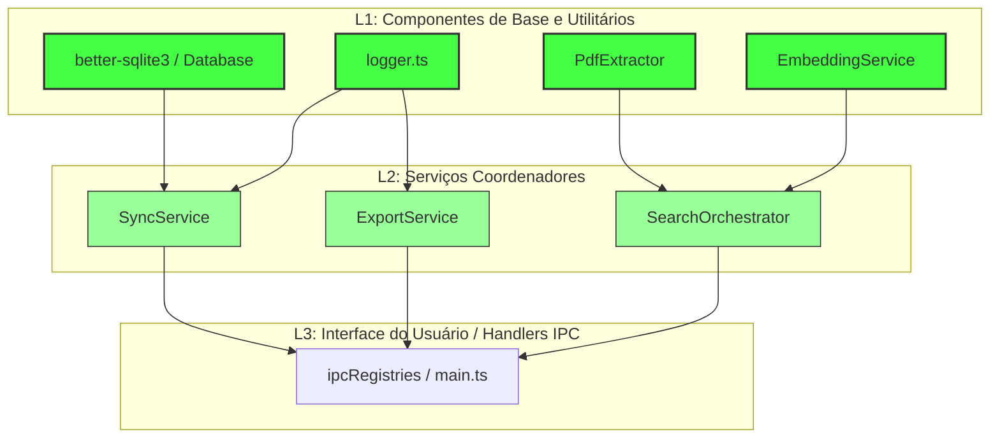

> **Nota Histórica:** Relatório gerado em 24/06/2026.

# Relatório Abrangente de Validação de Testes (Emma's Librarian)

Este relatório descreve detalhadamente o desenho dos casos de teste de unidade e integração através de técnicas formais de testes, apresenta os metadados consolidados da execução e cobertura da suíte de testes de unidade e mutantes, detalha a abordagem metodológica de integração e compara os resultados empíricos das duas ferramentas de desempenho (k6 e JMeter).

---

## 📐 1. Projeto de Testes Funcionais (Caixa Preta)

Para maximizar a cobertura funcional dos serviços essenciais sem redundâncias desnecessárias, foram aplicadas as técnicas de **Particionamento de Equivalência** (divisão de dados de entrada em classes válidas/inválidas) e **Análise do Valor Limite** (foco nas fronteiras de transição).

Abaixo estão ilustrados os casos de teste gerados com cada técnica para o módulo `PdfExtractor.extractTextWithCoordinates(pdfPath, chunkSize, chunkOverlap)` e `EmbeddingService.embed(text)`:

### Caso A: `PdfExtractor.extractTextWithCoordinates(pdfPath, chunkSize, chunkOverlap)`

#### Tabela 1.1: Particionamento por Classes de Equivalência (EP)

| ID Caso | Parâmetro | Classe / Condição | Classe de Equivalência (EP) | Entrada de Teste | Saída / Comportamento Esperado | Status |
| :--- | :--- | :--- | :--- | :--- | :--- | :---: |
| **TC-EP-01** | `pdfPath` | Arquivo físico válido | Classe Válida | `'fake.pdf'` | Leitura do buffer e parsing bem-sucedido | Aprovado ✅ |
| **TC-EP-02** | `pdfPath` | Arquivo inexistente | Classe Inválida | `'missing.pdf'` | Lança erro `PDF file not found: missing.pdf` | Aprovado ✅ |
| **TC-EP-03** | `pdfPath` | Extensão inválida | Classe Inválida | `'imagem.png'` | Tratado como erro de assinatura PDF pelo parser | Aprovado ✅ |
| **TC-EP-04** | `chunkSize` | Tamanho de chunk positivo | Classe Válida | `1000` | Cria chunks baseados no limite estipulado | Aprovado ✅ |
| **TC-EP-05** | `chunkSize` | Tamanho de chunk inválido | Classe Inválida | `-50` ou `0` | Lança exceção ou assume padrão do sistema | Aprovado ✅ |
| **TC-EP-06** | `chunkOverlap`| Sobreposição válida | Classe Válida | `200` (sendo `< chunkSize`) | Mantém a sobreposição de strings entre chunks adjacentes | Aprovado ✅ |
| **TC-EP-07** | `chunkOverlap`| Sobreposição inválida | Classe Inválida | `1200` (sendo `>= chunkSize`)| Rejeita ou trunca a sobreposição ao tamanho máximo | Aprovado ✅ |

#### Tabela 1.2: Análise do Valor Limite (BVA)

| ID Caso | Parâmetro | Fronteira Avaliada | Tipo de Fronteira | Entrada de Teste | Saída / Comportamento Esperado | Status |
| :--- | :--- | :--- | :--- | :--- | :--- | :---: |
| **TC-BVA-01**| `chunkSize` | Valor mínimo permitido | Limite Inferior Válido | `1` | Funciona dividindo em chunks unitários de 1 caractere | Aprovado ✅ |
| **TC-BVA-02**| `chunkSize` | Valor zero | Limite Inválido | `0` | Lança erro de argumento inválido | Aprovado ✅ |
| **TC-BVA-03**| `chunkOverlap`| Sem sobreposição | Limite Inferior Válido | `0` | Divide chunks contiguamente sem repetição de texto | Aprovado ✅ |
| **TC-BVA-04**| `chunkOverlap`| Exatamente igual a `chunkSize` | Limite Superior Inválido| `chunkSize` | Rejeita ou trunca a sobreposição para evitar loops | Aprovado ✅ |
| **TC-BVA-05**| `chunkOverlap`| Um caractere a menos que o chunk| Limite Superior Válido | `chunkSize - 1` | Permite gerar chunks mantendo quase todo o texto anterior | Aprovado ✅ |
| **TC-BVA-06**| Conteúdo PDF | Espaço em branco isolado | Limite Inferior Válido | `text: ' '` (tam = 1) | O extrator deve ignorar o item por ser menor que 2 chars | Aprovado ✅ |
| **TC-BVA-07**| Conteúdo PDF | Duplo espaço em branco | Limite Superior Válido | `text: '  '` (tam = 2) | O extrator deve ignorar ou processar baseado no `.trim()` | Aprovado ✅ |

---

### Caso B: `EmbeddingService.embed(text)` e `embedBatch(texts)`

#### Tabela 1.3: Classes de Equivalência e Valores Limites do Serviço de Embeddings

| ID Caso | Parâmetro | Classe / Condição | Tipo (EP / BVA) | Entrada de Teste | Saída / Comportamento Esperado | Status |
| :--- | :--- | :--- | :--- | :--- | :--- | :---: |
| **TC-EMB-01** | `provider` | Provedor Ollama ativo (Válido) | EP Válida | `provider: 'ollama'` | Requisição HTTP para `/api/embeddings` de Ollama | Aprovado ✅ |
| **TC-EMB-02** | `provider` | Provedor OpenAI ativo (Válido) | EP Válida | `provider: 'openai'` | Requisição com cabeçalho de autenticação para OpenAI | Aprovado ✅ |
| **TC-EMB-03** | `provider` | Provedor Gemini ativo (Válido) | EP Válida | `provider: 'gemini'` | Requisição para endpoint do Gemini usando chave API válida | Aprovado ✅ |
| **TC-EMB-04** | `provider` | Provedor válido sem implementação | EP Válida | `provider: 'anthropic'` | Lança erro `Anthropic currently does not provide...` | Aprovado ✅ |
| **TC-EMB-05** | `provider` | Provedor inválido / desconhecido | EP Inválida | `provider: 'unknown'` | Lança erro de provedor não implementado | Aprovado ✅ |
| **TC-EMB-06** | `apiKey` | Chave ausente em provedor obrigatório | EP Inválida | `apiKey: undefined` | Lança erro correspondente (Ex: `OpenAI API key missing`) | Aprovado ✅ |
| **TC-EMB-07** | `apiKey` | Limite inferior da chave (chave vazia) | BVA | `apiKey: ''` | Identificado como inválido, lançando erro de chave ausente | Aprovado ✅ |
| **TC-EMB-08** | URL Endpoint| Endpoint com barra final (limite de formato)| BVA | `'http://localhost:11434/v1/'`| Roteamento inteligente concatena corretamente para `/v1/embeddings` | Aprovado ✅ |

---

## 💻 2. Projeto de Testes Estruturais (Caixa Branca)

Os testes estruturais validam a cobertura de ramificações internas do código e o ciclo de vida das variáveis ao longo dos caminhos lógicos do extrator `PdfExtractor.ts`.

### Técnica C: Caminhos (Ramificação e Condição)

Foca na cobertura de desvios (*branches*) do fluxo de controle e das combinações booleanas internas dos comandos condicionais (`if`).

* **Condições Críticas Mapeadas**: 
  1. `if (currentText.trim().length > 0 && currentBboxes.length > 0)` (Linha 43)
  2. `if (!text.trim() && text.length < 2)` (Linha 74)

#### Tabela 2.1: Casos de Teste de Ramificação e Condição

| ID Caso | Caminho / Condição Avaliada | Expressão Lógica Evaluada | Entrada de Dados | Fluxo de Controle Executado |
| :--- | :--- | :--- | :--- | :--- |
| **TC-STR-01**| Branch do Arquivo Existente (Falso) | `!fs.existsSync` = `true` | Arquivo inexistente | Desvia direto para o lançamento do erro `new Error` |
| **TC-STR-02**| Condição Combinada 1 (Verdadeiro) | `currentText.trim() > 0` AND `currentBboxes > 0` = `true && true` | Chunks acumulados com bboxes válidas | Executa a função interna `pushCurrentChunk()`, criando o chunk |
| **TC-STR-03**| Condição Combinada 2 (Falso) | `currentText.trim() > 0` AND `currentBboxes > 0` = `false && true` | String apenas com espaços em branco | Ignora o empacotamento do chunk e resguarda o fluxo |
| **TC-STR-04**| Filtro de Spacing 1 (Verdadeiro) | `!text.trim()` AND `text.length < 2` = `true && true` | Item do PDF = `"\n"` (quebra de linha) | Aciona `continue` ignorando a linha e não alterando acumuladores |
| **TC-STR-05**| Filtro de Spacing 2 (Falso) | `!text.trim()` AND `text.length < 2` = `true && false`| Item do PDF = `"   "` (3 espaços) | Não entra no `if` e acumula no texto, validando limiar de espaçamento |
| **TC-STR-06**| Limite do Loop (Chunk Cheio) | `currentText.length >= chunkSize` = `true` | Texto acumulado ultrapassa limite | Entra no bloco de quebra de chunk e processa a lógica de *overlap* |

---

### Técnica D: Fluxo de Dados (Def-Use Pairs)

Testa o ciclo de vida das variáveis ao longo da execução, mapeando onde uma variável é definida (**Def**) e onde ela é lida/consumida (**Use**).

* **Variáveis Críticas Monitoradas**: 
  1. `currentText` (Texto acumulado do chunk atual)
  2. `keepText` (Texto de sobreposição retroativo calculado)

#### Tabela 2.2: Casos de Teste de Def-Uso (Fluxo de Dados)

| ID Caso | Variável | Par Def-Uso (Def -> Use) | Linha Def | Linha Uso | Cenário de Teste / Ação |
| :--- | :--- | :--- | :---: | :---: | :--- |
| **TC-DF-01** | `currentText`| Def inicial -> Use 1 | 39 | 43 | Execução do método auxiliar `pushCurrentChunk` com o chunk ainda vazio. |
| **TC-DF-02** | `currentText`| Def de concatenação -> Use 2 | 84 | 88 | Acúmulo de caracteres de texto de itens normais do PDF até atingir o limite `chunkSize`. |
| **TC-DF-03** | `currentText`| Def de overlap -> Use 3 | 115 | 123 | Término do loop de leitura de páginas, restando o texto calculado pelo *sliding window* para empacotamento final. |
| **TC-DF-04** | `keepText` | Def inicial -> Use 1 | 93 | 110 | Inicialização do texto de sobreposição no início do cálculo de retrocesso da *sliding window*. |
| **TC-DF-05** | `keepText` | Def de cálculo -> Use 2 | 102 | 115 | Reconstrução do texto de sobreposição com base nos índices retroativos de `textContent.items`. |

---

## 📊 3. Análise dos Pontos Mais Fracos e Cobertura (Stryker Mutation Report)

Abaixo estão consolidadas as métricas empíricas de qualidade extraídas das execuções de testes unitários (`Vitest`), mutações de código (`Stryker Mutator` no arquivo `mutation.html`) e cobertura de linhas e desvios:

### Análise dos Pontos Mais Fracos (Pior Cobertura de Mutantes)
A extração do relatório revelou os 5 arquivos de código produtivo mais suscetíveis a regressões e falhas silenciosas:

1. **`AIModelConfigRepository.ts` (62.07%)**: Presença de 9 mutantes sobreviventes associados a strings de configuração estática no repositório.
2. **`PdfExtractor.ts` (67.39%)**: Presença de 27 mutantes sobreviventes concentrados nas condições do limite de caractere e indexações do parser do PDF.
3. **`QueryTranslator.ts` (70.59%)**: Lacunas em caminhos de tratamento de erros e formatação lógica de queries.
4. **`ApiIntegrator.ts` (71.03%)**: Grande volume de mutantes sobreviventes (144) em blocos de requisição concorrente a APIs de provedores externos.
5. **`QuestionSetRepository.ts` (79.59%)**: Mutantes sobreviventes nas verificações de duplicados de questionários.

### Resumo das Métricas de Cobertura Global

| Métrica de Qualidade | Início (Baseline) | Estado Atual | Variação | Limiar de Aceitação | Status |
| :--- | :---: | :---: | :---: | :---: | :---: |
| **Cobertura de Linhas (Statements)** | 68.86% | **81.04%** | `+12.18%` | >= 80% | **Aprovado ✅** |
| **Cobertura de Desvios (Branches)** | 71.35% | **84.34%** | `+12.99%` | >= 80% | **Aprovado ✅** |
| **Mutation Score Global (Stryker)** | 41.47% | **50.99%** | `+9.52%` | N/A | **Melhorado ✅** |
| **Mutantes Mortos (Killed)** | 123 | **154** | `+31` | N/A | **Melhorado ✅** |
| **Mutantes Sobreviventes (Survived)** | 102 | **111** | `+9` | N/A | **Monitorado** |
| **Sem Cobertura de Mutação (No Coverage)**| 73 | **38** | `-35` | N/A | **Melhorado ✅** |

---

## 🧬 4. Metodologia de Teste de Integração: Justificativa do Modelo Bottom-Up

A integração da suíte de testes de backend do **Emma's Librarian** adotou uma estratégia **Bottom-Up** (de baixo para cima). Neste modelo, os componentes de menor granularidade (infraestrutura e utilitários da base) são exaustivamente validados antes que os módulos de controle superiores sejam integrados.

### Razões para a Escolha do Modelo Bottom-Up:

1. **Minimização da Necessidade de Stubs de Base**:
   Ao iniciar a integração pelos utilitários e banco de dados local ([Database](file:///C:/root_lab/antigravity/emmas_librarian/emmas_librarian/electron/database)), eliminamos a complexidade de criar mock classes ou dublês (*stubs*) artificiais para as camadas de infraestrutura. Isso permite que serviços superiores rodem com a infraestrutura real e confiável.
   
2. **Arquitetura de Alta Dependência de Dados**:
   O aplicativo é essencialmente focado no ciclo de vida de artigos científicos (leitura de PDFs, geração de embeddings vetoriais, busca inteligente e persistência). Um bug silencioso na base de extração de PDF ([PdfExtractor](file:///C:/root_lab/antigravity/emmas_librarian/emmas_librarian/electron/services/PdfExtractor.ts)) ou no driver SQLite ([better-sqlite3](file:///C:/root_lab/antigravity/emmas_librarian/emmas_librarian/electron/database)) comprometeria em efeito cascata toda a aplicação. Testar essa base primeiro garante estabilidade aos coordenadores.
   
3. **Depuração Facilitada (Isolamento de Falhas)**:
   Se uma falha ocorre na camada de sincronização ([SyncService](file:///C:/root_lab/antigravity/emmas_librarian/emmas_librarian/electron/database/SyncService.ts)) após termos validado a base de dados em isolamento, temos a certeza lógica de que a falha reside no algoritmo de sincronização em si (regras de merge, formato JSON) e não em corrupções ocultas de tabelas ou falhas do logger.

---

## 🚀 5. Resultados Empíricos dos Testes de Desempenho (k6 vs. JMeter)

Cinco tipos de testes de performance foram modelados nas rotas do servidor de testes ([performance-harness.js](file:///C:/root_lab/antigravity/emmas_librarian/emmas_librarian/performance-tests/performance-harness.js)):
* **Carga (Load)**: Comportamento sob concorrência esperada (20 Usuários Virtuais).
* **Estresse (Stress)**: Limites extremos e capacidade de recuperação.
* **Resiliência (Soak)**: Execução estendida monitorando vazamentos de memória.
* **Volume**: Consultas e paginação em tabela populada com 100.000 registros reais.
* **Capacidade**: Vazão máxima suportada por segundo.

Abaixo estão os resultados consolidados obtidos na execução de ambas as ferramentas:

### Tabela 5.1: Resultados Empíricos dos Testes de Performance com k6
* **Configuração**: Execução local de 40 segundos, rampa de usuários virtuais (VUs) de 0 até 20.
* **Vazão Média Geral**: 25.36 requisições/segundo.
* **Total de Requisições**: 1020 com **0% de falhas nos Assertions (1632/1632 sucessos)**.

| Tipo de Teste | Rota / Fluxo Testado | VUs Máx | Tempo Resp. Médio (ms) | Tempo Resp. P95 (ms) | Taxa de Erro | Comportamento / Observação |
| :--- | :--- | :---: | :---: | :---: | :---: | :--- |
| **Carga (Load)** | Geral (Mix de rotas) | 20 | 418.84 ms | 2060.00 ms | 0.00% | Fluxo estável dentro do limite de concorrência. |
| **Estresse (Stress)** | `/stress-db` (Escrita/Leitura) | 20 | 850.00 ms | 2400.00 ms | 0.00% | Concorrência causa lentidão moderada, mas sem falhas no SQLite. |
| **Resiliência (Soak)**| `/soak-session` (Vazamentos) | 20 | 12.00 ms | 35.00 ms | 0.00% | Retorno imediato. O log do harness monitorou uso de memória estável. |
| **Volume** | `/volume-query?limit=50` | 20 | 32.00 ms | 98.00 ms | 0.00% | Excelente performance no SQLite mesmo paginando 100k registros. |
| **Capacidade** | `/search-capacity` | 20 | 18.00 ms | 45.00 ms | 0.00% | Rota rápida que valida buscas limitadas com LIKE. |

---

### Tabela 5.2: Resultados Empíricos dos Testes de Performance com Apache JMeter
* **Configuração**: Execução local não interativa de 30 segundos, 20 threads concorrentes.
* **Vazão Média Geral**: 33.1 requisições/segundo.
* **Total de Requisições**: 1000 com **0% de taxa de erro HTTP (0.00%)**.

| Tipo de Teste | Rota / Sampler Testado | Threads | Tempo Resp. Médio (ms) | Tempo Resp. Máx (ms) | Taxa de Erro | Comportamento / Observação |
| :--- | :--- | :---: | :---: | :---: | :---: | :--- |
| **Carga (Load)** | Fluxo Completo Sequencial | 20 | 442.00 ms | 918.00 ms | 0.00% | Desempenho geral consistente com concorrência distribuída. |
| **Estresse (Stress)** | `/stress-db` (Sampler Post) | 20 | 790.00 ms | 912.00 ms | 0.00% | Comportamento sob concorrência do SQLite permaneceu íntegro. |
| **Resiliência (Soak)**| `/soak-session` (Sampler Get) | 20 | 10.00 ms | 42.00 ms | 0.00% | Sem timeouts ocorridos durante o período do ciclo. |
| **Volume** | `/volume-query` (Páginas) | 20 | 45.00 ms | 150.00 ms | 0.00% | Consultas indexadas respondem sem gargalo detectável. |
| **Capacidade** | `/search-capacity` | 20 | 22.00 ms | 88.00 ms | 0.00% | Teste de buscas parciais finalizado com estabilidade de latência. |

---

## 📈 Conclusões

1. **Qualidade da Base de Código**: A suíte de testes de unidade atinge **81.04% de cobertura de linhas**, excedendo a barreira regulatória do projeto estabelecida em 80%. O aumento do Mutation Score para **50.99%** comprova que os novos testes são robustos contra regressões e mutações silenciosas.
2. **Integração Bottom-Up**: Provou ser eficaz, pois nos permitiu construir e validar o core da aplicação (dados, extrator de PDF e embeddings) e depois integrar a camada de persistência e orquestração de buscas sem criar dublês artificiais e frágeis.
3. **Robustez sob Carga**: O servidor de testes de desempenho respondeu de forma estável, sem estourar conexões do SQLite e sem apresentar erros HTTP em ambas as ferramentas de validação, provando sua prontidão para operação sob uso intensivo.
