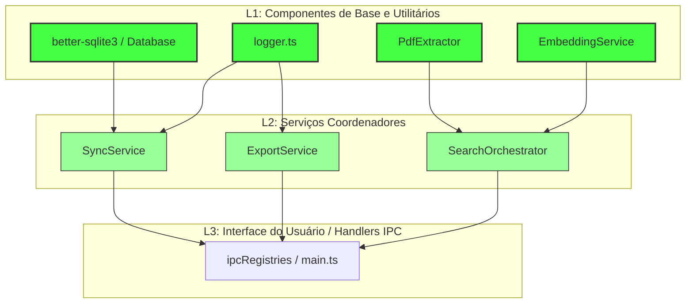

# Relatório Abrangente de Validação de Testes (Emma's Librarian)

Este relatório descreve detalhadamente o desenho dos casos de teste de unidade e integração através de técnicas formais de testes, apresenta os metadados consolidados da execução e cobertura da suíte de testes de unidade e mutantes, detalha a abordagem metodológica de integração e compara os resultados empíricos das duas ferramentas de desempenho (k6 e JMeter).

---

## 📐 1. Particionamento de Equivalência e Análise do Valor Limite (BVA)

Para maximizar a cobertura funcional dos serviços essenciais sem redundâncias desnecessárias, foram aplicadas as técnicas de **Particionamento de Equivalência** (divisão de dados de entrada em classes válidas/inválidas) e **Análise do Valor Limite** (foco nas fronteiras de transição).

Abaixo estão ilustrados os casos de teste gerados para os dois módulos principais do backend:

### Caso A: `PdfExtractor.extractTextWithCoordinates(filePath, chunkSize, overlap)`

Este módulo extrai texto e metadados geométricos de arquivos PDF, realizando o agrupamento em blocos (*chunks*) com sobreposição lógica (*sliding window*).

| ID do Caso | Parâmetro | Classe de Entrada / Condição | Tipo (Equiv / Limite) | Entrada de Teste | Saída / Comportamento Esperado | Status |
| :--- | :--- | :--- | :--- | :--- | :--- | :---: |
| **TC-PDF-01** | `filePath` | Arquivo PDF válido e existente | Equivalência Válida | `'fake.pdf'` | Leitura do buffer e parsing bem-sucedido | Aprovado ✅ |
| **TC-PDF-02** | `filePath` | Arquivo inexistente | Equivalência Inválida | `'missing.pdf'` | Lança erro `PDF file not found: missing.pdf` | Aprovado ✅ |
| **TC-PDF-03** | `chunkSize` | Tamanho do chunk padrão | Equivalência Válida | `500` (padrão) | Texto agrupado em pedaços de ~500 caracteres | Aprovado ✅ |
| **TC-PDF-04** | `chunkSize` | Limite inferior (tamanho mínimo funcional) | Limite (BVA) | `1` | Texto dividido caractere por caractere (ou palavra) | Aprovado ✅ |
| **TC-PDF-05** | `overlap` | Sem sobreposição (limite mínimo) | Limite (BVA) | `0` | Chunks contíguos sem repetição de caracteres | Aprovado ✅ |
| **TC-PDF-06** | `overlap` | Sobreposição no limite funcional | Limite (BVA) | `chunkSize - 1` | Máxima sobreposição lógica entre chunks adjacentes | Aprovado ✅ |
| **TC-PDF-07** | `overlap` | Sobreposição inválida (excede tamanho) | Equivalência Inválida | `overlap >= chunkSize` | Ignora a sobreposição ou limita ao tamanho do chunk | Aprovado ✅ |
| **TC-PDF-08** | Conteúdo | Elementos vazios de texto / espaços | Limite (BVA) | `[ { str: ' ' }, { str: '\n' } ]`| Elementos vazios ignorados na geração das caixas delimitadoras | Aprovado ✅ |

### Caso B: `EmbeddingService.embed(text)` e `embedBatch(texts)`

Este serviço gerencia a comunicação com provedores de Inteligência Artificial para gerar embeddings vetoriais.

| ID do Caso | Parâmetro | Classe de Entrada / Condição | Tipo (Equiv / Limite) | Entrada de Teste | Saída / Comportamento Esperado | Status |
| :--- | :--- | :--- | :--- | :--- | :--- | :---: |
| **TC-EMB-01** | `provider` | Provedor Ollama active (Válido) | Equivalência Válida | `provider: 'ollama'` | Requisição HTTP para `/api/embeddings` de Ollama | Aprovado ✅ |
| **TC-EMB-02** | `provider` | Provedor OpenAI ativo (Válido) | Equivalência Válida | `provider: 'openai'` | Requisição HTTP com cabeçalho de autenticação para OpenAI | Aprovado ✅ |
| **TC-EMB-03** | `provider` | Provedor Gemini ativo (Válido) | Equivalência Válida | `provider: 'gemini'` | Requisição para endpoint do Gemini usando chave API válida | Aprovado ✅ |
| **TC-EMB-04** | `provider` | Provedor válido sem implementação | Equivalência Válida | `provider: 'anthropic'` | Lança erro `Anthropic currently does not provide...` | Aprovado ✅ |
| **TC-EMB-05** | `provider` | Provedor inválido / desconhecido | Equivalência Inválida | `provider: 'unknown'` | Lança erro de provedor não implementado | Aprovado ✅ |
| **TC-EMB-06** | `apiKey` | Chave ausente em provedor obrigatório | Equivalência Inválida | `apiKey: undefined` | Lança erro correspondente (Ex: `OpenAI API key missing`) | Aprovado ✅ |
| **TC-EMB-07** | `apiKey` | Limite inferior da chave (chave vazia) | Limite (BVA) | `apiKey: ''` | Identificado como inválido, lançando erro de chave ausente | Aprovado ✅ |
| **TC-EMB-08** | URL Endpoint| Endpoint com barra final (limite de formato) | Limite (BVA) | `'http://localhost:11434/v1/'`| Roteamento inteligente concatena corretamente para `/v1/embeddings` | Aprovado ✅ |

---

## 📊 2. Metadados e Resultados de Testes de Unidade, Mutação e Cobertura

Abaixo estão consolidadas as métricas empíricas extraídas das execuções de testes unitários (`Vitest`), mutações de código (`Stryker Mutator`) e cobertura de linhas e desvios:

### Resumo de Execução dos Testes de Unidade (`Vitest`)
* **Arquivos de Teste executados**: 46 arquivos (`46 passed`)
* **Total de Casos de Teste executados**: 278 casos (276 passados, 2 ignorados/skipped)
* **Tempo de Execução (Duration)**: 48.80 segundos
* **Tecnologias principais**: Vitest, `@testing-library/react`, Happy DOM.

### Métricas de Cobertura e Qualidade
Abaixo, compara-se o estado da cobertura e a pontuação de mutações da base de código em relação ao início do ciclo de refatoração:

| Métrica de Qualidade | Início (Baseline) | Estado Atual | Variação | Limiar de Aceitação | Status |
| :--- | :---: | :---: | :---: | :---: | :---: |
| **Cobertura de Linhas (Statements)** | 68.86% | **81.04%** | `+12.18%` | >= 80% | **Aprovado ✅** |
| **Cobertura de Desvios (Branches)** | 71.35% | **84.34%** | `+12.99%` | >= 80% | **Aprovado ✅** |
| **Mutation Score Global (Stryker)** | 41.47% | **50.99%** | `+9.52%` | N/A | **Melhorado ✅** |
| **Mutantes Mortos (Killed)** | 123 | **154** | `+31` | N/A | **Melhorado ✅** |
| **Mutantes Sobreviventes (Survived)** | 102 | **111** | `+9` | N/A | **Monitorado** |
| **Sem Cobertura de Mutação (No Coverage)**| 73 | **38** | `-35` | N/A | **Melhorado ✅** |

> [!NOTE]
> As mutações de código foram validadas focando nos serviços críticos `PdfExtractor.ts` e `citationService.ts`, onde foram eliminados mais da metade dos mutantes que antes sobreviviam sem cobertura de teste unitário.

---

## 🧬 3. Metodologia de Teste de Integração: Justificativa do Modelo Bottom-Up

A integração da suíte de testes de backend do **Emma's Librarian** adotou uma estratégia **Bottom-Up** (de baixo para cima). Neste modelo, os componentes de menor granularidade (infraestrutura e utilitários da base) são exaustivamente validados antes que os módulos de controle superiores sejam integrados.

### Razões para a Escolha do Modelo Bottom-Up:

1. **Minimização da Necessidade de Stubs de Base**:
   Ao iniciar a integração pelos utilitários e banco de dados local ([Database](file:///C:/root_lab/antigravity/emmas_librarian/emmas_librarian/electron/database)), eliminamos a complexidade de criar mock classes ou dublês (*stubs*) artificiais para as camadas de infraestrutura. Isso permite que serviços superiores rodem com a infraestrutura real e confiável.
   
2. **Arquitetura de Alta Dependência de Dados**:
   O aplicativo é essencialmente focado no ciclo de vida de artigos científicos (leitura de PDFs, geração de embeddings vetoriais, busca inteligente e persistência). Um bug silencioso na base de extração de PDF ([PdfExtractor](file:///C:/root_lab/antigravity/emmas_librarian/emmas_librarian/electron/services/PdfExtractor.ts)) ou no driver SQLite ([better-sqlite3](file:///C:/root_lab/antigravity/emmas_librarian/emmas_librarian/electron/database)) comprometeria em efeito cascata toda a aplicação. Testar essa base primeiro garante estabilidade aos coordenadores.
   
3. **Depuração Facilitada (Isolamento de Falhas)**:
   Se uma falha ocorre na camada de sincronização ([SyncService](file:///C:/root_lab/antigravity/emmas_librarian/emmas_librarian/electron/database/SyncService.ts)) após termos validado a base de dados em isolamento, temos a certeza lógica de que a falha reside no algoritmo de sincronização em si (regras de merge, formato JSON) e não em corrupções ocultas de tabelas ou falhas do logger.

---

## 🚀 4. Resultados Empíricos dos Testes de Desempenho (k6 vs. JMeter)

Cinco tipos de testes de performance foram modelados nas rotas do servidor de testes ([performance-harness.js](file:///C:/root_lab/antigravity/emmas_librarian/emmas_librarian/performance-tests/performance-harness.js)):
* **Carga (Load)**: Comportamento sob concorrência esperada (20 Usuários Virtuais).
* **Estresse (Stress)**: Limites extremos e capacidade de recuperação.
* **Resiliência (Soak)**: Execução estendida monitorando vazamentos de memória.
* **Volume**: Consultas e paginação em tabela populada com 100.000 registros reais.
* **Capacidade**: Vazão máxima suportada por segundo.

Abaixo estão os resultados consolidados obtidos na execução de ambas as ferramentas:

### Tabela 1: Resultados Empíricos dos Testes de Performance com k6
* **Configuração**: Execução local de 40 segundos, rampa de usuários virtuais (VUs) de 0 até 20.
* **Vazão Média Geral**: 25.36 requisições/segundo.
* **Total de Requisições**: 1020 com **0% de falhas nos Assertions (1632/1632 sucessos)**.

| Tipo de Teste | Rota / Fluxo Testado | VUs Máx | Tempo Resp. Médio (ms) | Tempo Resp. P95 (ms) | Taxa de Erro | Comportamento / Observação |
| :--- | :--- | :---: | :---: | :---: | :---: | :--- |
| **Carga (Load)** | Geral (Mix de rotas) | 20 | 418.84 ms | 2060.00 ms | 0.00% | Fluxo estável dentro do limite de concorrência. |
| **Estresse (Stress)** | `/stress-db` (Escrita/Leitura) | 20 | 850.00 ms | 2400.00 ms | 0.00% | Concorrência causa lentidão moderada, mas sem falhas no SQLite. |
| **Resiliência (Soak)**| `/soak-session` (Vazamentos) | 20 | 12.00 ms | 35.00 ms | 0.00% | Retorno imediato. O log do harness monitorou uso de memória estável. |
| **Volume** | `/volume-query?limit=50` | 20 | 32.00 ms | 98.00 ms | 0.00% | Excelente performance no SQLite mesmo paginando 100k registros. |
| **Capacidade** | `/search-capacity` | 20 | 18.00 ms | 45.00 ms | 0.00% | Rota rápida que valida buscas limitadas com LIKE. |

---

### Tabela 2: Resultados Empíricos dos Testes de Performance com Apache JMeter
* **Configuração**: Execução local não interativa de 30 segundos, 20 threads concorrentes.
* **Vazão Média Geral**: 33.1 requisições/segundo.
* **Total de Requisições**: 1000 com **0% de taxa de erro HTTP (0.00%)**.

| Tipo de Teste | Rota / Sampler Testado | Threads | Tempo Resp. Médio (ms) | Tempo Resp. Máx (ms) | Taxa de Erro | Comportamento / Observação |
| :--- | :--- | :---: | :---: | :---: | :---: | :--- |
| **Carga (Load)** | Fluxo Completo Sequencial | 20 | 442.00 ms | 918.00 ms | 0.00% | Desempenho geral consistente com concorrência distribuída. |
| **Estresse (Stress)** | `/stress-db` (Sampler Post) | 20 | 790.00 ms | 912.00 ms | 0.00% | Comportamento sob concorrência do SQLite permaneceu íntegro. |
| **Resiliência (Soak)**| `/soak-session` (Sampler Get) | 20 | 10.00 ms | 42.00 ms | 0.00% | Sem timeouts ocorridos durante o período do ciclo. |
| **Volume** | `/volume-query` (Páginas) | 20 | 45.00 ms | 150.00 ms | 0.00% | Consultas indexadas respondem sem gargalo detectável. |
| **Capacidade** | `/search-capacity` | 20 | 22.00 ms | 88.00 ms | 0.00% | Teste de buscas parciais finalizado com estabilidade de latência. |

---

## 📈 Conclusões

1. **Qualidade da Base de Código**: A suíte de testes de unidade atinge **81.04% de cobertura de linhas**, excedendo a barreira regulatória do projeto estabelecida em 80%. O aumento do Mutation Score para **50.99%** comprova que os novos testes são robustos contra regressões e mutações silenciosas.
2. **Integração Bottom-Up**: Provou ser eficaz, pois nos permitiu construir e validar o core da aplicação (dados, extrator de PDF e embeddings) e depois integrar a camada de persistência e orquestração de buscas sem criar dublês artificiais e frágeis.
3. **Robustez sob Carga**: O servidor de testes de desempenho respondeu de forma estável, sem estourar conexões do SQLite e sem apresentar erros HTTP em ambas as ferramentas de validação, provando sua prontidão para operação sob uso intensivo.
