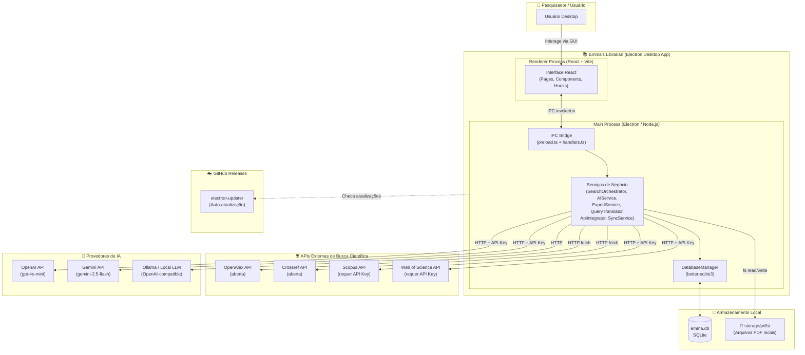

# Visão 1 — Visão Geral de Camadas (System Context)

> Macro-arquitetura do Emma's Librarian: como o usuário interage com o sistema e quais sistemas externos são consumidos.

## Diagrama

## Descrição

| Camada | Responsabilidade |
|---|---|
| **Usuário** | Pesquisador que interage com a interface desktop |
| **Renderer Process** | Frontend React com páginas, componentes e serviços de comunicação IPC |
| **Main Process** | Backend Electron com serviços de negócio, orquestração e acesso a dados |
| **APIs de Busca** | Fontes externas de metadados acadêmicos (2 abertas + 2 com API key) |
| **Provedores de IA** | LLMs para resumo, extração massiva e extração de metadados de PDF |
| **Armazenamento Local** | SQLite para dados estruturados + filesystem para PDFs |
| **GitHub Releases** | Canal de distribuição e auto-atualização via electron-updater |
