# Visão 2 — Processos Electron (Main Process vs Renderer)

> Divisão arquitetural fundamental entre Main Process (Electron/Node.js) e Renderer Process (React/Vite), incluindo a ponte IPC.

## Diagrama

```mermaid
flowchart LR
    subgraph RendererProcess["🖥️ Renderer Process (React + Vite)"]
        direction TB
        MainTSX["main.tsx\n(Entry Point, HashRouter, Routes)"]
        Layout["Layout.tsx\n(Sidebar, Header, Navegação)"]
        Pages["Pages\n(Dashboard, Search,\nProjectDetails, ArticleReader,\nNewProject, Settings, TermsOfUse)"]
        Components["Components\n(QueryBuilder, ArticleTable,\nModais, DiarySection, etc.)"]
        ApiService["services/api.ts\n(Abstração IPC → Promises)"]
        CitService["services/citationService.ts"]
        Types["types/index.ts\n(Interfaces compartilhadas)"]
        Utils["utils/pdfTextSearch.ts"]

        MainTSX --> Layout --> Pages
        Pages --> Components
        Pages --> ApiService
        Components --> ApiService
        Pages --> CitService
        Pages --> Utils
    end

    subgraph Bridge["🔗 IPC Bridge"]
        direction TB
        PreloadTS["preload.ts\n(contextBridge.exposeInMainWorld)"]
        ElectronAPI["window.electronAPI\n• invoke(channel, ...args)\n• on(channel, callback)\n• getPathForFile(file)"]
        PreloadTS --> ElectronAPI
    end

    subgraph MainProcessNode["⚙️ Main Process (Electron / Node.js)"]
        direction TB
        ElectronMain["main.ts\n• createWindow()\n• CSP headers\n• autoUpdater\n• Error handling"]
        HandlersTS["ipc/handlers.ts\n• setupIpcHandlers()\n• 60 ipcMain.handle() registros"]
        
        subgraph BackendServices["Serviços"]
            DBManager["DatabaseManager"]
            SearchOrch["SearchOrchestrator"]
            QTranslator["QueryTranslator"]
            ApiInteg["ApiIntegrator"]
            AISvc["AIService"]
            ExportSvc["ExportService"]
            SyncSvc["SyncService"]
        end

        ElectronMain -->|"setupIpcHandlers()"| HandlersTS
        HandlersTS --> BackendServices
    end

    ApiService <-->|"ipcRenderer.invoke(channel, args)"| PreloadTS
    PreloadTS <-->|"ipcMain.handle(channel, handler)"| HandlersTS

    style Bridge fill:#fef3c7,stroke:#f59e0b,stroke-width:2px
    style RendererProcess fill:#dbeafe,stroke:#3b82f6,stroke-width:2px
    style MainProcessNode fill:#dcfce7,stroke:#22c55e,stroke-width:2px
```

## Fluxo de Comunicação

1. **Frontend** chama `window.electronAPI.invoke(channel, ...args)` via `api.ts`
2. **Preload** (`contextBridge`) encaminha a chamada como `ipcRenderer.invoke()`
3. **Main Process** recebe via `ipcMain.handle(channel, handler)` em `handlers.ts`
4. **Handler** delega para o serviço apropriado e retorna o resultado
5. **Resultado** percorre o caminho inverso como resolução da Promise

## Segurança

| Configuração | Valor | Motivo |
|---|---|---|
| `nodeIntegration` | `false` | Impede acesso direto a APIs Node no renderer |
| `contextIsolation` | `true` | Isola o contexto do preload do contexto da página |
| CSP Headers | Configurado por env | Restringe origens de scripts, estilos, conexões |
