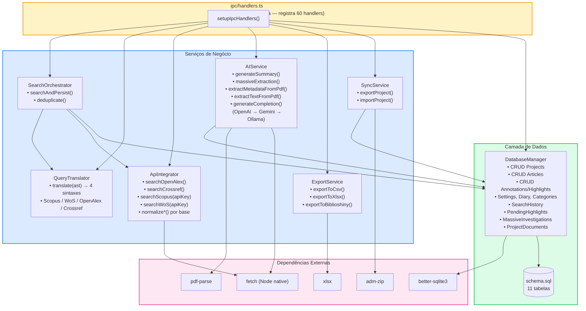

# Visão 3 — Componentes do Backend (Electron Services)

> Mapa de todos os serviços do processo principal e suas interdependências.

## Diagrama de Dependências

## Responsabilidades dos Serviços

| Serviço | Responsabilidade | Dependências Diretas |
|---|---|---|
| **SearchOrchestrator** | Coordena busca multi-base, deduplicação e persistência | QueryTranslator, ApiIntegrator, DatabaseManager |
| **QueryTranslator** | Converte AST visual → sintaxe nativa (4 bases) | Nenhuma |
| **ApiIntegrator** | HTTP para APIs científicas + normalização de resultados | fetch (Node) |
| **AIService** | Extração de texto PDF + chamadas a LLMs + persistência | DatabaseManager, pdf-parse, fetch |
| **ExportService** | Gera CSV/XLSX/Biblioshiny a partir de artigos | xlsx |
| **SyncService** | Exporta/importa projetos como .zip | DatabaseManager, adm-zip |
| **DatabaseManager** | CRUD completo em 11 tabelas SQLite | better-sqlite3 |
