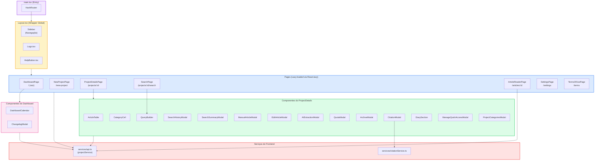

# Visão 4 — Componentes do Frontend (React Pages & Components)

> Hierarquia de páginas e componentes React, mostrando composição e roteamento.

## Árvore de Roteamento e Composição

## Resumo

| Página | Rota | Componentes Principais |
|---|---|---|
| DashboardPage | `/` | DashboardCalendar, ChangelogModal |
| NewProjectPage | `/new-project` | Formulário simples |
| ProjectDetailsPage | `/projects/:id` | ArticleTable, QueryBuilder, 10+ modais |
| SearchPage | `/projects/:id/search` | QueryBuilder |
| ArticleReaderPage | `/articles/:id` | PdfHighlighter (react-pdf-highlighter), anotações inline |
| SettingsPage | `/settings` | Configurações de API keys, tema, versão |
| TermsOfUsePage | `/terms` | Conteúdo estático |

### Padrão de comunicação

Todos os componentes que precisam de dados usam `projectService` de `api.ts`, que encapsula chamadas `window.electronAPI.invoke()` em Promises tipadas.
