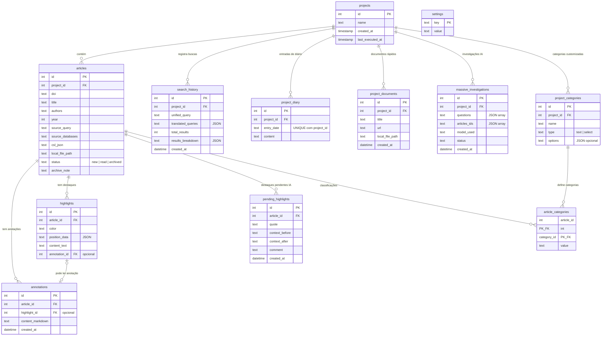

# Visão 5 — Modelo de Dados (ER Diagram — SQLite)

> Esquema relacional completo do banco de dados SQLite (`emma.db`), definido em `schema.sql`.

## Diagrama ER

## Tabelas e Relacionamentos

| Tabela | Registros | Relacionamento Principal |
|---|---|---|
| `projects` | Projetos de pesquisa | Raiz do modelo |
| `articles` | Artigos acadêmicos | Pertence a `projects` |
| `annotations` | Anotações em Markdown | Pertence a `articles`, opcionalmente a `highlights` |
| `highlights` | Destaques visuais no PDF | Pertence a `articles` |
| `search_history` | Histórico de buscas | Pertence a `projects` |
| `settings` | Configurações key-value | Global (sem FK) |
| `project_diary` | Diário de pesquisa | Pertence a `projects` |
| `pending_highlights` | Destaques sugeridos pela IA | Pertence a `articles` |
| `project_documents` | Documentos de acesso rápido | Pertence a `projects` |
| `massive_investigations` | Histórico de extrações IA | Pertence a `projects` |
| `project_categories` | Categorias customizadas do projeto | Pertence a `projects` |
| `article_categories` | Classificação de artigos | Junction table: `articles` ↔ `project_categories` |
