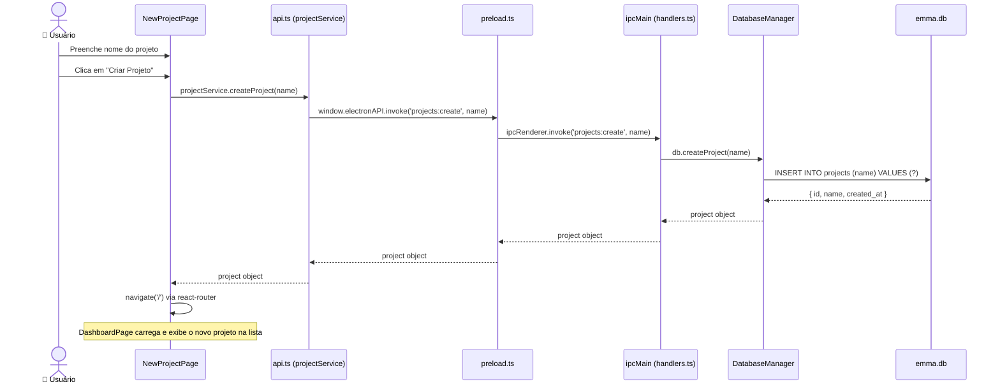

# Visão 6 — Caso de Uso: Criação de um Projeto

> Diagrama de sequência mostrando o fluxo completo de criação de um novo projeto, desde o formulário até a persistência.

## Diagrama de Sequência

## Camadas Envolvidas

| Camada | Arquivo | Ação |
|---|---|---|
| UI | `NewProjectPage.tsx` | Formulário com campo de nome |
| Serviço Frontend | `api.ts` → `projectService.createProject()` | Encapsula IPC em Promise |
| IPC Bridge | `preload.ts` | `contextBridge` encaminha invoke |
| Handler | `handlers.ts` → `PROJECTS_CREATE` | Delega para DatabaseManager |
| Persistência | `DatabaseManager.createProject()` | INSERT no SQLite |
