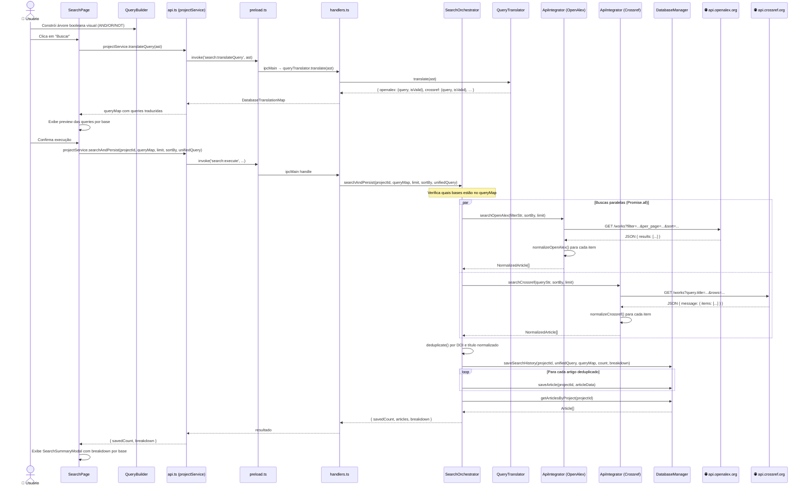

# Visão 7 — Caso de Uso: Busca em Bases SEM Chave de API (OpenAlex, Crossref)

> Diagrama de sequência do fluxo de busca nas bases abertas que não exigem autenticação.

## Diagrama de Sequência

## Pontos-Chave

- **OpenAlex** e **Crossref** não requerem autenticação
- As buscas são **paralelas** via `Promise.all`
- Cada base tem seu próprio método de normalização (`normalizeOpenAlex`, `normalizeCrossref`)
- A **deduplicação** é feita por DOI (exato) e título (case-insensitive, trimmed)
- O **histórico** de busca é registrado antes da persistência dos artigos
