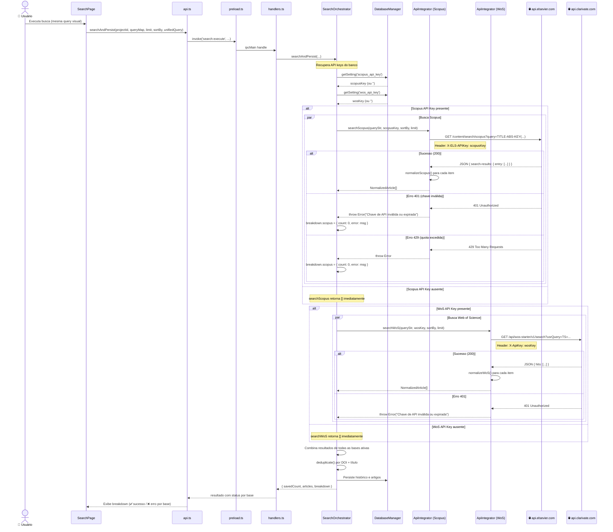

# Visão 8 — Caso de Uso: Busca em Bases COM Chave de API (Scopus, Web of Science)

> Diagrama de sequência do fluxo de busca nas bases que exigem autenticação, destacando as diferenças em relação às bases abertas.

## Diagrama de Sequência

## Diferenças em Relação à Busca Aberta

| Aspecto | Bases Abertas (OpenAlex, Crossref) | Bases com API Key (Scopus, WoS) |
|---|---|---|
| **Autenticação** | Nenhuma | Header HTTP com API key |
| **Configuração** | Automática | Requer configuração em Settings |
| **Sem chave** | Sempre executa | Retorna `[]` silenciosamente |
| **Tratamento de erro** | Genérico | Específico (401, 429) |
| **Sintaxe de query** | `filter=` / `query.title=` | `TITLE-ABS-KEY()` / `TS=` |
| **Limite por request** | 200 (OA) / 1000 (CR) | 200 (Scopus) / 100 (WoS) |
