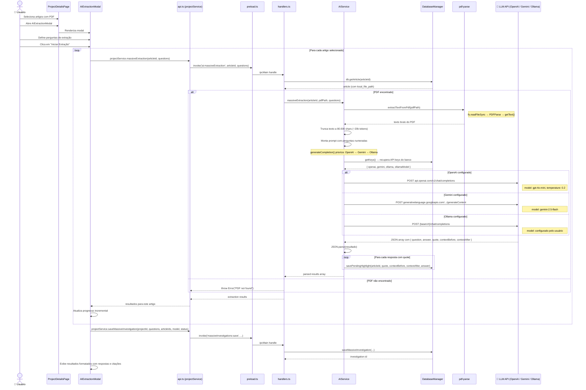

# Visão 9 — Caso de Uso: Extração Massiva de IA (Investigação em Massa)

> Diagrama de sequência do fluxo de extração de dados estruturados via IA para múltiplos artigos.

## Diagrama de Sequência

## Detalhes Técnicos

| Aspecto | Detalhe |
|---|---|
| **Extração de texto** | `pdf-parse` lê o buffer e extrai texto plano |
| **Limite de contexto** | Truncado em 80.000 chars (~20k tokens) |
| **Prioridade de LLM** | OpenAI → Gemini → Ollama (primeiro configurado) |
| **Formato de resposta** | JSON array com `question`, `answer`, `quote`, `contextBefore`, `contextAfter` |
| **Pending Highlights** | Citações extraídas são salvas como destaques pendentes para ancoragem visual no PDF |
| **Histórico** | Cada execução é registrada em `massive_investigations` |
