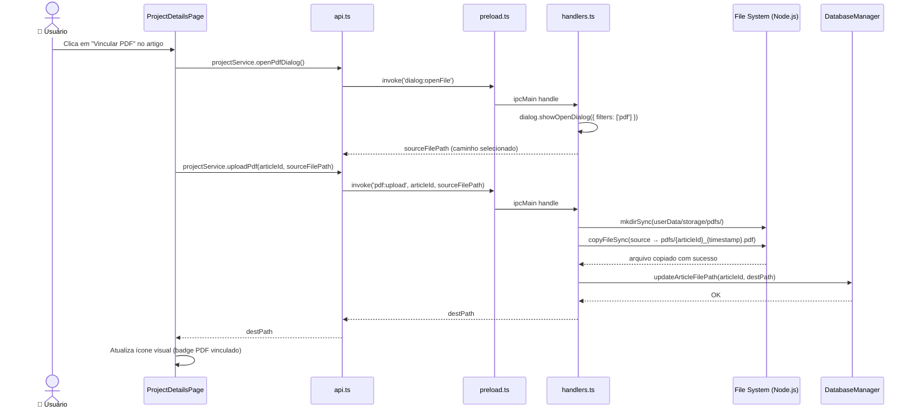
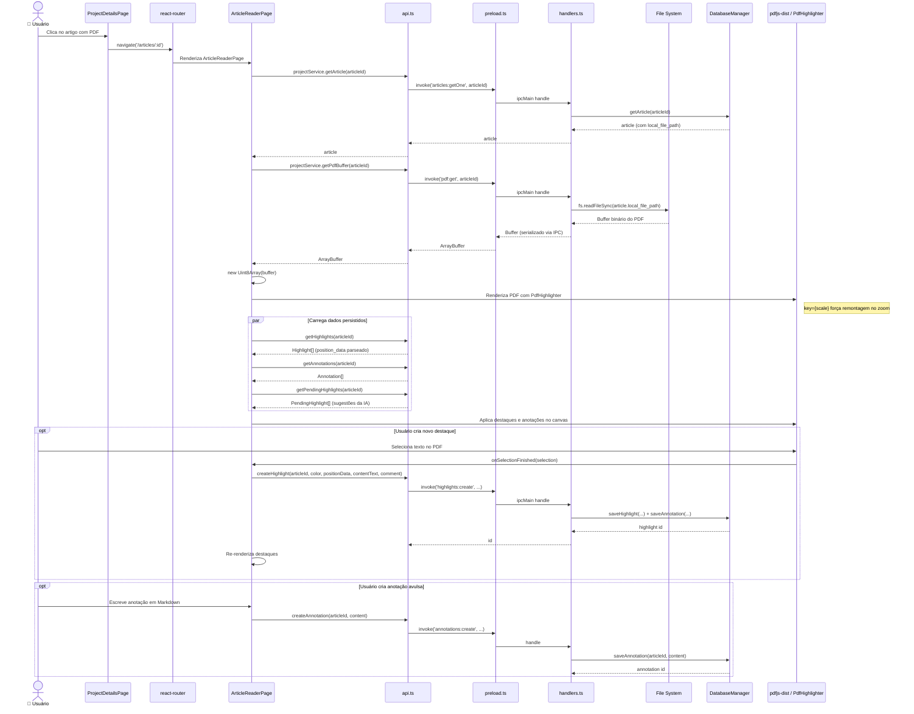

# Visão 10 — Caso de Uso: Adição e Leitura de PDF

> Dois fluxos complementares: (a) vincular um PDF a um artigo e (b) abrir e ler o PDF no leitor integrado.

## Fluxo A — Adição / Upload de PDF

## Fluxo B — Leitura de PDF no Leitor Integrado

## Detalhes Técnicos

| Aspecto | Detalhe |
|---|---|
| **Armazenamento de PDFs** | Copiados para `userData/storage/pdfs/{articleId}_{timestamp}.pdf` |
| **Transferência IPC** | Buffer binário serializado, reconstruído como `Uint8Array` no renderer |
| **Renderização** | `react-pdf-highlighter` + `pdfjs-dist` com worker local |
| **Zoom reativo** | `key={scale}` no `PdfHighlighter` força remontagem do React |
| **Destaques pendentes** | Criados pela IA na extração massiva, exibidos como sugestões |
| **Desvinculação** | `pdf:unlink` apaga arquivo físico + limpa `local_file_path` (preserva anotações) |
