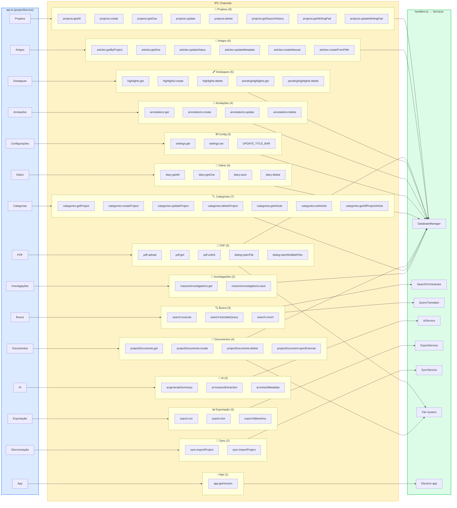

# Visão 11 — Mapa de Canais IPC (IPC Channel Map)

> Catálogo completo de todos os canais IPC registrados, agrupados por domínio funcional.

## Diagrama

## Resumo Quantitativo

| Domínio | Canais | Serviço Backend |
|---|---|---|
| Projetos | 8 | DatabaseManager |
| Busca | 3 | SearchOrchestrator, QueryTranslator |
| Artigos | 6 | DatabaseManager |
| PDF / Diálogos | 5 | DatabaseManager, File System |
| Destaques | 5 | DatabaseManager |
| Anotações | 4 | DatabaseManager |
| IA | 3 | AIService |
| Exportação | 3 | ExportService |
| Configurações | 3 | DatabaseManager, Electron |
| Diário | 4 | DatabaseManager |
| Documentos | 4 | DatabaseManager, File System |
| Categorias | 7 | DatabaseManager |
| Investigações | 2 | DatabaseManager |
| Sincronização | 2 | SyncService |
| App | 1 | Electron |
| **Total** | **60** | — |
