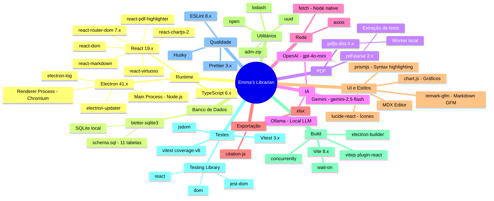

# Visão 12 — Stack Tecnológico (Tech Stack Map)

> Ecossistema de dependências externas e bibliotecas-chave do projeto.

## Diagrama

## Tabela de Dependências Principais

| Categoria | Biblioteca | Versão | Finalidade |
|---|---|---|---|
| **Core** | Electron | 41.7.1 | Desktop app framework |
| **Core** | React | 19.2.6 | UI framework |
| **Core** | TypeScript | 6.0.2 | Type safety |
| **Core** | Vite | 8.0.12 | Bundler e dev server |
| **Dados** | better-sqlite3 | 12.10.0 | Banco SQLite embutido |
| **PDF** | pdfjs-dist | 4.4.168 | Renderização de PDF |
| **PDF** | pdf-parse | 2.4.5 | Extração de texto de PDF |
| **PDF** | react-pdf-highlighter | 7.0.0 | Destaques e anotações em PDF |
| **Rede** | axios | 1.16.1 | HTTP client |
| **UI** | lucide-react | 1.16.0 | Biblioteca de ícones |
| **UI** | chart.js | 4.5.1 | Gráficos bibliométricos |
| **Exportação** | xlsx | 0.18.5 | Geração de planilhas |
| **Exportação** | citation-js | 0.7.22 | Formatação de citações |
| **Editor** | @mdxeditor/editor | 4.0.0 | Editor Markdown rico |
| **Build** | electron-builder | 26.8.1 | Empacotamento e distribuição |
| **Atualização** | electron-updater | 6.8.3 | Auto-update via GitHub Releases |
| **Testes** | vitest | 3.0.0 | Test runner |
