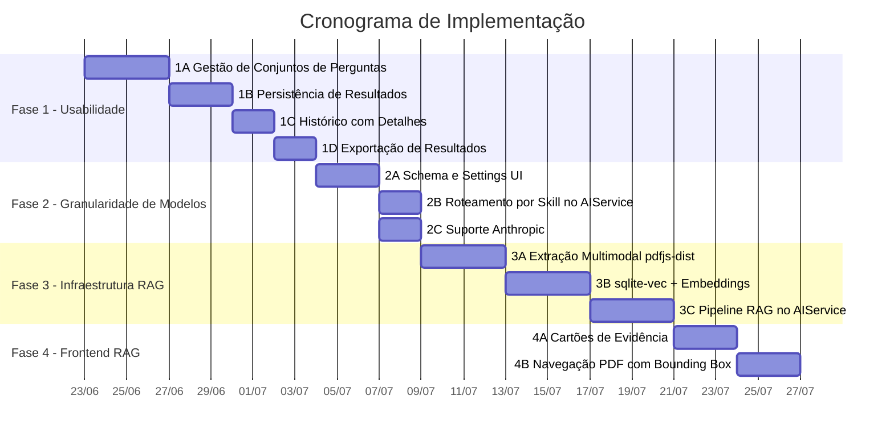
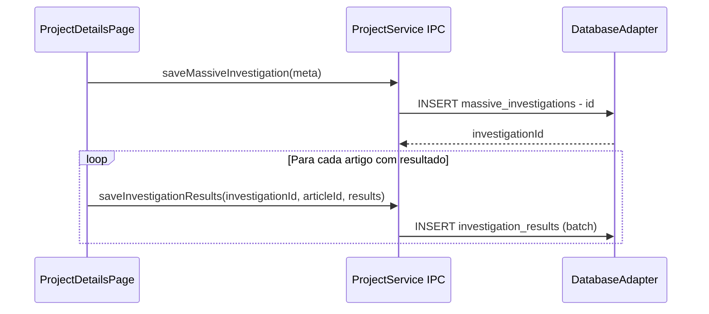
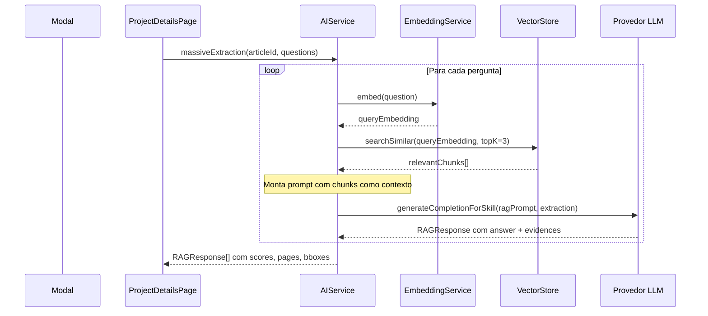

# Plano de Implementação: Melhorias de IA e Usabilidade

> Combina as melhorias técnicas do plano original (RAG, Vector DB, multimodal, granularidade de modelos) com melhorias de usabilidade na investigação massiva de IA.

---

## Regras Obrigatórias de Desenvolvimento

Toda implementação deste plano **deve** seguir as regras de `AGENTS.md` e `procedimento.md`. As seguintes diretrizes se aplicam transversalmente a todas as fases:

### TDD Obrigatório (Red-Green-Refactor)

Cada sub-fase segue o ciclo:
1. **RED:** Escrever testes que descrevem a funcionalidade. Executar e confirmar falha.
2. **GREEN:** Implementar o código mínimo para os testes passarem.
3. **REFACTOR:** Melhorar estrutura e legibilidade sem quebrar testes.

Nenhuma implementação deve começar pelo código de produção. Os testes vêm primeiro.

### Registro no `log.md`

Ao final de cada sub-fase (1A, 1B, etc.), registrar no topo de `log.md`:
- Data e Hora
- Objetivo do ciclo (ex: "1A — Gestão de Conjuntos de Perguntas")
- Arquivos criados/modificados
- Status dos testes TDD (quantos passaram, quantos foram escritos)
- Decisões técnicas relevantes

**Nunca apagar registros anteriores.**

### Injeção de Dependências

Todas as novas classes (`VectorStore`, `EmbeddingService`, `PdfExtractor`, etc.) recebem dependências via construtor/parâmetro, nunca via import global. O `AIService` também deve ser refatorado para receber suas dependências (DB adapter, embedding service, vector store) via construtor.

### Wrapper para Libs Externas

Cada lib de terceiros deve ser encapsulada atrás de uma interface própria do projeto:
- `pdfjs-dist` → encapsulado pelo `PdfExtractor`
- `sqlite-vec` → encapsulado pelo `VectorStore`
- APIs externas (OpenAI, Gemini, Anthropic, Ollama) → encapsuladas por um `LLMProviderGateway` (interface + implementações)

### Limite de 500 Linhas por Arquivo

Arquivos que atualmente excedem 500 linhas **devem ser refatorados** antes ou durante a fase que os altera:
- `ProjectDetailsPage.tsx` (1313 linhas) → extrair lógica de AI para `useAIInvestigation` hook
- `AIExtractionModal.tsx` (548 linhas) → extrair sub-componentes para `src/components/ai/`
- `DatabaseAdapter.ts` (618+ linhas) → extrair métodos de AI para `QuestionSetRepository.ts`, `InvestigationResultRepository.ts`
- `ipcRegistries.ts` (612 linhas) → extrair handlers de AI para `aiIpcHandlers.ts`

### Nomenclatura

Evitar sufixos genéricos (`Manager`, `Handler`, `data`). Preferir nomes específicos com <5 hits no codebase.

### Tipagem Explícita

Sem `any`, `Dict`, ou funções sem tipo de retorno. Remover `// @ts-nocheck` dos arquivos alterados.

---

## Diagnóstico do Estado Atual

### Arquivos-Chave

| Camada | Arquivo | Linhas |
|--------|---------|--------|
| Backend IA | `electron/services/AIService.ts` | 295 |
| Modal de Extração | `src/components/modals/AIExtractionModal.tsx` | 548 |
| Orquestração | `src/pages/ProjectDetailsPage.tsx` | 1313 |
| Schema DB | `electron/database/schema.sql` | 253 |
| Adapter DB | `electron/database/DatabaseAdapter.ts` | 618+ |
| Tipos Frontend | `src/types/index.ts` | 254 |
| IPC | `electron/ipc/ipcRegistries.ts` | 612 |
| Service Interface | `src/services/ProjectServiceInterface.ts` | — |
| Configurações | `src/pages/SettingsPage.tsx` | 568 |

### Gaps Identificados

| Área | Estado Atual | Problema |
|------|-------------|----------|
| **Perguntas** | `useState<string[]>([''])` efêmero, resetado ao fechar modal | Sem persistência, sem reuso, sem conjuntos nomeados |
| **Resultados** | Apenas in-memory (React state) + `pending_highlights` para quotes | `massive_investigations` guarda só metadados, não as respostas |
| **Histórico** | Tab mostra perguntas e IDs de artigos, mas sem respostas | Impossível revisar resultados passados |
| **Exportação** | Nenhuma | Sem CSV/XLSX/JSON dos resultados |
| **Seleção de modelo** | Prioridade fixa: OpenAI → Gemini → Ollama | Sem escolha por investigação ou por skill |
| **Anthropic** | Campo de settings desabilitado ("Em breve") | Sem `callAnthropic()` no AIService |
| **Extração PDF** | `pdf-parse` com truncamento (80k chars) | Perde layout, sem coordenadas, busca case-sensitive |
| **Busca semântica** | Nenhuma — texto plano truncado enviado inteiro ao LLM | Sem chunking, sem embeddings, sem RAG |

---

## Visão Geral das Fases



---

## Fase 1: Melhorias de Usabilidade (Gestão de Perguntas e Resultados)

### 1A — Gestão de Conjuntos de Perguntas (✅ CONCLUÍDO)

**Objetivo:** Permitir que o usuário crie, nomeie, salve, edite, duplique, exclua e reutilize conjuntos de perguntas entre investigações.

#### Schema SQL — Nova tabela `question_sets`

```sql
CREATE TABLE IF NOT EXISTS question_sets (
    id INTEGER PRIMARY KEY AUTOINCREMENT,
    project_id INTEGER,                        -- NULL = global (disponível em todos os projetos)
    name TEXT NOT NULL,
    description TEXT,
    questions TEXT NOT NULL,                    -- JSON string[]
    created_at DATETIME DEFAULT CURRENT_TIMESTAMP,
    updated_at DATETIME DEFAULT CURRENT_TIMESTAMP,
    FOREIGN KEY(project_id) REFERENCES projects(id) ON DELETE CASCADE
);
```

> **Nota:** `project_id = NULL` indica um conjunto global reutilizável em qualquer projeto.
> O campo `questions` usa JSON `string[]` para manter consistência com `massive_investigations.questions`.

#### Tipos TypeScript — Novo `QuestionSet`

```typescript
// Em src/types/index.ts e electron/types.ts
export interface QuestionSet {
  id: number;
  project_id: number | null;
  name: string;
  description: string | null;
  questions: string;  // JSON string[]
  created_at: string;
  updated_at: string;
}
```

#### Canais IPC — Novos

```typescript
// Em IpcChannel enum
QUESTION_SETS_LIST       = 'questionSets:list',
QUESTION_SETS_GET        = 'questionSets:get',
QUESTION_SETS_CREATE     = 'questionSets:create',
QUESTION_SETS_UPDATE     = 'questionSets:update',
QUESTION_SETS_DELETE     = 'questionSets:delete',
QUESTION_SETS_DUPLICATE  = 'questionSets:duplicate',
```

#### Alterações por Arquivo

| Arquivo | Alteração |
|---------|-----------|
| `schema.sql` | Adicionar tabela `question_sets` |
| `DatabaseAdapter.ts` | Métodos CRUD: `createQuestionSet`, `getQuestionSets`, `getQuestionSet`, `updateQuestionSet`, `deleteQuestionSet`, `duplicateQuestionSet` |
| `src/types/index.ts` | Interface `QuestionSet`, novos canais IPC |
| `electron/types.ts` | Espelhar `QuestionSet` e canais IPC |
| `ipcRegistries.ts` | Handlers para os 6 novos canais |
| `ProjectServiceInterface.ts` | Métodos na interface: `getQuestionSets`, `createQuestionSet`, etc. |
| `api.ts` | Implementação IPC dos métodos |
| `FakeProjectService.ts` | Implementação fake para testes |

#### Novo Componente: `QuestionSetCatalog.tsx`

Criar em `src/components/ai/QuestionSetCatalog.tsx`:

```
┌─────────────────────────────────────────────────────┐
│  Conjuntos de Perguntas                    [+ Novo] │
│─────────────────────────────────────────────────────│
│  ┌─────────────────────────────────────────────┐    │
│  │ 📋 Metodologia Científica          [Global] │    │
│  │    5 perguntas · Atualizado 22/06/2026      │    │
│  │    [Usar] [Editar] [Duplicar] [Excluir]     │    │
│  └─────────────────────────────────────────────┘    │
│  ┌─────────────────────────────────────────────┐    │
│  │ 📋 Dados Demográficos         [Este Projeto]│    │
│  │    8 perguntas · Atualizado 21/06/2026      │    │
│  │    [Usar] [Editar] [Duplicar] [Excluir]     │    │
│  └─────────────────────────────────────────────┘    │
│─────────────────────────────────────────────────────│
│  💡 Dica: Conjuntos globais ficam disponíveis em    │
│     todos os projetos.                              │
└─────────────────────────────────────────────────────┘
```

**Funcionalidades do componente:**
- Listar conjuntos (globais + do projeto atual) com contagem de perguntas
- Botão "Usar" → carrega perguntas no formulário da investigação
- Botão "Editar" → abre inline editor para renomear/alterar perguntas
- Botão "Duplicar" → cria cópia com sufixo " (Cópia)"
- Botão "Excluir" → confirmação antes de deletar
- Botão "+ Novo" → formulário inline: nome, descrição, perguntas dinâmicas
- Botão "Salvar como Conjunto" no formulário de investigação → salva perguntas atuais como novo conjunto

#### Integração no `AIExtractionModal.tsx`

A aba "Nova Investigação" ganha uma seção acima do formulário de perguntas:

1. **Dropdown "Carregar Conjunto"** — lista os conjuntos salvos, ao selecionar preenche `aiQuestions`
2. **Botão "Salvar Perguntas Atuais"** — abre mini-formulário pedindo nome e descrição, salva o `aiQuestions` atual como novo `QuestionSet`
3. O `QuestionSetManager` fica acessível via um botão "Gerenciar Conjuntos" que expande um painel lateral ou abre sub-aba

#### Ciclo TDD (Ordem de Implementação)

1. **RED:** Escrever testes para o CRUD do `DatabaseAdapter` → `electron/database/__tests__/DatabaseAdapter.questionSets.test.ts`
2. **RED:** Escrever testes para renderização do `QuestionSetCatalog` → `src/components/__tests__/QuestionSetCatalog.test.tsx`
3. **RED:** Escrever testes de integração carregar/salvar no Modal → `src/components/__tests__/AIExtractionModal.test.tsx` (expandir)
4. **GREEN:** Implementar `schema.sql`, `DatabaseAdapter`, tipos, IPC handlers, `QuestionSetCatalog`, integração no modal
5. **REFACTOR:** Limpar código, verificar todos os testes, registrar no `log.md`

---

### 1B — Persistência de Resultados da Investigação (✅ CONCLUÍDO)

**Objetivo:** Salvar os resultados completos (perguntas + respostas + quotes) no banco de dados para consulta posterior.

#### Schema SQL — Nova tabela `investigation_results`

```sql
CREATE TABLE IF NOT EXISTS investigation_results (
    id INTEGER PRIMARY KEY AUTOINCREMENT,
    investigation_id INTEGER NOT NULL,
    article_id INTEGER NOT NULL,
    question TEXT NOT NULL,
    answer TEXT,
    quote TEXT,
    status TEXT DEFAULT 'success',            -- 'success' | 'error' | 'skipped'
    error_message TEXT,
    created_at DATETIME DEFAULT CURRENT_TIMESTAMP,
    FOREIGN KEY(investigation_id) REFERENCES massive_investigations(id) ON DELETE CASCADE,
    FOREIGN KEY(article_id) REFERENCES articles(id) ON DELETE CASCADE
);

CREATE INDEX IF NOT EXISTS idx_inv_results_investigation
    ON investigation_results(investigation_id);
CREATE INDEX IF NOT EXISTS idx_inv_results_article
    ON investigation_results(article_id);
```

#### Fluxo de Salvamento



#### Alterações por Arquivo

| Arquivo | Alteração |
|---------|-----------|
| `schema.sql` | Tabela `investigation_results` + índices |
| `DatabaseAdapter.ts` | `saveInvestigationResults(investigationId, articleId, results[])`, `getInvestigationResults(investigationId)`, `getInvestigationResultsByArticle(investigationId, articleId)` |
| `src/types/index.ts` | Interface `InvestigationResult`, novos canais IPC |
| `ipcRegistries.ts` | Handlers `INVESTIGATION_RESULTS_SAVE`, `INVESTIGATION_RESULTS_GET` |
| `ProjectServiceInterface.ts` | Novos métodos na interface |
| `api.ts` | Implementação IPC |
| `ProjectDetailsPage.tsx` | Alterar `handleMassiveExtraction` para salvar resultados após cada artigo, usando o `investigationId` retornado por `saveMassiveInvestigation` |

#### Tipo `InvestigationResult`

```typescript
export interface InvestigationResult {
  id: number;
  investigation_id: number;
  article_id: number;
  question: string;
  answer: string | null;
  quote: string | null;
  status: 'success' | 'error' | 'skipped';
  error_message: string | null;
  created_at: string;
}
```

---

### 1C — Histórico com Visualização de Detalhes (✅ CONCLUÍDO)

**Objetivo:** Permitir clicar em um registro do histórico para ver os resultados completos daquela investigação.

#### Novo Componente: `InvestigationDetailView.tsx`

Criar em `src/components/ai/InvestigationDetailView.tsx`:

```
┌─────────────────────────────────────────────────────┐
│  ← Voltar ao Histórico                             │
│─────────────────────────────────────────────────────│
│  Investigação #12 — 22/06/2026 14:30               │
│  Modelo: gemini-2.5-flash · 5 artigos · Sucesso    │
│─────────────────────────────────────────────────────│
│                                                     │
│  📄 Artigo: "Effects of mindfulness on..."          │
│  ┌───────────────────────────────────────────┐      │
│  │ P1: Qual a metodologia principal?         │      │
│  │ R: Estudo randomizado controlado com...   │      │
│  │ 📌 "randomized controlled trial..." (p.3) │      │
│  ├───────────────────────────────────────────┤      │
│  │ P2: Qual o tamanho da amostra?            │      │
│  │ R: 245 participantes...                   │      │
│  │ 📌 "A total of 245..." (p.5)              │      │
│  └───────────────────────────────────────────┘      │
│                                                     │
│  📄 Artigo: "Cognitive behavioral therapy..."       │
│  ┌───────────────────────────────────────────┐      │
│  │ ...                                       │      │
│  └───────────────────────────────────────────┘      │
│                                                     │
│  [Exportar CSV] [Exportar JSON] [Re-executar]       │
└─────────────────────────────────────────────────────┘
```

#### Alterações por Arquivo

| Arquivo | Alteração |
|---------|-----------|
| `AIExtractionModal.tsx` | Tab "Histórico" ganha click handler em cada registro, renderiza `InvestigationDetailView` |
| Novo `InvestigationDetailView.tsx` | Componente que recebe `investigationId`, busca `investigation_results`, agrupa por artigo, renderiza Q&A |
| `ProjectDetailsPage.tsx` | Handler para buscar resultados detalhados (via service) |

#### Funcionalidades

- Agrupamento por artigo com collapsible sections
- Botão "Re-executar" → carrega as mesmas perguntas e artigos na aba "Nova Investigação"
- Indicadores visuais de status por resposta (sucesso, erro, pulada)
- Busca/filtro dentro dos resultados

---

### 1D — Exportação de Resultados (✅ CONCLUÍDO)

**Objetivo:** Exportar resultados de uma investigação em CSV ou JSON.

#### Novo Módulo: `src/utils/investigationExporter.ts`

```typescript
// Funções puras sem side-effects — fáceis de testar

export function formatResultsAsCsv(
  investigation: MassiveInvestigation,
  results: InvestigationResult[],
  articles: Article[]
): string

export function formatResultsAsJson(
  investigation: MassiveInvestigation,
  results: InvestigationResult[],
  articles: Article[]
): string
```

#### Formato CSV (Exemplo)

```csv
Artigo,Pergunta,Resposta,Citação,Status
"Effects of mindfulness...","Qual a metodologia?","Estudo randomizado...","randomized controlled...",success
```

#### Fluxo de Exportação

1. Usuário clica "Exportar CSV" no `InvestigationDetailView`
2. Chama `formatResultsAsCsv(...)` para gerar string
3. Usa `window.electronAPI.invoke('dialog:saveFile', ...)` para abrir diálogo nativo de salvar arquivo
4. Grava o conteúdo no path escolhido

#### Alterações por Arquivo

| Arquivo | Alteração |
|---------|-----------|
| Novo `src/utils/investigationExporter.ts` | Formatadores CSV e JSON |
| `InvestigationDetailView.tsx` | Botões de exportação que acionam os formatadores |
| `ipcRegistries.ts` | Handler `dialog:saveFile` (se não existir) |
| `src/types/index.ts` | Canal IPC `DIALOG_SAVE_FILE` |

#### Ciclo TDD (Ordem de Implementação)

1. **RED:** Escrever testes para `formatResultsAsCsv` e `formatResultsAsJson` → `src/utils/__tests__/investigationExporter.test.ts`
2. **GREEN:** Implementar formatadores, botões de exportação, handler IPC `dialog:saveFile`
3. **REFACTOR:** Verificar testes, registrar no `log.md`

---

## Fase 2: Granularidade de Modelos e Suporte Anthropic

### 2A — Schema e Settings UI para Modelos por Skill(✅ CONCLUÍDO)

**Objetivo:** Permitir que o usuário configure qual modelo usar para cada tipo de tarefa de IA.

#### Schema SQL — Nova tabela `ai_model_config`

```sql
CREATE TABLE IF NOT EXISTS ai_model_config (
    id INTEGER PRIMARY KEY AUTOINCREMENT,
    skill TEXT NOT NULL UNIQUE,               -- 'metadata' | 'summary' | 'extraction' | 'embeddings'
    provider TEXT NOT NULL,                   -- 'openai' | 'gemini' | 'anthropic' | 'ollama'
    model_name TEXT NOT NULL,                 -- ex: 'gpt-4o-mini', 'gemini-2.5-flash'
    updated_at DATETIME DEFAULT CURRENT_TIMESTAMP
);

-- Defaults sensíveis
INSERT OR IGNORE INTO ai_model_config (skill, provider, model_name) VALUES
    ('metadata', 'gemini', 'gemini-2.5-flash'),
    ('summary', 'gemini', 'gemini-2.5-flash'),
    ('extraction', 'gemini', 'gemini-2.5-flash'),
    ('embeddings', 'ollama', 'nomic-embed-text');
```

#### Tipo `AIModelConfig`

```typescript
export type AISkill = 'metadata' | 'summary' | 'extraction' | 'embeddings';
export type AIProvider = 'openai' | 'gemini' | 'anthropic' | 'ollama';

export interface AIModelConfig {
  id: number;
  skill: AISkill;
  provider: AIProvider;
  model_name: string;
  updated_at: string;
}
```

#### Alterações em `SettingsPage.tsx`

Nova seção "Configurações Avançadas de IA" abaixo das API keys:

```
┌─────────────────────────────────────────────────────┐
│  Modelos por Funcionalidade                         │
│─────────────────────────────────────────────────────│
│  📄 Extração de Metadados                           │
│     Provedor: [Gemini ▼]  Modelo: [gemini-2.5-flash]│
│                                                     │
│  📝 Geração de Resumos                              │
│     Provedor: [Gemini ▼]  Modelo: [gemini-2.5-pro] │
│                                                     │
│  🔍 Investigação Massiva (RAG)                      │
│     Provedor: [OpenAI ▼]  Modelo: [gpt-4o]         │
│                                                     │
│  🧮 Embeddings (Vetorização)                        │
│     Provedor: [Ollama ▼]  Modelo: [nomic-embed-text]│
│                                                     │
│  [Salvar Configuração]  [Restaurar Padrões]         │
└─────────────────────────────────────────────────────┘
```

---

### 2B — Roteamento por Skill no AIService(✅ CONCLUÍDO)

**Objetivo:** Cada método do AIService usa o modelo correto conforme configuração.

#### Alterações em `AIService.ts`

Substituir `generateCompletion(prompt)` por:

```typescript
/** Roteia para o provedor/modelo correto baseado na skill solicitada. */
generateCompletionForSkill(prompt: string, skill: AISkill): Promise<string>
```

O método consulta `ai_model_config` para obter `provider` + `model_name`, e dispacha para `callOpenAI`, `callGemini`, `callAnthropic` ou `callOllama` com o modelo específico.

| Método | Antes | Depois |
|--------|-------|--------|
| `extractMetadataFromPdf` | `generateCompletion(prompt)` | `generateCompletionForSkill(prompt, 'metadata')` |
| `generateSummary` | `generateCompletion(prompt)` | `generateCompletionForSkill(prompt, 'summary')` |
| `massiveExtraction` | `generateCompletion(prompt)` | `generateCompletionForSkill(prompt, 'extraction')` |

---

### 2C — Suporte Anthropic(✅ CONCLUÍDO)

**Objetivo:** Implementar `callAnthropic` e habilitar o campo nas configurações.

#### Alterações

| Arquivo | Alteração |
|---------|-----------|
| `AIService.ts` | Novo método `callAnthropic(prompt, model)` usando a API de Messages da Anthropic |
| `SettingsPage.tsx` | Remover `disabled` do campo Anthropic, adicionar tooltip com modelos suportados |

#### Wrapper `LLMProviderGateway`

Para cumprir a regra de "wrap third-party libs", as chamadas de API não devem usar `fetch` diretamente. Criar uma interface `LLMProviderGateway` com implementações por provedor:

```typescript
// electron/services/llm/LLMProviderGateway.ts
export interface LLMProviderGateway {
  /** Envia prompt e retorna texto gerado. */
  complete(prompt: string, model: string): Promise<string>;
}

// electron/services/llm/AnthropicGateway.ts
export class AnthropicGateway implements LLMProviderGateway {
  constructor(private readonly apiKey: string) {}

  async complete(prompt: string, model: string): Promise<string> {
    const response = await fetch('https://api.anthropic.com/v1/messages', {
      method: 'POST',
      headers: {
        'Content-Type': 'application/json',
        'x-api-key': this.apiKey,
        'anthropic-version': '2023-06-01',
      },
      body: JSON.stringify({
        model,
        max_tokens: 4096,
        messages: [{ role: 'user', content: prompt }],
      }),
    });
    const data = await response.json();
    return data.content[0].text;
  }
}
```

As implementações `OpenAIGateway`, `GeminiGateway` e `OllamaGateway` seguem o mesmo padrão. O `AIService` recebe os gateways via construtor em vez de instanciar internamente.

---

## Fase 3: Infraestrutura RAG (do Plano Original)

> **IMPORTANTE:** Esta fase implementa o core técnico descrito no plano original. As alterações são de maior risco e devem ser feitas em branch separada.

### 3A — Extração Multimodal com `pdfjs-dist`

**Objetivo:** Substituir `pdf-parse` por `pdfjs-dist` para extrair texto com coordenadas `(page, x, y, w, h)`.

#### Novo Módulo: `electron/services/PdfExtractor.ts`

```typescript
export interface PdfTextChunk {
  text: string;
  page: number;
  bbox: { x: number; y: number; w: number; h: number };
}

export interface PdfExtractionResult {
  chunks: PdfTextChunk[];
  totalPages: number;
  totalCharacters: number;
}

/** Extrai texto preservando layout e coordenadas usando pdfjs-dist. */
export async function extractTextWithCoordinates(
  pdfPath: string
): Promise<PdfExtractionResult>

/** Renderiza páginas específicas como imagens Base64 para VLM. */
export async function renderPagesAsImages(
  pdfPath: string,
  pages: number[]
): Promise<Map<number, string>>
```

#### Alterações

| Arquivo | Alteração |
|---------|-----------|
| `package.json` | Adicionar `pdfjs-dist` como dependência |
| Novo `electron/services/PdfExtractor.ts` | Implementação da extração multimodal |
| `AIService.ts` | `extractMetadataFromPdf` passa a usar `renderPagesAsImages` + VLM |
| `AIService.ts` | `massiveExtraction` passa a usar `extractTextWithCoordinates` para chunking |

---

### 3B — Vector DB com `sqlite-vec` + Embeddings

**Objetivo:** Armazenar embeddings dos chunks no SQLite existente e permitir busca por similaridade.

#### Schema SQL — Tabela virtual vetorial

```sql
-- Metadados dos chunks (relacional)
CREATE TABLE IF NOT EXISTS pdf_chunks (
    id INTEGER PRIMARY KEY AUTOINCREMENT,
    article_id INTEGER NOT NULL,
    chunk_index INTEGER NOT NULL,
    text_content TEXT NOT NULL,
    page_number INTEGER NOT NULL,
    bbox_x REAL,
    bbox_y REAL,
    bbox_w REAL,
    bbox_h REAL,
    token_count INTEGER,
    created_at DATETIME DEFAULT CURRENT_TIMESTAMP,
    FOREIGN KEY(article_id) REFERENCES articles(id) ON DELETE CASCADE
);

-- Vetores (sqlite-vec)
CREATE VIRTUAL TABLE IF NOT EXISTS pdf_chunk_embeddings USING vec0(
    chunk_id INTEGER PRIMARY KEY,
    embedding FLOAT[384]                      -- dimensão depende do modelo de embeddings
);
```

#### Novo Módulo: `electron/services/VectorStore.ts`

```typescript
export interface SimilarChunk {
  chunkId: number;
  text: string;
  page: number;
  bbox: { x: number; y: number; w: number; h: number };
  similarityScore: number;
}

/** Encapsula operações de busca vetorial no sqlite-vec. */
export class VectorStore {
  constructor(db: Database)

  /** Indexa chunks de um artigo (chamado na importação). */
  indexArticleChunks(articleId: number, chunks: PdfTextChunk[], embeddings: number[][]): void

  /** Busca os K chunks mais similares à query. */
  searchSimilar(queryEmbedding: number[], topK: number): SimilarChunk[]

  /** Remove chunks de um artigo (chamado na exclusão). */
  removeArticleChunks(articleId: number): void
}
```

#### Novo Módulo: `electron/services/EmbeddingService.ts`

```typescript
/** Gera embeddings usando o modelo configurado (OpenAI, Ollama, etc). */
export class EmbeddingService {
  constructor(config: AIModelConfig)

  /** Gera embedding para um único texto. */
  embed(text: string): Promise<number[]>

  /** Gera embeddings em batch. */
  embedBatch(texts: string[]): Promise<number[][]>
}
```

#### Alterações

| Arquivo | Alteração |
|---------|-----------|
| `package.json` | Adicionar `sqlite-vec` como dependência |
| `schema.sql` | Tabelas `pdf_chunks` e `pdf_chunk_embeddings` |
| `DatabaseAdapter.ts` | Carregar extensão `sqlite-vec`, métodos para chunks |
| Novo `electron/services/VectorStore.ts` | Encapsulamento da busca vetorial |
| Novo `electron/services/EmbeddingService.ts` | Geração de embeddings |
| Pipeline de importação de artigos | Após salvar PDF, executar: extrair chunks, gerar embeddings, indexar |

---

### 3C — Pipeline RAG no AIService

**Objetivo:** Substituir o envio de texto truncado pelo fluxo de Retrieval-Augmented Generation.

#### Novo Fluxo `massiveExtraction`



#### Nova Interface de Retorno (substitui a atual)

```typescript
export interface RAGEvidence {
  chunkId: number;
  textSnippet: string;
  page: number;
  similarityScore: number;
  bbox: { x: number; y: number; w: number; h: number } | null;
  reasoning: string;
}

export interface RAGExtractionResult {
  question: string;
  synthesizedAnswer: string;
  confidenceScore: 'ALTA' | 'MÉDIA' | 'BAIXA';
  evidences: RAGEvidence[];
}
```

> **ATENÇÃO:** Esta mudança altera o contrato de retorno do `massiveExtraction`. Todos os consumidores (Modal, Page, testes) precisam ser atualizados simultaneamente. Considerar manter o método antigo como fallback durante a migração.

---

## Fase 4: Frontend RAG (Cartões de Evidência)

### 4A — Cartões de Evidência no Modal

**Objetivo:** Redesenhar a exibição de resultados para mostrar evidências rastreáveis com scores de confiança.

#### Novo Componente: `src/components/ai/EvidenceCard.tsx`

Renderiza um único card de evidência com:
- Trecho citado em blockquote estilizado
- Badge de página
- Barra de confiança semântica (0-100%, colorida: verde >85%, amarelo >60%, vermelho <60%)
- Raciocínio da IA em texto colapsável
- Botão "Visualizar no Documento" → navega ao PDF

#### Novo Componente: `src/components/ai/RAGResultCard.tsx`

Renderiza o resultado completo de uma pergunta:
- Header com a pergunta
- Resposta sintetizada
- Badge de confiança geral (ALTA/MÉDIA/BAIXA)
- Lista de `EvidenceCard` (tipicamente 3)

#### Alterações no `AIExtractionModal.tsx`

- Substituir o render atual de resultados por `RAGResultCard`
- Remover `// @ts-nocheck` e tipar corretamente
- Adaptar para receber `RAGExtractionResult[]` em vez de `AIExtractionResultItem[]`

---

### 4B — Navegação PDF com Bounding Box

**Objetivo:** Ao clicar "Visualizar no Documento", o leitor de PDF navega à página correta e desenha um retângulo de destaque sobre o trecho citado.

#### Alterações

| Arquivo | Alteração |
|---------|-----------|
| Leitor de PDF (componente existente) | Aceitar prop `highlightBbox?: { page, x, y, w, h }`, renderizar retângulo overlay |
| `EvidenceCard.tsx` | Botão "Visualizar" emite evento com coordenadas do bbox |
| `ProjectDetailsPage.tsx` | Handler que recebe coordenadas e passa para o leitor de PDF |

---

## Resumo de Novos Arquivos

| Arquivo | Fase | Responsabilidade |
|---------|------|------------------|
| `src/components/ai/QuestionSetCatalog.tsx` | 1A | CRUD visual de conjuntos de perguntas |
| `src/components/ai/InvestigationDetailView.tsx` | 1C | Visualização detalhada de resultados históricos |
| `src/utils/investigationExporter.ts` | 1D | Formatação CSV/JSON para exportação |
| `src/hooks/useAIInvestigation.ts` | 1A | Hook extraído de ProjectDetailsPage (lógica de AI) |
| `electron/database/QuestionSetRepository.ts` | 1A | Métodos DB para question_sets (extraído de DatabaseAdapter) |
| `electron/database/InvestigationResultRepository.ts` | 1B | Métodos DB para investigation_results (extraído de DatabaseAdapter) |
| `electron/ipc/aiIpcHandlers.ts` | 1A | Handlers IPC de AI (extraído de ipcRegistries) |
| `electron/services/llm/LLMProviderGateway.ts` | 2C | Interface para provedores LLM |
| `electron/services/llm/AnthropicGateway.ts` | 2C | Implementação Anthropic do gateway |
| `electron/services/llm/OpenAIGateway.ts` | 2C | Implementação OpenAI do gateway |
| `electron/services/llm/GeminiGateway.ts` | 2C | Implementação Gemini do gateway |
| `electron/services/llm/OllamaGateway.ts` | 2C | Implementação Ollama do gateway |
| `electron/services/PdfExtractor.ts` | 3A | Extração de texto com coordenadas via `pdfjs-dist` |
| `electron/services/VectorStore.ts` | 3B | Busca vetorial encapsulando `sqlite-vec` |
| `electron/services/EmbeddingService.ts` | 3B | Geração de embeddings multi-provedor |
| `src/components/ai/EvidenceCard.tsx` | 4A | Card individual de evidência RAG |
| `src/components/ai/RAGResultCard.tsx` | 4A | Card completo de resultado com evidências |

## Resumo de Alterações em Arquivos Existentes

| Arquivo | Fases | Natureza das Alterações |
|---------|-------|------------------------|
| `schema.sql` | 1A, 1B, 2A, 3B | Novas tabelas: `question_sets`, `investigation_results`, `ai_model_config`, `pdf_chunks`, `pdf_chunk_embeddings` |
| `DatabaseAdapter.ts` | 1A, 1B, 2A, 3B | Métodos CRUD para cada nova tabela, carregamento de extensão `sqlite-vec` |
| `src/types/index.ts` | 1A, 1B, 2A, 3C | Interfaces: `QuestionSet`, `InvestigationResult`, `AIModelConfig`, `RAGExtractionResult`, `RAGEvidence`, novos canais IPC |
| `electron/types.ts` | 1A, 1B, 2A | Espelhar tipos e canais do frontend |
| `ipcRegistries.ts` | 1A, 1B, 1D, 2A | Handlers para ~12 novos canais IPC |
| `ProjectServiceInterface.ts` | 1A, 1B, 2A | Novos métodos na interface |
| `api.ts` | 1A, 1B, 2A | Implementação IPC dos novos métodos |
| `AIService.ts` | 2B, 2C, 3A, 3C | `generateCompletionForSkill`, `callAnthropic`, pipeline RAG |
| `AIExtractionModal.tsx` | 1A, 1C, 4A | Dropdown de conjuntos, link para detalhes no histórico, cartões RAG |
| `ProjectDetailsPage.tsx` | 1A, 1B, 1C, 4B | Salvar resultados, carregar conjuntos, handler de navegação PDF |
| `SettingsPage.tsx` | 2A, 2C | Painel de modelos por skill, habilitar Anthropic |
| `FakeProjectService.ts` | 1A, 1B, 2A | Implementações fake dos novos métodos |
| `package.json` | 3A, 3B | Dependências: `pdfjs-dist`, `sqlite-vec` |

---

## Ordem de Execução Recomendada

> **Dica:** A Fase 1 entrega valor imediato ao usuário sem risco técnico significativo. Comece por ela.

1. **Fase 1A** — Gestão de Conjuntos de Perguntas *(impacto alto, risco baixo)*
2. **Fase 1B** — Persistência de Resultados *(pré-requisito para 1C e 1D)*
3. **Fase 1C** — Histórico com Detalhes *(depende de 1B)*
4. **Fase 1D** — Exportação *(depende de 1B)*
5. **Fase 2A+2B+2C** — Granularidade de Modelos + Anthropic *(independente, pode paralelizar)*
6. **Fase 3A** — Extração Multimodal *(risco médio, requer testes extensivos)*
7. **Fase 3B** — Vector DB *(risco alto, dependência nativa `sqlite-vec`)*
8. **Fase 3C** — Pipeline RAG *(depende de 3A + 3B)*
9. **Fase 4A+4B** — Frontend RAG *(depende de 3C)*

---

## Resumo do Impacto

A combinação de usabilidade + infra técnica transforma a investigação massiva de um recurso experimental em uma **ferramenta de auditoria científica de produção**:

- **Antes:** perguntas digitadas do zero a cada uso, resultados perdidos ao fechar o modal, sem exportação, modelo fixo, texto truncado sem rastreabilidade
- **Depois:** conjuntos de perguntas reutilizáveis, resultados persistidos e consultáveis, exportação CSV/JSON, modelo configurável por tarefa, RAG com evidências rastreáveis até a coordenada exata no PDF
