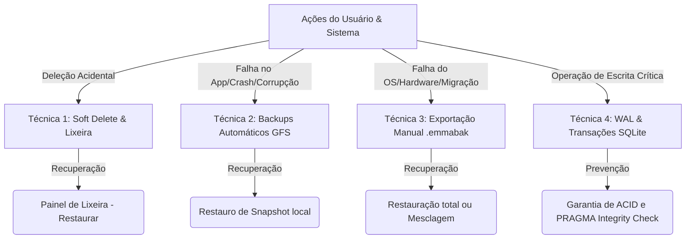

# Plano de Implementação: Funcionalidade de Backup e Recuperação

> [!IMPORTANT]
> **Diretriz Obrigatória de Desenvolvimento:**
> Todo o desenvolvimento deste plano deve seguir **RIGOROSAMENTE** o procedimento estabelecido em [procedimento.md](file:///C:/root_lab/antigravity/emmas_librarian/procedimento.md):
> 1. **Ciclo de TDD (Test-Driven Development):** Seguir estritamente o fluxo Red-Green-Refactor para cada nova funcionalidade ou correção de bug.
> 2. **Histórico Incremental (`log.md`):** Registrar detalhadamente cada ciclo de desenvolvimento no topo do arquivo [log.md](file:///C:/root_lab/antigravity/emmas_librarian/log.md) sem apagar ou sobrescrever o histórico anterior.
> 3. **Commits Pequenos e Locais:** Realizar commits atômicos locais com mensagens descritivas claras em inglês.

Este documento detalha o plano de implementação de uma arquitetura robusta de backup, proteção de dados e recuperação para o **Emma's Librarian**. Sendo uma aplicação desktop *local-first*, a integridade dos dados locais (SQLite e arquivos PDF anexados) é essencial.

O plano é composto por 6 técnicas complementares que evitam perda de dados por exclusão acidental, corrupção de arquivos ou sobrescrita incorreta.

---

## 🏗️ 1. Visão Geral das Técnicas Propostas



---

## 🗑️ Técnica 1: Soft Delete & Lixeira (Trash Bin)
**Objetivo:** Evitar a perda imediata de dados quando o usuário clica em "Excluir" por engano.

### Modificações no Banco de Dados
Adicionar a coluna `deleted_at` (DATETIME, default NULL) nas tabelas principais:
- `projects`
- `articles`
- `annotations`

### Lógica de Deleção vs. Ocultação
- **Deleção Lógica (Soft Delete):** A operação padrão de deleção nas telas do app apenas definirá `deleted_at = datetime('now')`. Os arquivos PDF correspondentes **não** serão excluídos do disco nesta etapa.
- **Consultas Padrão (Queries):** Todas as queries normais de listagem devem ser alteradas para ignorar registros marcados como excluídos:
  ```sql
  SELECT * FROM projects WHERE deleted_at IS NULL ORDER BY created_at DESC;
  SELECT * FROM articles WHERE project_id = ? AND deleted_at IS NULL;
  ```
- **Painel da Lixeira:** Interface dedicada nas Configurações que lista os itens com `deleted_at IS NOT NULL`.
- **Ações de Lixeira:**
  - `TRASH_RESTORE_ITEM`: Remove o timestamp de `deleted_at`, restaurando o item imediatamente.
  - `TRASH_PERMANENT_DELETE`: Exclui fisicamente o registro do SQLite e deleta o arquivo PDF físico associado no diretório `storage/pdfs/`.
  - `TRASH_EMPTY`: Limpa permanentemente todos os itens da lixeira.
- **Autolimpeza:** Opcionalmente, itens na lixeira há mais de 30 dias podem ser removidos permanentemente na inicialização do app.

---

## ⏰ Técnica 2: Backups Locais Automáticos com Rotação (GFS)
**Objetivo:** Proteger o usuário contra corrupção do banco de dados ou sobrescrita indevida que não seja percebida imediatamente.

### Fluxo de Funcionamento
1. **Gatilho:** Executado no processo principal do Electron (`main.ts`) durante a inicialização (ou em segundo plano a cada 24 horas).
2. **Opção de Desativação nas Configurações:** Este mecanismo será **ativado por padrão** para garantir a segurança dos dados. No entanto, por ser um processo que consome processamento e armazenamento incremental, haverá uma opção nas Configurações do app: `Habilitar backups automáticos locais (Recomendado)`. Se desativada, a rotina de backup diário será completamente ignorada.
3. **Checagem de Integridade:** Antes de realizar o backup, executa `PRAGMA integrity_check;` no SQLite.
   - **Como funciona:** O SQLite varre a estrutura interna do arquivo do banco, inspecionando a consistência dos nós das B-Trees, validando se as páginas estão encadeadas corretamente e se não há setores corrompidos na lista de páginas livres (*free-list*). Além disso, valida se todas as entradas de índices apontam para registros válidos e correspondentes nas tabelas.
   - **Tipos de falha detectados:** Corrupção física e lógica estrutural. Isso inclui falhas causadas por interrupções bruscas de energia durante a gravação física (escrita parcial de blocos), defeitos físicos no disco rígido (bad sectors), ou modificações manuais externas inadequadas no arquivo `.db`. Se a consulta retornar qualquer coisa diferente de `ok` (ex: mensagens como `row X has missing index entry`), o backup **não** é realizado e um aviso visual de erro de integridade do banco é emitido ao usuário, impedindo que backups saudáveis antigos sejam sobrescritos por versões já corrompidas.
4. **Diretório de Backup:** Criado em `app.getPath('userData')/backups/`.
5. **Compressão:** O arquivo `emma.db` é copiado e comprimido usando a biblioteca nativa do Node.js (`zlib` com gzip) para economizar espaço em disco. Exemplo de nome de arquivo: `emma_backup_2026-06-05.db.gz`.

### Política de Retenção GFS (Grandfather-Father-Son)
Para evitar o consumo excessivo do disco rígido do usuário, implementaremos um script de rotação de backups:
- **Diários (Son):** Mantém os backups dos últimos 7 dias.
- **Semanais (Father):** Mantém 1 backup por semana das últimas 4 semanas.
- **Mensais (Grandfather):** Mantém 1 backup por mês dos últimos 12 meses.
- Todos os arquivos mais antigos ou que não se encaixem nessas regras de intervalo serão automaticamente apagados pelo serviço de rotação.

---

## 📦 Técnica 3: Exportação e Restauração Manual (Full Backup Archive)
**Objetivo:** Permitir migrar dados para um novo computador, salvar cópias em HDs externos ou serviços de nuvem do usuário (Google Drive, Dropbox, etc.).

### Exportação (`.emmabak`)
1. O usuário clica em **"Criar Backup Completo"** nas configurações.
2. Abre-se um diálogo nativo do Electron (`dialog.showSaveDialog`) para salvar o arquivo com a extensão `.emmabak`.
3. O app cria um arquivo ZIP (via `adm-zip`) contendo:
   - Uma cópia limpa do banco de dados `emma.db`.
   - Toda a estrutura de subpastas de mídias: `/storage/pdfs/` e `/storage/project_documents/`.
   - Um arquivo de metadados `backup_metadata.json` (com informações de data, versão do app e contagem de projetos).

### Restauração (Restore & Merge)
O usuário clica em **"Restaurar de Arquivo"** e seleciona um `.emmabak`:
- **Opção A: Restauração Total (Sobrescrever - Override):**
  1. O app avisa o usuário que todos os dados atuais serão perdidos.
  2. Fecha a conexão atual do banco (`db.close()`).
  3. Substitui o arquivo `emma.db` atual pelo do backup.
  4. Extrai os PDFs do ZIP para a pasta de armazenamento, mesclando arquivos (com base no nome/hash).
  5. Reabre a conexão do banco e recarrega a janela do Electron (`BrowserWindow.reload()`).
- **Opção B: Importar e Mesclar (Merge Import):**
  1. O app lê o banco de dados do backup de forma temporária.
  2. Identifica os projetos contidos no backup que não existem no banco de dados ativo.
  3. Insere os projetos, artigos, anotações, highlights e copia os arquivos PDF correspondentes, gerando novos IDs para evitar colisões (aproveitando e estendendo a lógica do `SyncService.importProject`).

---

## 🛡️ Técnica 4: WAL Mode e Segurança Transacional
**Objetivo:** Garantir a robustez das gravações no SQLite, evitando que quedas de energia ou travamentos do aplicativo corrompam o banco de dados principal no meio de uma alteração.

### Mecanismos Técnicos
- **WAL Mode (Write-Ahead Logging):** Já habilitado no `DatabaseManager.ts` (`journal_mode = WAL`). Ele melhora a concorrência de leitura e escrita e garante que, em caso de travamento do sistema, o banco de dados possa ser recuperado automaticamente para o último estado consistente pelo SQLite.
- **Transações Estritas:** Todas as inserções e modificações em lote (como o salvamento de múltiplos artigos vindos de uma busca ou importação em lote de PDFs) devem obrigatoriamente rodar dentro de uma transação SQLite (`db.transaction()`). Se qualquer inserção falhar, a transação inteira sofre rollback, mantendo o banco intacto e sem dados parciais "órfãos".

---

## 📝 Técnica 5: Histórico de Alterações e Rollback do Diário (Diary Versioning)
**Objetivo:** Permitir que o usuário recupere o conteúdo de uma página do diário do projeto caso apague ou sobrescreva o conteúdo acidentalmente.

### Mecanismo de Funcionamento
1. **Nova Tabela de Histórico (`project_diary_history`):**
   ```sql
   CREATE TABLE IF NOT EXISTS project_diary_history (
       id INTEGER PRIMARY KEY AUTOINCREMENT,
       project_id INTEGER NOT NULL,
       entry_date TEXT NOT NULL,
       content TEXT NOT NULL,
       updated_at DATETIME DEFAULT CURRENT_TIMESTAMP,
       FOREIGN KEY(project_id) REFERENCES projects(id) ON DELETE CASCADE
   );
   ```
2. **Salvamento de Versões (Gatilho da Aplicação):**
   No `DatabaseManager.ts`, ao salvar uma entrada no diário (`saveDiaryEntry`), antes de executar a query `INSERT OR REPLACE INTO project_diary`, a aplicação fará uma verificação simples:
   - Se já existe uma entrada para aquele `project_id` e `entry_date`, ela seleciona o conteúdo antigo e o insere em `project_diary_history`.
   - Se o diário for excluído (`deleteDiaryEntry`), o último estado também é enviado para o histórico com uma tag de controle ou simplesmente guardado lá para que possa ser recuperado.
3. **Limite de Retenção de Versões:**
   Para evitar crescimento excessivo do banco com rascunhos antigos, mantemos apenas as **últimas 10 versões** de cada dia de diário. Toda vez que inserimos uma nova versão na tabela `project_diary_history`, removemos as mais antigas usando:
   ```sql
   DELETE FROM project_diary_history 
   WHERE project_id = ? AND entry_date = ? 
     AND id NOT IN (
         SELECT id FROM project_diary_history 
         WHERE project_id = ? AND entry_date = ? 
         ORDER BY updated_at DESC LIMIT 10
     );
   ```
4. **Interface Visual de Rollback:**
   - Na página de edição do diário, haverá um pequeno botão com ícone de histórico (relógio/atualizar).
   - Ao ser clicado, abre-se uma barra lateral ou modal com a lista de edições salvas (`Histórico de Versões do Diário`).
   - Cada versão mostrará o timestamp de modificação (`updated_at`). Ao clicar, o usuário poderá visualizar um preview do texto antigo e clicar em "Restaurar" para carregar aquele conteúdo de volta ao editor ativo.

---

## 🔄 Técnica 6: Isolamento Completo de Ambientes (Dev vs. Prod)
**Objetivo:** Garantir que o ambiente de desenvolvimento utilize dados e diretórios 100% isolados, protegendo a base de dados de produção de sobrescritas, testes automatizados e alterações acidentais.

### Mecanismo de Funcionamento
1. **Redirecionamento Global do Electron:**
   No arquivo `electron/main.ts`, interceptamos o caminho de dados padrão (`userData`) antes da inicialização de qualquer serviço ou conexão ao SQLite:
   ```typescript
   const isDev = process.env.NODE_ENV !== 'production' && !app.isPackaged;

   if (isDev) {
     const devDataPath = path.join(process.cwd(), 'dev_data');
     app.setPath('userData', devDataPath);
   }
   ```
2. **Impacto e Segurança:**
   - **Isolamento de Banco:** O arquivo `emma.db` de desenvolvimento será salvo em `emmas_librarian/dev_data/emma.db`.
   - **Isolamento de Arquivos:** PDFs e documentos salvos em desenvolvimento serão guardados em `emmas_librarian/dev_data/storage/pdfs/` e `emmas_librarian/dev_data/storage/project_documents/`.
   - **Isolamento de Backups:** Backups locais gerados no desenvolvimento serão guardados em `emmas_librarian/dev_data/backups/`.
   - O ambiente de produção continuará apontando de forma independente para a pasta padrão do usuário (`%APPDATA%/emmas_librarian` no Windows), garantindo segurança total.

*(Nota: Esta técnica já foi implementada com sucesso em `main.ts`!)*

---

## 🔍 Etapa 0: Investigação e Correção da Importação/Exportação (.emmapcarc)
**Objetivo:** Investigar e corrigir a perda de dados (destaques, anotações e páginas de diário) ao exportar/importar projetos individuais. Esta etapa é prioritária, pois os mecanismos de restauração e mesclagem (Merge) reutilizarão a lógica de importação do `SyncService.ts`.

### O Problema Identificado
Atualmente, a rotina de exportação no `SyncService.exportProject()` extrai metadados do projeto, artigos, histórico de buscas, categorias e documentos locais, mas **ignora completamente**:
- `annotations`: Notas em Markdown associadas aos artigos.
- `highlights`: Marcações visuais de texto nos PDFs (que apontam para chaves estrangeiras de artigos e anotações).
- `pending_highlights`: Destaques pendentes de sincronização.
- `project_diary`: O diário de anotações do projeto.

Como consequência, ao importar o arquivo `.emmapcarc` no ambiente de desenvolvimento, todos esses dados são perdidos.

### Ações Corretivas e Lógica de Implementação
1. **Exportação (`SyncService.ts`):**
   - Alterar o método `exportProject` para consultar as tabelas `annotations`, `highlights`, `pending_highlights` e `project_diary` associadas ao ID do projeto e IDs de seus artigos.
   - Adicionar essas coleções no arquivo JSON `project.json` empacotado no ZIP `.emmapcarc`.
2. **Importação e Remapeamento (`SyncService.ts`):**
   - No método `importProject`, dentro da transação de inserção:
     - Criar um mapa de remapeamento de IDs de anotações (`annotationMap: Map<number, number>`).
     - Inserir as anotações, registrando a relação `old_annotation_id -> new_annotation_id` no `annotationMap` e o novo `article_id`.
     - Inserir os destaques (`highlights`), remapeando a chave estrangeira `article_id` e a chave opcional `annotation_id` para os novos IDs recém-gerados.
     - Inserir os destaques pendentes (`pending_highlights`), remapeando o `article_id`.
     - Inserir as entradas de diário (`project_diary`), remapeando para o novo `project_id` gerado.

---

## 📅 Cronograma de Implementação Detalhado


O desenvolvimento será estruturado em 4 etapas de desenvolvimento contínuo:

### Etapa 0: Fase Prioritária - Correção da Importação/Exportação (.emmapcarc)
- [x] Escrever testes de integração em `SyncService.test.ts` (TDD) para validar a exportação/importação de anotações, destaques e diário.
- [x] Implementar a coleta de anotações, destaques e páginas de diário no `SyncService.exportProject()`.
- [x] Implementar o salvamento e remapeamento de IDs de anotações, destaques e diário no `SyncService.importProject()`.
- [x] Validar a importação ponta a ponta de arquivos `.emmapcarc` gerados da produção para o dev.
- [x] Documentar o progresso no `log.md` e realizar commits atômicos locais em inglês.

### Etapa 1: Backend e Lógica de Armazenamento (Backups Automáticos & WAL)
- [x] Implementar o isolamento completo dos ambientes configurando o path de `userData` para `./dev_data` em desenvolvimento.
- [ ] Criar o serviço `BackupManager.ts` em `electron/services/`.
- [ ] Implementar a cópia e compressão comprimida (`gzip`) do banco no startup.
- [ ] Criar algoritmo de limpeza baseado na política GFS.
- [ ] Adicionar checagem de integridade (`PRAGMA integrity_check`).
- [ ] Testar cenários de inicialização (startup rápido e impacto em performance).

### Etapa 2: Lixeira, Histórico do Diário e Schema
- [ ] Criar script de migração no SQLite para adicionar a coluna `deleted_at` e a tabela `project_diary_history`.
- [ ] Atualizar todas as queries no `DatabaseManager.ts` para respeitar `deleted_at IS NULL`.
- [ ] Implementar no `DatabaseManager.ts` a lógica de versionamento do diário ao salvar/deletar entradas.
- [ ] Adicionar rotas IPC para restaurar, listar e apagar permanentemente itens da lixeira, e para consultar/restaurar o histórico do diário.
- [ ] Criar a interface de Lixeira ("Trash Bin") nas configurações do React frontend.
- [ ] Criar o visual de Histórico de Versões e botão de rollback na página de edição do diário.

### Etapa 3: Manual Backup & UI (Exportação Completa e Restauro)
- [ ] Implementar empacotamento completo de banco + PDFs em formato ZIP com extensão `.emmabak` no `SyncService.ts`.
- [ ] Implementar fluxo de restauração total (fechando conexão de banco e reiniciando a janela).
- [ ] Criar painel de gerenciamento de backup na UI do usuário (Configurações), incluindo o controle liga/desliga de backup automático e controle de histórico do diário.
- [ ] Conduzir testes de migração ponta a ponta (Migração de banco antigo para novo).

---

## ⚖️ Análise de Impacto e Armazenamento

- **Armazenamento de SQLite:** Um banco de dados com 10.000 artigos anotados possui cerca de 10 MB a 30 MB. Com a compressão gzip, cada backup local ocupará menos de 3 MB. A política GFS com 23 backups ativos ocupará no máximo **70 MB** em disco.
- **Armazenamento de PDFs:** Como os PDFs ocupam a maior parte do espaço (média de 1.5 MB por artigo), a cópia automática diária **não incluirá os PDFs** para evitar consumo excessivo de disco. Os PDFs estarão seguros contra deleção através da lixeira (soft delete) e serão empacotados apenas no **backup manual `.emmabak`** solicitado pelo usuário.
