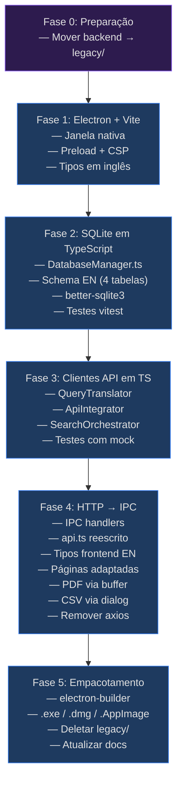

# Migração para Electron + React/Vite — Plano de Implementação

Migração completa do **Emma's Librarian** de uma arquitetura desacoplada (FastAPI/Python + React/Vite) para uma arquitetura unificada em **Electron + React/Vite + TypeScript**, conforme proposta em [refatoracao_electron.md](file:///C:/root_lab/antigravity/emmas_librarian/refatoracao_electron.md).

---

## Decisões Aprovadas pelo Usuário

| Questão | Decisão |
|---------|---------|
| Estrutura de diretórios | `electron/` dentro de `frontend/`, um único `package.json` |
| Backend Python | Mover para pasta `legacy/` **antes de iniciar** o desenvolvimento |
| Nomes de colunas | **Padronizar para inglês** (schema novo, tipos novos, código todo em EN) |
| Leitor de PDF | Preservar `react-pdf-highlighter` existente, adaptar para IPC |
| Redesign de UI | Plano **separado**, após migração funcional |
| Localização do banco | `app.getPath('userData')/emma.db` em produção, diretório do projeto em dev |
| Armazenamento de PDFs | `app.getPath('userData')/storage/pdfs/` (customização futura via Settings) |
| Export CSV | Gerado no main process, salvo via dialog nativo |

---

## Estado Atual do Projeto (Auditoria Completa)

### Backend (`backend/`)

| Aspecto | Detalhe |
|---------|---------|
| **Framework** | FastAPI + Uvicorn, HTTP assíncrono via `httpx.AsyncClient` |
| **Banco de dados** | SQLite3 raw (sem ORM, apesar de SQLAlchemy estar em `requirements.txt`) |
| **Schema** | 4 tabelas: `projects`, `articles`, `annotations`, `highlights` |
| **Endpoints** | 13 rotas REST (sem autenticação) |
| **APIs externas** | OpenAlex e Crossref implementados; Scopus e WoS **não existem** |
| **Testes** | 4 arquivos de teste (DB, query translator, API integrator, search orchestrator) |
| **Armazenamento PDF** | `backend/storage/pdfs/article_{id}.pdf` |
| **CORS** | Totalmente aberto (`allow_origins=["*"]`) |
| **Nomes de colunas** | Em português (e.g., `projeto_id`, `titulo`, `autores`, `ano`, `conteudo_markdown`, `data_criacao`) |

**Estrutura real do backend:**
```
backend/
├── app/
│   ├── main.py                     ← FastAPI app (13 endpoints)
│   ├── db/
│   │   ├── database.py             ← DatabaseManager (sqlite3 raw)
│   │   └── schema.sql              ← 4 tabelas
│   └── services/
│       ├── api_integrator.py       ← OpenAlex + Crossref clients
│       ├── query_translator.py     ← QueryBlock → parâmetros de API
│       └── search_orchestrator.py  ← Pipeline: tradução → busca → dedup → persist
├── storage/pdfs/                   ← PDFs armazenados
├── tests/
│   ├── conftest.py
│   ├── test_db.py
│   ├── test_api_integrator.py
│   ├── test_query_translator.py
│   └── test_search_orchestrator.py
└── requirements.txt                ← fastapi, uvicorn, sqlalchemy*, pydantic, pytest, httpx, python-multipart
```

**Schema SQL atual (4 tabelas, nomes em português — serão migrados para inglês):**

| Tabela | Colunas atuais (PT) | Colunas novas (EN) |
|--------|---------------------|-------------------|
| `projects` | `id`, `name`, `data_criacao`, `ultima_execucao` | `id`, `name`, `created_at`, `last_executed_at` |
| `articles` | `id`, `projeto_id`, `doi`, `titulo`, `autores`, `ano`, `query_origem`, `base_origem`, `csl_json`, `local_file_path`, `status` | `id`, `project_id`, `doi`, `title`, `authors`, `year`, `source_query`, `source_databases`, `csl_json`, `local_file_path`, `status` |
| `annotations` | `id`, `artigo_id`, `conteudo_markdown`, `data_criacao` | `id`, `article_id`, `content_markdown`, `created_at` |
| `highlights` | `id`, `artigo_id`, `color`, `position_data`, `annotation_id` | `id`, `article_id`, `color`, `position_data`, `annotation_id` |

**Endpoints reais (13 rotas):**

| Método | Rota | Descrição |
|--------|------|-----------|
| GET | `/projects` | Listar todos os projetos |
| POST | `/projects` | Criar projeto (`{name}`) |
| GET | `/projects/{id}` | Obter projeto |
| POST | `/projects/{id}/search` | Executar busca (`{query_blocks, limit}`) |
| GET | `/projects/{id}/articles` | Listar artigos do projeto |
| GET | `/projects/{id}/export` | Exportar CSV (UTF-8 BOM, headers em PT) |
| GET | `/articles/{id}` | Obter artigo |
| GET | `/articles/{id}/highlights` | Listar highlights (JOIN com annotations) |
| POST | `/articles/{id}/highlights` | Criar highlight (`{color, position_data, annotation_content?}`) |
| GET | `/articles/{id}/annotations` | Listar anotações |
| POST | `/articles/{id}/upload-pdf` | Upload de PDF (multipart) |
| GET | `/articles/{id}/pdf` | Servir PDF armazenado |

### Frontend (`frontend/`)

| Aspecto | Detalhe |
|---------|---------|
| **Framework** | React 19 + TypeScript 6 + Vite 8 |
| **Roteamento** | React Router v7 (4 rotas) |
| **HTTP** | Axios para `localhost:8000` |
| **Leitor PDF** | `react-pdf-highlighter` + `pdfjs-dist@3.11.174` **já implementado** |
| **Ícones** | `lucide-react` |
| **Estilização** | Inline styles (CSS global é boilerplate do Vite, quase sem uso) |
| **State** | Local (`useState`/`useEffect`), sem gerenciamento global |
| **Testes** | Nenhum |

**Estrutura real do frontend:**
```
frontend/
├── src/
│   ├── main.tsx                    ← Entry: Router + 4 rotas
│   ├── style.css                   ← CSS global (maioria boilerplate Vite)
│   ├── components/
│   │   └── QueryBuilder.tsx        ← Construtor visual de queries
│   ├── pages/
│   │   ├── DashboardPage.tsx       ← Landing: lista projetos
│   │   ├── NewProjectPage.tsx      ← Criar projeto + busca inicial
│   │   ├── ProjectDetailsPage.tsx  ← Detalhes: artigos, upload PDF, export CSV
│   │   └── ArticleReaderPage.tsx   ← Leitor PDF com highlights/anotações
│   ├── services/
│   │   └── api.ts                  ← 12 métodos via Axios
│   └── types/
│       └── index.ts                ← 5 interfaces (Project, Article, Annotation, Highlight, QueryBlock)
├── public/
│   ├── favicon.svg
│   └── icons.svg
├── package.json
└── tsconfig.json
```

**Rotas existentes:**

| Rota | Componente | Função |
|------|-----------|--------|
| `/` | `DashboardPage` | Grid de projetos |
| `/new-project` | `NewProjectPage` | Criar projeto + busca |
| `/projects/:id` | `ProjectDetailsPage` | Artigos, filtro, upload PDF, export |
| `/articles/:id` | `ArticleReaderPage` | Leitor PDF + highlights + anotações |

**Serviço API (12 métodos):**

| Método | HTTP | Endpoint |
|--------|------|----------|
| `getProjects()` | GET | `/projects` |
| `createProject(name)` | POST | `/projects` |
| `getProject(id)` | GET | `/projects/:id` |
| `searchAndPersist(id, blocks, limit)` | POST | `/projects/:id/search` |
| `getArticles(id)` | GET | `/projects/:id/articles` |
| `getExportUrl(id)` | — | retorna URL string |
| `getArticle(id)` | GET | `/articles/:id` |
| `getHighlights(id)` | GET | `/articles/:id/highlights` |
| `createHighlight(id, color, pos, note?)` | POST | `/articles/:id/highlights` |
| `getAnnotations(id)` | GET | `/articles/:id/annotations` |
| `uploadPdf(id, file)` | POST | `/articles/:id/upload-pdf` |
| `getPdfUrl(id)` | — | retorna URL string |

---

## Mudanças Propostas

A migração é dividida em **5 fases** + uma **Fase 0** preparatória, cada uma entregando um incremento funcional testável.

---

### Fase 0: Preparação — Mover Backend para `legacy/`

**Objetivo**: Preservar o backend Python como referência durante toda a migração.

#### [RENAME] `backend/` → `legacy/backend/`

Mover o diretório inteiro para `legacy/backend/` na raiz do projeto:

```
emmas_librarian/
├── legacy/
│   └── backend/              ← Cópia integral para consulta
│       ├── app/
│       ├── storage/
│       ├── tests/
│       └── requirements.txt
├── frontend/
└── ...
```

> [!NOTE]
> O `legacy/` serve apenas como referência. Não será mais executado. Será deletado ao final da Fase 5.

**Critério de aceitação**: `legacy/backend/` contém todos os arquivos originais. O diretório `backend/` não existe mais na raiz.

---

### Fase 1: Integração do Electron com React/Vite

**Objetivo**: Fazer o frontend React existente rodar dentro de uma janela Electron nativa.

#### [MODIFY] `frontend/package.json`

Adicionar dependências e scripts do Electron:

```diff
+ "main": "dist-electron/main.js",
  "scripts": {
    "dev": "vite",
+   "electron:dev": "concurrently \"vite\" \"wait-on http://localhost:5173 && electron .\"",
+   "electron:build": "vite build && tsc -p tsconfig.electron.json && electron-builder",
    "build": "tsc && vite build",
    "preview": "vite preview"
  },
  "dependencies": {
    "axios": "^1.16.1",
    "lucide-react": "^1.16.0",
    "pdfjs-dist": "^3.11.174",
    "react-pdf-highlighter": "^8.0.0-rc.0",
    "react-router-dom": "^7.15.1",
+   "better-sqlite3": "^11.0.0"
  },
  "devDependencies": {
+   "electron": "^33.0.0",
+   "electron-builder": "^25.0.0",
+   "concurrently": "^9.0.0",
+   "wait-on": "^8.0.0",
+   "@types/better-sqlite3": "^7.6.0",
+   "vitest": "^3.0.0",
    ...
  }
```

#### [NEW] `frontend/electron/main.ts`

Processo principal do Electron:

- Criar `BrowserWindow` com `nodeIntegration: false`, `contextIsolation: true`, `preload`
- Em dev: carregar `http://localhost:5173`
- Em prod: carregar `file://dist/index.html`
- Gerenciar ciclo de vida (`app.whenReady`, `window-all-closed`, `activate`)
- CSP headers via `session.defaultSession.webRequest`

#### [NEW] `frontend/electron/preload.ts`

Script de preload usando `contextBridge`:

```typescript
contextBridge.exposeInMainWorld('electronAPI', {
  invoke: (channel: string, ...args: unknown[]) => ipcRenderer.invoke(channel, ...args),
  on: (channel: string, callback: (...args: unknown[]) => void) => {
    ipcRenderer.on(channel, (_event, ...args) => callback(...args));
  }
});
```

#### [NEW] `frontend/electron/types.ts`

Tipos compartilhados entre main e renderer, agora **em inglês**:

```typescript
// Interfaces do domínio (nomes padronizados em inglês)
export interface Project {
  id: number;
  name: string;
  created_at: string;
  last_executed_at?: string;
}

export interface Article {
  id: number;
  project_id: number;
  doi?: string;
  title: string;
  authors?: string;
  year?: number;
  source_query: string;
  source_databases: string;  // JSON string
  csl_json: string;
  local_file_path?: string;
  status: 'new' | 'read' | 'archived';
}

export interface Annotation {
  id: number;
  article_id: number;
  content_markdown: string;
  created_at: string;
}

export interface Highlight {
  id: number;
  article_id: number;
  color: string;
  position_data: string;  // JSON string
  annotation_id?: number;
}

// Canais IPC
export enum IpcChannel {
  PROJECTS_GET_ALL = 'projects:getAll',
  PROJECTS_CREATE = 'projects:create',
  PROJECTS_GET_ONE = 'projects:getOne',
  SEARCH_EXECUTE = 'search:execute',
  ARTICLES_GET_BY_PROJECT = 'articles:getByProject',
  ARTICLES_GET_ONE = 'articles:getOne',
  HIGHLIGHTS_GET = 'highlights:get',
  HIGHLIGHTS_CREATE = 'highlights:create',
  ANNOTATIONS_GET = 'annotations:get',
  PDF_UPLOAD = 'pdf:upload',
  PDF_GET = 'pdf:get',
  EXPORT_CSV = 'export:csv',
  DIALOG_OPEN_FILE = 'dialog:openFile',
}
```

#### [NEW] `frontend/tsconfig.electron.json`

TypeScript config para o código Electron:

```json
{
  "compilerOptions": {
    "target": "ES2022",
    "module": "commonjs",
    "outDir": "dist-electron",
    "rootDir": "electron",
    "strict": true,
    "esModuleInterop": true,
    "resolveJsonModule": true,
    "declaration": false
  },
  "include": ["electron/**/*.ts"]
}
```

#### [MODIFY] `frontend/index.html`

Adicionar CSP meta tag para segurança Electron.

**Critério de aceitação**: `npm run electron:dev` abre o app React existente dentro de uma janela Electron nativa. Nesta fase a comunicação ainda pode ser via HTTP para o backend Python, apenas para validar que o Electron funciona.

---

### Fase 2: Migração da Camada de Persistência (SQLite → better-sqlite3)

**Objetivo**: Reescrever `DatabaseManager` em TypeScript com `better-sqlite3`, usando nomes de colunas **em inglês**.

#### [NEW] `frontend/electron/database/schema.sql`

Schema novo com nomes padronizados em inglês:

```sql
PRAGMA foreign_keys = ON;

CREATE TABLE IF NOT EXISTS projects (
    id INTEGER PRIMARY KEY AUTOINCREMENT,
    name TEXT NOT NULL,
    created_at TIMESTAMP DEFAULT CURRENT_TIMESTAMP,
    last_executed_at TIMESTAMP
);

CREATE TABLE IF NOT EXISTS articles (
    id INTEGER PRIMARY KEY AUTOINCREMENT,
    project_id INTEGER NOT NULL,
    doi TEXT,
    title TEXT NOT NULL,
    authors TEXT,
    year INTEGER,
    source_query TEXT,
    source_databases TEXT,          -- JSON array string, e.g. '["OpenAlex","Crossref"]'
    csl_json TEXT,                  -- Raw CSL-JSON
    local_file_path TEXT,
    status TEXT DEFAULT 'new',      -- 'new', 'read', 'archived'
    FOREIGN KEY (project_id) REFERENCES projects(id) ON DELETE CASCADE
);

CREATE TABLE IF NOT EXISTS annotations (
    id INTEGER PRIMARY KEY AUTOINCREMENT,
    article_id INTEGER NOT NULL,
    content_markdown TEXT NOT NULL,
    created_at TIMESTAMP DEFAULT CURRENT_TIMESTAMP,
    FOREIGN KEY (article_id) REFERENCES articles(id) ON DELETE CASCADE
);

CREATE TABLE IF NOT EXISTS highlights (
    id INTEGER PRIMARY KEY AUTOINCREMENT,
    article_id INTEGER NOT NULL,
    color TEXT NOT NULL,
    position_data TEXT NOT NULL,    -- JSON position data
    annotation_id INTEGER,
    FOREIGN KEY (article_id) REFERENCES articles(id) ON DELETE CASCADE,
    FOREIGN KEY (annotation_id) REFERENCES annotations(id) ON DELETE SET NULL
);
```

#### [NEW] `frontend/electron/database/DatabaseManager.ts`

Classe equivalente a `legacy/backend/app/db/database.py`, porém com nomes em inglês:

```typescript
export class DatabaseManager {
  private db: BetterSqlite3.Database;

  constructor(dbPath: string) {
    this.db = new BetterSqlite3(dbPath);
    this.db.pragma('journal_mode = WAL');
    this.db.pragma('foreign_keys = ON');
    this.initSchema();
  }

  // Projects
  createProject(name: string): Project
  getProject(id: number): Project | undefined
  getAllProjects(): Project[]

  // Articles
  saveArticle(projectId: number, articleData: ArticleInput): number
  getArticle(id: number): Article | undefined
  getArticlesByProject(projectId: number): Article[]
  updateArticleFilePath(articleId: number, path: string): void

  // Annotations
  saveAnnotation(articleId: number, content: string): number
  getAnnotations(articleId: number): Annotation[]

  // Highlights (com JOIN para incluir comment da annotation)
  saveHighlight(articleId: number, color: string, positionData: object, annotationId?: number): number
  getHighlights(articleId: number): HighlightWithComment[]

  close(): void
}
```

> [!NOTE]
> `better-sqlite3` é **síncrono**, o que simplifica enormemente o código comparado ao driver Python. Cada query retorna o resultado diretamente, sem `await`.

#### [NEW] `frontend/electron/database/__tests__/DatabaseManager.test.ts`

Testes unitários portados de `legacy/backend/tests/test_db.py`, adaptados para os nomes em inglês:

- Banco in-memory (`:memory:`)
- Framework: `vitest`
- Cobertura: inicialização do schema, CRUD projetos, save/get articles, annotations, highlights com JOIN

**Critério de aceitação**: Todos os testes passando com `npx vitest run electron/database/`.

---

### Fase 3: Reescrita dos Clientes de API em TypeScript

**Objetivo**: Portar `query_translator.py`, `api_integrator.py` e `search_orchestrator.py` para TypeScript.

#### [NEW] `frontend/electron/services/QueryTranslator.ts`

Portagem de `legacy/backend/app/services/query_translator.py`:

```typescript
export class QueryTranslator {
  toOpenAlex(blocks: QueryBlock[]): string                    // → filter string
  toCrossref(blocks: QueryBlock[]): Record<string, string>    // → query params
}
```

Campos suportados: `title` (contains), `year` (equals, greater_than, less_than).

#### [NEW] `frontend/electron/services/ApiIntegrator.ts`

Portagem de `legacy/backend/app/services/api_integrator.py`:

```typescript
export class ApiIntegrator {
  async searchOpenAlex(filterQuery: string, limit: number): Promise<NormalizedArticle[]>
  async searchCrossref(params: Record<string, string>, limit: number): Promise<NormalizedArticle[]>

  private normalizeOpenAlex(results: OpenAlexWork[]): NormalizedArticle[]
  private normalizeCrossref(items: CrossrefItem[]): NormalizedArticle[]
}
```

- Usar `fetch` nativo do Node.js (Electron 33+ suporta)
- Normalização para formato unificado com nomes em **inglês**

#### [NEW] `frontend/electron/services/SearchOrchestrator.ts`

Portagem de `legacy/backend/app/services/search_orchestrator.py`:

```typescript
export class SearchOrchestrator {
  constructor(
    private db: DatabaseManager,
    private translator: QueryTranslator,
    private api: ApiIntegrator
  )

  async executeSearch(
    projectId: number,
    queryBlocks: QueryBlock[],
    limit: number
  ): Promise<{ savedCount: number; articles: Article[] }>
}
```

Pipeline: traduzir → buscar em ambas APIs → normalizar → deduplicar (DOI + título) → merge `source_databases` → persistir.

#### [NEW] `frontend/electron/services/types.ts`

Tipos dos clientes (nomes em inglês):

```typescript
export interface QueryBlock {
  id: string;
  field: 'title' | 'year';
  value: string;
  type: 'contains' | 'equals' | 'greater_than' | 'less_than';
}

export interface NormalizedArticle {
  doi?: string;
  title: string;
  authors?: string;
  year?: number;
  source_databases: string[];
  csl_json: object;
}
```

#### [NEW] `frontend/electron/services/__tests__/QueryTranslator.test.ts`

Portagem dos testes de `test_query_translator.py`.

#### [NEW] `frontend/electron/services/__tests__/ApiIntegrator.test.ts`

Portagem dos testes de `test_api_integrator.py` com mocking de `fetch`.

#### [NEW] `frontend/electron/services/__tests__/SearchOrchestrator.test.ts`

Portagem dos testes de `test_search_orchestrator.py` (deduplicação, pipeline completo).

**Critério de aceitação**: Todos os testes passando com `npx vitest run electron/services/`.

---

### Fase 4: Substituição de HTTP por IPC

**Objetivo**: Eliminar toda comunicação HTTP. O frontend fala diretamente com o main process via IPC.

#### [NEW] `frontend/electron/ipc/handlers.ts`

Registro de handlers IPC mapeando cada operação do `api.ts`:

```typescript
export function registerIpcHandlers(
  db: DatabaseManager,
  orchestrator: SearchOrchestrator
): void {
  // Projects
  ipcMain.handle(IpcChannel.PROJECTS_GET_ALL, () => db.getAllProjects())
  ipcMain.handle(IpcChannel.PROJECTS_CREATE, (_, name: string) => db.createProject(name))
  ipcMain.handle(IpcChannel.PROJECTS_GET_ONE, (_, id: number) => db.getProject(id))

  // Search
  ipcMain.handle(IpcChannel.SEARCH_EXECUTE, async (_, projectId, blocks, limit) =>
    orchestrator.executeSearch(projectId, blocks, limit))

  // Articles
  ipcMain.handle(IpcChannel.ARTICLES_GET_BY_PROJECT, (_, projectId) =>
    db.getArticlesByProject(projectId))
  ipcMain.handle(IpcChannel.ARTICLES_GET_ONE, (_, id) => db.getArticle(id))

  // Highlights
  ipcMain.handle(IpcChannel.HIGHLIGHTS_GET, (_, articleId) => db.getHighlights(articleId))
  ipcMain.handle(IpcChannel.HIGHLIGHTS_CREATE, (_, articleId, color, posData, noteContent?) => {
    let annotationId: number | undefined
    if (noteContent) {
      annotationId = db.saveAnnotation(articleId, noteContent)
    }
    return db.saveHighlight(articleId, color, posData, annotationId)
  })

  // Annotations
  ipcMain.handle(IpcChannel.ANNOTATIONS_GET, (_, articleId) => db.getAnnotations(articleId))

  // PDF management
  ipcMain.handle(IpcChannel.PDF_UPLOAD, async (_, articleId, fileBuffer, fileName) => {
    const pdfDir = path.join(app.getPath('userData'), 'storage', 'pdfs')
    fs.mkdirSync(pdfDir, { recursive: true })
    const filePath = path.join(pdfDir, `article_${articleId}.pdf`)
    fs.writeFileSync(filePath, Buffer.from(fileBuffer))
    db.updateArticleFilePath(articleId, filePath)
    return filePath
  })

  ipcMain.handle(IpcChannel.PDF_GET, (_, articleId) => {
    const article = db.getArticle(articleId)
    if (article?.local_file_path && fs.existsSync(article.local_file_path)) {
      return fs.readFileSync(article.local_file_path)
    }
    return null
  })

  // Export CSV (headers em inglês agora)
  ipcMain.handle(IpcChannel.EXPORT_CSV, async (_, projectId) => {
    const articles = db.getArticlesByProject(projectId)
    const csv = generateCsv(articles)  // UTF-8 BOM, headers: ID, DOI, Title, Authors, Year, Sources, Status
    const { filePath } = await dialog.showSaveDialog({
      defaultPath: `project_${projectId}_articles.csv`,
      filters: [{ name: 'CSV', extensions: ['csv'] }]
    })
    if (filePath) fs.writeFileSync(filePath, csv)
    return filePath
  })

  // File dialog
  ipcMain.handle(IpcChannel.DIALOG_OPEN_FILE, async (_, filters?) => {
    const result = await dialog.showOpenDialog({
      filters: filters || [{ name: 'PDF', extensions: ['pdf'] }]
    })
    return result.filePaths[0] || null
  })
}
```

#### [MODIFY] `frontend/src/services/api.ts` → Reescrita completa

Trocar **todos** os 12 métodos de Axios para IPC:

```typescript
// Antes (Axios):
const api = axios.create({ baseURL: 'http://localhost:8000' })
export const projectService = {
  getProjects: () => api.get('/projects').then(r => r.data),
  ...
}

// Depois (IPC):
export const projectService = {
  getProjects: (): Promise<Project[]> =>
    window.electronAPI.invoke('projects:getAll'),

  createProject: (name: string): Promise<Project> =>
    window.electronAPI.invoke('projects:create', name),

  getProject: (id: number): Promise<Project> =>
    window.electronAPI.invoke('projects:getOne', id),

  searchAndPersist: (projectId: number, blocks: QueryBlock[], limit = 100) =>
    window.electronAPI.invoke('search:execute', projectId, blocks, limit),

  getArticles: (projectId: number): Promise<Article[]> =>
    window.electronAPI.invoke('articles:getByProject', projectId),

  getArticle: (id: number): Promise<Article> =>
    window.electronAPI.invoke('articles:getOne', id),

  getHighlights: (id: number): Promise<Highlight[]> =>
    window.electronAPI.invoke('highlights:get', id),

  createHighlight: (id: number, color: string, posData: object, note?: string) =>
    window.electronAPI.invoke('highlights:create', id, color, posData, note),

  getAnnotations: (id: number): Promise<Annotation[]> =>
    window.electronAPI.invoke('annotations:get', id),

  uploadPdf: async (id: number, file: File) => {
    const buffer = await file.arrayBuffer()
    return window.electronAPI.invoke('pdf:upload', id, buffer, file.name)
  },

  getPdfData: (id: number): Promise<ArrayBuffer | null> =>
    window.electronAPI.invoke('pdf:get', id),

  exportCsv: (projectId: number) =>
    window.electronAPI.invoke('export:csv', projectId),
}
```

#### [MODIFY] `frontend/src/types/index.ts` → Padronizar nomes para inglês

Atualizar todas as 5 interfaces para usar nomes em inglês, espelhando `electron/types.ts`:

```typescript
// Antes (PT):
interface Article {
  id: number;
  projeto_id: number;
  titulo: string;
  autores?: string;
  ano?: number;
  base_origem: string[];
  // ...
}

// Depois (EN):
export interface Article {
  id: number;
  project_id: number;
  title: string;
  authors?: string;
  year?: number;
  source_databases: string[];
  // ...
}
```

Interfaces afetadas:
- `Project`: `data_criacao` → `created_at`, `ultima_execucao` → `last_executed_at`
- `Article`: `projeto_id` → `project_id`, `titulo` → `title`, `autores` → `authors`, `ano` → `year`, `query_origem` → `source_query`, `base_origem` → `source_databases`
- `Annotation`: `artigo_id` → `article_id`, `conteudo_markdown` → `content_markdown`, `data_criacao` → `created_at`
- `Highlight`: `artigo_id` → `article_id`
- `QueryBlock`: sem mudanças (já estava em inglês)
- Status values: `novo` → `new`, `lido` → `read`, `arquivado` → `archived`

#### [MODIFY] `frontend/src/pages/DashboardPage.tsx`

Atualizar referências de propriedades:
- `project.data_criacao` → `project.created_at`

#### [MODIFY] `frontend/src/pages/NewProjectPage.tsx`

Sem mudanças estruturais (usa apenas `project.name` e `project.id`).

#### [MODIFY] `frontend/src/pages/ProjectDetailsPage.tsx`

Atualizar referências de propriedades:
- `article.titulo` → `article.title`
- `article.autores` → `article.authors`
- `article.ano` → `article.year`
- `article.base_origem` → `article.source_databases`
- `article.local_file_path` → sem mudança
- Adaptar export CSV: remover `getExportUrl()`, usar `projectService.exportCsv(id)` via IPC

#### [MODIFY] `frontend/src/pages/ArticleReaderPage.tsx`

Atualizar referências de propriedades:
- `article.titulo` → `article.title`
- `article.local_file_path` → sem mudança
- `highlight.artigo_id` → `highlight.article_id`
- Adaptar carregamento de PDF:
  - Antes: `projectService.getPdfUrl(id)` → URL HTTP
  - Depois: `projectService.getPdfData(id)` → `ArrayBuffer` → `Blob` URL para `react-pdf-highlighter`

#### [MODIFY] `frontend/src/components/QueryBuilder.tsx`

Sem mudanças (já usa nomes em inglês internamente).

#### [NEW] `frontend/src/types/electron.d.ts`

```typescript
export interface ElectronAPI {
  invoke(channel: string, ...args: unknown[]): Promise<any>;
  on(channel: string, callback: (...args: unknown[]) => void): void;
}

declare global {
  interface Window {
    electronAPI: ElectronAPI;
  }
}
```

#### [MODIFY] `frontend/electron/main.ts`

Atualizar para:
- Instanciar `DatabaseManager` com `app.getPath('userData')/emma.db` (prod) ou `./emma.db` (dev)
- Instanciar `QueryTranslator`, `ApiIntegrator`, `SearchOrchestrator`
- Chamar `registerIpcHandlers(db, orchestrator)`
- `app.on('before-quit')` → `db.close()`

#### Remover dependência `axios`

```diff
  "dependencies": {
-   "axios": "^1.16.1",
    "better-sqlite3": "^11.0.0",
    ...
  }
```

**Critério de aceitação**: App funciona **sem** o servidor Python. Criar projeto, buscar artigos, upload/leitura de PDF, highlights, export CSV — tudo via IPC. Todos os nomes de propriedades no frontend usam convenção em inglês.

---

### Fase 5: Empacotamento e Distribuição

**Objetivo**: Gerar instalador nativo (.exe) via `electron-builder`.

#### [MODIFY] `frontend/package.json`

Configuração final do builder:

```json
"build": {
  "appId": "com.emmas-librarian.app",
  "productName": "Emma's Librarian",
  "directories": { "output": "release" },
  "files": [
    "dist/**/*",
    "dist-electron/**/*",
    "node_modules/better-sqlite3/**/*"
  ],
  "win": {
    "target": [{ "target": "nsis", "arch": ["x64"] }],
    "icon": "build/icon.ico"
  },
  "mac": {
    "target": [{ "target": "dmg", "arch": ["x64", "arm64"] }]
  },
  "linux": {
    "target": [{ "target": "AppImage", "arch": ["x64"] }]
  },
  "nsis": {
    "oneClick": false,
    "perMachine": false,
    "allowToChangeInstallationDirectory": true
  }
}
```

#### [NEW] `frontend/build/icon.png`

Ícone da aplicação (placeholder, a ser substituído pelo final).

#### [MODIFY] Documentação

- Atualizar `README.md`: novo setup, comandos `npm run electron:dev`, sem necessidade de Python
- Atualizar `procedimento.md`: regras para código Electron/TypeScript, TDD com vitest
- Atualizar `pendencias.md`: remover items concluídos, adicionar novos (redesign UI, Scopus/WoS)

#### [DELETE] `legacy/` (diretório inteiro)

Após validação completa da Fase 4:
- Todo o código Python de referência
- PDFs existentes em `legacy/backend/storage/pdfs/` devem ser migrados para `userData/storage/pdfs/` antes da deleção

**Critério de aceitação**: `npm run electron:build` gera `release/Emma's Librarian Setup.exe` que instala e roda standalone.

---

## Estrutura Final do Projeto

```
emmas_librarian/
├── frontend/
│   ├── electron/
│   │   ├── main.ts                        ← Processo principal
│   │   ├── preload.ts                     ← Bridge segura
│   │   ├── types.ts                       ← Tipos do domínio (EN)
│   │   ├── database/
│   │   │   ├── DatabaseManager.ts         ← Wrapper better-sqlite3
│   │   │   ├── schema.sql                 ← 4 tabelas (nomes EN)
│   │   │   └── __tests__/
│   │   │       └── DatabaseManager.test.ts
│   │   ├── services/
│   │   │   ├── QueryTranslator.ts         ← Blocos → params de API
│   │   │   ├── ApiIntegrator.ts           ← OpenAlex + Crossref
│   │   │   ├── SearchOrchestrator.ts      ← Pipeline de busca
│   │   │   ├── types.ts
│   │   │   └── __tests__/
│   │   │       ├── QueryTranslator.test.ts
│   │   │       ├── ApiIntegrator.test.ts
│   │   │       └── SearchOrchestrator.test.ts
│   │   └── ipc/
│   │       └── handlers.ts               ← Registro dos canais IPC
│   ├── src/
│   │   ├── main.tsx                       ← Router (4 rotas)
│   │   ├── style.css                      ← Estilos globais
│   │   ├── components/
│   │   │   └── QueryBuilder.tsx
│   │   ├── pages/
│   │   │   ├── DashboardPage.tsx          ← Propriedades EN
│   │   │   ├── NewProjectPage.tsx
│   │   │   ├── ProjectDetailsPage.tsx     ← IPC + propriedades EN
│   │   │   └── ArticleReaderPage.tsx      ← IPC + PDF via buffer
│   │   ├── services/
│   │   │   └── api.ts                     ← Reescrito: IPC
│   │   └── types/
│   │       ├── index.ts                   ← Interfaces EN
│   │       └── electron.d.ts              ← Tipos window.electronAPI
│   ├── build/
│   │   └── icon.png
│   ├── package.json
│   ├── tsconfig.json
│   ├── tsconfig.electron.json
│   └── vitest.config.ts
├── plans/
├── README.md
├── procedimento.md
└── pendencias.md
```

---

## Diagrama de Dependências entre Fases



---

## Mapeamento de Renomeação PT → EN

Referência rápida para a padronização de nomes durante toda a migração:

### Schema SQL

| Tabela | Coluna PT | Coluna EN |
|--------|----------|----------|
| `projects` | `data_criacao` | `created_at` |
| `projects` | `ultima_execucao` | `last_executed_at` |
| `articles` | `projeto_id` | `project_id` |
| `articles` | `titulo` | `title` |
| `articles` | `autores` | `authors` |
| `articles` | `ano` | `year` |
| `articles` | `query_origem` | `source_query` |
| `articles` | `base_origem` | `source_databases` |
| `annotations` | `artigo_id` | `article_id` |
| `annotations` | `conteudo_markdown` | `content_markdown` |
| `annotations` | `data_criacao` | `created_at` |
| `highlights` | `artigo_id` | `article_id` |

### Status Values

| PT | EN |
|----|-----|
| `novo` | `new` |
| `lido` | `read` |
| `arquivado` | `archived` |

### CSV Export Headers

| PT | EN |
|----|-----|
| ID | ID |
| DOI | DOI |
| Título | Title |
| Autores | Authors |
| Ano | Year |
| Bases | Sources |
| Status | Status |

---

## Plano de Verificação

### Testes Automatizados (TDD — conforme seção 4 do doc de refatoração)

```bash
# Configurar vitest no projeto
npx vitest run                              # Todos os testes
npx vitest run electron/database/           # Fase 2
npx vitest run electron/services/           # Fase 3
npx vitest run --coverage                   # Cobertura completa
```

| Fase | Testes | Critério |
|------|--------|----------|
| 0 | Manual | `legacy/backend/` existe, `backend/` não existe |
| 1 | Manual | `npm run electron:dev` abre janela Electron com o React |
| 2 | ~10 testes (DatabaseManager) | CRUD completo com nomes EN |
| 3 | ~10 testes (Translator + Clients + Orchestrator) | Tradução, normalização, deduplicação |
| 4 | Manual + integração | App funciona sem backend Python; fluxo completo; nomes EN |
| 5 | Manual | Instalador gerado, instala e roda em máquina limpa |

### Verificação Manual

- **Fase 1**: Abrir via `npm run electron:dev`, navegar por todas as 4 rotas
- **Fase 4**: Executar fluxo completo sem backend Python:
  1. Criar projeto → buscar artigos → ver resultados
  2. Upload de PDF → abrir leitor → criar highlights com notas
  3. Export CSV → verificar arquivo gerado com headers em inglês
- **Fase 5**: Instalar o `.exe` e repetir o fluxo acima

### Nota sobre Migração de Dados

> [!WARNING]
> Como os nomes das colunas estão mudando de PT para EN, o banco `emma.db` existente **não será compatível** com o novo schema. Isso é aceitável para esta fase do projeto (pré-release). Se houver dados que precisem ser preservados, um script de migração one-time será necessário (renomear colunas via `ALTER TABLE ... RENAME COLUMN`).
